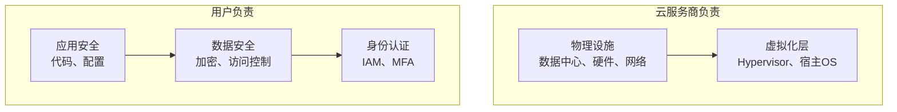
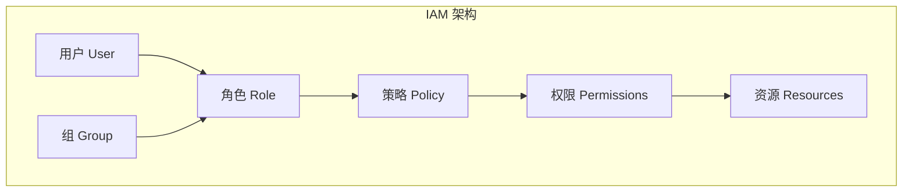
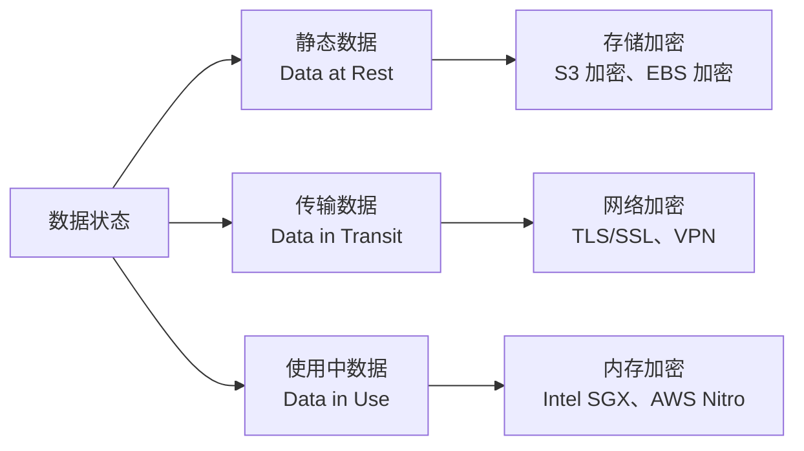
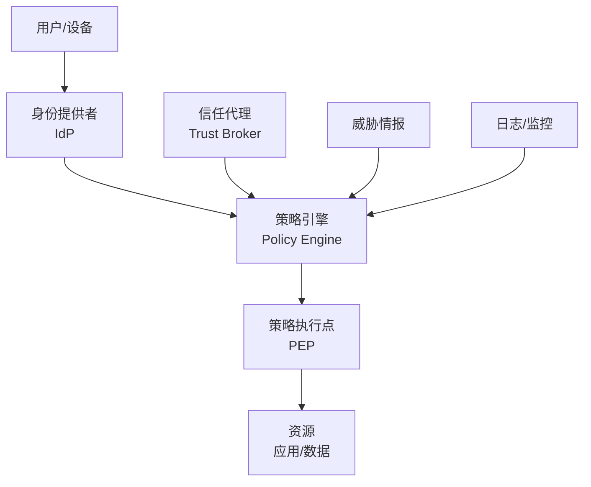
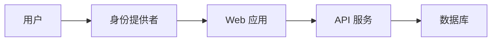
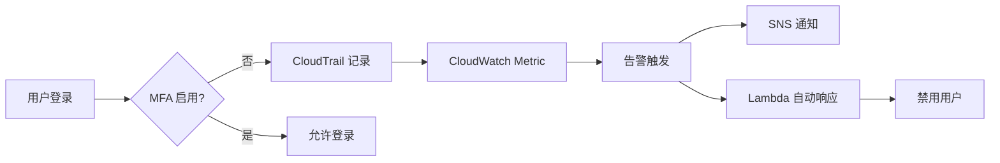

# 第9章 云安全技术 — 综合练习题

> [!info] 题型说明
> 本习题集共 **32 题**,包含多种题型,建议用时 120 分钟完成。
> - 单选题(11 题)
> - 多选题(6 题)
> - 判断题(5 题)
> - 简答题(4 题)
> - 计算题(4 题)
> - 实操题(2 题)

---

## 一、单项选择题(每题 3 分,共 33 分)

### 第 1 题

云安全的责任共担模型中,云服务商负责?

A. 数据安全
B. 访问控制
C. 物理基础设施安全
D. 应用安全

<details>
<summary>查看答案与解析</summary>

**答案：C**

**解析**：责任共担模型(Shared Responsibility Model):
- **云服务商负责**:物理基础设施(数据中心、硬件、网络)、虚拟化层、云服务安全
- **用户负责**:数据安全(A)、访问控制(B)、应用安全(D)、身份认证

IaaS 模式下用户责任最多,SaaS 模式下云服务商责任最多。

</details>

---

### 第 2 题

IAM(Identity and Access Management)的核心功能不包括?

A. 用户身份认证
B. 权限管理
C. 数据加密
D. 多因素认证(MFA)

<details>
<summary>查看答案与解析</summary>

**答案：C**

**解析**：IAM 核心功能:
- **用户身份认证**(A):验证用户身份
- **权限管理**(B):授予用户访问权限
- **多因素认证**(D):增强身份认证安全性

数据加密(C)是数据保护功能,不属于 IAM。

</details>

---

### 第 3 题

以下哪种加密算法是对称加密?

A. RSA
B. AES
C. ECC
D. DSA

<details>
<summary>查看答案与解析</summary>

**答案：B**

**解析**：
- **AES**(Advanced Encryption Standard):对称加密算法,加密解密使用相同密钥
- RSA(A):非对称加密,公钥加密、私钥解密
- ECC(C):非对称加密,椭圆曲线加密
- DSA(D):数字签名算法,非对称加密

</details>

---

### 第 4 题

KMS(Key Management Service)的主要作用是?

A. 存储用户密码
B. 管理加密密钥生命周期
C. 监控网络安全
D. 防火墙配置

<details>
<summary>查看答案与解析</summary>

**答案：B**

**解析**：KMS(Key Management Service)核心功能:
- **管理密钥生命周期**:创建、轮换、删除密钥
- 密钥存储:安全存储主密钥
- 密钥使用:控制密钥访问权限
- 审计日志:记录密钥使用历史

KMS 不存储用户密码(A),不监控网络安全(C),不配置防火墙(D)。

</details>

---

### 第 5 题

云安全的"最小权限原则"是指?

A. 所有用户都使用相同权限
B. 只授予用户完成任务所需的最小权限
C. 禁止所有权限
D. 所有用户都有管理员权限

<details>
<summary>查看答案与解析</summary>

**答案：B**

**解析**：最小权限原则(Principle of Least Privilege):
- 只授予用户完成工作任务所需的**最小权限**
- 避免过度授权,降低安全风险
- 定期审查权限,及时移除不必要的权限

</details>

---

### 第 6 题

以下哪项不是云安全威胁?

A. 数据泄露
B. 账户劫持
C. 服务器过热
D. 恶意内部人员

<details>
<summary>查看答案与解析</summary>

**答案：C**

**解析**：云安全威胁(CSA Top Threats):
- **数据泄露**(A):敏感数据被未授权访问
- **账户劫持**(B):攻击者窃取用户账户
- **恶意内部人员**(D):内部员工滥用权限

服务器过热(C)是硬件运维问题,不属于安全威胁。

</details>

---

### 第 7 题

WAF(Web Application Firewall)的作用是?

A. 加密网络流量
B. 防护 Web 应用攻击(如 SQL 注入、XSS)
C. 防病毒
D. 访问控制

<details>
<summary>查看答案与解析</summary>

**答案：B**

**解析**：WAF(Web Application Firewall)防护 Web 应用攻击:
- **SQL 注入**(SQL Injection):防止数据库被攻击
- **跨站脚本**(XSS):防止恶意脚本注入
- **跨站请求伪造**(CSRF):防止伪造请求
- **文件包含漏洞**:防止恶意文件包含

WAF 不加密流量(A),不防病毒(C),不做访问控制(D)。

</details>

---

### 第 8 题

数据加密的"静态数据加密"是指?

A. 传输过程中的数据加密
B. 存储在磁盘上的数据加密
C. 内存中的数据加密
D. 日志数据加密

<details>
<summary>查看答案与解析</summary>

**答案：B**

**解析**：数据加密类型:
- **静态数据加密(Data at Rest)**:存储在磁盘上的数据加密(B)
- **传输数据加密(Data in Transit)**:传输过程中的数据加密(A)
- **使用中数据加密(Data in Use)**:内存中的数据加密(C)

静态数据加密保护存储的数据,如数据库、对象存储。

</details>

---

### 第 9 题

AWS IAM 中的"角色(Role)"与"用户(User)"的主要区别是?

A. 角色可以长期使用凭证,用户使用临时凭证
B. 用户用于人类,角色用于服务和应用
C. 角色权限更大
D. 用户可以跨账户访问

<details>
<summary>查看答案与解析</summary>

**答案：B**

**解析**：
- **用户(User)**:代表人类用户,使用长期凭证(访问密钥、密码)
- **角色(Role)**:代表服务或应用(如 EC2、Lambda),使用临时凭证(STS)

角色通过 AssumeRole API 获取临时凭证,更安全。

</details>

---

### 第 10 题

以下哪项不符合云安全合规要求?

A. 定期审计日志
B. 数据加密存储
C. 使用默认密码
D. 启用多因素认证

<details>
<summary>查看答案与解析</summary>

**答案：C**

**解析**：云安全合规要求:
- 定期审计日志(A):满足审计要求
- 数据加密存储(B):保护敏感数据
- 启用多因素认证(D):增强身份认证

使用默认密码(C)违反安全最佳实践,不符合合规要求。

</details>

---

### 第 11 题

零信任架构(Zero Trust Architecture)的核心原则是?

A. 信任内部网络
B. 不信任任何用户和设备,持续验证
C. 只信任管理员
D. 信任所有云服务

<details>
<summary>查看答案与解析</summary>

**答案：B**

**解析**：零信任架构核心原则:
- **从不信任,始终验证**(Never Trust, Always Verify)
- 不信任任何用户和设备(无论内部还是外部)
- 持续验证身份和权限
- 最小权限访问

传统安全模型信任内部网络(A),零信任模型不信任任何网络。

</details>

---

## 二、多项选择题(每题 4 分,共 24 分)

### 第 12 题

云安全的核心领域包括?(多选)

A. 身份与访问管理(IAM)
B. 数据保护
C. 网络安全
D. 合规性
E. 物理安全

<details>
<summary>查看参考答案</summary>

**答案：A、B、C、D、E**

**解析**：云安全核心领域:
- **身份与访问管理**(A):IAM、多因素认证
- **数据保护**(B):加密、备份、访问控制
- **网络安全**(C):VPC、防火墙、WAF
- **合规性**(D):审计、日志、认证
- **物理安全**(E):数据中心安全、硬件安全

</details>

---

### 第 13 题

IAM 的最佳实践包括?(多选)

A. 使用最小权限原则
B. 启用多因素认证(MFA)
C. 定期轮换访问密钥
D. 使用根账户进行日常操作
E. 定期审查权限

<details>
<summary>查看参考答案</summary>

**答案：A、B、C、E**

**解析**：IAM 最佳实践:
- **最小权限原则**(A):只授予必要权限
- **启用 MFA**(B):增强身份认证
- **定期轮换密钥**(C):降低密钥泄露风险
- **定期审查权限**(E):及时移除不必要权限

D 错误:不应使用根账户进行日常操作(风险高)。

</details>

---

### 第 14 题

数据加密的类型包括?(多选)

A. 静态数据加密(Data at Rest)
B. 传输数据加密(Data in Transit)
C. 使用中数据加密(Data in Use)
D. 日志数据加密
E. 元数据加密

<details>
<summary>查看参考答案</summary>

**答案：A、B、C**

**解析**：数据加密三种类型:
- **静态数据加密**(A):存储数据加密(如 S3 加密)
- **传输数据加密**(B):网络传输加密(如 TLS/SSL)
- **使用中数据加密**(C):内存数据加密(如 Intel SGX)

日志数据加密(D)和元数据加密(E)属于静态数据加密。

</details>

---

### 第 15 题

云安全合规标准包括?(多选)

A. ISO 27001
B. SOC 2
C. GDPR
D. HIPAA
E. PCI DSS

<details>
<summary>查看参考答案</summary>

**答案：A、B、C、D、E**

**解析**：云安全合规标准:
- **ISO 27001**(A):信息安全管理体系
- **SOC 2**(B):服务组织控制报告
- **GDPR**(C):欧盟数据保护法规
- **HIPAA**(D):美国医疗数据保护法
- **PCI DSS**(E):支付卡行业数据安全标准

</details>

---

### 第 16 题

KMS 的密钥类型包括?(多选)

A. 客户托管密钥(CMK)
B. 服务托管密钥
C. 数据密钥
D. 主密钥
E. 会话密钥

<details>
<summary>查看参考答案</summary>

**答案：A、B、C**

**解析**：KMS 密钥类型:
- **客户托管密钥**(A):用户创建和管理
- **服务托管密钥**(B):云服务自动管理
- **数据密钥**(C):用于加密数据,由主密钥保护

主密钥(D)和数据密钥(C)是同一概念的不同表述。

</details>

---

### 第 17 题

零信任架构的核心组件包括?(多选)

A. 身份提供者(IdP)
B. 策略引擎
C. 策略执行点(PEP)
D. 信任代理
E. 防火墙

<details>
<summary>查看参考答案</summary>

**答案：A、B、C、D**

**解析**：零信任架构核心组件:
- **身份提供者**(A):认证用户身份(如 Okta、Azure AD)
- **策略引擎**(B):评估访问策略
- **策略执行点**(C):执行访问控制
- **信任代理**(D):代理访问请求

防火墙(E)是传统安全组件,不是零信任核心组件。

</details>

---

## 三、判断题(每题 2 分,共 10 分)

### 第 18 题

云服务商负责保护用户数据的安全。

<details>
<summary>查看答案与解析</summary>

**答案：错误**

**解析**：在责任共担模型中,**用户负责数据安全**,云服务商负责物理基础设施和云服务安全。用户需要配置数据加密、访问控制、备份等安全措施。

</details>

---

### 第 19 题

对称加密算法的加密和解密使用相同的密钥。

<details>
<summary>查看答案与解析</summary>

**答案：正确**

**解析**：对称加密算法(如 AES、DES)加密和解密使用**相同的密钥**。非对称加密算法(如 RSA、ECC)使用公钥加密、私钥解密。

</details>

---

### 第 20 题

启用数据加密后,数据备份也需要加密。

<details>
<summary>查看答案与解析</summary>

**答案：正确**

**解析**：数据备份包含与原始数据相同的内容,需要同样级别的加密保护。未加密的备份可能泄露敏感数据。云服务商通常提供备份加密功能。

</details>

---

### 第 21 题

多因素认证(MFA)可以完全防止账户劫持。

<details>
<summary>查看答案与解析</summary>

**答案：错误**

**解析**：MFA 显著降低账户劫持风险,但**不能完全防止**:
- 攻击者可能窃取多个因素(密码 + 手机)
- 社会工程攻击绕过 MFA
- MFA 实现漏洞

MFA 是重要安全措施,但需配合其他安全控制。

</details>

---

### 第 22 题

零信任架构要求所有访问请求都经过验证,包括内部网络。

<details>
<summary>查看答案与解析</summary>

**答案：正确**

**解析**：零信任架构核心原则:**从不信任,始终验证**。无论请求来自内部网络还是外部网络,都需要验证身份和权限。这打破了传统"信任内部网络"的安全模型。

</details>

---

## 四、简答题(每题 6 分,共 24 分)

### 第 23 题

解释云安全责任共担模型,并说明 IaaS、PaaS、SaaS 三种服务模式下的责任差异。

<details>
<summary>查看参考答案</summary>

**责任共担模型定义**:

云安全责任共担模型(Shared Responsibility Model)明确了云服务商和用户各自负责的安全领域,确保安全责任清晰。



---

**三种服务模式责任对比**:

| 责任领域 | IaaS | PaaS | SaaS |
|---------|------|------|------|
| **物理设施** | 云服务商 | 云服务商 | 云服务商 |
| **网络基础设施** | 云服务商 | 云服务商 | 云服务商 |
| **虚拟化层** | 云服务商 | 云服务商 | 云服务商 |
| **操作系统** | **用户** | 云服务商 | 云服务商 |
| **中间件/运行时** | **用户** | 云服务商 | 云服务商 |
| **应用代码** | **用户** | **用户** | 云服务商 |
| **数据** | **用户** | **用户** | **用户** |
| **身份认证** | **用户** | **用户** | **用户** |

---

**详细说明**:

**IaaS(基础设施即服务)**:

**云服务商负责**:
- 物理数据中心安全
- 网络基础设施(硬件网络设备)
- 虚拟化层(Hypervisor)
- 物理服务器硬件

**用户负责**:
- 操作系统安全补丁
- 中间件和运行时配置
- 应用代码安全
- 数据加密和访问控制
- 身份认证和权限管理

**示例**:AWS EC2
- AWS 负责:物理服务器、虚拟化层、网络硬件
- 用户负责:操作系统补丁、应用安全、数据加密

---

**PaaS(平台即服务)**:

**云服务商负责**:
- 物理设施 + 虚拟化层
- **操作系统**
- **中间件和运行时**(如数据库、消息队列)

**用户负责**:
- 应用代码安全
- 数据安全(配置加密、访问控制)
- 身份认证和权限管理

**示例**:AWS RDS
- AWS 负责:数据库软件、操作系统、补丁管理
- 用户负责:数据库访问控制、数据加密配置

---

**SaaS(软件即服务)**:

**云服务商负责**:
- 物理设施 + 虚拟化层
- 操作系统 + 中间件
- **应用软件**

**用户负责**:
- **数据安全**:配置访问控制、数据分类
- **身份认证**:配置 IAM、启用 MFA
- **合规性**:确保使用符合合规要求

**示例**:Salesforce CRM
- Salesforce 负责:应用软件、数据库、操作系统
- 用户负责:用户权限配置、数据访问控制

---

**关键差异**:

1. **用户责任范围**:
   - IaaS:最多(操作系统 + 应用 + 数据)
   - PaaS:中等(应用 + 数据)
   - SaaS:最少(仅数据 + 配置)

2. **安全控制灵活性**:
   - IaaS:最高(完全控制)
   - PaaS:中等(平台层受限)
   - SaaS:最低(仅应用配置)

3. **安全配置复杂度**:
   - IaaS:最高(需配置所有层)
   - PaaS:中等(平台层预配置)
   - SaaS:最低(安全由云服务商管理)

</details>

---

### 第 24 题

解释 IAM(Identity and Access Management)的核心概念和最佳实践。

<details>
<summary>查看参考答案</summary>

**IAM 核心概念**:



**核心概念说明**:

| 概念 | 定义 | 示例 |
|------|------|------|
| **用户(User)** | 代表人类用户,有长期凭证 | 开发人员、管理员 |
| **组(Group)** | 用户的集合,便于权限管理 | 开发组、运维组 |
| **角色(Role)** | 代表服务或应用,使用临时凭证 | EC2 角色、Lambda 角色 |
| **策略(Policy)** | 定义权限的文档(JSON 格式) | S3 只读策略 |
| **权限(Permission)** | 对资源的操作权限 | s3:GetObject、ec2:StartInstances |

---

**IAM 核心组件详解**:

**1. 用户(User)**:
- 代表人类用户
- 使用长期凭证:密码、访问密钥(Access Key)
- 需要启用 MFA
- 应避免使用根账户

**示例**:
```json
{
  "UserName": "developer1",
  "Path": "/",
  "CreateDate": "2024-01-01T00:00:00Z"
}
```

**2. 组(Group)**:
- 用户的集合
- 统一授予权限,简化管理
- 用户加入组后继承组的权限

**示例**:
```json
{
  "GroupName": "developers",
  "Users": ["developer1", "developer2"]
}
```

**3. 角色(Role)**:
- 代表服务或应用(如 EC2、Lambda)
- 使用临时凭证(STS)
- 通过 AssumeRole API 获取角色
- 更安全(临时凭证自动轮换)

**示例**:
```json
{
  "RoleName": "EC2S3ReadOnlyRole",
  "AssumeRolePolicyDocument": {
    "Version": "2012-10-17",
    "Statement": [
      {
        "Effect": "Allow",
        "Principal": {"Service": "ec2.amazonaws.com"},
        "Action": "sts:AssumeRole"
      }
    ]
  }
}
```

**4. 策略(Policy)**:
- 定义权限的 JSON 文档
- 包含 Effect、Action、Resource、Condition

**示例**:S3 只读策略
```json
{
  "Version": "2012-10-17",
  "Statement": [
    {
      "Effect": "Allow",
      "Action": ["s3:GetObject", "s3:ListBucket"],
      "Resource": ["arn:aws:s3:::my-bucket", "arn:aws:s3:::my-bucket/*"]
    }
  ]
}
```

---

**IAM 最佳实践**:

**1. 最小权限原则(Least Privilege)**:
- 只授予完成任务所需的最小权限
- 避免使用 `*:*`(所有权限)
- 使用条件限制权限(如 IP 地址、时间)

**示例**:
```json
{
  "Effect": "Allow",
  "Action": "s3:GetObject",
  "Resource": "arn:aws:s3:::my-bucket/*",
  "Condition": {
    "IpAddress": {"aws:SourceIp": "10.0.0.0/8"}
  }
}
```

**2. 启用多因素认证(MFA)**:
- 所有用户启用 MFA
- 特别是管理员用户
- 防止密码泄露导致账户劫持

**3. 使用角色而非用户密钥**:
- 应用使用角色(Role)获取临时凭证
- 避免使用长期访问密钥(Access Key)
- 临时凭证自动轮换,更安全

**4. 定期轮换访问密钥**:
- 设置密钥轮换策略(如每 90 天)
- 使用 AWS Secrets Manager 管理密钥
- 及时禁用泄露的密钥

**5. 定期审查权限**:
- 使用 IAM Access Analyzer 审查权限
- 移除未使用的权限
- 删除离职用户的账户

**6. 使用组管理权限**:
- 创建组(如 developers、admins)
- 将权限附加到组
- 用户加入组继承权限
- 简化权限管理

**7. 避免使用根账户**:
- 根账户拥有所有权限,风险极高
- 仅用于初始账户配置
- 日常操作使用 IAM 用户

**8. 监控和审计**:
- 启用 CloudTrail 记录 API 调用
- 配置告警(如未经授权的 API 调用)
- 定期审查 CloudTrail 日志

---

**IAM 架构示例**:

```
组织结构:
├── 管理员组
│   ├── 用户: admin1
│   └── 权限: AdministratorAccess(完全权限)
├── 开发组
│   ├── 用户: dev1, dev2
│   └── 权限: EC2 全权限 + S3 读写 + CloudWatch 只读
├── 运维组
│   ├── 用户: ops1
│   └── 权限: EC2 全权限 + CloudWatch 全权限 + IAM 只读
└── 应用角色
    ├── EC2 角色: S3 只读 + DynamoDB 读写
    └── Lambda 角色: DynamoDB 全权限 + SNS 发布
```

</details>

---

### 第 25 题

解释数据加密的三种类型(静态数据、传输数据、使用中数据),并说明各自的实现方式。

<details>
<summary>查看参考答案</summary>

**数据加密三种类型**:



---

**1. 静态数据加密(Data at Rest)**:

**定义**:加密存储在磁盘上的数据(如数据库、对象存储、文件系统)。

**实现方式**:

| 服务 | 加密方式 | 管理方式 |
|------|---------|---------|
| **S3** | SSE-S3、SSE-KMS、SSE-C | 服务端加密 |
| **EBS** | AES-256、KMS 加密 | 卷加密 |
| **RDS** | TDE、KMS 加密 | 数据库加密 |
| **DynamoDB** | 默认加密 | 服务端加密 |

**S3 加密示例**:
```bash
# 启用 S3 默认加密(AWS 托管密钥)
aws s3api put-bucket-encryption \
  --bucket my-bucket \
  --server-side-encryption-configuration '{
    "Rules": [{
      "ApplyServerSideEncryptionByDefault": {
        "SSEAlgorithm": "AES256"
      }
    }]
  }'
```

**EBS 加密示例**:
```bash
# 创建加密 EBS 卷
aws ec2 create-volume \
  --size 100 \
  --volume-type gp3 \
  --encrypted \
  --kms-key-id alias/aws/ebs \
  --availability-zone us-east-1a
```

---

**2. 传输数据加密(Data in Transit)**:

**定义**:加密网络传输过程中的数据(如 HTTP、数据库连接)。

**实现方式**:

| 场景 | 加密协议 | 示例 |
|------|---------|------|
| **Web 流量** | TLS/SSL | HTTPS |
| **API 调用** | TLS 1.2+ | RESTful API |
| **数据库连接** | SSL/TLS | MySQL SSL 连接 |
| **VPN 连接** | IPsec、OpenVPN | Site-to-Site VPN |

**TLS/SSL 配置示例**(Nginx):
```nginx
server {
    listen 443 ssl;
    server_name example.com;

    ssl_certificate /etc/ssl/certs/example.com.crt;
    ssl_certificate_key /etc/ssl/private/example.com.key;
    ssl_protocols TLSv1.2 TLSv1.3;
    ssl_ciphers HIGH:!aNULL:!MD5;
}
```

**数据库 SSL 连接示例**(MySQL):
```bash
# 启用 SSL 连接
mysql --host mydb.xxxxx.us-east-1.rds.amazonaws.com \
      --ssl-ca=/path/to/rds-ca-2019-root.pem \
      --ssl-mode=VERIFY_IDENTITY \
      --user=admin \
      --password
```

---

**3. 使用中数据加密(Data in Use)**:

**定义**:加密内存中正在处理的数据,防止内存泄露或物理攻击。

**实现方式**:

| 技术 | 说明 | 应用场景 |
|------|------|---------|
| **Intel SGX** | 硬件级内存隔离 | 敏感数据处理 |
| **AWS Nitro Enclaves** | 隔离计算环境 | 密钥管理、数据处理 |
| **Azure Confidential Computing** | 机密计算 | 医疗、金融数据 |

**AWS Nitro Enclaves 示例**:
```bash
# 创建 Nitro Enclave
nitro-cli build-enclave \
  --docker-uri example-kms-decrypt:latest \
  --output-file example-kms-decrypt.eif

# 运行 Enclave
nitro-cli run-enclave \
  -- enclave-name my-enclave \
  --cpu-count 2 \
  --memory 1024 \
  --eif-path example-kms-decrypt.eif
```

---

**三种加密类型对比**:

| 对比维度 | 静态数据加密 | 传输数据加密 | 使用中数据加密 |
|---------|------------|------------|--------------|
| **数据状态** | 存储在磁盘 | 网络传输 | 内存处理 |
| **主要威胁** | 磁盘窃取、数据泄露 | 网络监听、中间人攻击 | 内存泄露、物理攻击 |
| **实现方式** | AES-256、KMS | TLS/SSL、VPN | SGX、Nitro Enclaves |
| **性能影响** | 低(硬件加速) | 低(硬件加速) | 较高(额外开销) |
| **成熟度** | 成熟 | 成熟 | 新兴技术 |
| **应用场景** | 所有存储数据 | 所有网络通信 | 高敏感数据处理 |

---

**加密最佳实践**:

**1. 静态数据加密**:
- 启用所有存储服务的默认加密
- 使用 KMS 管理密钥
- 定期轮换密钥

**2. 传输数据加密**:
- 强制 HTTPS(TLS 1.2+)
- 禁用弱加密算法(如 SSLv3、TLS 1.0)
- 使用证书管理服务(如 AWS Certificate Manager)

**3. 使用中数据加密**:
- 评估敏感数据处理场景
- 使用机密计算技术(如 Nitro Enclaves)
- 在隔离环境中处理敏感数据

</details>

---

### 第 26 题

解释零信任架构(Zero Trust Architecture)的核心原则和实施步骤。

<details>
<summary>查看参考答案</summary>

**零信任架构定义**:

零信任架构(Zero Trust Architecture, ZTA)是一种安全模型,核心原则是**"从不信任,始终验证"(Never Trust, Always Verify)**,不信任任何用户和设备,无论其位于网络内部还是外部,所有访问请求都需验证。

---

**零信任 vs 传统安全模型**:

| 对比维度 | 传统安全模型(边界安全) | 零信任架构 |
|---------|---------------------|-----------|
| **信任假设** | 信任内部网络 | 不信任任何网络 |
| **防护重点** | 网络边界(防火墙) | 身份和设备 |
| **访问控制** | 网络级访问控制 | 应用级访问控制 |
| **验证频率** | 一次性验证(登录时) | 持续验证(每次请求) |
| **数据保护** | 边界防护 | 数据级防护 |
| **攻击假设** | 阻止外部攻击 | 假设已被入侵 |

---

**零信任核心原则**:

**1. 从不信任,始终验证**:
- 不信任任何用户、设备、网络
- 每次访问请求都需验证身份和权限

**2. 最小权限访问**:
- 只授予完成任务所需的最小权限
- 基于角色的访问控制(RBAC)
- 动态权限(根据上下文调整)

**3. 假设已被入侵**:
- 假设攻击者已在网络内部
- 实施横向移动防护
- 持续监控异常行为

**4. 显式验证**:
- 基于所有可用数据点验证访问请求
- 包括:身份、设备、位置、行为

---

**零信任架构核心组件**:



**核心组件说明**:

| 组件 | 作用 | 示例 |
|------|------|------|
| **身份提供者(IdP)** | 认证用户身份 | Okta、Azure AD、Ping Identity |
| **策略引擎** | 评估访问策略 | 集中式策略管理器 |
| **策略执行点(PEP)** | 执行访问控制 | 网关、代理、API 网关 |
| **信任代理** | 代理访问请求 | BeyondCorp、Zscaler |
| **威胁情报** | 提供威胁信息 | MITRE ATT&CK、威胁情报服务 |

---

**零信任实施步骤**:

**步骤 1:识别敏感数据和应用**

- 数据分类:敏感数据、内部数据、公开数据
- 应用清单:核心应用、内部工具、第三方服务
- 数据流映射:数据在系统间的流转

**步骤 2:映射数据流和依赖关系**



- 识别数据流路径
- 发现系统依赖关系
- 标记敏感数据位置

**步骤 3:构建零信任网络**

- 微分段(Micro-segmentation):将网络划分为小段
- 隔离关键资源:数据库、密钥管理系统
- 限制横向流量:禁止不必要的系统间通信

**步骤 4:实施身份和设备验证**

**身份验证**:
- 多因素认证(MFA)
- 单点登录(SSO)
- 身份联合(Identity Federation)

**设备验证**:
- 设备健康检查(是否安装补丁、防病毒)
- 证书认证
- 移动设备管理(MDM)

**步骤 5:实施策略和访问控制**

**访问策略示例**:
```json
{
  "PolicyName": "AccessWebApp",
  "Subject": {
    "User": "developer@example.com",
    "DeviceHealth": "Compliant",
    "Location": "AllowedCountries"
  },
  "Resource": "https://webapp.example.com",
  "Action": "GET",
  "Conditions": {
    "MFA": "Required",
    "DeviceCert": "Valid",
    "Time": "BusinessHours"
  }
}
```

**步骤 6:监控和日志记录**

- 记录所有访问请求
- 监控异常行为
- 配置安全告警

**步骤 7:持续优化**

- 定期审查访问策略
- 更新威胁情报
- 优化验证流程

---

**零信任实施案例**:

**案例:Google BeyondCorp**

Google BeyondCorp 是零信任架构的典型实践:

**架构**:
- 无 VPN 访问:员工无需 VPN 即可访问内部应用
- 设备清单:所有设备注册到设备清单
- 访问代理:通过 Access Proxy 验证访问请求
- 信任推断:根据设备健康、用户身份推断信任级别

**效果**:
- 提升安全性:假设网络已被入侵
- 简化访问:无需管理 VPN
- 提升用户体验:随处访问

---

**零信任实施工具**:

| 工具类型 | 示例工具 |
|---------|---------|
| **身份提供者(IdP)** | Okta、Azure AD、Ping Identity |
| **零信任网络访问(ZTNA)** | Zscaler、Palo Alto Prisma Access、Cloudflare Access |
| **微分段** | VMware NSX、Illumio |
| **API 网关** | Kong、AWS API Gateway、Azure API Management |
| **端点检测(EDR)** | CrowdStrike、Carbon Black、Microsoft Defender |

</details>

---

## 五、计算题(每题 8 分,共 32 分)

### 第 27 题：密钥轮换策略计算

某企业使用 AWS KMS 管理加密密钥,配置如下:

- 密钥类型:客户托管密钥(CMK)
- 密钥轮换频率:每年一次
- 数据保留时间:5 年
- 加密算法:AES-256
- 每年加密数据量:10 TB

假设:
- 密钥轮换后,旧密钥仍可解密历史数据
- AWS KMS 密钥成本:每个 CMK $1/月
- API 调用成本:每 10,000 次 $0.03

请计算:

1. 5 年内需要保留多少个密钥版本?
2. 5 年内的密钥成本是多少?
3. 若每年加密操作 100 万次,解密操作 500 万次,5 年 API 成本是多少?
4. 若启用自动密钥轮换,是否有额外成本?

<details>
<summary>查看参考答案</summary>

**1. 计算需要保留的密钥版本数**

**密钥轮换策略**:
- 轮换频率:每年一次
- 数据保留时间:5 年

**密钥版本计算**:
- 第 1 年:创建密钥版本 1
- 第 2 年:创建密钥版本 2,版本 1 仍需保留(可解密第 1 年数据)
- 第 3 年:创建密钥版本 3,版本 1、2 仍需保留
- ...
- 第 5 年:创建密钥版本 5,版本 1-4 仍需保留

**结论**:5 年内需要保留 **5 个密钥版本**(版本 1-5)。

---

**2. 计算密钥成本**

**AWS KMS 密钥成本**:
- 每个 CMK: $1/月

**单个密钥 5 年成本**:
- 月成本: $1/月
- 年成本: $1 × 12 = $12/年
- 5 年成本: $12 × 5 = **$60**

**5 个密钥版本 5 年成本**:
- **注意**:AWS KMS 密钥轮换不会创建新的 CMK,只是生成新的密钥材料
- 仍只有 1 个 CMK,成本不增加

**结论**:5 年密钥成本 = **$60**(1 个 CMK)

---

**3. 计算 API 成本**

**AWS KMS API 成本**:
- 加密操作(Encrypt):每 10,000 次 $0.03
- 解密操作(Decrypt):每 10,000 次 $0.03

**每年 API 调用次数**:
- 加密操作:100 万次 = 1,000,000 次
- 解密操作:500 万次 = 5,000,000 次

**每年 API 成本**:
- 加密成本:1,000,000 ÷ 10,000 × $0.03 = $3
- 解密成本:5,000,000 ÷ 10,000 × $0.03 = $15
- 年总成本: $3 + $15 = **$18/年**

**5 年 API 成本**:
- 总成本: $18 × 5 = **$90**

---

**4. 自动密钥轮换成本**

**AWS KMS 自动密钥轮换**:
- AWS KMS 自动密钥轮换**不额外收费**
- 每年自动生成新密钥材料
- 仍只有 1 个 CMK,成本不变

**结论**:启用自动密钥轮换**无额外成本**。

---

**成本汇总**:

| 成本项 | 5 年成本 |
|-------|---------|
| CMK 密钥成本 | $60 |
| API 成本(加密 + 解密) | $90 |
| **总成本** | **$150** |

</details>

---

### 第 28 题：IAM 权限策略分析

某公司 IAM 策略如下:

```json
{
  "Version": "2012-10-17",
  "Statement": [
    {
      "Effect": "Allow",
      "Action": ["s3:GetObject", "s3:ListBucket"],
      "Resource": ["arn:aws:s3:::company-bucket", "arn:aws:s3:::company-bucket/*"]
    },
    {
      "Effect": "Deny",
      "Action": "s3:*",
      "Resource": "arn:aws:s3:::company-bucket/confidential/*"
    }
  ]
}
```

请分析:

1. 该策略允许用户对 company-bucket 执行哪些操作?
2. 用户能否访问 company-bucket/confidential/ 目录下的文件?
3. 若添加新的 Statement 允许 `s3:*` 权限,用户能否访问 confidential 目录?
4. 如何修改策略,允许用户访问除 confidential 目录外的所有文件?

<details>
<summary>查看参考答案</summary>

**1. 分析允许的操作**

**Statement 1**:
```json
{
  "Effect": "Allow",
  "Action": ["s3:GetObject", "s3:ListBucket"],
  "Resource": ["arn:aws:s3:::company-bucket", "arn:aws:s3:::company-bucket/*"]
}
```

**解析**:
- `Effect: Allow`:允许操作
- `Action`:
  - `s3:GetObject`:下载对象
  - `s3:ListBucket`:列出对象
- `Resource`:
  - `arn:aws:s3:::company-bucket`:允许列出 company-bucket
  - `arn:aws:s3:::company-bucket/*`:允许下载 company-bucket 下所有对象

**结论**:用户可以:
- 列出 company-bucket 中的对象(`s3:ListBucket`)
- 下载 company-bucket 中的对象(`s3:GetObject`)

---

**2. 分析能否访问 confidential 目录**

**Statement 2**:
```json
{
  "Effect": "Deny",
  "Action": "s3:*",
  "Resource": "arn:aws:s3:::company-bucket/confidential/*"
}
```

**解析**:
- `Effect: Deny`:拒绝操作
- `Action: s3:*`:拒绝所有 S3 操作
- `Resource`: `arn:aws:s3:::company-bucket/confidential/*`:针对 confidential 目录下的所有对象

**IAM 策略评估逻辑**:
1. 显式拒绝(Deny)优先级最高
2. 显式允许(Allow)
3. 隐式拒绝(默认)

**结论**:用户**不能访问** confidential 目录下的文件,因为存在显式拒绝。

---

**3. 添加允许 s3:* 权限后的分析**

**新增 Statement**:
```json
{
  "Effect": "Allow",
  "Action": "s3:*",
  "Resource": "arn:aws:s3:::company-bucket/*"
}
```

**策略评估**:
- 新 Statement 允许 `s3:*` 权限(包括所有 S3 操作)
- 但 Statement 2 仍然拒绝 confidential 目录的 `s3:*`

**IAM 评估规则**:
- 显式拒绝 > 显式允许
- 即使添加了 `s3:*` 允许,显式拒绝仍然生效

**结论**:用户**仍然不能访问** confidential 目录。

---

**4. 修改策略允许访问非 confidential 目录**

**方案 1:显式允许非 confidential 目录**:

```json
{
  "Version": "2012-10-17",
  "Statement": [
    {
      "Effect": "Allow",
      "Action": ["s3:GetObject", "s3:ListBucket"],
      "Resource": [
        "arn:aws:s3:::company-bucket",
        "arn:aws:s3:::company-bucket/*"
      ],
      "Condition": {
        "StringNotLike": {
          "s3:prefix": "confidential/*"
        }
      }
    }
  ]
}
```

**方案 2:使用 Deny 例外**:

```json
{
  "Version": "2012-10-17",
  "Statement": [
    {
      "Effect": "Allow",
      "Action": ["s3:GetObject", "s3:ListBucket"],
      "Resource": ["arn:aws:s3:::company-bucket", "arn:aws:s3:::company-bucket/*"]
    },
    {
      "Effect": "Deny",
      "Action": "s3:*",
      "Resource": "arn:aws:s3:::company-bucket/confidential/*"
    }
  ]
}
```

**方案 2 即为原策略,已经满足需求**。

**验证**:
- 用户尝试下载 `s3://company-bucket/public/file.txt`:允许(未被拒绝)
- 用户尝试下载 `s3://company-bucket/confidential/secret.txt`:拒绝(显式拒绝)

**结论**:原策略已经正确实现了"允许访问非 confidential 目录"的需求。

</details>

---

### 第 29 题：安全事件影响分析

某企业发生数据泄露事件,影响如下:

- 泄露数据量:10 万条用户记录
- 泄露数据类型:用户名、邮箱、密码哈希(加盐)
- 密码哈希算法:bcrypt(cost=12)
- 用户通知成本:$1/用户
- GDPR 罚款:最高 2000 万欧元或年营业额的 4%

假设:
- 企业年营业额:1 亿欧元
- 平均用户价值:100 欧元/年
- 用户流失率:10%(因泄露导致)

请计算:

1. 用户通知成本是多少?
2. 用户流失损失是多少?
3. GDPR 最高罚款是多少?
4. 若启用数据加密,是否可以避免 GDPR 罚款?

<details>
<summary>查看参考答案</summary>

**1. 计算用户通知成本**

**泄露用户数**: 10 万条 = 100,000 用户

**通知成本**:
- 单用户成本: $1
- 总成本: 100,000 × $1 = **$100,000**

---

**2. 计算用户流失损失**

**流失用户数**:
- 用户总数: 100,000
- 流失率: 10%
- 流失用户数: 100,000 × 10% = 10,000 用户

**用户流失损失**:
- 平均用户价值: 100 欧元/年
- 年损失: 10,000 × 100 = **1,000,000 欧元 = 100 万欧元**

---

**3. 计算 GDPR 最高罚款**

**GDPR 罚款标准**:
- 最高罚款: 2000 万欧元 或 年营业额的 4%(取较高者)

**计算**:
- 选项 1: 2000 万欧元
- 选项 2: 年营业额 1 亿欧元 × 4% = 400 万欧元

**最高罚款**: max(2000 万欧元, 400 万欧元) = **2000 万欧元**

**注**:实际罚款由监管机构根据严重程度确定,可能低于最高罚款。

---

**4. 判断加密是否能避免罚款**

**GDPR 关于加密的规定**:
- 数据加密是 GDPR 推荐的安全措施
- 加密可以降低数据泄露的影响
- 但加密**不能完全避免 GDPR 罚款**

**原因**:
1. **GDPR 罚款依据**:罚款不仅基于数据泄露本身,还基于:
   - 是否实施了适当的安全措施
   - 是否及时通知监管机构和用户
   - 是否采取了补救措施

2. **加密的作用**:
   - 降低数据泄露的影响(攻击者无法解密数据)
   - 可能降低罚款金额
   - 但不能完全免除罚款责任

3. **例外情况**:
   - 若启用加密且密钥未泄露,监管机构可能认为企业已采取适当安全措施,降低或免除罚款
   - 但这取决于具体案例和监管机构判断

**结论**:
- 启用加密可以**降低罚款风险和罚款金额**
- 但**不能完全避免 GDPR 罚款**
- 企业还需履行通知义务、采取补救措施

---

**总损失汇总**:

| 损失项 | 金额 |
|-------|------|
| 用户通知成本 | $100,000(约 9 万欧元) |
| 用户流失损失 | 100 万欧元/年 |
| GDPR 罚款(最高) | 2000 万欧元 |
| **潜在总损失** | **约 2110 万欧元** |

**风险缓解建议**:
1. 启用数据加密(静态和传输加密)
2. 实施访问控制和最小权限原则
3. 定期安全审计和渗透测试
4. 建立数据泄露响应计划
5. 及时通知用户和监管机构

</details>

---

### 第 30 题：安全预算分配

某企业年度安全预算为 50 万美元,需分配到以下安全领域:

| 安全领域 | 预算分配比例 |
|---------|------------|
| 身份与访问管理(IAM) | 30% |
| 数据保护 | 25% |
| 网络安全 | 20% |
| 安全监控 | 15% |
| 合规性 | 10% |

请计算:

1. 各安全领域的预算金额是多少?
2. 若实施零信任架构,需额外投入 20 万美元,安全预算需增加多少比例?
3. 若安全预算占 IT 总预算的 10%,企业 IT 总预算是多少?
4. 若发生安全事件,平均损失为预算的 5 倍,安全投资的 ROI 是多少?

<details>
<summary>查看参考答案</summary>

**1. 计算各领域预算金额**

**总预算**: 50 万美元

**各领域预算**:
- **IAM**: 50 × 30% = **15 万美元**
- **数据保护**: 50 × 25% = **12.5 万美元**
- **网络安全**: 50 × 20% = **10 万美元**
- **安全监控**: 50 × 15% = **7.5 万美元**
- **合规性**: 50 × 10% = **5 万美元**

**验证**: 15 + 12.5 + 10 + 7.5 + 5 = 50 万美元 ✓

---

**2. 计算零信任架构预算增加比例**

**零信任架构额外投入**: 20 万美元

**新总预算**: 50 + 20 = 70 万美元

**预算增加比例**:
- 增加金额: 20 万美元
- 增加比例: 20 ÷ 50 × 100% = **40%**

---

**3. 计算 IT 总预算**

**安全预算占 IT 总预算比例**: 10%

**计算**:
- IT 总预算 = 安全预算 ÷ 比例
- IT 总预算 = 50 万 ÷ 10% = **500 万美元**

---

**4. 计算安全投资 ROI**

**安全投资 ROI 公式**:
```
ROI = (避免的损失 - 安全投入) ÷ 安全投入 × 100%
```

**假设**:
- 安全预算(投入): 50 万美元
- 平均安全事件损失: 50 × 5 = 250 万美元
- 安全措施可避免的损失比例:假设 80%(即避免 250 × 80% = 200 万美元损失)

**计算**:
- 避免的损失: 200 万美元
- 安全投入: 50 万美元
- ROI = (200 - 50) ÷ 50 × 100% = **300%**

**结论**:每投入 1 美元安全预算,可避免 4 美元损失,ROI 为 300%。

---

**预算汇总表**:

| 领域 | 预算比例 | 预算金额 |
|------|---------|---------|
| IAM | 30% | $150,000 |
| 数据保护 | 25% | $125,000 |
| 网络安全 | 20% | $100,000 |
| 安全监控 | 15% | $75,000 |
| 合规性 | 10% | $50,000 |
| **总计** | **100%** | **$500,000** |

</details>

---

## 六、实操题(每题 8 分,共 16 分)

### 第 31 题：IAM 策略编写

使用 AWS IAM 编写策略,满足以下需求:

**需求**:
- 允许用户列出和下载 S3 存储桶 `my-bucket` 的对象
- 拒绝用户删除 S3 对象
- 允许用户上传对象到 `my-bucket/uploads/` 目录
- 允许用户列出 EC2 实例
- 拒绝用户启动或终止 EC2 实例

请编写完整的 IAM 策略 JSON。

<details>
<summary>查看参考答案</summary>

**IAM 策略 JSON**:

```json
{
  "Version": "2012-10-17",
  "Statement": [
    {
      "Sid": "AllowS3ReadAccess",
      "Effect": "Allow",
      "Action": [
        "s3:GetObject",
        "s3:ListBucket"
      ],
      "Resource": [
        "arn:aws:s3:::my-bucket",
        "arn:aws:s3:::my-bucket/*"
      ]
    },
    {
      "Sid": "DenyS3Delete",
      "Effect": "Deny",
      "Action": [
        "s3:DeleteObject",
        "s3:DeleteObjectVersion"
      ],
      "Resource": "arn:aws:s3:::my-bucket/*"
    },
    {
      "Sid": "AllowS3Upload",
      "Effect": "Allow",
      "Action": "s3:PutObject",
      "Resource": "arn:aws:s3:::my-bucket/uploads/*"
    },
    {
      "Sid": "AllowEC2List",
      "Effect": "Allow",
      "Action": [
        "ec2:DescribeInstances",
        "ec2:DescribeInstanceStatus",
        "ec2:DescribeInstanceTypes",
        "ec2:DescribeImages"
      ],
      "Resource": "*"
    },
    {
      "Sid": "DenyEC2StartTerminate",
      "Effect": "Deny",
      "Action": [
        "ec2:StartInstances",
        "ec2:StopInstances",
        "ec2:TerminateInstances",
        "ec2:RebootInstances"
      ],
      "Resource": "*"
    }
  ]
}
```

**策略解析**:

**Statement 1: 允许 S3 只读访问**:
- 允许 `s3:GetObject`(下载对象)
- 允许 `s3:ListBucket`(列出对象)
- 适用于 `my-bucket` 及其所有对象

**Statement 2: 拒绝 S3 删除**:
- 拒绝 `s3:DeleteObject` 和 `s3:DeleteObjectVersion`
- 适用于 `my-bucket` 下所有对象
- 即使其他策略允许删除,此显式拒绝仍生效

**Statement 3: 允许 S3 上传**:
- 允许 `s3:PutObject`(上传对象)
- 仅适用于 `my-bucket/uploads/` 目录

**Statement 4: 允许 EC2 列表**:
- 允许 `ec2:Describe*` 操作(列出实例、镜像等)
- 适用于所有资源(`Resource: "*"`)

**Statement 5: 拒绝 EC2 启动/终止**:
- 拒绝 `ec2:StartInstances`、`StopInstances`、`TerminateInstances`、`RebootInstances`
- 适用于所有实例

---

**应用策略**:

```bash
# 创建策略
aws iam create-policy \
  --policy-name MyCustomPolicy \
  --policy-document file://policy.json \
  --description "Custom policy for S3 and EC2 access"

# 将策略附加到用户
aws iam attach-user-policy \
  --user-name myuser \
  --policy-arn arn:aws:iam::123456789012:policy/MyCustomPolicy

# 将策略附加到角色
aws iam attach-role-policy \
  --role-name myrole \
  --policy-arn arn:aws:iam::123456789012:policy/MyCustomPolicy
```

</details>

---

### 第 32 题：安全日志分析

某企业的 CloudTrail 日志显示以下可疑 API 调用:

```json
{
  "eventName": "ConsoleLogin",
  "userIdentity": {
    "type": "IAMUser",
    "userName": "admin",
    "arn": "arn:aws:iam::123456789012:user/admin"
  },
  "sourceIPAddress": "203.0.113.50",
  "userAgent": "Mozilla/5.0",
  "responseElements": {
    "ConsoleLogin": "Success"
  },
  "additionalEventData": {
    "MFAUsed": "No",
    "LoginTo": "https://console.aws.amazon.com"
  }
}
```

请分析:

1. 这是什么类型的事件?
2. 存在什么安全风险?
3. 如何检测和防御此类风险?
4. 编写 AWS Config 规则或 CloudWatch 告警检测此类事件。

<details>
<summary>查看参考答案</summary>

**1. 事件类型分析**

**事件类型**: AWS 控制台登录事件(`ConsoleLogin`)

**关键信息**:
- 用户类型: IAMUser
- 用户名: admin(管理员账户)
- 登录成功: Success
- **MFA 未使用**: `"MFAUsed": "No"`
- 源 IP 地址: 203.0.113.50

---

**2. 安全风险分析**

**主要风险**: 管理员账户未启用 MFA 登录

**具体风险**:

| 风险 | 说明 |
|------|------|
| **账户劫持** | 攻击者窃取密码后可登录管理员账户 |
| **权限滥用** | 管理员账户拥有高权限,可访问所有资源 |
| **数据泄露** | 攻击者可下载敏感数据 |
| **资源破坏** | 攻击者可删除关键资源 |

**攻击场景**:
1. 攻击者通过钓鱼邮件获取管理员密码
2. 攻击者从未知 IP(203.0.113.50)登录
3. 因未启用 MFA,攻击者成功登录
4. 攻击者滥用管理员权限,窃取数据或破坏资源

---

**3. 检测与防御措施**

**检测措施**:

| 检测方法 | 说明 |
|---------|------|
| **CloudWatch Logs Insights** | 查询未使用 MFA 的登录事件 |
| **AWS Security Hub** | 自动检测未启用 MFA 的用户 |
| **GuardDuty** | 检测异常登录(如未知 IP) |
| **自定义告警** | 配置 CloudWatch 告警 |

**防御措施**:

| 防御方法 | 说明 |
|---------|------|
| **强制 MFA** | 通过 SCP 或 IAM 策略强制 MFA |
| **IP 白名单** | 限制管理员登录 IP 范围 |
| **密码策略** | 设置强密码策略 |
| **账户锁定** | 多次失败登录后锁定账户 |
| **多管理员账户** | 使用多个管理员账户,分散风险 |

---

**4. 编写检测规则**

**方案 1: CloudWatch Logs Insights 查询**

```
fields @timestamp, eventName, userIdentity.userName, sourceIPAddress, additionalEventData.MFAUsed
| filter eventName = "ConsoleLogin"
| filter additionalEventData.MFAUsed = "No"
| sort @timestamp desc
| limit 20
```

---

**方案 2: CloudWatch 告警(通过 CloudTrail 和 SNS)**

**创建 CloudWatch 日志组**:
```bash
aws logs create-log-group \
  --log-group-name /aws/cloudtrail/ console-login-events
```

**创建 metric filter**:
```bash
aws logs put-metric-filter \
  --log-group-name /aws/cloudtrail/console-login-events \
  --filter-name NoMFALogin \
  --filter-pattern '{($.eventName = "ConsoleLogin") && ($.additionalEventData.MFAUsed = "No")}' \
  --metric-transformations metricName=NoMFALoginCount,metricNamespace=Security,metricValue=1
```

**创建 CloudWatch 告警**:
```bash
aws cloudwatch put-metric-alarm \
  --alarm-name NoMFALoginAlarm \
  --metric-name NoMFALoginCount \
  --namespace Security \
  --statistic Sum \
  --period 300 \
  --threshold 1 \
  --comparison-operator GreaterThanOrEqualToThreshold \
  --evaluation-periods 1 \
  --alarm-actions arn:aws:sns:us-east-1:123456789012:SecurityAlerts
```

---

**方案 3: AWS Config 规则**

**使用托管规则**: `IAM_USER_MFA_ENABLED`

```bash
aws configservice put-config-rule \
  --config-rule '{
    "ConfigRuleName": "iam-user-mfa-enabled",
    "Source": {
      "Owner": "AWS",
      "SourceIdentifier": "IAM_USER_MFA_ENABLED"
    },
    "InputParameters": "{\"ExcludeUserNames\": \"limited-user\"}"
  }'
```

---

**方案 4: AWS Lambda 自动响应**

**Lambda 函数**(自动禁用未启用 MFA 的用户):

```python
import boto3

def lambda_handler(event, context):
    iam = boto3.client('iam')
    cloudtrail = boto3.client('cloudtrail')
    
    # 查询未使用 MFA 的登录事件
    response = cloudtrail.lookup_events(
        LookupAttributes=[
            {
                'AttributeKey': 'EventName',
                'AttributeValue': 'ConsoleLogin'
            }
        ],
        MaxResults=50
    )
    
    for event in response['Events']:
        if 'MFAUsed' in event['AdditionalEventData']:
            if event['AdditionalEventData']['MFAUsed'] == 'No':
                username = event['Username']
                
                # 禁用用户(自动响应)
                iam.delete_login_profile(UserName=username)
                
                print(f"Disabled user {username} due to no MFA login")
    
    return {'statusCode': 200, 'body': 'Processed'}
```

---

**完整防御架构**:



</details>

---

## 附录：章节知识点速查表

| 考点 | 重要程度 | 关联题目 |
|-----|---------|---------|
| 责任共担模型 | ⭐⭐⭐⭐⭐ | 1, 23 |
| IAM | ⭐⭐⭐⭐⭐ | 2, 5, 9, 13, 24, 28, 31 |
| 数据加密 | ⭐⭐⭐⭐⭐ | 3, 4, 8, 14, 25, 27 |
| 密钥管理 | ⭐⭐⭐⭐⭐ | 4, 16, 27 |
| 零信任架构 | ⭐⭐⭐⭐⭐ | 11, 17, 22, 26 |
| 云安全威胁 | ⭐⭐⭐⭐ | 6, 29 |
| 网络安全 | ⭐⭐⭐⭐ | 7 |
| 合规性 | ⭐⭐⭐⭐⭐ | 10, 15, 29, 30 |
| 安全预算 | ⭐⭐⭐⭐ | 30 |
| 安全日志分析 | ⭐⭐⭐⭐⭐ | 32 |