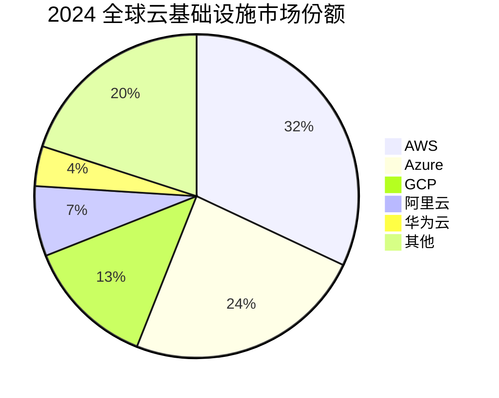
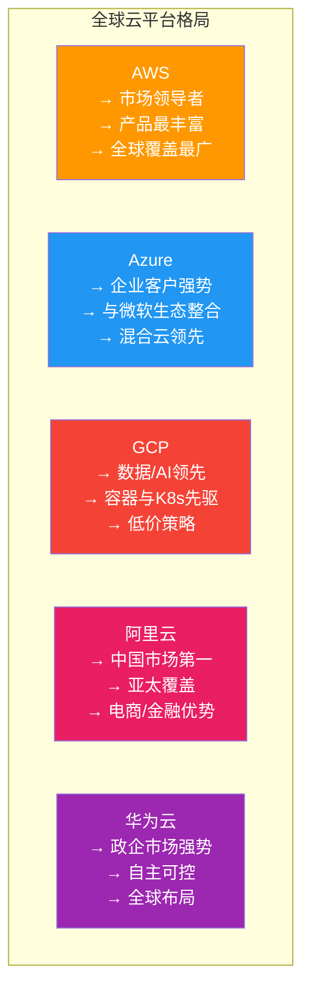
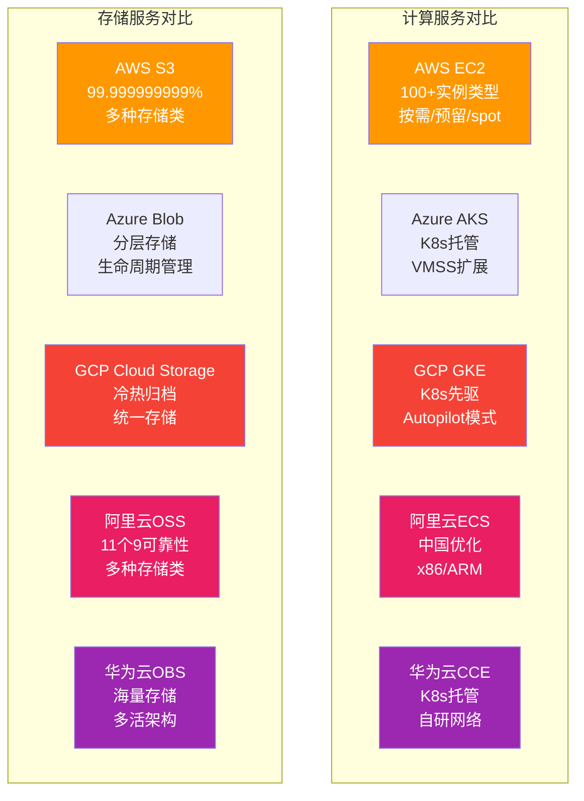
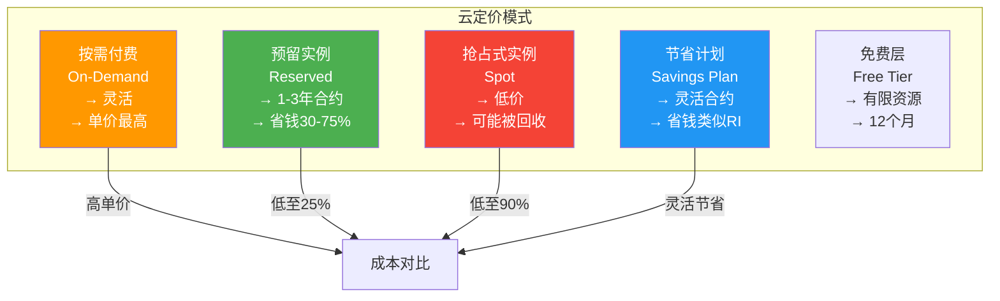
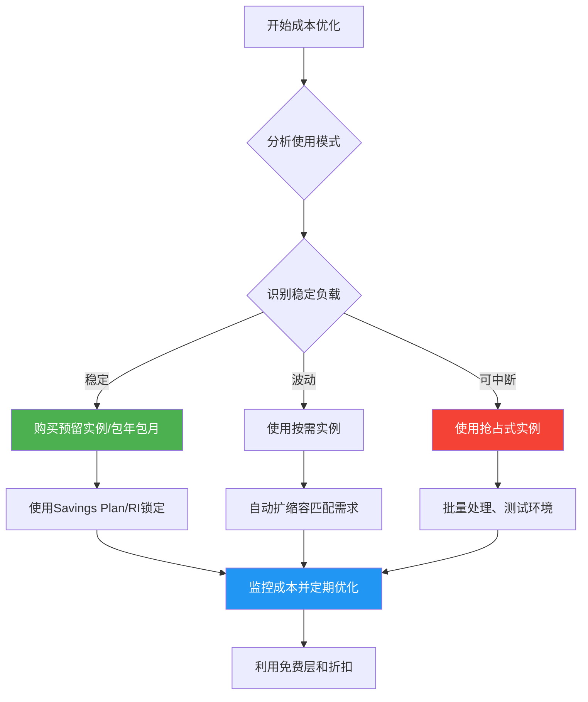

# 10.1 主流云平台对比

> [!abstract] 本节导读
> 云平台是云计算生态的基础设施。本节首先介绍全球五大主流云平台（AWS、Azure、GCP、阿里云、华为云）的市场定位和核心优势，然后从IaaS/PaaS/SaaS三个层面对比产品矩阵，接着分析云平台选型的关键标准和定价模型，最后通过Mermaid图表展示云平台市场格局和产品对比。

## 一、云平台市场格局

### 全球市场份额



### 五大平台定位



| 平台 | 定位 | 核心优势 | 目标客户 |
|-----|------|---------|---------|
| **AWS** | 云先行者、领导者 | 产品最多（300+服务）、全球节点最多 | 全行业、开发者 |
| **Azure** | 企业云平台 | 微软生态整合（Office/Azure AD）、混合云 | 大型企业、政府 |
| **GCP** | 数据与AI平台 | BigQuery、TensorFlow、Anthos | 数据驱动、开发者 |
| **阿里云** | 中国云第一 | 中国市场份额第一、亚太覆盖 | 中国企业、电商 |
| **华为云** | 政企云 | 自主可控、政府行业、金融行业 | 政府、金融、运营商 |

## 二、产品矩阵对比

### IaaS层对比

| 维度 | AWS | Azure | GCP | 阿里云 | 华为云 |
|-----|-----|-------|-----|--------|--------|
| **计算** | EC2 | Virtual Machines | Compute Engine | ECS | ECS |
| **容器** | ECS/EKS | AKS | GKE | ACK | CCE |
| **存储** | S3 | Blob Storage | Cloud Storage | OSS | OBS |
| **块存储** | EBS | Managed Disks | Persistent Disk | 云磁盘 | EVS |
| **数据库** | RDS | Azure SQL | Cloud SQL | RDS | RDS |
| **网络** | VPC | VNet | VPC | VPC | VPC |
| **负载均衡** | ALB/NLB | LB | Cloud LB | SLB | ELB |
| **CDN** | CloudFront | Azure CDN | Cloud CDN | CDN | CDN |

### PaaS层对比

| 维度 | AWS | Azure | GCP | 阿里云 | 华为云 |
|-----|-----|-------|-----|--------|--------|
| **数据库** | DynamoDB | Cosmos DB | Firestore | DynamoDB兼容 | DDS |
| **缓存** | ElastiCache | Azure Cache | Cloud Memorystore | Redis | Redis |
| **消息队列** | SQS | Service Bus | Cloud Pub/Sub | MQ | DMS |
| **搜索** | Elasticsearch Service | Azure Search | Cloud Search | Elasticsearch | Elasticsearch |
| **大数据** | EMR | HDInsight | Dataproc | EMR | MRS |
| **AI/ML** | SageMaker | Azure ML | Vertex AI | PAI | ModelArts |
| **无服务器** | Lambda | Azure Functions | Cloud Functions | FC | FunctionGraph |

### SaaS层对比

| 维度 | AWS | Azure | GCP | 阿里云 | 华为云 |
|-----|-----|-------|-----|--------|--------|
| **办公协作** | WorkDocs | Microsoft 365 | G Suite/Workspace | 钉钉 | 华为云WeLink |
| **CRM** | AWS Marketplace | Dynamics 365 | Google Workspace | 阿里云Marketplace | 华为云Marketplace |
| **企业应用** | 多种第三方 | 丰富生态 | 丰富生态 | 钉钉/阿里云应用 | 企业微信/WeLink |

### 核心产品对比矩阵



## 三、云平台选型

### 选型关键因素

```mermaid
graph TB
    subgraph "云平台选型决策树"
        direction TB
        Start["开始选型"] --> Q1{业务主要市场?}
        Q1 -->|"中国为主"| Q1A["阿里云/华为云<br/>→ 合规性好<br/>→ 网络延迟低"]
        Q1 -->|"全球"| Q1B["AWS/Azure/GCP<br/>→ 全球节点覆盖"]
        Q1 -->|"欧美"| Q1C["AWS/Azure<br/>→ 数据合规"]
        Q1A --> Q2{行业特点?}
        Q1B --> Q3{技术需求?}
        Q1C --> Q3

        Q2 -->|"电商/互联网"| Aliyun2["阿里云<br/>→ 电商生态"]
        Q2 -->|"政府/金融"| Huawei2["华为云<br/>→ 自主可控"]
        Q2 -->|"通用"| Aliyun3["阿里云/华为云"]

        Q3 -->|"AI/大数据"| GCP["GCP<br/>→ Vertex AI/BigQuery"]
        Q3 -->|"企业/混合云"| Azure["Azure<br/>→ 混合云/微软生态"]
        Q3 -->|"通用/全球"| AWS["AWS<br/>→ 产品最全"]

        style Aliyun2 fill:#4CAF50,color:#fff
        style Huawei2 fill:#FF9800,color:#fff
        style GCP fill:#2196F3,color:#fff
        style AWS fill:#F44336,color:#fff
```

### 选型维度

| 维度 | 评估要点 | 权重 |
|-----|---------|------|
| **业务需求** | 应用类型、性能要求、数据位置 | ★★★★★ |
| **合规要求** | 数据主权、行业监管、审计要求 | ★★★★★ |
| **成本预算** | 定价模型、预估用量、优化空间 | ★★★★ |
| **技术能力** | 团队技能、生态系统、API成熟度 | ★★★★ |
| **服务可用性** | SLA、区域覆盖、灾备能力 | ★★★ |
| **供应商锁定** | 迁移成本、标准化程度、多云策略 | ★★★ |
| **长期发展** | 供应商路线图、创新能力、市场份额 | ★★ |

### 多云 vs 单云

| 策略 | 优点 | 缺点 | 适用场景 |
|-----|------|------|---------|
| **单云** | 简单、成本低、无迁移成本 | 供应商锁定、区域受限 | 初创公司、单一市场 |
| **多云（Multi-Cloud）** | 避免锁定、最优选择、风险分散 | 复杂度高、管理成本高 | 大型企业、全球业务 |
| **混合云（Hybrid）** | 灵活、可整合现有IT | 架构复杂、网络要求高 | 政府、金融、传统企业 |

## 四、定价模型对比

### 定价模式



### 各平台定价对比

| 定价模式 | AWS | Azure | GCP | 阿里云 |
|---------|-----|-------|-----|--------|
| **按需** | 基准价 | 约与AWS相当 | 普遍比AWS低10-30% | 中国本地化定价 |
| **预留** | 1/3年期，省30-75% | 1/3年期，类似 | 1/3年期，叫Committed Use Discount | 1/3年期，包年包月 |
| **抢占式** | Spot Instance | Spot VM | Preemptible VM | 抢占式实例 |
| **节省计划** | Savings Plans | 无直接对应 | 无直接对应 | 预留实例券 |
| **免费层** | 12个月+永久免费 | 12个月+永久免费 | 12个月+永久免费 | 新用户免费试用 |

### 成本优化建议



## 五、小结

> [!summary] 本节要点回顾
> 1. **市场格局**：AWS领导者、Azure企业强势、GCP数据/AI优势、阿里云中国第一、华为云政企强势
> 2. **产品矩阵**：各平台在IaaS/PaaS/SaaS层有对应产品，命名不同但功能对等
> 3. **选型决策**：业务市场、合规要求、成本预算、技术能力四大核心维度
> 4. **定价模型**：按需、预留、抢占、节省计划各有适用场景，组合使用最优化成本
> 5. **多云策略**：多云避免锁定，混合云整合现有IT，单云简单高效

## 关联知识点

| 关联知识点 | 关系 |
|-----------|------|
| [[4.1 云架构设计与OpenStack]] | OpenStack是云平台的开源基础 |
| [[10.2 云原生技术体系]] | 云原生应用部署在各大云平台上 |
| [[10.3 云原生应用开发实践]] | 应用开发需考虑云平台特性 |
| [[第9章 云安全与隐私防护]] | 不同云平台的安全合规能力不同 |