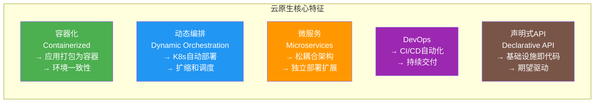
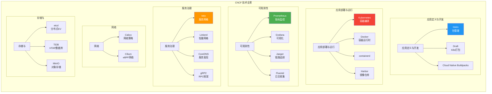
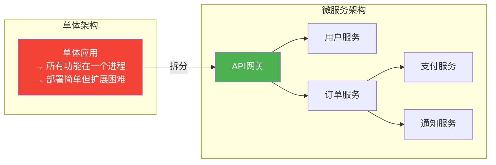
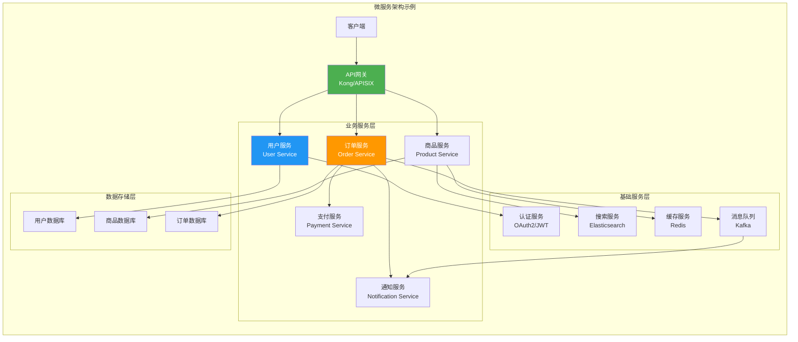
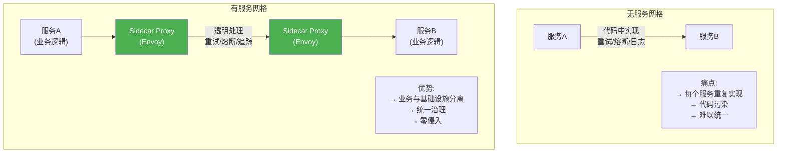
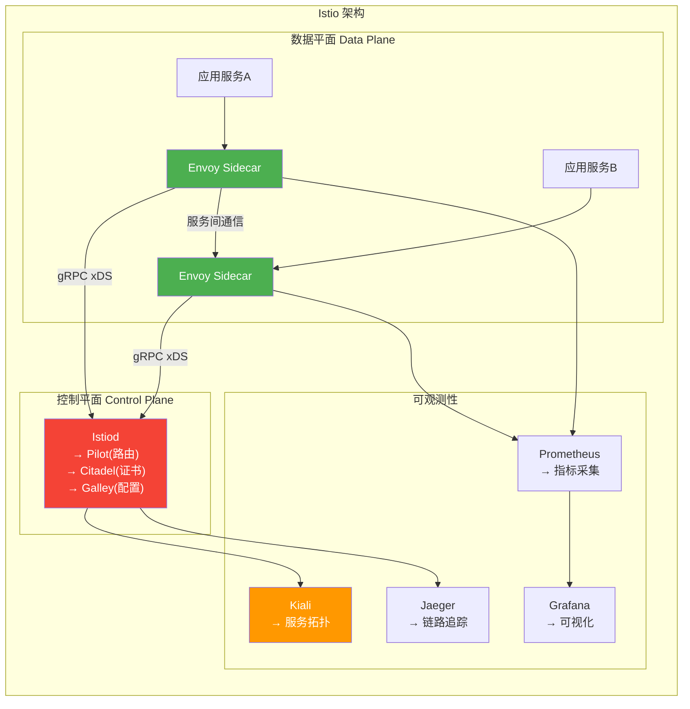
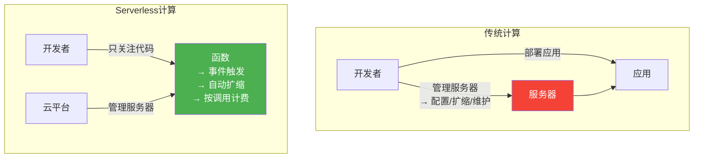
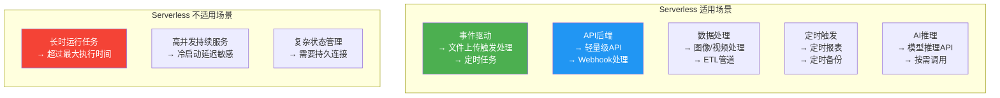

# 10.2 云原生技术体系

> [!abstract] 本节导读
> 云原生是云计算时代的核心技术范式。本节首先介绍云原生的定义与核心特征，展示CNCF技术全景图，然后深入讲解微服务架构的设计原则与挑战，接着介绍服务网格（Istio）的架构与功能，最后讨论Serverless计算的优势与适用场景。

## 一、云原生概述

### 什么是云原生

> [!definition] 云原生（Cloud Native）
> 云原生是一套构建和运行应用的方法论，充分利用云计算的弹性、分布式和自动化特性，使应用能够在公有云、私有云和混合云环境中可扩展、可维护、可迁移。



### 云原生 vs 传统应用

| 维度 | 传统应用 | 云原生应用 |
|-----|---------|-----------|
| **架构** | 单体/烟囱式 | 微服务/Serverless |
| **部署单元** | 虚拟机 | 容器/函数 |
| **扩缩方式** | 手动或半自动 | 自动弹性伸缩 |
| **交付频率** | 周/月/季度 | 日/小时/分钟 |
| **资源利用** | 低（平均10-20%） | 高（60-80%） |
| **故障处理** | 被动修复 | 主动自愈 |
| **可观测性** | 日志为主 | 指标+日志+追踪 |

## 二、CNCF 技术全景

### CNCF 全景图

> [!definition] CNCF（Cloud Native Computing Foundation）
> Linux基金会旗下的云原生计算基金会，致力于推动云原生技术栈的标准化和普及。



### CNCF 毕业项目

| 项目 | 类型 | 描述 |
|-----|------|------|
| **Kubernetes** | 容器编排 | 容器调度和管理 |
| **Docker** | 容器运行时 | 容器创建和运行 |
| **Prometheus** | 监控 | 指标采集和告警 |
| **Grafana** | 可视化 | 仪表盘和图表 |
| **Jaeger** | 追踪 | 分布式链路追踪 |
| **Fluentd** | 日志 | 日志收集和转发 |
| **Istio** | 服务网格 | 服务间通信治理 |
| **Helm** | 包管理 | K8s应用打包 |
| **etcd** | 存储 | 分布式键值存储 |
| **CoreDNS** | 网络 | DNS服务发现 |
| **gRPC** | RPC | 高性能RPC框架 |

## 三、微服务架构

### 从单体到微服务



### 微服务设计原则

> [!tip] 微服务设计十大原则
> 1. **单一职责**：每个服务只做一件事，做好
> 2. **服务自治**：每个服务独立部署、独立数据存储
> 3. **松耦合**：服务间通过API通信，不依赖内部实现
> 4. **高内聚**：服务内部的元素紧密相关
> 5. **API优先**：先定义API，再实现
> 6. **去中心化**：数据和管理去中心化
> 7. **容错设计**：假设服务会失败，设计容错机制
> 8. **可观测**：每个服务必须可监控、可追踪
> 9. **自动化**：构建、部署、测试全自动化
> 10. **演进式设计**：服务可独立演进和替换

### 微服务架构图



### 微服务挑战

| 挑战 | 描述 | 解决方案 |
|-----|------|---------|
| **分布式复杂性** | 网络延迟、分区容忍 | 服务网格、异步通信 |
| **数据一致性** | 跨服务事务困难 | Saga模式、事件溯源 |
| **服务治理** | 服务发现、路由、负载均衡 | 服务网格、注册中心 |
| **可观测性** | 日志、指标、追踪需关联 | 分布式追踪（Jaeger） |
| **运维复杂度** | 服务数量多、部署频繁 | DevOps、GitOps |
| **测试难度** | 集成测试复杂 | 契约测试、端到端测试 |

## 四、服务网格

### 什么是服务网格

> [!definition] 服务网格（Service Mesh）
> 一种专用的基础设施层，用于处理服务间通信，以透明方式为应用提供可观测性、路由、安全、可靠性等功能，无需修改应用代码。



### Istio 架构

> [!definition] Istio
> 由Google、IBM、Lyft等联合开发的开源服务网格，基于Envoy代理，提供流量管理、安全、可观测性等核心功能。



### Istio 核心功能

| 功能 | 描述 | CRD |
|-----|------|-----|
| **流量管理** | 路由、分流量、超时、重试 | VirtualService, DestinationRule |
| **安全** | mTLS、授权、认证 | PeerAuthentication, AuthorizationPolicy |
| **可观测性** | 指标、追踪、日志 | Telemetry |
| **故障注入** | 模拟延迟、错误、崩溃 | FaultInjection |
| **金丝雀发布** | 灰度发布、A/B测试 | VirtualService |

### Istio 配置示例

```yaml
# virtualservice.yaml - 灰度发布
apiVersion: networking.istio.io/v1beta1
kind: VirtualService
metadata:
  name: web-app
spec:
  hosts:
    - web-app.default.svc.cluster.local
  http:
    - match:
        - headers:
            user-group:
              exact: beta
      route:
        - destination:
            host: web-app
            subset: v2
    - route:
        - destination:
            host: web-app
            subset: v1
---
# destinationrule.yaml
apiVersion: networking.istio.io/v1beta1
kind: DestinationRule
metadata:
  name: web-app
spec:
  host: web-app
  subsets:
    - name: v1
      labels:
        version: v1
    - name: v2
      labels:
        version: v2
---
# peerauthentication.yaml - mTLS
apiVersion: security.istio.io/v1beta1
kind: PeerAuthentication
metadata:
  name: default
  namespace: default
spec:
  mtls:
    mode: STRICT
```

## 五、Serverless 计算

### 什么是Serverless

> [!definition] Serverless计算
> 一种执行模型，云服务商动态管理服务器资源的分配和供应，开发者只需关注业务逻辑，无需管理服务器。



### Serverless 代表产品

| 平台 | 产品 | 特性 |
|-----|------|------|
| **AWS** | Lambda | 15分钟超时，事件驱动，丰富事件源 |
| **Azure** | Azure Functions | 支持多种语言，Durable Functions |
| **GCP** | Cloud Functions | 快速冷启动，与GCP生态集成 |
| **阿里云** | 函数计算（FC） | 国内领先，事件源丰富 |
| **华为云** | FunctionGraph | 多种触发方式 |
| **开源** | Knative, OpenFaaS | 可自托管的Serverless方案 |

### Serverless vs 容器 vs 虚拟机

| 维度 | 虚拟机 | 容器 | Serverless |
|-----|--------|------|------------|
| **资源隔离** | 硬件级 | 进程级 | 进程级 |
| **启动速度** | 分钟级 | 秒级 | 毫秒级（预热后） |
| **扩缩方式** | 手动/自动 | K8s自动 | 完全自动 |
| **计费方式** | 按实例时间 | 按实例时间 | 按调用次数+运行时间 |
| **运维开销** | 高 | 中 | 极低 |
| **适用场景** | 传统应用、重负载 | 微服务、云原生 | 事件驱动、轻量任务 |

### Serverless 应用场景



### Lambda 函数示例

```python
import json
import boto3

lambda_client = boto3.client('lambda')

def lambda_handler(event, context):
    action = event.get('action', 'process')

    if action == 'process_order':
        return process_order(event)
    elif action == 'generate_report':
        return generate_report(event)
    else:
        return {
            'statusCode': 400,
            'body': json.dumps({'error': f'Unknown action: {action}'})
        }

def process_order(event):
    order_id = event.get('order_id')
    s3 = boto3.client('s3')

    s3.put_object(
        Bucket='order-processing-bucket',
        Key=f'orders/{order_id}.json',
        Body=json.dumps(event)
    )

    return {
        'statusCode': 200,
        'body': json.dumps({
            'order_id': order_id,
            'status': 'processed'
        })
    }

def generate_report(event):
    sns = boto3.client('sns')
    sns.publish(
        TopicArn='arn:aws:sns:us-east-1:123456789012:reports',
        Subject='Daily Report Generated',
        Message=json.dumps({'date': event.get('date'), 'status': 'success'})
    )

    return {
        'statusCode': 200,
        'body': json.dumps({'report': 'generated'})
    }
```

## 六、小结

> [!summary] 本节要点回顾
> 1. **云原生核心**：容器化、动态编排、微服务、DevOps、声明式API
> 2. **CNCF全景**：应用定义→部署运行→可观测→服务治理→网络→存储，覆盖云原生全栈
> 3. **微服务**：拆分单体为独立服务，独立部署扩展，但带来分布式复杂性
> 4. **服务网格**：通过Sidecar代理透明处理服务间通信，Istio是主流实现
> 5. **Serverless**：无需管理服务器，按调用计费，适合事件驱动和轻量任务
> 6. **技术演进**：虚拟机→容器→Serverless，运维开销递减，弹性能力递增

## 关联知识点

| 关联知识点 | 关系 |
|-----------|------|
| [[3.3 Dockerfile与容器编排]] | Docker是云原生的容器基础 |
| [[8.3 容器编排Kubernetes]] | K8s是云原生的编排核心 |
| [[10.3 云原生应用开发实践]] | 云原生技术的具体应用 |
| [[10.1 主流云平台对比]] | 各大云平台都支持云原生技术栈 |