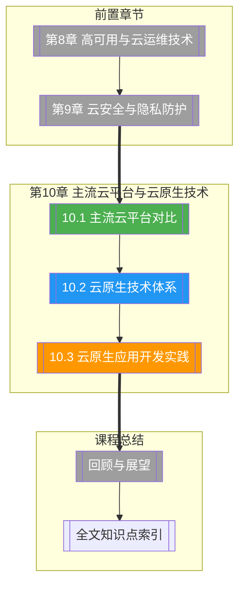

# 第10章 主流云平台与云原生技术

> [!abstract] 章节概述
> 本章聚焦云生态的两大支柱：主流云平台对比和云原生技术体系。首先全面对比AWS、Azure、GCP、阿里云、华为云的产品矩阵、定价模型和选型策略，然后介绍云原生的定义与CNCF技术全景，深入讲解微服务架构、服务网格（Istio）和Serverless计算，最后通过12-Factor方法论和完整微服务项目实战，展示云原生应用的开发全流程。

## 学习路线图

## 知识点导航

| 编号 | 知识点 | 核心内容 | 重要程度 |
|-----|--------|---------|---------|
| 10.1 | [[10.1 主流云平台对比]] | AWS/Azure/GCP/阿里云/华为云对比、产品矩阵、选型标准、定价模型 | ⭐⭐⭐⭐⭐ |
| 10.2 | [[10.2 云原生技术体系]] | 云原生定义与CNCF全景、微服务架构、服务网格Istio、Serverless | ⭐⭐⭐⭐⭐ |
| 10.3 | [[10.3 云原生应用开发实践]] | 12-Factor方法论、微服务通信、可观测性、完整项目实战 | ⭐⭐⭐⭐⭐ |

## 核心概念速览

> [!tip] 本章必须掌握的核心概念
> - **公有云市场格局**：AWS领导者、Azure企业强势、GCP数据/AI优势、阿里云中国市场第一
> - **云原生（Cloud Native）**：为云环境而生的应用构建和运行方式，充分利用云的弹性和分布式特性
> - **CNCF（Cloud Native Computing Foundation）**：Linux基金会旗下的云原生计算基金会
> - **微服务架构**：将单体应用拆分为一组小型、独立、可独立部署的服务
> - **服务网格（Service Mesh）**：在不修改应用代码的情况下，为服务间通信添加可观测性、路由、安全等功能
> - **Serverless计算**：无需管理服务器，按量计费的执行模式
> - **12-Factor应用**：构建SaaS应用的12条方法论
> - **可观测性三支柱**：日志（Logging）、指标（Metrics）、追踪（Tracing）

## 核心考点

> [!important] 期末高频考点

| 考点 | 所属知识点 | 考查形式 | 难度 |
|-----|-----------|---------|------|
| 五大云平台的定位与核心优势 | 10.1 | 对比题/简答题 | ★★★ |
| IaaS/PaaS/SaaS代表产品跨平台对比 | 10.1 | 对比题/表格题 | ★★★★ |
| 云平台选型的关键因素 | 10.1 | 案例分析/论述题 | ★★★★ |
| 云原生的定义与核心特征 | 10.2 | 简答题 | ★★★ |
| 微服务架构与单体架构的对比 | 10.2 | 对比题/论述题 | ★★★★ |
| 服务网格（Istio）的架构与功能 | 10.2 | 简答题/论述题 | ★★★★ |
| Serverless计算的优势与适用场景 | 10.2 | 简答题/对比题 | ★★★ |
| 12-Factor方法论的核心内容 | 10.3 | 简答题 | ★★★★ |
| 微服务通信方式（REST/gRPC/消息队列） | 10.3 | 对比题 | ★★★ |
| 可观测性三支柱的实现 | 10.3 | 论述题/案例分析 | ★★★★ |

## 自测题

> [!question] 章节自测
> 1. 对比AWS、Azure、GCP、阿里云、华为云在IaaS、PaaS、SaaS三个层面的核心产品和优势，分析中国企业出海的云平台选择策略。
> 2. 阐述云原生的核心特征和CNCF技术全景图，分析微服务、服务网格、Serverless如何协同工作。
> 3. 使用Istio为一个微服务应用配置流量管理（灰度发布）、故障注入和可观测性，编写相关的Istio配置文件。
> 4. 按照12-Factor方法论，设计一个云原生应用的开发和部署流程。
> 5. 设计一个包含3个微服务（API网关、用户服务、订单服务）的完整系统，说明服务间通信方式、可观测性实现和部署方案。

## 章节导航

| 方向 | 链接 |
|-----|------|
| ⬆ 返回课程总览 | [[MOC - 云计算技术]] |
| ⬅ 上一章 | [[第9章 云安全与隐私防护/MOC - 第9章]] |
| ➡ 课程总结 | （全部章节结束） |