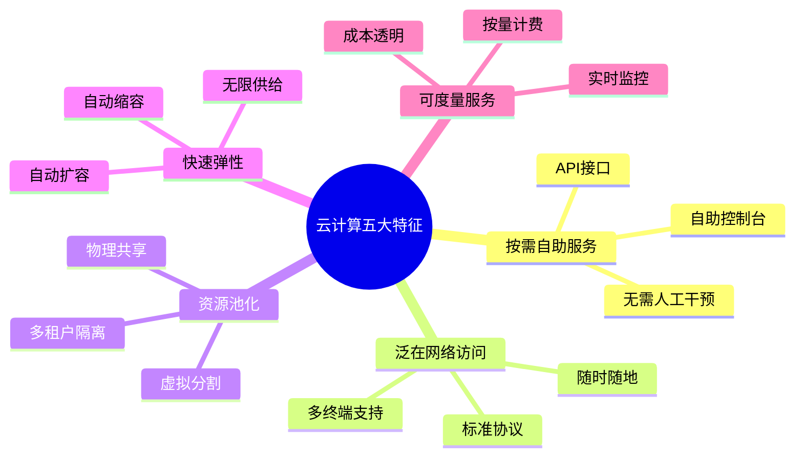
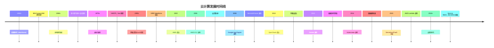
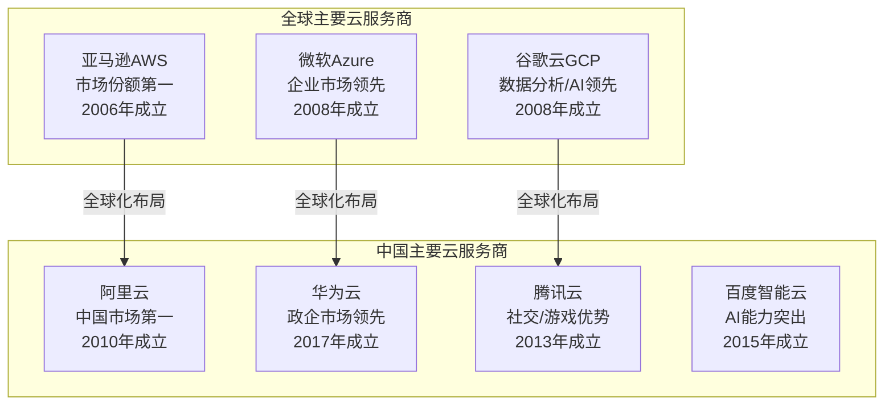

# 1.1 云计算定义、特征与发展历程

> [!abstract] 本节导读
> 云计算是近年来信息技术领域最具变革性的范式之一。本节从权威定义入手，阐述云计算的核心特征，梳理其从大型机时代到云原生时代的演进脉络，并介绍当前主流云服务商的竞争格局。

## 一、云计算的定义

### NIST 定义（2011年）

美国国家标准与技术研究院（National Institute of Standards and Technology, NIST）在 SP 800-205 中将云计算定义为：

> "云计算是一种模型，它可以通过网络按需访问可配置的计算资源共享池（如网络、服务器、存储、应用和服务），这些资源能够被快速提供和释放，只需最少的管理工作或服务提供商的交互。"

**NIST 定义的五个核心要点**：
1. **按需访问**（on-demand）：用户自主申请，无需人工干预
2. **网络访问**（network access）：通过标准网络协议访问
3. **资源池**（resource pooling）：多租户共享物理资源
4. **快速弹性**（rapid elasticity）：资源可快速增减
5. **服务度量**（measured service）：按需计费，量化监控

### ISO/IEC 17788 定义

国际标准化组织在 ISO/IEC 17788:2014 标准中给出的定义为：

> "云计算是一种支持网络访问可配置IT资源共享池的模式，能够在最少管理工作的情况下提供按需使用、自服务、弹性、可度量和多租户访问。"

**ISO 定义补充了**：
- 强调 IT 资源的可配置性（configurable）
- 明确多租户（multi-tenant）是核心属性而非附加特征
- 关注服务的可移植性和互操作性

### 通俗理解

云计算的本质是将**计算资源水电煤化**：
- 用户像使用自来水和电力一样，按需获取计算能力
- 无需购买和维护硬件设施
- 按使用量付费（pay-as-you-go）
- 资源可无限扩展，随时取用

## 二、云计算的五大基本特征

> [!important] NIST 五大 Essential Characteristics

| 特征 | 英文名称 | 含义 | 举例 |
|-----|---------|------|------|
| 按需自助服务 | On-demand Self-Service | 用户自行配置计算资源，无需与服务提供商交互 | 通过控制台自助创建云服务器 |
| 泛在网络访问 | Broad Network Access | 通过标准网络接口访问，支持多种终端（PC、手机、平板） | 通过互联网在任何设备上访问云服务 |
| 资源池化（多租户） | Resource Pooling / Multi-tenancy | 物理计算资源通过虚拟化技术池化，多租户共享 | 同一台物理机上运行多个用户的虚拟机 |
| 快速弹性 | Rapid Elasticity | 资源可快速向上或向下扩展，对用户来说资源供给是无限的 | 电商大促时自动扩容，过后自动缩容 |
| 可度量服务 | Measured Service | 系统自动监控和优化资源使用，按量计费 | 按CPU小时、存储容量、数据传输量计费 |

## 三、云计算发展历程

### 发展阶段概览

### 关键里程碑详解

#### 阶段一：前云时代（2006年以前）

| 年份 | 事件 | 意义 |
|-----|------|------|
| 1955 | IBM 650 大型机商用 | 集中式计算时代开始 |
| 1961 | John McCarthy 提出"计算作为公共事业" | 云计算思想萌芽 |
| 1965 | IBM System/360 分时系统 | 多用户共享计算资源 |
| 1972 | IBM VM/370 虚拟化操作系统 | 虚拟机概念验证 |
| 1999 | Salesforce 成立，推出云端CRM | SaaS模式诞生 |
| 2002 | Amazon Web Services 成立 | AWS开始提供云服务 |

#### 阶段二：云计算诞生期（2006-2009）

| 年份 | 事件 | 意义 |
|-----|------|------|
| **2006** | **AWS 发布 EC2（弹性计算云）** | **云计算元年**，首次将计算资源作为可按需购买的商品 |
| 2006 | Google 发布 Google Apps（Gmail等） | SaaS 市场教育 |
| 2008 | Google 发布 App Engine | PaaS 模式兴起 |
| 2008 | Microsoft 发布 Windows Azure | 微软进入云市场 |

#### 阶段三：成长期（2010-2015）

| 年份 | 事件 | 意义 |
|-----|------|------|
| 2010 | OpenStack 开源云平台成立 | 开源私有云解决方案 |
| 2010 | 阿里云成立 | 中国云市场起步 |
| 2011 | NIST 正式发布云计算定义 | 云计算概念标准化 |
| 2013 | **Docker 发布 1.0** | **容器化时代开启**，轻量级虚拟化变革 |
| 2014 | **Kubernetes 发布 1.0** | **容器编排标准**，由Google捐赠CNCF |
| 2014 | 亚马逊发布 Lambda | Serverless/FaaS 萌芽 |

#### 阶段四：成熟期（2015年至今）

| 年份 | 事件 | 意义 |
|-----|------|------|
| 2015 | AWS Lambda 正式商用 | Serverless 模式兴起 |
| 2016 | 阿里云成为全球第三大云厂商 | 亚太市场领先 |
| 2017 | CNCF 宣布 Kubernetes 毕业 | 容器编排成为云原生基础 |
| 2019 | 云原生（Cloud Native）成为主流 | CNCF Landscape 蓬勃发展 |
| 2020+ | Serverless、Service Mesh、eBPF 普及 | 云原生技术栈成熟 |

### 发展规律总结

> [!tip] 云计算演进规律
> 1. **资源抽象层级提升**：硬件→操作系统→虚拟机→容器→函数（Serverless）
> 2. **用户关注点上移**：基础设施→平台→应用逻辑
> 3. **计费粒度细化**：按年/月→按小时→按秒→按请求
> 4. **部署密度提升**：物理机→虚拟机（~10:1）→容器（~100:1）

## 四、云计算 vs 传统IT

| 对比维度 | 传统IT模式 | 云计算模式 |
|---------|-----------|-----------|
| **资源获取** | 购买硬件设备、自建机房 | 按需租用、即时获取 |
| **初始投入** | 高（硬件+机房+运维） | 低（按需付费，无前置成本） |
| **运维责任** | 全部由企业自行承担 | 由云服务商承担大部分 |
| **扩展能力** | 需提前规划、扩容周期长 | 弹性伸缩，分钟/秒级 |
| **资源利用率** | 低（平均15-30%） | 高（多租户共享，60-80%+） |
| **付费模式** | CapEx（资本支出）为主 | OpEx（运营支出）为主 |
| **技术栈锁定** | 硬件锁定严重 | 部分锁定，可跨云迁移 |
| **安全合规** | 自主管控，灵活 | 依赖云服务商，需评估 |
| **灾难恢复** | 需自建灾备中心 | 云端多可用区自动容灾 |
| **全球部署** | 需在各地建设机房 | 全球部署一键完成 |

## 五、主流云服务商格局

### 全球市场格局

> [!important] 全球云市场Gartner魔力象限领导者

### 各厂商定位对比

| 服务商 | 核心优势 | 目标用户 | 核心产品 |
|-------|---------|---------|---------|
| **AWS** | 产品线最全、生态最成熟 | 全行业、初创到大型企业 | EC2、S3、Lambda、RDS |
| **Azure** | 与Microsoft生态集成紧密 | 企业用户、政府 | Azure VM、Azure SQL、Power BI |
| **GCP** | 数据分析、AI/ML能力强 | 数据驱动型企业、开发者 | BigQuery、Cloud Functions、Vertex AI |
| **阿里云** | 亚太市场领先、电商生态 | 中国企业、跨境电商 | ECS、OSS、MaxCompute、钉钉 |
| **华为云** | 政企市场、5G融合、网络 | 政府、金融、运营商 | ECS、OBS、ModelArts、华为云Stack |
| **腾讯云** | 社交/游戏生态、音视频 | 游戏、社交、直播 | CVM、COS、微信云开发 |
| **百度智能云** | AI能力、自动驾驶 | 自动驾驶、智慧城市 | BCC、BOS、Apollo、文心一言 |

### 市场数据参考（2024年）

> [!example] 市场格局数据（参考Gartner、Synergy Research）
> - **全球IaaS+PaaS市场份额**：AWS ~30%，Azure ~23%，GCP ~11%，阿里云~4%
> - **中国公有云市场份额**：阿里云 ~37%，华为云 ~17%，腾讯云 ~16%，百度云 ~7%
> - 云计算市场年增长率 ~15-20%，Serverless增长率 >30%

## 六、小结

> [!summary] 本节要点回顾
> 1. **定义**：NIST和ISO从不同角度定义了云计算，核心是按需访问可配置计算资源共享池
> 2. **特征**：五大特征是云计算区别于传统IT的本质标志，简答题高频考点
> 3. **历程**：从1950s大型机→1999 Salesforce→2006 AWS EC2→2013 Docker→2015 Serverless
> 4. **对比**：云计算在扩展性、成本、运维等方面全面优于传统IT模式
> 5. **格局**：AWS/Azure/GCP为全球三强，阿里云/华为云/腾讯云为国内第一梯队

## 关联知识点

| 关联知识点 | 关系 |
|-----------|------|
| [[1.2 云计算服务模式：IaaS_PaaS_SaaS]] | 本节定义的具体展开 |
| [[1.3 云计算部署模式与应用形态]] | 云计算在组织中的落地方式 |
| [[第2章 虚拟化技术原理/MOC - 第2章]] | 云计算底层核心支撑技术 |
| [[第3章 容器与Docker技术/MOC - 第3章]] | 容器化是云原生的关键技术 |