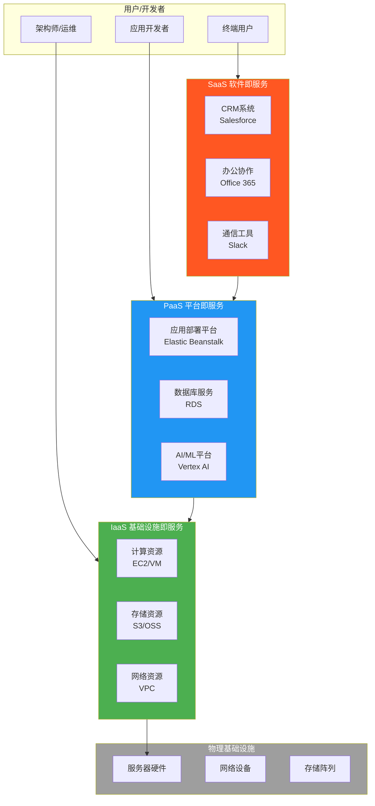
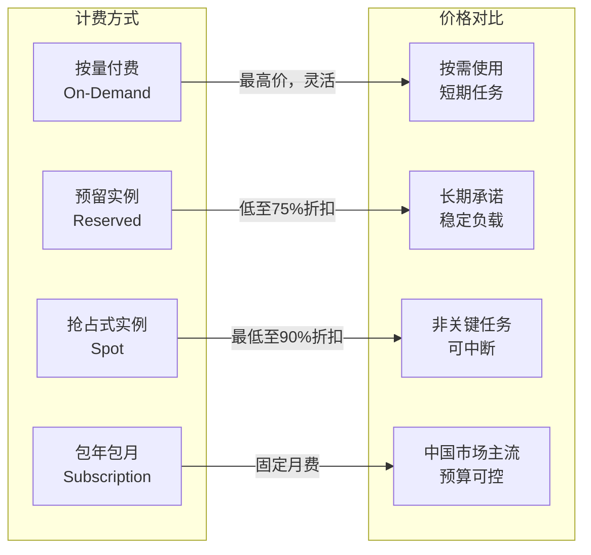
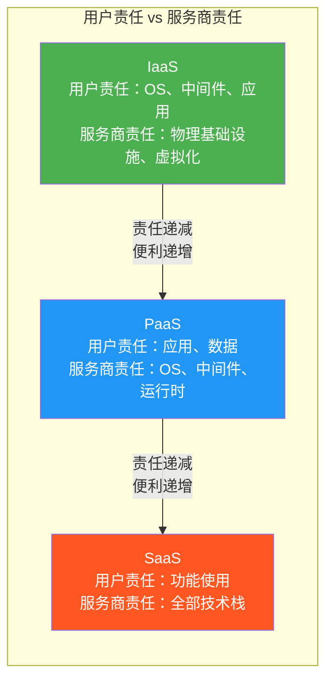
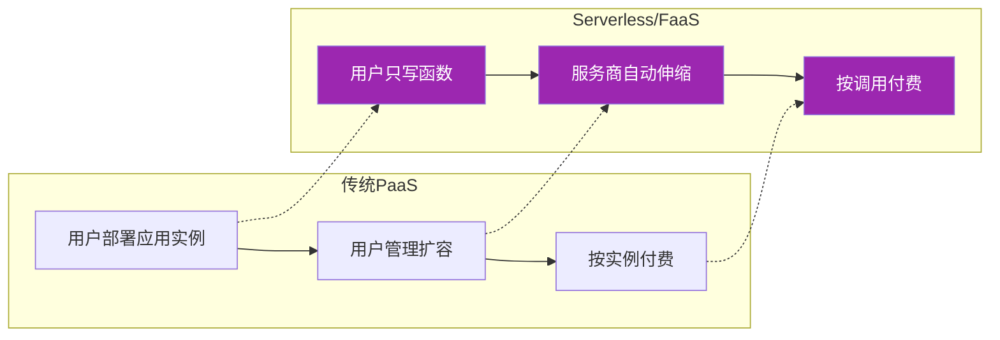
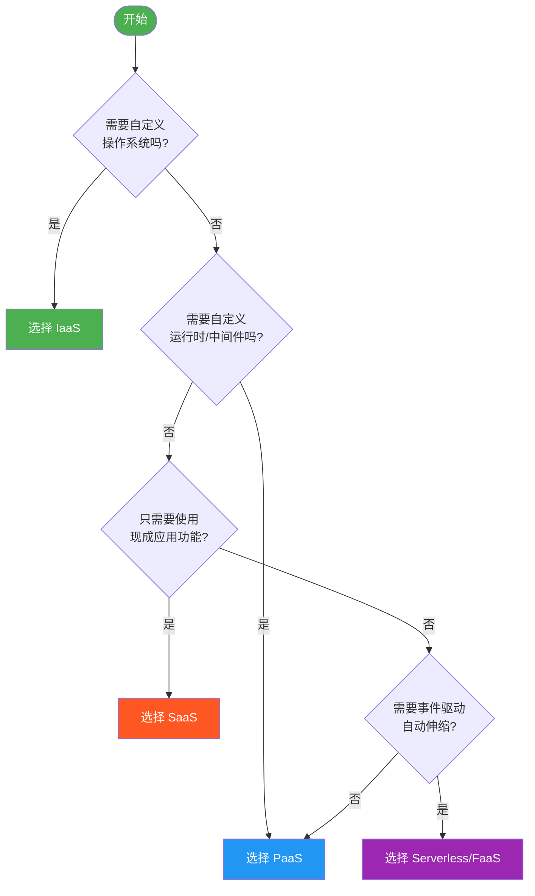

# 1.2 云计算服务模式：IaaS / PaaS / SaaS

> [!abstract] 本节导读
> SPI模型（SaaS、PaaS、IaaS）是云计算最核心的服务分类框架。三层服务分别对应不同的资源抽象层级，从基础设施到应用层层递进。本节深入解析每一层的定义、组件、产品、适用场景与优缺点，并探讨Serverless/FaaS与SPI模型的关系。

## 一、SPI模型概述

### SPI模型的起源

SPI是**SaaS、PaaS、IaaS**三种服务模式的首字母缩写。这一分类框架最早由：

- **Salesforce CEO Marc Benioff** 在2005年提出"SaaS"概念
- **Google** 在2008年发布App Engine后推广"PaaS"概念
- **AWS** 在2006年推出EC2后确立"IaaS"市场
- **NIST SP 800-205（2011）** 正式将SPI模型纳入云计算标准框架

### 层级关系

> [!tip] 核心思想
> SPI模型的本质是**资源抽象层级**的提升：
> - IaaS 提供最基础的计算资源（你需要搭建一切）
> - PaaS 提供开发运行平台（你只需关注业务逻辑）
> - SaaS 提供最终可用的软件（你只需使用功能）
>
> 每上一层，用户的自由度降低，但便利性和抽象程度提高。

## 二、IaaS — 基础设施即服务

### 定义

**IaaS（Infrastructure as a Service）** 是云计算服务模型中最基础的一层，云服务商提供虚拟化的计算、存储和网络基础设施，用户在其上部署和运行任意软件（包括操作系统和应用程序）。

用户需要自行管理：操作系统、中间件、运行时环境、应用程序。

### 核心组件

| 组件类别 | 具体服务 | 功能说明 |
|---------|---------|---------|
| **计算** | 弹性虚拟机（EC2/ECS/Azure VM） | 按需创建、启动、终止虚拟机 |
| **存储** | 对象存储（S3/OSS）、块存储、文件存储 | 提供持久化数据存储 |
| **网络** | 虚拟私有云（VPC/VNet）、弹性IP、负载均衡 | 网络隔离与流量分发 |
| **安全** | 安全组、访问控制、DDoS防护 | 网络安全基础防护 |
| **监控** | 基础监控、日志服务 | 资源使用监控 |

### 典型产品

| 产品 | 服务商 | 特点 |
|-----|-------|------|
| **Amazon EC2** | AWS | 全球最成熟的IaaS产品，实例类型最丰富 |
| **阿里云ECS** | 阿里云 | 中国市场领导者，与生态深度集成 |
| **Azure Virtual Machines** | 微软 | 与Windows生态无缝集成 |
| **Google Compute Engine** | GCP | 按秒计费，性能出色 |
| **华为云ECS** | 华为 | 政企市场领先，自主可控 |

### 计费模式

### 使用场景

- 企业自建数据中心的云化迁移
- 需要运行自定义操作系统或特殊软件
- 开发测试环境快速搭建
- 电商网站等需要自主管理架构的应用
- 金融、政府等对基础设施有强定制需求的行业

### 优缺点

> [!success] 优势
> - 最高灵活性和控制权，可自定义一切
> - 资源按需获取，无需资本投入
> - 支持复杂架构设计
> - 技术生态最成熟

> [!warning] 劣势
> - 用户需自行管理OS、补丁、安全
> - 运维复杂度较高
> - 成本管理需要精细化监控
> - 学习曲线较陡峭

## 三、PaaS — 平台即服务

### 定义

**PaaS（Platform as a Service）** 在IaaS之上提供应用开发、运行和管理的平台，用户无需管理底层基础设施，只需关注应用的业务逻辑和数据。

用户只需管理：应用程序和数据。

### 核心组件

| 组件类别 | 具体服务 | 功能说明 |
|---------|---------|---------|
| **应用托管** | 应用引擎（App Engine/Elastic Beanstalk） | 应用部署、自动伸缩 |
| **数据库服务** | 关系型数据库（RDS）、NoSQL（DynamoDB） | 托管式数据库，免运维 |
| **中间件** | 消息队列（SQS）、缓存（ElastiCache） | 分布式通信基础服务 |
| **开发工具** | CI/CD、代码托管、调试工具 | 应用开发全流程支持 |
| **AI/ML** | 机器学习平台（SageMaker/Vertex AI） | 模型训练与部署 |
| **物联网** | IoT平台、设备管理 | 设备接入与数据处理 |

### 典型产品

| 产品 | 服务商 | 特点 |
|-----|-------|------|
| **AWS Elastic Beanstalk** | AWS | 自动处理容量、负载均衡、伸缩 |
| **Heroku** | Salesforce | 以开发者体验著称，支持多种语言 |
| **Google App Engine** | GCP | 完全托管，自动伸缩 |
| **阿里云RDS** | 阿里云 | 国内最流行的托管数据库服务 |
| **Microsoft Azure SQL** | 微软 | 与SQL Server完全兼容 |
| **Vercel** | Vercel | 前端应用平台（Next.js） |

### 使用场景

- Web应用快速开发与部署
- 移动后端服务（Backend as a Service）
- 需要快速上线的中小型应用
- 数据分析与BI应用
- AI/ML模型训练与部署

### 优缺点

> [!success] 优势
> - 无需管理基础设施，大幅降低运维成本
> - 自动伸缩与高可用
> - 内置开发工具链，加速开发
> - 专注业务逻辑，快速交付

> [!warning] 劣势
> - 平台锁定风险高
> - 自定义能力受限
> - 某些场景性能可能不如自建IaaS
> - 跨平台迁移成本高

## 四、SaaS — 软件即服务

### 定义

**SaaS（Software as a Service）** 是最上层的服务模式，云服务商提供完整的应用程序，用户通过浏览器或客户端直接使用，无需关心任何底层技术。

用户只需：使用软件功能。

### 核心组件

| 组件类别 | 具体服务 | 功能说明 |
|---------|---------|---------|
| **CRM** | Salesforce、HubSpot | 客户关系管理 |
| **办公协作** | Microsoft 365、Google Workspace | 文档、邮件、日历、会议 |
| **通信** | Slack、飞书、Teams | 团队沟通协作 |
| **人力资源** | Workday、钉钉人事 | HR管理系统 |
| **数据分析** | Salesforce Analytics、Tableau | 商业智能与数据可视化 |
| **云存储** | Dropbox、阿里云盘 | 文件存储与同步 |

### 典型产品

| 产品 | 服务商 | 功能领域 |
|-----|-------|---------|
| **Salesforce CRM** | Salesforce | 全球最流行的SaaS应用，CRM市场领导者 |
| **Gmail / Google Workspace** | Google | 邮件+办公套件 |
| **Microsoft Office 365** | 微软 | 企业办公套件，含Teams |
| **Slack** | Slack | 企业团队即时通讯 |
| **Zoom** | Zoom | 视频会议与协作 |
| **飞书（Lark）** | 字节跳动 | 综合办公协作平台 |
| **钉钉** | 阿里巴巴 | 企业办公、考勤、审批 |

### 使用场景

- 企业日常办公（邮件、文档、会议）
- 销售与客户管理
- 团队协作与项目管理
- 人力资源管理
- 小型企业无需IT团队即可使用

### 优缺点

> [!success] 优势
> - 零部署成本，开箱即用
> - 自动升级，无需维护
> - 按需使用，可随时扩展
> - 任何设备、任何地点访问
> - 无需IT专业知识

> [!warning] 劣势
> - 数据安全与隐私顾虑
> - 定制化能力有限
> - 依赖网络连接
> - 长期订阅成本可能高于买断
> - 服务变更受服务商控制

## 五、SPI三层对比

### 详细对比表

| 对比维度 | IaaS | PaaS | SaaS |
|---------|------|------|------|
| **抽象层级** | 基础设施 | 开发平台 | 应用软件 |
| **用户管理范围** | OS、中间件、应用、数据 | 应用、数据 | 仅功能配置 |
| **用户掌控度** | ★★★★★ 最高 | ★★★ 中等 | ★ 最低 |
| **灵活性** | 最高 | 中等 | 最低 |
| **运维复杂度** | 最高 | 中等 | 最低 |
| **资源利用率** | 较低 | 较高 | 最高 |
| **付费模式** | 按CPU/存储/网络 | 按应用实例/请求 | 按用户/按需 |
| **技术门槛** | 高（需运维能力） | 中（需开发能力） | 低（终端用户） |
| **典型用户** | 架构师/运维工程师 | 开发者/企业IT | 终端用户/业务人员 |
| **迁移难度** | 中（VM导出） | 高（平台锁定） | 低（数据导出） |
| **安全责任** | 双方分担 | 服务商为主 | 服务商为主 |
| **代表产品** | EC2、ECS、Azure VM | RDS、Elastic Beanstalk | Salesforce、Office 365 |

### 可视化对比

## 六、Serverless / FaaS 与 SPI 模型

### Serverless 的本质

> [!important] Serverless ≠ 没有服务器
> Serverless = 用户无需关心服务器。服务器仍然存在，但由云服务商完全管理和自动伸缩。

Serverless 不是 SPI 模型的替代，而是 PaaS 的延伸或补充：

### Serverless 的核心特征

| 特征 | 说明 |
|-----|------|
| **无服务器管理** | 无需分配服务器、配置OS、打补丁 |
| **自动伸缩** | 根据请求量自动缩放到0或扩容 |
| **按调用付费** | 仅按实际调用次数和执行时长计费 |
| **事件驱动** | 由事件（HTTP请求、数据库变更、定时触发）触发执行 |
| **短暂运行** | 函数执行时间通常限制在秒级（AWS Lambda: 15min） |

### 典型产品

| 产品 | 服务商 | 支持语言 |
|-----|-------|---------|
| **AWS Lambda** | AWS | Node.js、Python、Java、Go、.NET等 |
| **Google Cloud Functions** | GCP | Node.js、Python、Go、Java |
| **Azure Functions** | 微软 | C#、JavaScript、Python、Java |
| **阿里云函数计算（FC）** | 阿里云 | Node.js、Python、Java、PHP |
| **Vercel Functions** | Vercel | JavaScript/TypeScript、Edge Runtime |
| **Cloudflare Workers** | Cloudflare | JavaScript/TypeScript |

### Serverless vs 传统PaaS对比

| 维度 | 传统PaaS | Serverless/FaaS |
|-----|---------|-----------------|
| 伸缩方式 | 手动或基于指标自动 | 完全自动，按请求量 |
| 付费粒度 | 按实例/小时 | 按毫秒/次调用 |
| 闲置成本 | 需要为闲置实例付费 | 无闲置成本 |
| 冷启动 | 无 | 存在（通常<100ms） |
| 执行时长 | 无限制（直到超时） | 有上限（通常15min） |
| 状态保持 | 可保持状态 | 无状态，需外部存储 |
| 适合场景 | 持续运行的服务 | 事件驱动、突发流量 |
| 复杂度 | 需要管理伸缩策略 | 只需关注函数逻辑 |

## 七、如何选择服务模式

### 决策框架

### 典型场景推荐

| 场景 | 推荐模式 | 理由 |
|-----|---------|------|
| 传统应用迁移上云 | IaaS | 需要保持原有OS和运行环境 |
| 新型Web应用开发 | PaaS | 加速开发，无需运维基础设施 |
| 企业办公 | SaaS | 无需IT投入，立即可用 |
| 图片处理/数据转换 | Serverless | 事件驱动，按需执行，无闲置成本 |
| 电商网站 | IaaS + PaaS 混合 | 核心业务IaaS，数据服务PaaS |
| 大数据分析 | PaaS | 托管数据平台，专注分析逻辑 |
| 物联网后端 | Serverless | 处理海量设备触发的事件 |

### 选择建议

> [!tip] 选型原则
> 1. **向上爬原则**：优先选择抽象层级更高的服务模式（SaaS > PaaS > IaaS），除非有明确理由需要更低层
> 2. **成本考量**：在同等条件下，抽象层级越高，运维成本越低
> 3. **锁定评估**：PaaS和SaaS的平台锁定风险需提前评估，关注数据导出能力
> 4. **团队能力**：IaaS需要更强的运维能力，SaaS几乎零门槛
> 5. **业务特点**：事件驱动型业务天然适合Serverless

## 八、小结

> [!summary] 本节要点回顾
> 1. **SPI模型**：IaaS → PaaS → SaaS，抽象层级递增，用户责任递减
> 2. **IaaS**：提供基础设施，用户自由度最高，运维复杂度最大
> 3. **PaaS**：提供开发平台，平衡灵活性与便利性，开发者首选
> 4. **SaaS**：提供成品软件，零门槛使用，终端用户导向
> 5. **Serverless/FaaS**：PaaS的延伸，事件驱动、按调用付费、自动伸缩
> 6. **选型决策**：根据自定义需求、团队能力、成本预算综合判断

## 关联知识点

| 关联知识点 | 关系 |
|-----------|------|
| [[1.1 云计算定义、特征与发展历程]] | SPI模型是云计算特征的具体实现 |
| [[1.3 云计算部署模式与应用形态]] | 服务模式与部署模式交叉组合 |
| [[第3章 容器与Docker技术/MOC - 第3章]] | 容器是PaaS/Serverless的基础支撑 |
| [[第4章 云计算架构与资源调度/MOC - 第4章]] | 云架构决定SPI各层的实现方式 |