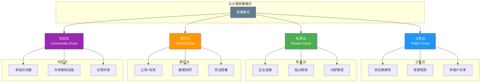
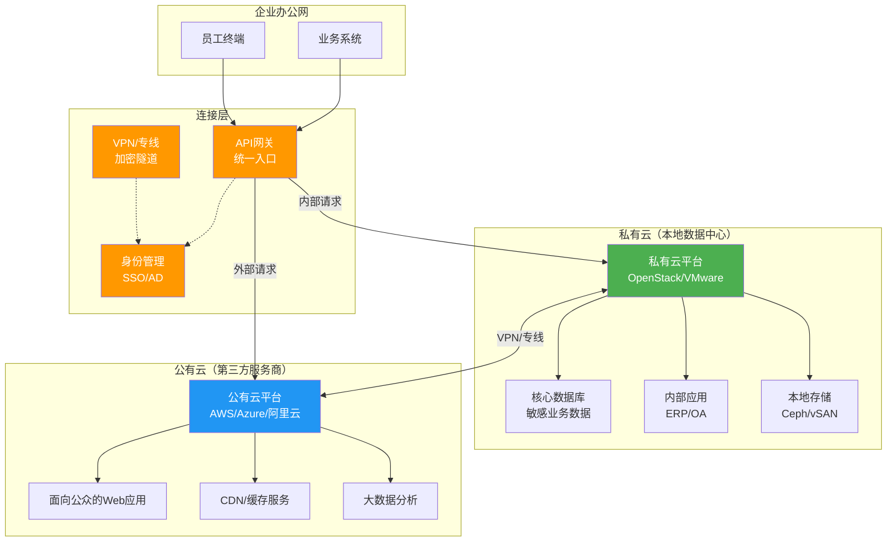
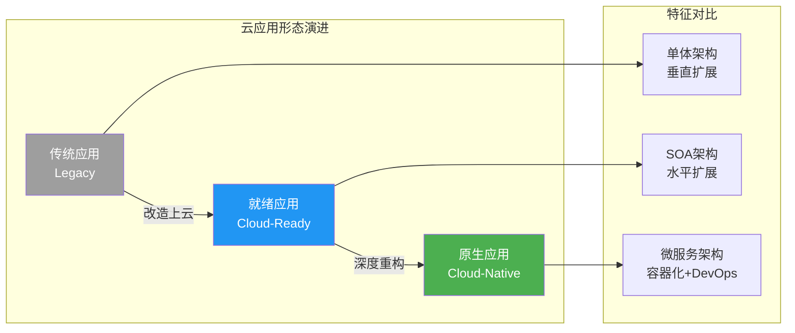
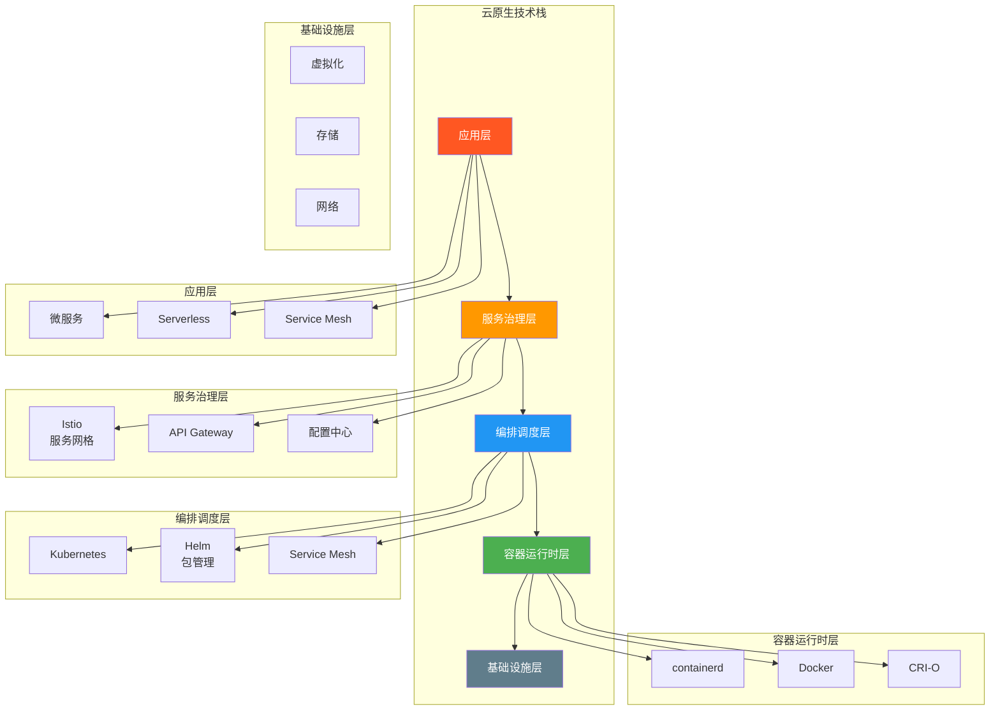
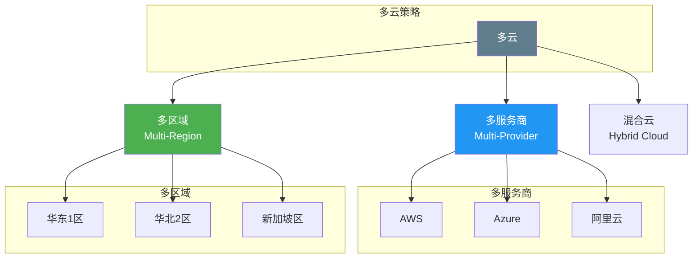
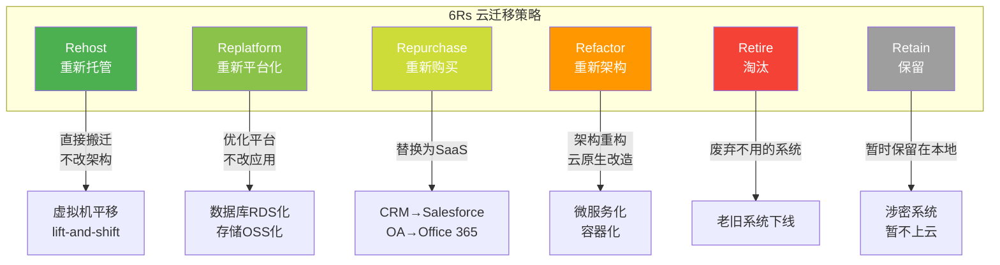

# 1.3 云计算部署模式与应用形态

> [!abstract] 本节导读
> 如果说SPI模型回答了"如何提供服务"的问题，那么部署模式回答了"服务部署在哪里"的问题。本节详细阐述公有云、私有云、混合云和社区云四种部署模式的特点与适用场景，进一步探讨云应用形态、多云策略以及企业云迁移的方法论。

## 一、四种部署模式

### 部署模式全景图



### 公有云（Public Cloud）

#### 定义

公有云由第三方云服务商拥有和运营，通过互联网向任意用户提供计算资源，多个租户共享同一物理基础设施。

#### 核心特征

| 特征 | 说明 |
|-----|------|
| **所有权** | 第三方云服务商所有 |
| **访问方式** | 通过互联网访问 |
| **多租户** | 多用户共享物理资源池 |
| **计费模式** | 按使用量付费（pay-as-you-go） |
| **维护责任** | 由云服务商承担 |

#### 优势

- **零资本投入**：无需购买硬件，启动成本极低
- **无限扩展**：理论上资源供给无上限
- **快速上线**：分钟级即可获得计算资源
- **无需运维**：基础设施维护完全由服务商负责
- **按用量付费**：只为实际使用的资源付费

#### 劣势

- **数据安全顾虑**：数据存储在第三方，存在泄露风险
- **网络依赖**：必须通过互联网访问，离线不可用
- **平台锁定**：深度依赖特定云服务商的技术栈
- **合规问题**：某些行业数据不能出境或必须本地存储
- **定制受限**：硬件、网络等底层无法自定义

#### 典型应用场景

- 创业公司快速搭建产品原型
- 中小型企业IT基础设施外包
- 电商网站应对突发流量
- 开发测试环境
- 数据分析与大数据处理
- 面向公众的Web应用

#### 代表产品

- **AWS**（全球最大公有云服务商）
- **阿里云**（中国最大公有云服务商）
- **Microsoft Azure**
- **Google Cloud Platform**

### 私有云（Private Cloud）

#### 定义

私有云由企业或组织自行构建和管理，仅供内部使用，不对外提供服务。可部署在企业内部数据中心或由第三方托管。

#### 核心特征

| 特征 | 说明 |
|-----|------|
| **所有权** | 企业/组织所有 |
| **访问方式** | 通常通过内部网络访问 |
| **单租户** | 独占物理资源 |
| **计费模式** | CAPEX为主，资源可内部结算 |
| **维护责任** | 企业IT部门或第三方服务商 |

#### 两种形态

> [!note] 私有云的两种部署形态
> 1. **On-premises（本地部署）**：私有云部署在企业自有数据中心
> 2. **Hosted Private Cloud（托管私有云）**：由第三方服务商托管，但资源专供单一企业使用

#### 优势

- **数据控制力强**：数据完全掌握在企业手中
- **安全性高**：网络隔离，外部无法访问
- **合规友好**：满足金融、政府等行业的数据主权要求
- **高度定制**：可根据业务需求自定义硬件和网络
- **性能稳定**：不受公网带宽和外部故障影响

#### 劣势

- **初始投入大**：需要购买服务器、存储、网络设备
- **运维成本高**：需要专业IT团队维护
- **扩展能力有限**：扩容需购买新硬件
- **资源利用率低**：独占模式，平均利用率仅20-40%
- **技术迭代慢**：新技术跟进需要投入额外资源

#### 典型应用场景

- 金融机构核心业务系统
- 政府和军队涉密系统
- 大型制造企业ERP/MES系统
- 医疗行业电子病历
- 对数据主权和安全有严格要求的行业

#### 技术栈

| 技术 | 产品 |
|-----|------|
| 虚拟化 | VMware vSphere、KVM、Hyper-V |
| 云平台 | OpenStack、oVirt、Proxmox |
| 容器编排 | Kubernetes、OpenShift |
| 存储 | Ceph、GlusterFS、VMware vSAN |
| 网络 | Open vSwitch、NSX、OVN |

### 混合云（Hybrid Cloud）

#### 定义

混合云是将公有云和私有云通过网络连接，实现数据和应用的协同。企业可根据数据敏感度和业务需求，在公有云和私有云之间灵活分配负载。

#### 核心特征

| 特征 | 说明 |
|-----|------|
| **组成** | 公有云 + 私有云 |
| **连接方式** | VPN、专线、SD-WAN |
| **数据协同** | 数据在公私云之间流动 |
| **负载分配** | 敏感数据→私有云；非敏感→公有云 |
| **统一管理** | 通过混合云管理平台统一运维 |

#### 混合云架构图



#### 优势

- **兼顾安全与弹性**：敏感数据留本地，弹性业务上公有云
- **成本优化**：公有云应对突发流量，私有云承载稳态负载
- **渐进式上云**：无需一次性全量迁移，分阶段实施
- **避免供应商锁定**：公私云分别采用不同技术栈
- **业务连续性**：公有云作为灾备，提升容灾能力

#### 劣势

- **架构复杂度高**：需要跨云网络、数据同步、身份管理
- **运维难度大**：需要同时管理两套云环境
- **数据同步延迟**：跨云数据传输可能存在延迟
- **安全边界模糊**：需要精细的跨云安全策略
- **成本不一定低**：混合管理工具和专线成本额外支出

#### 典型应用场景

- 电商平台：核心交易系统在私有云，前端展示和CDN在公有云
- 金融机构：核心账务系统在私有云，客服渠道和营销系统在公有云
- 制造企业：MES/ERP在私有云，面向客户的电商平台在公有云
- 政府部门：涉密系统在私有云，政务公开网站在公有云

#### 混合云部署策略

> [!tip] 常见混合云部署策略
> 1. **云爆发（Cloud Bursting）**：平时负载在私有云，流量高峰时自动扩展到公有云
> 2. **数据分层**：热数据在公有云，冷/敏数据在私有云
> 3. **应用分层**：内部应用在私有云，面向外部的应用在公有云
> 4. **灾备模式**：公有云作为私有云的灾难恢复站点
> 5. **API集成**：公私云通过API网关实现应用间协同

### 社区云（Community Cloud）

#### 定义

社区云由多个具有共同需求（安全、合规、行业）的组织共建和共享，基础设施和服务仅对社区内成员开放。

#### 核心特征

| 特征 | 说明 |
|-----|------|
| **所有权** | 社区内多个组织共同所有 |
| **访问方式** | 仅社区成员可访问 |
| **多租户** | 多组织共享，但限定在社区内 |
| **计费模式** | 按约定分摊成本 |
| **维护责任** | 社区共同承担或委托第三方 |

#### 优势

- **成本共担**：基础设施成本由多家组织分摊
- **合规共享**：满足特定行业的合规要求
- **资源共享**：共享专业软件和计算资源
- **协同创新**：社区成员可协同开发和创新

#### 劣势

- **协调复杂**：多个组织之间的协调成本高
- **灵活性低**：受限于社区的统一技术标准
- **规模有限**：资源池规模小于公有云
- **治理困难**：安全和责任边界模糊

#### 典型应用场景

- **政务云**：政府各部门共建共享
- **医疗云**：医院、诊所、药企共建
- **教育云**：高校、教育机构共建
- **金融云**：银行、证券、保险机构共建

## 二、部署模式对比总结

| 对比维度 | 公有云 | 私有云 | 混合云 | 社区云 |
|---------|--------|--------|--------|--------|
| **所有者** | 云服务商 | 企业自身 | 企业+服务商 | 社区成员 |
| **用户范围** | 任意用户 | 仅限内部 | 内部+合作伙伴 | 社区内组织 |
| **初期投入** | 极低 | 高 | 中高 | 中 |
| **运维成本** | 最低 | 最高 | 高 | 中 |
| **扩展性** | 极高 | 有限 | 高 | 有限 |
| **数据控制力** | 低 | 高 | 灵活 | 中 |
| **安全性** | 中 | 最高 | 高 | 中高 |
| **灵活性** | 最高 | 最低 | 高 | 中 |
| **典型用户** | 中小企业、开发者 | 大型企业、政府 | 中大型企业 | 行业组织 |
| **代表产品** | AWS、阿里云 | OpenStack、VMware | AWS Outposts、阿里云专有云 | 政务云、医疗云 |

```mermaid
radar
    title 部署模式对比雷达图
    axis 初始投入, 0, 100
    axis 运维成本, 0, 100
    axis 扩展性, 0, 100
    axis 数据控制力, 0, 100
    axis 安全性, 0, 100
    curve 公有云, 10, 10, 95, 30, 50
    curve 私有云, 90, 90, 40, 95, 90
    curve 混合云, 60, 65, 80, 75, 80
    curve 社区云, 50, 50, 55, 70, 75
```

## 三、云应用形态

### 按云化程度分类

> [!important] 三种云应用形态



### 云原生（Cloud-Native）

#### 定义

云原生应用是**为云计算环境优化设计**的应用，充分利用云平台的弹性、分布式、自动化等特性。CNCF（云原生计算基金会）定义云原生具备以下特征：

| 特征 | 说明 |
|-----|------|
| **容器化** | 应用打包为容器，实现环境一致性 |
| **微服务** | 应用拆分为小型独立服务，独立部署和扩展 |
| **动态编排** | 通过Kubernetes等工具自动部署和管理容器 |
| **DevOps** | 开发与运维一体化，CI/CD自动化流水线 |
| **持续交付** | 小批量、高频次发布 |
| **弹性伸缩** | 根据负载自动增减资源 |
| **声明式API** | 通过YAML等声明式方式管理基础设施 |

#### 云原生技术栈



### 云就绪（Cloud-Ready）

- 传统应用经过改造可部署在云上
- 通常采用虚拟机部署
- 架构没有根本性改变
- 利用云的基础设施能力（存储、计算、网络）
- 典型场景：传统Java/.NET应用迁移上云

### 云无关（Cloud-Agnostic）

- 应用设计时考虑了跨云部署能力
- 不依赖特定云服务商的专有服务
- 使用标准化接口和开源组件
- 可在不同云平台之间低成本迁移

## 四、多云策略（Multi-Cloud）

### 多云架构类型



### 多云的动机

| 动机 | 说明 |
|-----|------|
| **避免供应商锁定** | 不依赖单一云服务商，增强议价能力 |
| **成本优化** | 不同服务商在不同服务上有价格优势 |
| **合规要求** | 不同地区数据存储合规要求不同 |
| **高可用** | 跨云冗余，提升业务连续性 |
| **技术需求** | 不同云有不同技术优势（如AI、数据分析） |
| **并购整合** | 合并不同公司带来的云环境 |

### 多云挑战

- **网络复杂度**：跨云网络打通、延迟和带宽
- **数据同步**：数据在多云之间的一致性保障
- **身份管理**：统一身份认证和权限管理
- **成本管理**：多账单整合和成本分析
- **技能要求**：团队需要掌握多个云平台的技能
- **安全挑战**：安全策略跨云一致性保障

## 五、企业云迁移策略

### 6Rs 迁移框架

> [!important] AWS提出的6Rs迁移策略



### 各策略详解

| 策略 | 中文名 | 描述 | 适用场景 | 改动程度 |
|-----|-------|------|---------|---------|
| **Rehost** | 重新托管 | 将应用直接搬迁到云上虚拟机，不改架构 | 紧急迁移、测试环境 | ★ 最低 |
| **Replatform** | 重新平台化 | 不改应用代码，但优化运行平台（如RDS替代自建数据库） | 数据库、中间件迁移 | ★★ 低 |
| **Repurchase** | 重新购买 | 将自建应用替换为SaaS产品 | CRM、OA、HR等标准应用 | ★★ 低 |
| **Refactor** | 重新架构 | 应用架构重构为云原生（微服务、Serverless） | 核心业务系统长期优化 | ★★★★ 高 |
| **Retire** | 淘汰 | 下线不再需要的应用 | 老旧、冗余系统 | ★★ 低 |
| **Retain** | 保留 | 暂不上云，保留在本地 | 涉密、合规限制的系统 | ★ 最低 |

### 迁移路径建议

> [!tip] 推荐迁移路径
> 1. **第一阶段**：Rehost 非核心系统（测试、开发环境）→ 熟悉云环境
> 2. **第二阶段**：Replatform 数据库和中间件 → 验证云平台稳定性
> 3. **第三阶段**：Repurchase 标准应用 → 降低自建运维负担
> 4. **第四阶段**：Refactor 核心业务 → 云原生改造，最大化云价值
> 5. **贯穿始终**：Retire 无用系统，Retain 合规受限系统

### 迁移注意事项

> [!warning] 迁移风险提示
> - **数据迁移**：注意数据一致性、迁移窗口、回滚方案
> - **网络迁移**：DNS切换、CDN配置、防火墙策略
> - **应用兼容性**：OS版本、依赖库、中间件版本
> - **成本评估**：上云后的成本可能高于预期，需持续优化
> - **安全合规**：加密传输、数据脱敏、访问控制
> - **性能验证**：迁移后进行性能基准测试
> - **回滚方案**：制定详细的迁移回滚计划

## 六、企业采用案例

### 案例1：某大型电商混合云架构

| 系统 | 部署模式 | 理由 |
|-----|---------|------|
| 核心交易系统 | 私有云 | 数据敏感，交易量大 |
| 前端展示/CDN | 公有云 | 面向公众，弹性需求 |
| 大数据分析 | 公有云 | 计算密集型，按需扩展 |
| 内部OA/ERP | 私有云 | 数据安全要求高 |
| 客服/营销系统 | 公有云 | 面向外部，快速迭代 |

### 案例2：某政府部门政务云

- 采用**社区云**模式，多部门共建
- 核心涉密系统部署在**私有云**
- 政务公开网站部署在**公有云**
- 通过专线实现公私云互联
- 统一身份认证平台

### 案例3：某金融机构云迁移

- 核心业务（支付、清算）→ 私有云（本地数据中心）
- 营销活动系统 → 公有云（弹性应对促销流量）
- 数据分析 → 公有云大数据平台
- 采用Replatform策略将Oracle迁移到RDS
- 混合云管理平台统一运维

## 七、小结

> [!summary] 本节要点回顾
> 1. **四种部署模式**：公有云（公共共享）、私有云（企业独占）、混合云（公私结合）、社区云（行业共建）
> 2. **云应用形态**：云就绪（改造上云）、云原生（为云设计）、云无关（跨云兼容）
> 3. **多云策略**：多服务商（避免锁定）、多区域（合规+高可用）
> 4. **6Rs迁移**：Rehost→Replatform→Repurchase→Refactor，渐进式上云
> 5. **选型原则**：安全合规→业务特性→成本效益→技术成熟度

## 关联知识点

| 关联知识点 | 关系 |
|-----------|------|
| [[1.1 云计算定义、特征与发展历程]] | 部署模式是云计算特征的具体落地 |
| [[1.2 云计算服务模式：IaaS_PaaS_SaaS]] | 服务模式与部署模式交叉组合形成云解决方案 |
| [[第4章 云计算架构与资源调度/MOC - 第4章]] | 云架构是部署模式的技术实现 |
| [[第10章 主流云平台与云原生技术/MOC - 第10章]] | 云原生技术栈的深入解析 |