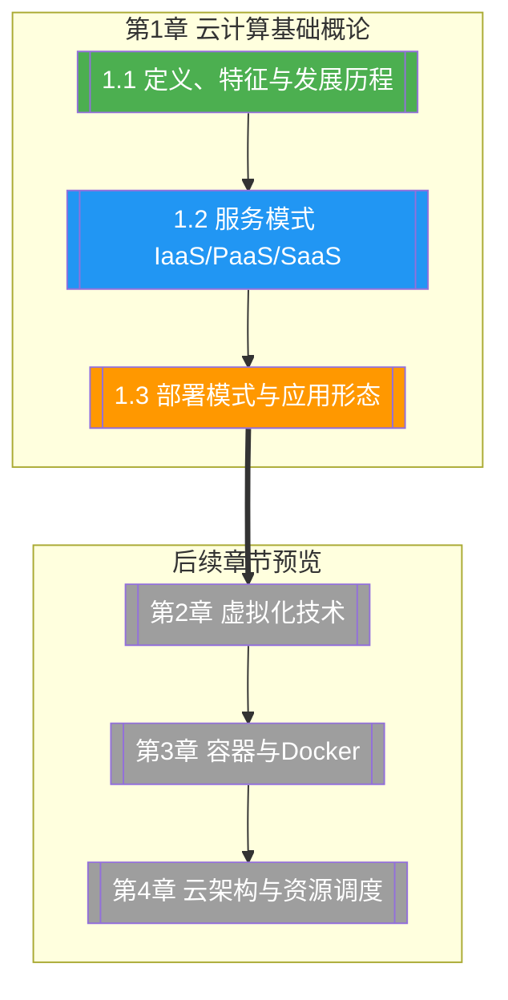

# 第1章 云计算基础概论

> [!abstract] 章节概述
> 本章是云计算技术课程的开篇，系统介绍云计算的定义与核心特征、主流服务模式（SPI模型）、部署模式与应用形态。通过对云计算发展历程的梳理，帮助读者建立从传统IT到云原生的整体认知，为后续学习虚拟化、容器化、云架构等核心技术奠定基础。

## 学习路线图

## 知识点导航

| 编号 | 知识点 | 核心内容 | 重要程度 |
|-----|--------|---------|---------|
| 1.1 | [[1.1 云计算定义、特征与发展历程]] | NIST/ISO定义、五大特征、发展时间线、主流厂商 | ⭐⭐⭐⭐⭐ |
| 1.2 | [[1.2 云计算服务模式：IaaS_PaaS_SaaS]] | SPI模型、各层对比、Serverless/FaaS、选型策略 | ⭐⭐⭐⭐⭐ |
| 1.3 | [[1.3 云计算部署模式与应用形态]] | 公有/私有/混合/社区云、云应用形态、迁移策略 | ⭐⭐⭐⭐ |

## 核心概念速览

> [!tip] 本章必须掌握的核心概念
> - **云计算（Cloud Computing）**：通过网络按需提供可配置计算资源的共享模式
> - **五大特征**：按需自助服务、泛在网络访问、多租户、快速弹性、可度量服务
> - **SPI模型**：IaaS（基础设施即服务）→ PaaS（平台即服务）→ SaaS（软件即服务）
> - **部署模式**：公有云、私有云、混合云、社区云
> - **Serverless/FaaS**：事件驱动、按量计费的新型服务形态
> - **云原生**：面向云环境设计的应用开发范式，包含容器化、微服务、DevOps等

## 核心考点

> [!important] 期末高频考点

| 考点 | 所属知识点 | 考查形式 | 难度 |
|-----|-----------|---------|------|
| 云计算NIST定义与五大特征 | 1.1 | 简答题/选择题 | ★★ |
| 云计算发展里程碑（年份+事件） | 1.1 | 填空题/选择题 | ★★ |
| IaaS/PaaS/SaaS的区别与典型产品 | 1.2 | 对比题/选择题 | ★★★ |
| SPI三层服务模型的层级关系 | 1.2 | 简答题/论述题 | ★★★ |
| 四种部署模式的优缺点对比 | 1.3 | 对比题 | ★★★ |
| 混合云架构设计与应用场景 | 1.3 | 案例分析 | ★★★★ |
| 云迁移六大策略（6Rs） | 1.3 | 论述题/案例分析 | ★★★ |

## 自测题

> [!question] 章节自测
> 1. 请用NIST（2011）的标准定义阐述云计算，并说明其五大essential characteristics各自的含义。
> 2. 某企业需要将现有本地CRM系统迁移到云端，同时保留部分敏感数据在本地。请分析应选择哪种云部署模式，并说明理由。
> 3. 对比IaaS、PaaS、SaaS三种服务模式的资源抽象层级、用户掌控程度和典型应用场景。
> 4. 简述从2006年AWS EC2发布到2015年Serverless兴起这段时间云计算领域的三个关键里程碑及其意义。

## 章节导航

| 方向 | 链接 |
|-----|------|
| ⬆ 返回课程总览 | [[MOC - 云计算技术]] |
| ⬅ 上一章 | （课程开篇） |
| ➡ 下一章 | [[第2章 虚拟化技术原理/MOC - 第2章]] |