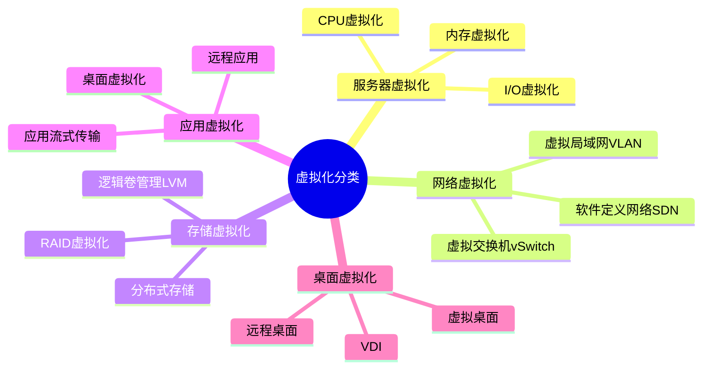
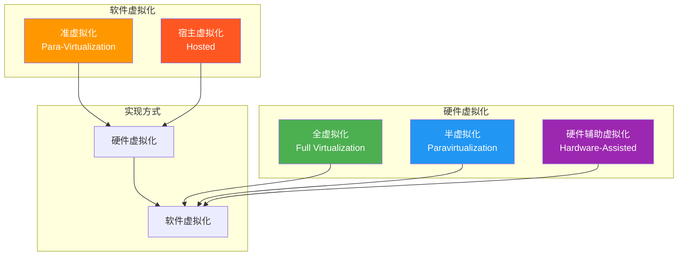
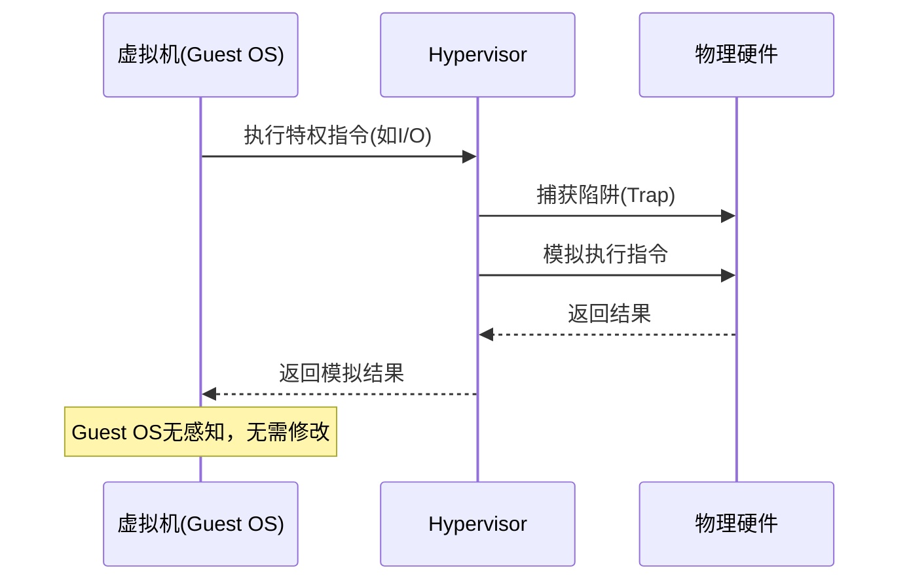
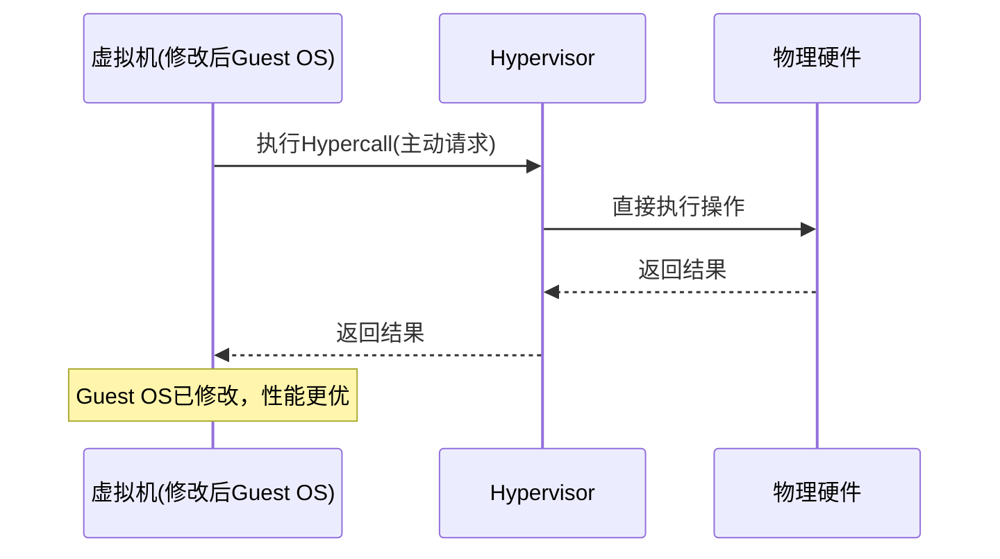
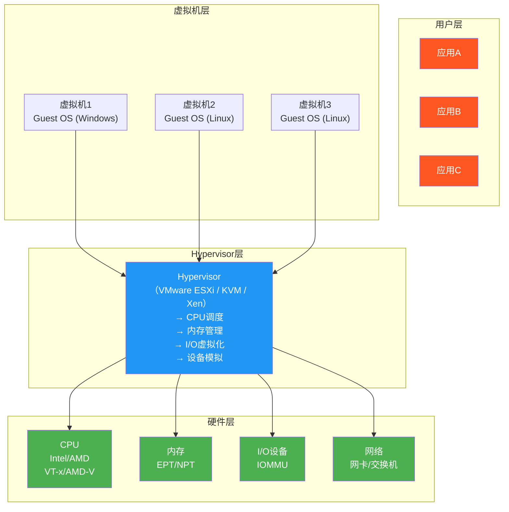

# 2.1 虚拟化概述与分类

> [!abstract] 本节导读
> 虚拟化是云计算的核心支撑技术。本节从虚拟化的基本定义与目标出发，系统介绍虚拟化的分类体系，重点阐述硬件虚拟化与软件虚拟化、全虚拟化与半虚拟化的区别，最后通过架构图展示虚拟化的整体分层模型，并分析其带来的收益与挑战。

## 一、虚拟化的定义与目标

### 定义

**虚拟化（Virtualization）** 是通过软件或硬件技术，将物理计算资源（CPU、内存、存储、网络等）抽象为逻辑虚拟资源的技术。它允许在单一物理平台上同时运行多个隔离的计算环境，每个环境仿佛独占物理资源。

> [!quote] 虚拟化的本质
> 虚拟化的本质是**资源抽象与隔离**：
> - **抽象**：将底层异构的物理资源封装为统一的、可编程的接口
> - **隔离**：确保多个虚拟环境之间互不干扰，提供安全性与稳定性

### 核心目标

| 目标 | 说明 |
|-----|------|
| **资源池化** | 将分散的物理资源整合为统一资源池，统一调度 |
| **多路复用** | 多个虚拟机共享同一物理主机，提高资源利用率 |
| **隔离性** | 虚拟机之间完全隔离，一个VM故障不影响其他VM |
| **封装性** | 虚拟机的完整状态可保存、复制、迁移 |
| **按需分配** | 资源可按需动态分配与回收 |
| **兼容性** | 虚拟机中的操作系统无需修改即可运行（全虚拟化） |

## 二、虚拟化分类体系

### 按虚拟化层级分类

### 各类型详解

#### 服务器虚拟化

服务器虚拟化是云计算中最核心的虚拟化类型，指在同一台物理服务器上创建多个独立的虚拟服务器（虚拟机）。

| 组件 | 虚拟化方式 | 说明 |
|-----|-----------|------|
| **CPU虚拟化** | 时间片轮转/指令翻译 | 多个VM共享物理CPU，通过时间片分配 |
| **内存虚拟化** | 地址映射/内存复用 | 物理内存映射为虚拟地址空间，支持超分 |
| **I/O虚拟化** | 设备模拟/直通/半虚拟 | 磁盘、网络、USB等设备的虚拟化 |

#### 网络虚拟化

网络虚拟化将物理网络资源抽象为虚拟网络，主要技术包括：

- **VLAN（虚拟局域网）**：在物理网络上逻辑划分多个广播域
- **vSwitch（虚拟交换机）**：虚拟机之间的虚拟网络交换设备
- **SDN（软件定义网络）**：通过软件控制网络流量和拓扑
- **VXLAN（虚拟可扩展局域网）**：overlay网络隧道技术

#### 存储虚拟化

存储虚拟化将物理存储资源抽象为虚拟存储，主要方式：

- **LVM（逻辑卷管理）**：在Linux上实现的逻辑卷抽象
- **RAID虚拟化**：通过条带化/镜像提供存储冗余
- **分布式存储**：Ceph、GlusterFS等将集群存储池化

#### 应用虚拟化

应用虚拟化将应用程序与操作系统解耦：

- **应用流（App Streaming）**：按需传输应用组件
- **桌面虚拟化（VDI）**：远程交付完整桌面环境
- **远程应用（Remote App）**：仅远程交付单个应用窗口

### 按实现方式分类

## 三、硬件虚拟化 vs 软件虚拟化

### 硬件虚拟化

硬件虚拟化直接在物理硬件上实现资源抽象，通常通过 Hypervisor 或硬件扩展指令完成。

| 技术 | 原理 | 代表 |
|-----|------|------|
| **硬件辅助虚拟化** | 利用CPU的特殊指令（VMX/SVM）创建隔离的VM执行环境 | Intel VT-x、AMD-V |
| **内存硬件虚拟化** | 通过页表扩展（EPT/NPT）加速内存访问 | Intel EPT、AMD NPT |
| **IOMMU** | 将设备直接分配给虚拟机，绕过Hypervisor | Intel VT-d、AMD-Vi |

### 软件虚拟化

软件虚拟化通过纯软件方式实现资源抽象，不依赖硬件特殊支持。

| 技术 | 原理 | 代表 |
|-----|------|------|
| **指令翻译** | 将Guest OS的特权指令翻译为宿主可执行的指令 | QEMU纯软件模式 |
| **系统调用拦截** | 拦截Guest OS的系统调用并代为执行 | User-Mode Linux |
| **动态二进制翻译** | 运行时将Guest指令翻译为宿主指令 | QEMU TCG模式 |

### 对比

| 维度 | 硬件虚拟化 | 软件虚拟化 |
|-----|-----------|-----------|
| **性能** | 接近原生性能（95-99%） | 性能损耗大（20-50%） |
| **兼容性** | 需硬件支持 | 无需特殊硬件，兼容性好 |
| **隔离性** | 硬件级隔离，安全性高 | 软件级隔离，安全性较低 |
| **灵活性** | 受限于硬件特性 | 可跨平台模拟不同架构 |
| **复杂度** | 硬件设计复杂 | 软件实现复杂 |
| **典型产品** | KVM、Xen、Hyper-V | QEMU、Bochs |

## 四、全虚拟化 vs 半虚拟化 vs 准虚拟化

### 全虚拟化（Full Virtualization）

> [!definition] 全虚拟化
> 虚拟机运行未经修改的操作系统，Hypervisor 通过**陷阱与模拟（Trap-and-Emulate）**机制处理特权指令。

**工作原理**：
1. Guest OS 执行特权指令（如 I/O 操作、中断）时触发 CPU 异常
2. Hypervisor 捕获该异常并模拟执行
3. 结果返回给 Guest OS，Guest OS 无感知

**特点**：
- ✅ 兼容性最好，Guest OS 无需修改
- ❌ 性能损耗较大（陷阱与模拟开销）
- ❌ 依赖硬件辅助虚拟化优化
- 📌 代表产品：VMware ESXi、Microsoft Virtual PC（早期版本）

### 半虚拟化（Paravirtualization）

> [!definition] 半虚拟化
> Guest OS 感知虚拟化环境，通过**超级调用（Hypercall）**主动与 Hypervisor 协作，而非依赖陷阱机制。

**工作原理**：
1. Guest OS 被修改以识别虚拟化环境
2. 将特权操作替换为 Hypercall（类似系统调用）
3. Hypervisor 高效处理 Hypercall，无需陷阱与模拟

**特点**：
- ✅ 性能接近原生（比全虚拟化快 2-3 倍）
- ❌ Guest OS 必须修改（需支持 Xen 等 Hypervisor）
- ❌ 兼容性受限，无法运行未修改的 OS
- 📌 代表产品：Xen（早期版本）、Linux PVOPS

### 准虚拟化（Para-Virtualization / 超虚拟化）

准虚拟化是半虚拟化的进一步优化，结合了硬件辅助虚拟化：

- 使用硬件 VT-x/AMD-V 执行大部分非特权指令
- 仅对关键路径使用半虚拟化协作
- 兼顾兼容性与性能

### 三者对比

| 维度 | 全虚拟化 | 半虚拟化 | 准虚拟化 |
|-----|---------|---------|---------|
| **Guest OS** | 无需修改 | 必须修改 | 部分修改（可选） |
| **实现方式** | 陷阱与模拟 | Hypercall协作 | 硬件辅助+Hybrid |
| **性能** | 较低（30-50%损耗） | 高（5-10%损耗） | 接近原生（2-5%损耗） |
| **兼容性** | 最好（支持任意OS） | 差（需定制OS） | 较好（支持多数OS） |
| **隔离性** | 强 | 强 | 强 |
| **复杂度** | Hypervisor复杂 | Guest OS复杂 | 两者都较复杂 |
| **典型产品** | VMware ESXi | Xen 3.x | KVM、Xen 4.x+ |
| **当前地位** | 已淘汰 | 已淘汰 | 主流方案 |

## 五、虚拟化架构全景

### 分层架构图

### 组件功能说明

| 组件 | 功能 |
|-----|------|
| **Hypervisor** | 核心虚拟化层，管理所有VM的生命周期与资源分配 |
| **虚拟CPU（vCPU）** | 为每个VM提供一个或多个虚拟CPU核心 |
| **虚拟内存** | 为每个VM提供独立的虚拟地址空间 |
| **虚拟设备** | 虚拟网卡、虚拟磁盘、虚拟显卡等 |
| **VMCS/VMCB** | CPU中的VM执行控制块，存储VM状态 |
| **设备模型** | 模拟特定硬件的行为（如模拟Intel网卡） |

## 六、虚拟化的收益与挑战

### 收益

> [!success] 虚拟化带来的价值
> 
> | 维度 | 具体收益 |
> |-----|---------|
> | **成本节约** | 物理服务器数量减少 70-80%，硬件采购成本大幅下降 |
> | **资源利用率** | CPU 利用率从 5-15% 提升到 60-80% |
> | **快速部署** | 新虚拟机部署从小时级缩短到分钟级 |
> | **灾难恢复** | 虚拟机快照和迁移简化灾备流程 |
> | **运维简化** | 统一管理物理和虚拟资源，降低运维复杂度 |
> | **绿色IT** | 减少物理服务器数量，降低能耗和散热成本 |
> | **应用隔离** | 为不同应用提供安全隔离的运行环境 |

### 挑战

> [!warning] 虚拟化面临的挑战
> 
> | 挑战 | 说明 | 应对策略 |
> |-----|------|---------|
> | **性能开销** | 虚拟化层引入的性能损耗 | 硬件辅助虚拟化、半虚拟化驱动 |
> | **资源争抢** | 多个VM争抢同一物理资源导致性能抖动 | 合理的超分策略、资源预留 |
> | **安全隔离** | VM逃逸攻击（VM Escape）风险 | 硬件隔离、安全加固、最小权限 |
> | **管理复杂度** | 大规模VM的生命周期管理挑战 | 云编排平台（OpenStack、vCenter） |
> | **许可证问题** | 某些软件许可证与物理CPU绑定 | 虚拟化友好的许可证方案 |
> | **性能监控** | 虚拟化环境中性能问题定位困难 | 细粒度监控、全链路追踪 |
> | **存储瓶颈** | 多个VM的I/O集中到同一存储 | 分布式存储、SSD缓存 |

## 七、小结

> [!summary] 本节要点回顾
> 1. **定义**：虚拟化是将物理资源抽象为虚拟资源的技术，核心是资源抽象与隔离
> 2. **分类**：按层级分为服务器/网络/存储/应用虚拟化；按实现分为硬件/软件虚拟化
> 3. **三种虚拟化**：全虚拟化（陷阱与模拟）、半虚拟化（Hypercall协作）、准虚拟化（硬件辅助）
> 4. **架构**：Hypervisor位于物理硬件与虚拟机之间，负责CPU/内存/I/O的虚拟化管理
> 5. **价值**：成本节约、资源利用率提升、快速部署、灾难恢复简化
> 6. **挑战**：性能开销、资源争抢、安全隔离、管理复杂度

## 关联知识点

| 关联知识点 | 关系 |
|-----------|------|
| [[2.2 Hypervisor与虚拟化架构]] | 本节分类的深入展开 |
| [[2.3 虚拟化资源管理与性能]] | 本节架构的性能优化 |
| [[第1章 云计算基础概论/1.1 云计算定义、特征与发展历程]] | 虚拟化是云计算的核心支撑技术 |
| [[第3章 容器与Docker技术/3.1 容器技术基础]] | 容器是轻量级的进程级虚拟化 |