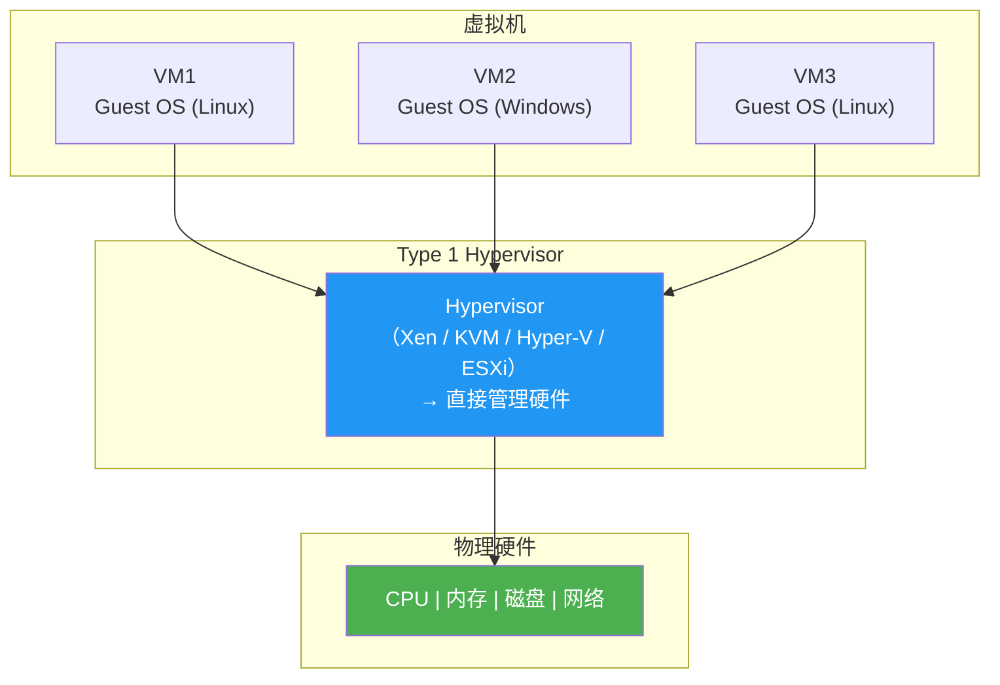
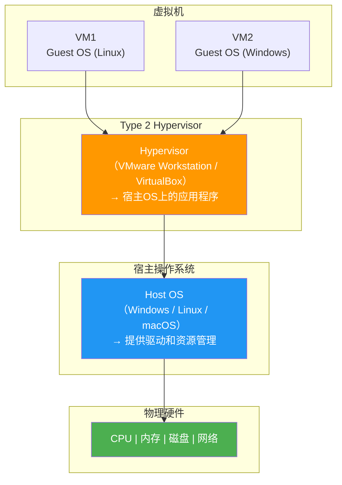
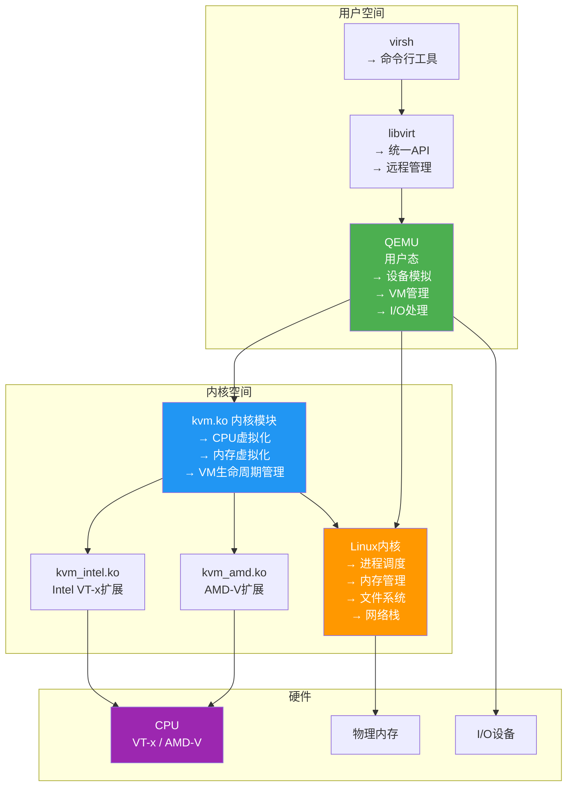
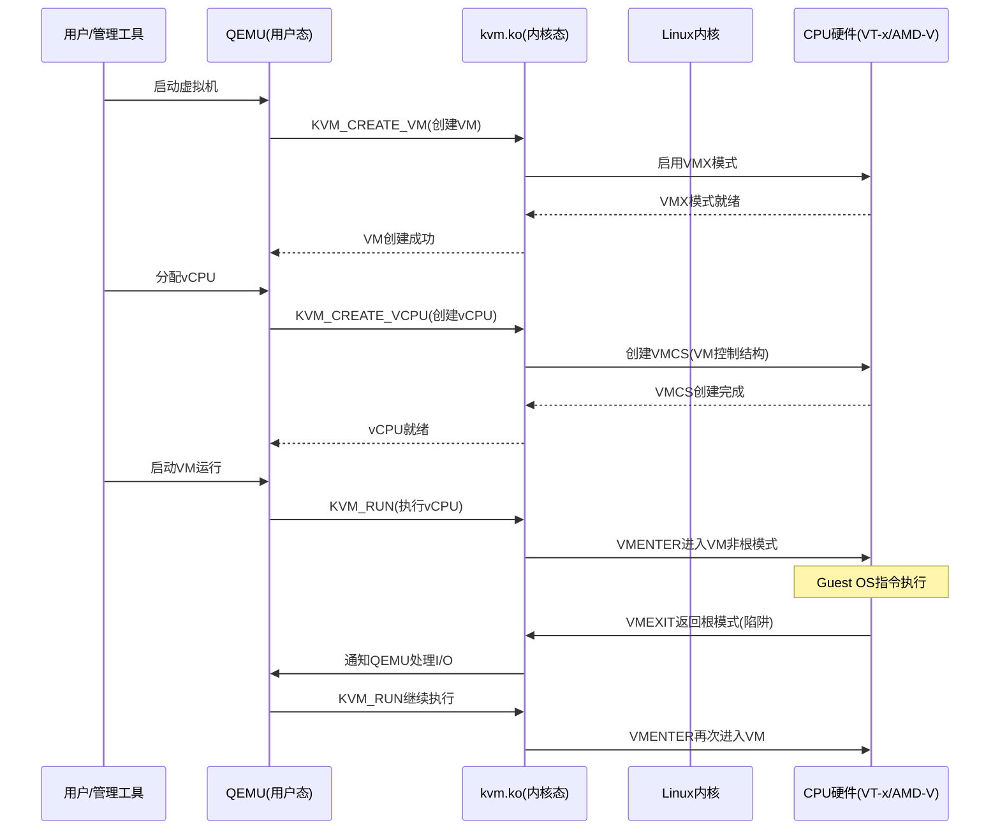
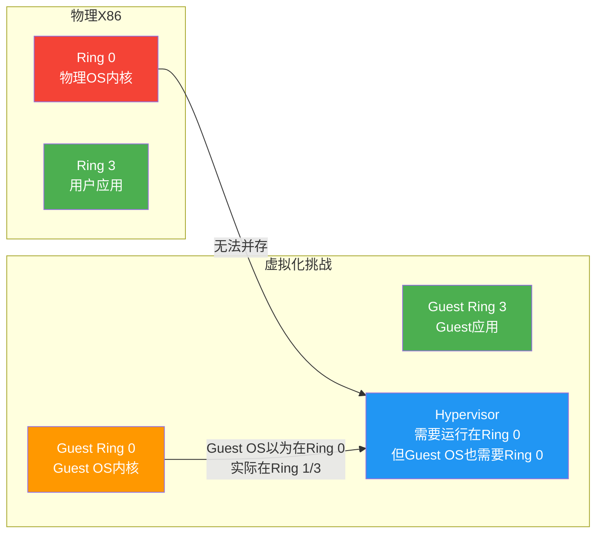
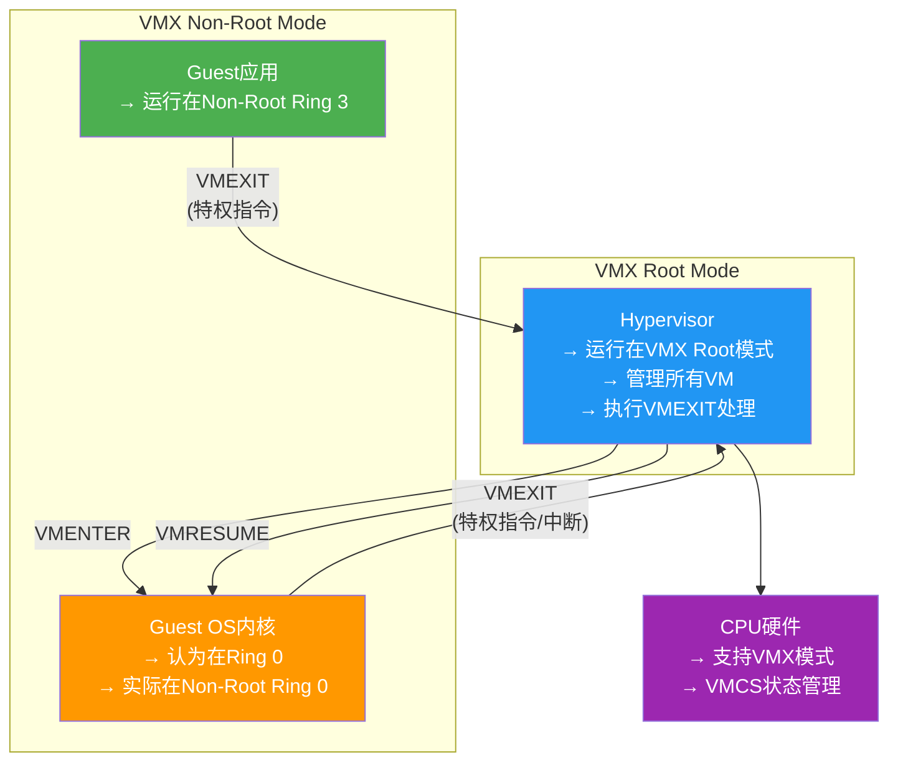
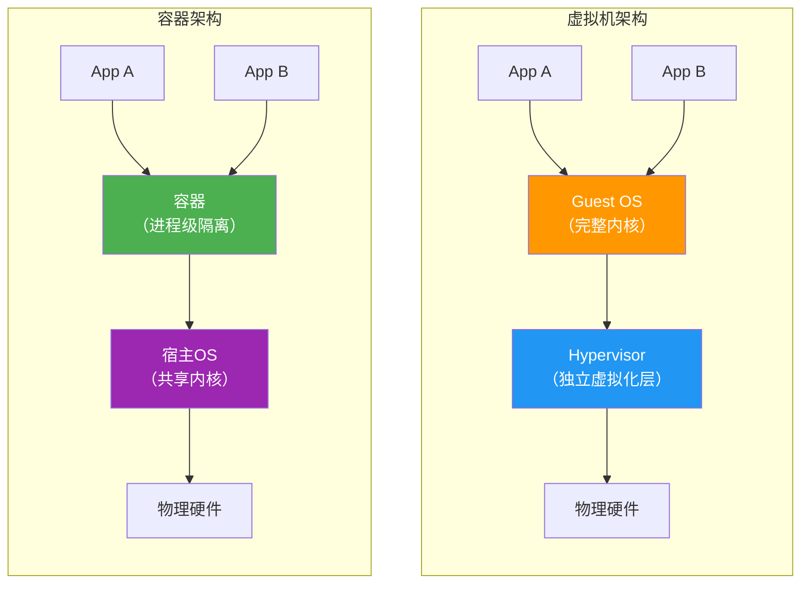

# 2.2 Hypervisor与虚拟化架构

> [!abstract] 本节导读
> Hypervisor 是虚拟化技术的核心引擎，决定了虚拟化的性能、隔离性与可扩展性。本节首先介绍 Type 1 和 Type 2 两类 Hypervisor 的架构差异，重点剖析 KVM 的内核级虚拟化实现、X86 架构的虚拟化挑战及硬件辅助虚拟化的解决方案，最后通过容器与虚拟机的对比帮助读者建立整体认知。

## 一、Hypervisor 概述

### 什么是 Hypervisor

**Hypervisor（虚拟机监控器，VMM）** 是在物理硬件与虚拟机之间运行的中间软件层，负责创建、管理和运行虚拟机。它为每个虚拟机提供独立的虚拟硬件视图（CPU、内存、磁盘、网络等），并确保虚拟机之间的隔离性。

> [!tip] Hypervisor的核心职责
> 1. **CPU虚拟化**：为每个VM提供虚拟CPU，并调度物理CPU时间片
> 2. **内存虚拟化**：维护虚拟地址到物理地址的映射
> 3. **I/O虚拟化**：模拟或直通物理I/O设备
> 4. **设备模拟**：为VM提供标准硬件模型
> 5. **资源管理**：动态分配和回收物理资源

## 二、Type 1 vs Type 2 Hypervisor

### Type 1 Hypervisor（裸金属型）

> [!definition] Type 1 Hypervisor
> 直接运行在物理硬件之上，不依赖任何操作系统，本身就是一个轻量级的操作系统。

**特点**：
- ✅ 性能最优，直接与硬件交互，无中间层损耗
- ✅ 隔离性最好，安全边界清晰
- ✅ 专为虚拟化设计，功能针对性强
- ❌ 管理工具需单独安装
- ❌ 自身功能有限，需配合管理平台使用

**代表产品**：

| 产品 | 厂商 | 特点 |
|-----|------|------|
| **VMware ESXi** | VMware | 企业级最成熟，生态最完善 |
| **Xen** | Citrix/开源 | 学术起源，半虚拟化先驱 |
| **KVM** | 开源（Red Hat） | 集成在Linux内核中 |
| **Microsoft Hyper-V** | 微软 | 与Windows Server集成 |
| **Proxmox VE** | 开源 | 基于Debian，支持KVM和容器 |

### Type 2 Hypervisor（宿主型）

> [!definition] Type 2 Hypervisor
> 运行在操作系统之上，作为一个应用程序运行，依赖宿主操作系统提供的设备驱动和资源管理。

**特点**：
- ✅ 安装简单，像普通应用一样安装
- ✅ 兼容性好，可在多种操作系统上运行
- ✅ 功能丰富，GUI管理方便
- ❌ 性能较差（需经过宿主OS中转）
- ❌ 隔离性较弱（依赖宿主OS安全性）
- ❌ 资源分配受宿主OS限制

**代表产品**：

| 产品 | 厂商 | 特点 |
|-----|------|------|
| **VMware Workstation** | VMware | 桌面虚拟化，功能最强 |
| **Oracle VirtualBox** | Oracle | 开源免费，跨平台 |
| **VMware Fusion** | VMware | macOS上的桌面虚拟化 |
| **Parallels Desktop** | Parallels | macOS上性能最优 |

### 对比总结

| 维度 | Type 1 | Type 2 |
|-----|--------|--------|
| **运行位置** | 裸金属之上 | 宿主OS之上 |
| **性能** | 接近原生（95-99%） | 有额外损耗（10-30%） |
| **隔离性** | 硬件级，最强 | 软件级，较弱 |
| **安装复杂度** | 需要专门安装 | 像普通应用一样 |
| **资源管理** | 直接管理硬件 | 依赖宿主OS |
| **适用场景** | 数据中心、企业服务器 | 桌面开发、测试环境 |
| **典型用户** | 运维工程师、数据中心 | 开发者、个人用户 |
| **许可证** | 通常付费 | 多为免费 |

## 三、KVM 架构深度解析

### KVM 概述

**KVM（Kernel-based Virtual Machine）** 是一个开源的内核级虚拟化技术，自 Linux 2.6.20（2007年）起被集成到 Linux 内核中。它将 Linux 内核转变为一个 Type 1（通过内核模块）的 Hypervisor。

> [!important] KVM的设计哲学
> KVM 遵循最小化设计原则：尽量复用 Linux 内核的现有功能（进程调度、内存管理、文件系统、网络栈等），仅实现虚拟化必需的部分。这使得 KVM 代码量小、质量高、与内核同步演进。

### KVM 核心组件

| 组件 | 说明 | 位置 |
|-----|------|------|
| **kvm.ko** | 内核模块，提供核心虚拟化能力 | Linux 内核空间 |
| **kvm_intel.ko / kvm_amd.ko** | CPU特定模块（Intel VT-x / AMD-V） | Linux 内核空间 |
| **QEMU** | 用户空间组件，负责设备模拟与VM管理 | 用户空间 |
| **libvirt** | 虚拟化管理库，提供统一API | 用户空间 |
| **virsh / virt-manager** | 管理工具 | 用户空间 |

### KVM 架构图

### KVM 工作流程

### KVM 的优势

> [!success] KVM相比传统Hypervisor的优势
> 
> | 优势 | 说明 |
> |-----|------|
> | **零额外内核** | 复用Linux内核，无需维护独立内核 |
> | **功能同步** | 跟随Linux内核迭代，功能持续增强 |
> | **性能优异** | 内核级实现，性能接近原生 |
> | **开源免费** | 完全开源，无许可证限制 |
> | **安全性** | 与Linux安全机制深度集成（SELinux、cgroups等） |
> | **丰富生态** | 被OpenStack、QEMU、Docker等广泛采用 |
> | **社区支持** | 全球Linux社区共同维护 |

## 四、X86 虚拟化的"Ring 0 陷阱"问题

### X86 的特权级设计

X86 架构定义了 4 个特权级（Ring 0 ~ Ring 3）：

| 特权级 | 权限 | 典型使用者 |
|-------|------|----------|
| **Ring 0** | 最高权限，可执行任何指令 | 操作系统内核 |
| **Ring 1** | 次高权限 | 通常未使用 |
| **Ring 2** | 中等权限 | 通常未使用 |
| **Ring 3** | 最低权限 | 用户态应用程序 |

### 虚拟化的挑战

**核心矛盾**：
- Hypervisor 需要运行在 Ring 0 来管理硬件
- Guest OS 也需要 Ring 0 权限来执行特权指令
- X86 只有 4 个 Ring，无法为 Hypervisor 和 Guest OS 各提供独立的 Ring 0

### 解决方案演进

| 方案 | 原理 | 性能 | 兼容性 |
|-----|------|------|--------|
| **陷阱与模拟** | Guest OS运行在Ring 3，特权指令触发陷阱由VMM模拟 | 差 | 最好 |
| **Ring 1 方案** | Guest OS运行在Ring 1，特权指令被硬件拦截 | 中 | 需修改OS |
| **半虚拟化** | Guest OS修改为主动发起Hypercall | 好 | 需修改OS |
| **硬件辅助虚拟化** | 引入VMX非根模式，解决Ring冲突 | 最好 | 好 |

## 五、硬件辅助虚拟化

### Intel VT-x

**Intel Virtualization Technology (VT-x)** 是 Intel 为 x86 虚拟化设计的硬件扩展，于 2005 年引入。

#### 核心概念

| 概念 | 说明 |
|-----|------|
| **VMX Root Mode** | Hypervisor 运行的新模式，等同于 Ring 0 |
| **VMX Non-Root Mode** | Guest OS 运行的新模式，拥有自己的 Ring 0-3 |
| **VMCS（VM Control Structure）** | 存储 VM 状态的内存数据结构 |
| **VMENTER/VMEXIT** | 两种模式之间切换的指令 |

#### VT-x 运行模式

#### VMCS 状态字段

| 字段类别 | 内容 |
|---------|------|
| **Guest 状态** | Guest 的 CR0/CR3/CR4、GDT、IDT、MSR、段选择子等 |
| **Host 状态** | Hypervisor 的对应寄存器状态 |
| **执行控制** | 控制哪些指令触发 VMEXIT |
| **VM-Entry/Exit 控制** | 控制 VM Entry/Exit 的行为 |

### AMD-V

**AMD Virtualization (AMD-V)** 是 AMD 的对应技术，与 VT-x 类似：

| VT-x 概念 | AMD-V 对应 |
|-----------|-----------|
| VMX Root Mode | VMX (Host) Mode |
| VMX Non-Root Mode | Guest Mode |
| VMCS | VMCB（Virtual Machine Control Block） |
| VMENTER | VMRUN |
| VMEXIT | VMEXIT |
| EPT | NPT（Nested Page Table） |

### 内存硬件虚拟化

| 技术 | 厂商 | 功能 |
|-----|------|------|
| **EPT（Extended Page Tables）** | Intel | 硬件加速的二级地址翻译，避免软件 Shadow Page Table |
| **NPT（Nested Page Tables）** | AMD | AMD 对应的硬件页表扩展 |

**EPT 工作原理**：
1. Guest OS 维护自己的页表（虚拟地址 → Guest 物理地址）
2. Hypervisor 维护 EPT（Guest 物理地址 → Host 物理地址）
3. CPU 自动完成两级页表翻译（Guest VA → Guest PA → Host PA）
4. 无需 Hypervisor 介入，性能接近原生

## 六、容器 vs 虚拟机对比

### 架构对比

### 详细对比表

| 维度 | 虚拟机（VM） | 容器（Container） |
|-----|-------------|-------------------|
| **隔离级别** | 操作系统级（独立内核） | 进程级（共享内核） |
| **启动速度** | 分钟级（通常 1-5 分钟） | 秒级（通常 < 3 秒） |
| **资源占用** | 较重（数百MB~数GB） | 轻量（数十~数百MB） |
| **资源密度** | 中等（~10:1） | 高（~100:1） |
| **隔离性** | 强（硬件级隔离） | 中（进程级隔离） |
| **兼容性** | 可运行任意OS | 仅支持同内核OS |
| **性能** | 接近原生（95-99%） | 几乎原生（99-100%） |
| **持久化** | 独立磁盘镜像 | 联合文件系统 |
| **迁移** | 热迁移（复杂） | 镜像迁移（简单） |
| **安全边界** | 强安全边界 | 较弱（需配合seccomp/AppArmor） |
| **典型产品** | KVM、VMware、Xen | Docker、containerd、CRI-O |
| **适用场景** | 强隔离需求、异构OS | 微服务、DevOps、CI/CD |

## 七、主流 Hypervisor 横向对比

| 特性 | KVM | Xen | VMware ESXi | Hyper-V |
|-----|-----|-----|-------------|---------|
| **类型** | Type 1（内核级） | Type 1（微内核） | Type 1（独立内核） | Type 1（内核级） |
| **开源** | ✅ 完全开源 | ✅ 开源（部分） | ❌ 商业软件 | ❌ 商业软件 |
| **宿主OS** | Linux | 无（微内核） | 无 | Windows Server |
| **虚拟化方式** | 硬件辅助 | 半虚拟+硬件辅助 | 硬件辅助 | 硬件辅助 |
| **性能** | 优 | 良 | 最优 | 优 |
| **生态** | OpenStack、Docker | 云平台 | vCenter、vSphere | System Center |
| **管理工具** | libvirt、virsh | xm、xl | vCenter | Hyper-V Manager |
| **典型应用** | 云计算/大数据 | 云/桌面虚拟化 | 企业数据中心 | 微软生态云 |

## 八、小结

> [!summary] 本节要点回顾
> 1. **Hypervisor类型**：Type 1（裸金属型，性能优）和 Type 2（宿主型，易安装）
> 2. **KVM架构**：kvm.ko内核模块+QEMU用户态组件，复用Linux内核功能
> 3. **X86虚拟化挑战**：Ring 0 冲突问题，通过硬件辅助虚拟化（VT-x/AMD-V）解决
> 4. **VT-x/AMD-V**：引入VMX Root/Non-Root模式，VMCS/VMCB存储状态
> 5. **EPT/NPT**：硬件加速的二级页表翻译，大幅提升内存虚拟化性能
> 6. **容器vs虚拟机**：容器共享内核、轻量、快速启动；虚拟机独立内核、强隔离

## 关联知识点

| 关联知识点 | 关系 |
|-----------|------|
| [[2.1 虚拟化概述与分类]] | Hypervisor是虚拟化的核心实现 |
| [[2.3 虚拟化资源管理与性能]] | Hypervisor的资源管理机制 |
| [[第3章 容器与Docker技术/3.1 容器技术基础]] | 容器与VM的深度对比 |
| [[第4章 云计算架构与资源调度]] | OpenStack与KVM/libvirt的集成 |