# 2.3 虚拟化资源管理与性能

> [!abstract] 本节导读
> 本节深入虚拟化的核心实现层面，系统讲解 CPU 虚拟化、内存虚拟化和 I/O 虚拟化的关键技术与性能影响，分析虚拟化性能开销的来源与优化策略，重点介绍虚拟机热迁移的原理与流程，最后说明 OpenStack 中 nova 与 libvirt 的集成方式。

## 一、CPU 虚拟化

### 虚拟CPU（vCPU）模型

在虚拟化环境中，每个虚拟机被分配一个或多个**虚拟CPU（vCPU）**。Hypervisor 负责将 vCPU 映射到物理 CPU 核心上执行。

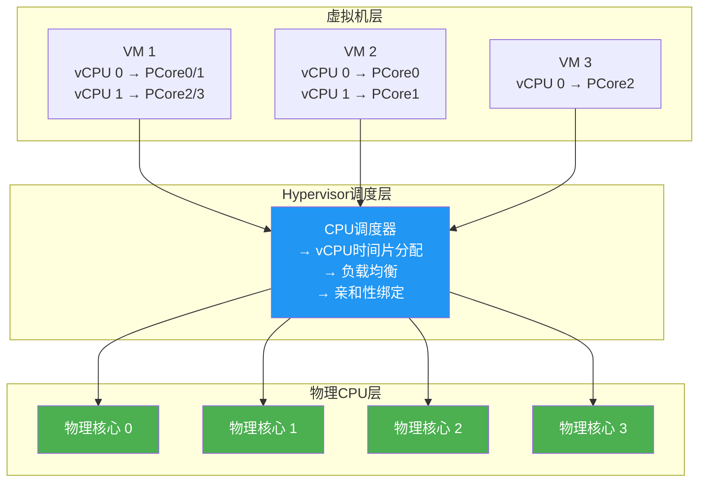

### CPU 调度策略

| 策略 | 说明 | 适用场景 |
|-----|------|---------|
| **时间片轮转** | 为每个 vCPU 分配固定时间片，轮流执行 | 公平共享场景 |
| **优先级调度** | 根据 VM 优先级分配不同 CPU 时间 | 关键业务优先 |
| **CPU 亲和性** | 绑定 vCPU 到特定物理核心，减少缓存失效 | 高性能计算 |
| **NUMA 感知调度** | 考虑 NUMA 架构，减少跨节点内存访问 | 大内存 VM |
| **实时调度** | 为实时 VM 提供确定性 CPU 时间 | 音视频、实时控制 |

### CPU 超分（Over-commitment）

> [!important] CPU超分
> 在虚拟化中，分配给所有 VM 的 vCPU 总数可以超过物理 CPU 核心数。例如，在 4 核物理机上分配 16 个 vCPU，超分比为 4:1。

**超分的原理**：
1. 大多数 VM 的 CPU 利用率并不高（通常 10-30%）
2. Hypervisor 通过时间片轮转让多个 vCPU 共享物理核心
3. 只要不是所有 VM 同时满载，超分就不会产生显著性能影响

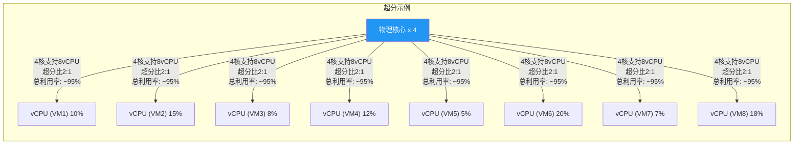

**超分的风险与控制**：

| 风险 | 说明 | 控制措施 |
|-----|------|---------|
| **性能抖动** | 多个 VM 同时争抢 CPU 导致性能波动 | 监控 CPU 占用率，设置阈值告警 |
| **Noisy Neighbor** | 一个高负载 VM 影响其他 VM | 使用 cgroups 限制 CPU 使用 |
| **CPU 抢占** | vCPU 被频繁抢占导致延迟增加 | 合理设置超分比（建议 2:1 ~ 4:1） |
| **调度延迟** | 时间片过长或过短影响响应速度 | 根据负载调整时间片长度 |

### vCPU 热添加

Hypervisor 支持在 VM 运行时动态增加 vCPU 数量：
- 需 Guest OS 支持（Linux 2.6.x+、Windows Server 2008+）
- 无需重启 VM
- 适用于负载波动场景

## 二、内存虚拟化

### 内存虚拟化核心机制

内存虚拟化的核心是**维护虚拟地址到物理地址的映射**，让每个 VM 感觉独占物理内存。

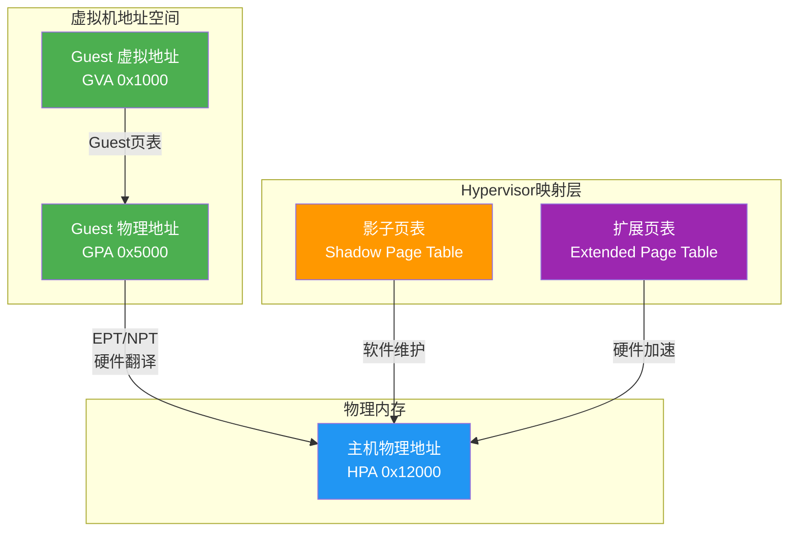

### 内存虚拟化关键技术

| 技术 | 原理 | 性能影响 |
|-----|------|---------|
| **影子页表（Shadow PT）** | Hypervisor 维护独立的页表，软件翻译 | 高开销（每次Guest页表变更都要同步） |
| **EPT/NPT** | 硬件支持的二级页表翻译 | 低开销（CPU自动翻译） |
| **内存气球（Ballooning）** | Hypervisor 通过气球驱动回收 VM 的空闲内存 | 中等开销（需Guest OS协作） |
| **页共享（Page Sharing）** | 多个VM共享相同内容的只读页面（如OS内核） | 节省内存，轻微开销 |
| **内存超分** | 分配给所有VM的内存超过物理内存总量 | 依赖Ballooning回收，可能导致换页 |
| **KSM（Kernel Samepage Merging）** | Linux内核级页合并 | CPU开销换内存节省 |
| **内存热插拔** | 运行时动态增加VM内存 | 需Guest OS支持 |

### 内存气球技术详解

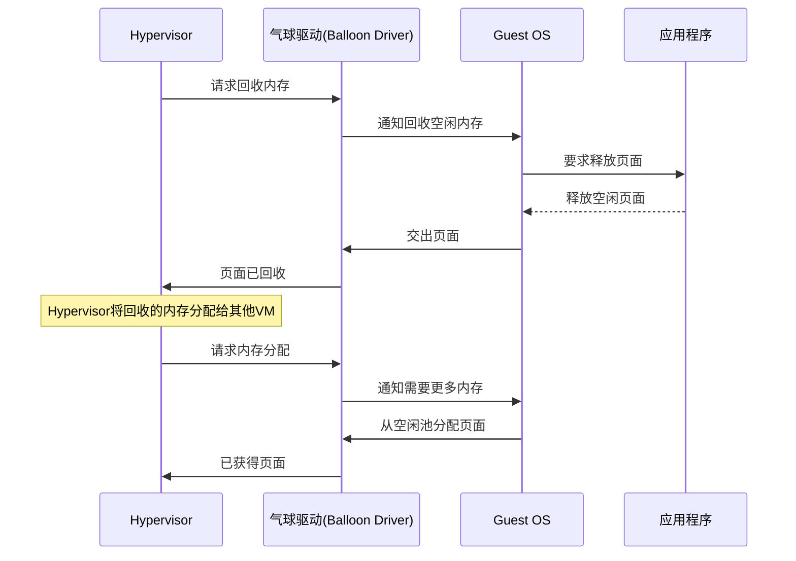

### 页共享原理

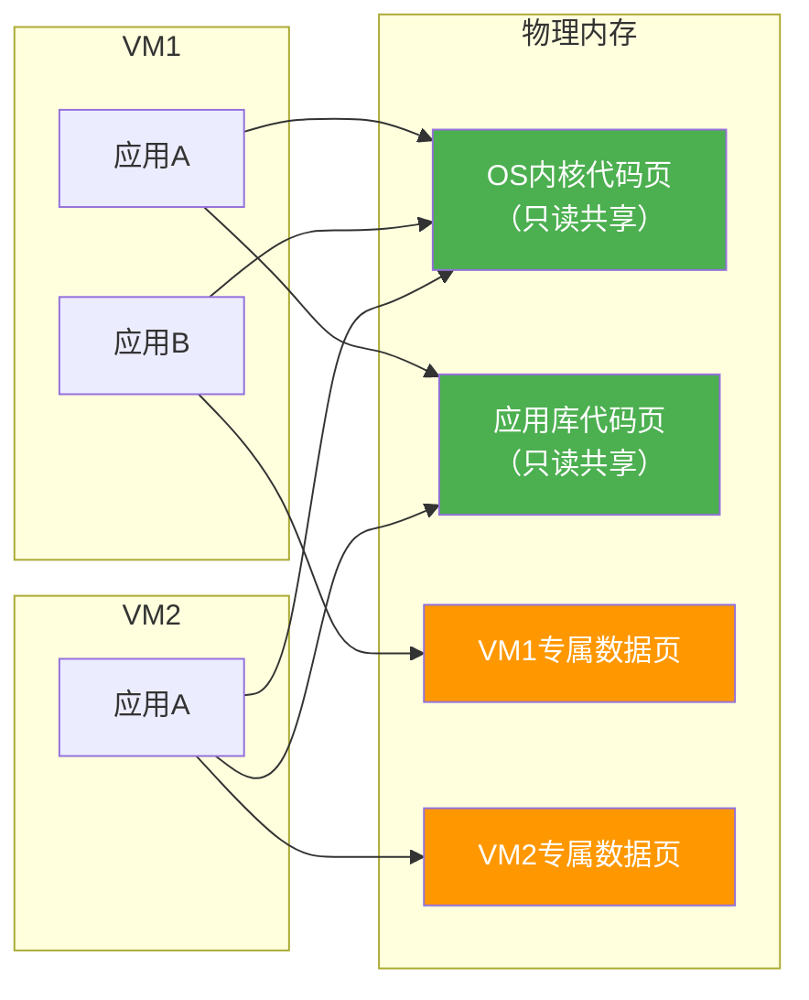

### 内存超分策略

| 超分比 | 说明 | 适用场景 |
|-------|------|---------|
| 1.5:1 | 保守超分 | 生产环境关键业务 |
| 2:1 | 推荐超分 | 通用生产环境 |
| 3:1 | 积极超分 | 测试开发环境 |
| 4:1+ | 极限超分 | 非关键、低负载场景 |

**超分风险**：当所有 VM 同时需要大量内存时，可能导致：
- 内存换页（Swap），性能急剧下降
- OOM（Out of Memory）导致 VM 被杀
- 系统整体不稳定

## 三、I/O 虚拟化

### I/O 虚拟化方式

| 方式 | 原理 | 性能 | 复杂度 |
|-----|------|------|--------|
| **设备模拟（Emulation）** | Hypervisor 模拟完整设备行为，所有 I/O 由 QEMU 软件模拟 | 低 | 高 |
| **半虚拟化（Paravirtual I/O）** | 使用 virtio 等半虚拟化驱动，通过 virtqueue 协作 | 高 | 中 |
| **直通（Passthrough）** | 将物理设备直接分配给 VM，绕过 Hypervisor | 接近原生 | 低 |
| **SR-IOV** | 通过 VF 虚拟化，兼顾直通性能与多 VM 共享 | 接近原生 | 高 |

### 设备模拟

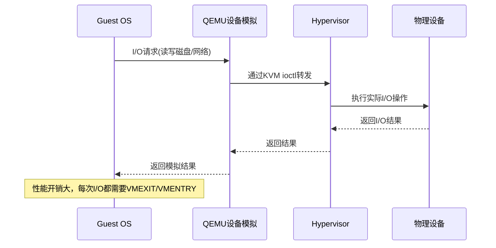

### 半虚拟化 I/O（virtio）

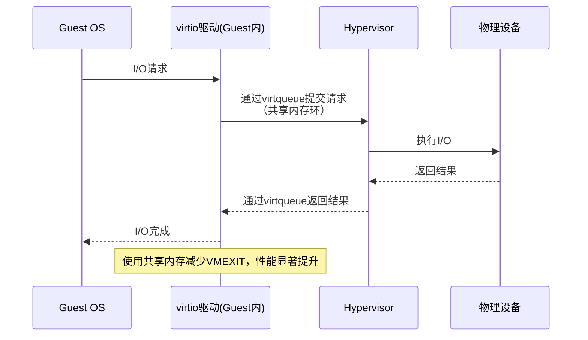

**virtio 核心组件**：

| 组件 | 说明 |
|-----|------|
| **virtqueue** | 基于共享内存的请求队列，避免 VMEXIT |
| **virtio_backend** | Hypervisor 侧的设备后端实现 |
| **notify** | Guest OS 通知 Hypervisor 有新请求 |
| **eventfd** | 高效的事件通知机制 |

### I/O 直通与 SR-IOV

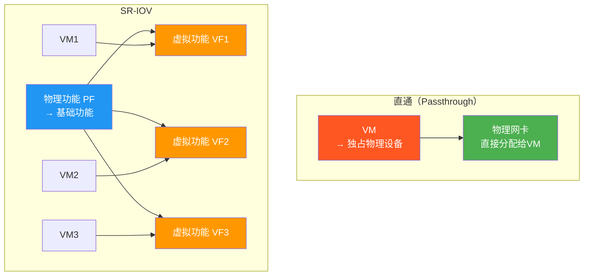

### 网络虚拟化

| 组件 | 说明 |
|-----|------|
| **虚拟网卡（vNIC）** | VM中的虚拟网络接口，对应物理网卡 |
| **虚拟交换机（vSwitch）** | VM之间、VM与外部的网络交换 |
| **Open vSwitch（OVS）** | 开源虚拟交换机，支持 SDN |
| **虚拟网桥（linux bridge）** | Linux内核级虚拟网桥 |
| **NAT/路由** | VM与外部网络的地址转换 |

## 四、性能开销分析

### 开销来源

| 开销类别 | 来源 | 典型影响 |
|---------|------|---------|
| **VMEXIT/VMENTRY** | VM与Hypervisor模式切换 | 每次切换 ~1000 周期 |
| **页表转换** | 影子页表维护 | 每次更新 ~5000 周期 |
| **I/O 模拟** | QEMU设备模拟 | 每次I/O ~微秒级 |
| **中断虚拟化** | 中断处理与注入 | 每次中断 ~微秒级 |
| **CPU调度** | vCPU时间片分配 | 调度延迟 ~毫秒级 |

### 性能对比

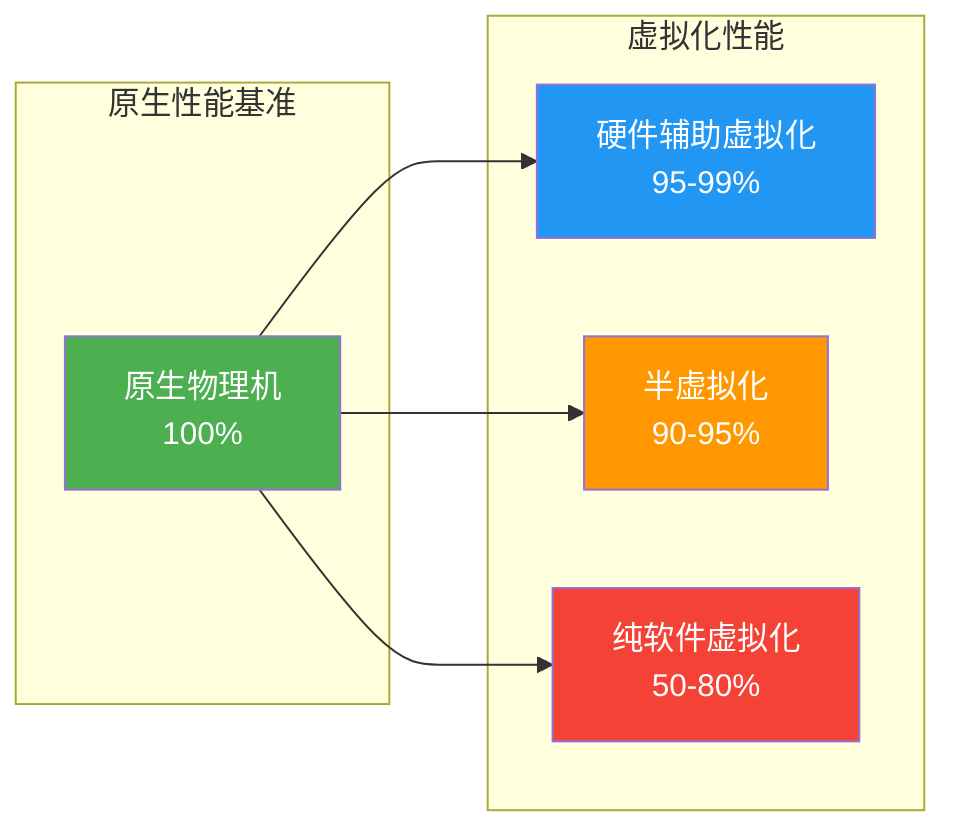

### 性能优化策略

| 层面 | 优化措施 | 效果 |
|-----|---------|------|
| **CPU** | 使用硬件辅助、CPU亲和性、避免过超分 | 降低CPU开销 10-30% |
| **内存** | 启用EPT/NPT、KSM、内存气球 | 降低内存开销 20-40% |
| **I/O** | 使用virtio、直通、SR-IOV | I/O性能提升 2-10x |
| **网络** | 使用virtio-net、OVS-DPDK、SR-IOV | 网络吞吐提升 5-10x |
| **存储** | 使用virtio-blk、本地SSD、分布式存储 | 存储IOPS提升 3-5x |
| **调度** | NUMA感知、负载均衡、避免Noisy Neighbor | 减少性能抖动 |

## 五、虚拟机热迁移

### 热迁移概述

**热迁移（Live Migration）** 是将运行中的虚拟机从一台物理主机迁移到另一台，且不中断服务的技术。

> [!important] 热迁移的意义
> - **硬件维护**：物理服务器升级、维护时无需停机
> - **负载均衡**：在主机间动态迁移VM以平衡负载
> - **灾难恢复**：主主机故障时将VM迁移到备用主机
> - **能耗优化**：低负载时将VM集中到少数主机，关闭其他主机

### 热迁移原理

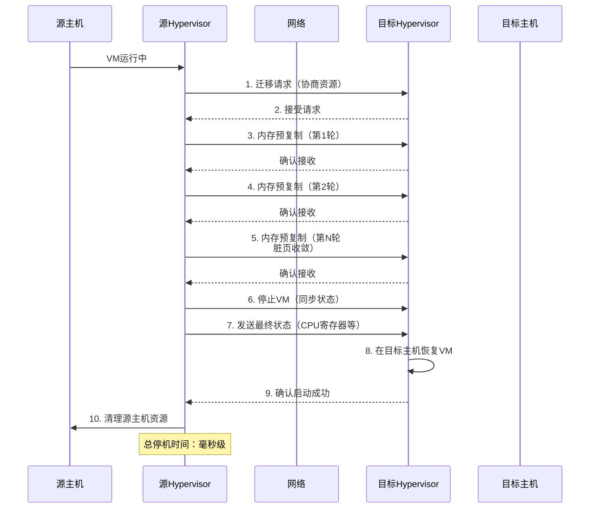

### 热迁移关键步骤

| 步骤 | 说明 | 耗时 |
|-----|------|------|
| 1. **预复制（Pre-copy）** | 迭代复制内存页面，跟踪脏页 | 最长（取决于内存大小和脏页率） |
| 2. **停止与复制（Stop-and-copy）** | 暂停VM，复制剩余内存和CPU状态 | 最短（毫秒级） |
| 3. **恢复（Resume）** | 在目标主机恢复VM执行 | 最短 |
| 4. **清理（Cleanup）** | 释放源主机上的VM资源 | 最短 |

### 预复制详解

预复制是一个迭代过程：
1. **第1轮**：复制所有内存页面
2. **第2轮及以后**：仅复制上一轮中被修改的页面（脏页）
3. **终止条件**：
   - 脏页数量足够少（低于阈值）
   - 达到最大迭代次数
   - 内存总大小与脏页率达到稳态

### 热迁移的挑战

| 挑战 | 说明 | 解决措施 |
|-----|------|---------|
| **停机时间** | 预复制过程中脏页率过高导致停机时间延长 | 使用Post-copy、异步迁移 |
| **网络带宽** | 大内存VM迁移消耗大量网络带宽 | 压缩、增量复制、带宽限制 |
| **存储迁移** | VM磁盘镜像需要独立迁移 | 共享存储、存储热迁移 |
| **跨主机延迟** | 迁移期间VM响应变慢 | 选择低峰期迁移 |
| **安全风险** | 迁移过程中数据可能被窃听 | 加密传输、VPN |
| **NUMA亲和性** | 迁移后VM的NUMA拓扑可能变化 | NUMA感知的迁移策略 |

### 热迁移 vs 冷迁移

| 维度 | 热迁移 | 冷迁移 |
|-----|--------|--------|
| **VM状态** | 运行中 | 关机/暂停 |
| **服务中断** | 毫秒级 | 分钟级 |
| **迁移时间** | 较长（需复制内存） | 较短（仅复制磁盘） |
| **复杂度** | 高 | 低 |
| **适用场景** | 生产环境、关键业务 | 非关键业务、维护窗口 |

## 六、OpenStack Nova 与 libvirt 集成

### OpenStack 虚拟化架构

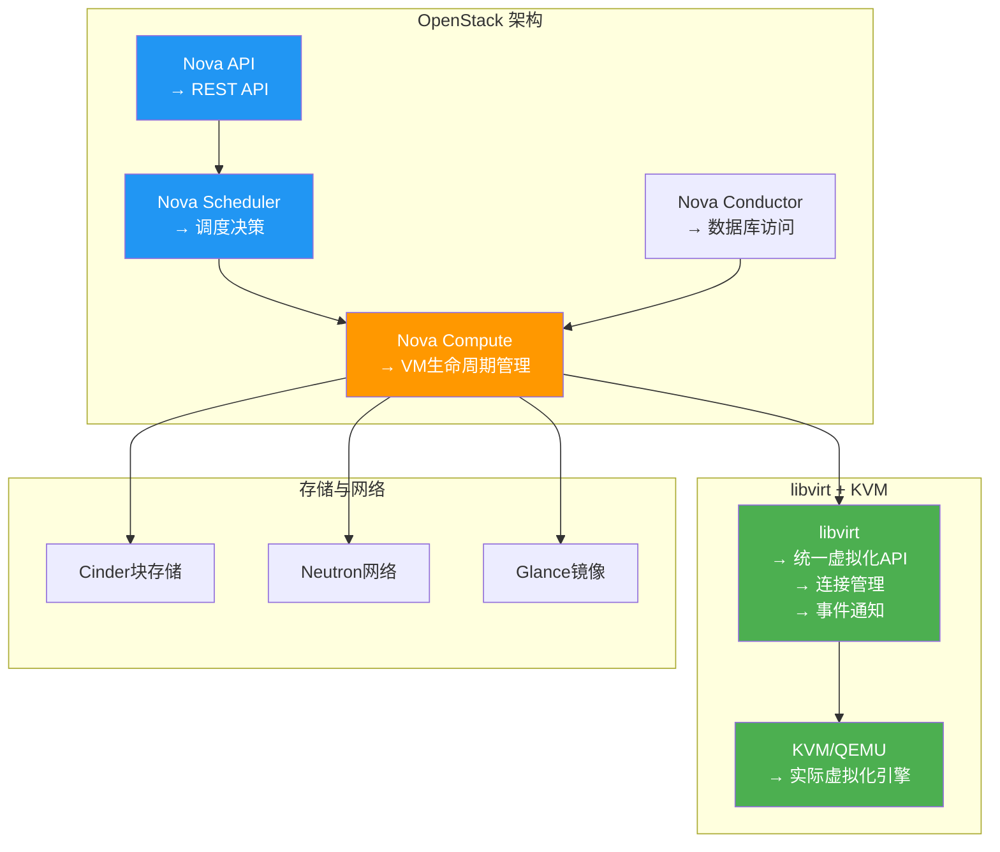

### libvirt 核心功能

| 功能 | 说明 |
|-----|------|
| **连接管理** | 本地/远程连接Hypervisor（QEMU/KVM、Xen、VirtualBox） |
| **域（Domain）管理** | 创建、启动、停止、暂停、迁移虚拟机 |
| **资源管理** | CPU、内存、磁盘、网络资源的配置与监控 |
| **事件通知** | VM状态变化、资源使用事件的实时通知 |
| **安全通信** | 支持 TLS、SASL 等安全认证方式 |
| **存储管理** | 存储池、卷的管理 |
| **网络管理** | 虚拟网络、桥接、NAT 配置 |

### OpenStack Nova 与 libvirt 交互流程

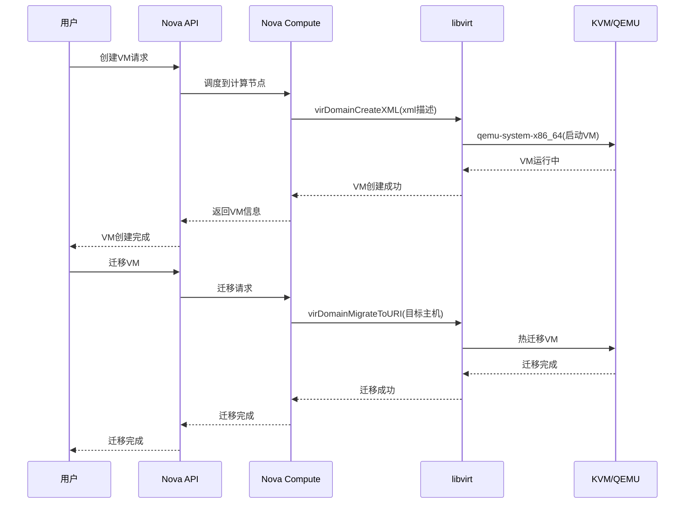

### 关键代码示例

```python
import libvirt

conn = libvirt.open("qemu+ssh://root@remote_host/system")

xml_desc = """
<domain type='kvm'>
  <name>test-vm</name>
  <memory unit='KiB'>2097152</memory>
  <vcpu placement='static'>2</vcpu>
  <os>
    <type arch='x86_64' machine='pc-i440fx-5.2'>hvm</type>
  </os>
  <devices>
    <disk type='file' device='disk'>
      <driver name='qemu' type='qcow2'/>
      <source file='/var/lib/libvirt/images/test-vm.qcow2'/>
      <target dev='vda' bus='virtio'/>
    </disk>
    <interface type='network'>
      <source network='default'/>
      <model type='virtio'/>
    </interface>
  </devices>
</domain>
"""

domain = conn.createDomainXML(xml_desc)
print(f"VM {domain.name()} 已创建，状态: {domain.info()[0]}")

domain.suspend()
domain.resume()
domain.destroy()

conn.close()
```

## 七、小结

> [!summary] 本节要点回顾
> 1. **CPU虚拟化**：vCPU映射、时间片调度、CPU超分（建议2:1~4:1）
> 2. **内存虚拟化**：影子页表→EPT/NPT硬件加速、内存气球、页共享、KSM
> 3. **I/O虚拟化**：设备模拟→半虚拟化（virtio）→直通→SR-IOV，性能递增
> 4. **性能分析**：VMEXIT、页表转换、I/O模拟是主要开销来源，硬件辅助+virtio是核心优化
> 5. **热迁移**：预复制→停止复制→恢复，停机时间毫秒级，是云运维的关键技术
> 6. **OpenStack集成**：Nova Compute → libvirt → KVM/QEMU，libvirt提供统一API

## 关联知识点

| 关联知识点 | 关系 |
|-----------|------|
| [[2.1 虚拟化概述与分类]] | 资源管理是虚拟化核心功能 |
| [[2.2 Hypervisor与虚拟化架构]] | Hypervisor的资源管理实现 |
| [[第4章 云计算架构与资源调度]] | OpenStack资源调度与编排 |
| [[第5章 云存储技术体系]] | 存储虚拟化与云存储的关系 |
| [[第6章 云网络与虚拟网络技术]] | 网络虚拟化与SDN |