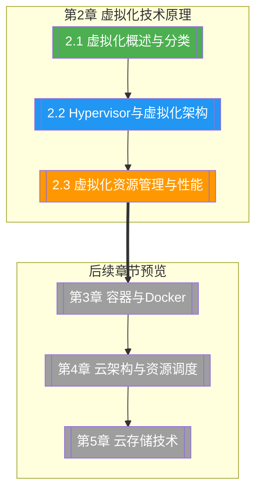

# 第2章 虚拟化技术原理

> [!abstract] 章节概述
> 虚拟化是云计算的基石，本章系统阐述虚拟化技术的原理、架构与实践。从虚拟化的定义与分类出发，深入剖析 Hypervisor 的工作机制与 KVM/Xen 等主流虚拟化架构，进而讨论 CPU、内存、I/O 等核心资源的虚拟化实现与性能优化。通过本章学习，读者将理解云计算底层的资源抽象与隔离机制。

## 学习路线图

## 知识点导航

| 编号 | 知识点 | 核心内容 | 重要程度 |
|-----|--------|---------|---------|
| 2.1 | [[2.1 虚拟化概述与分类]] | 虚拟化定义、分类体系、硬件/软件虚拟化、全虚/半虚/准虚拟 | ⭐⭐⭐⭐ |
| 2.2 | [[2.2 Hypervisor与虚拟化架构]] | Type1/Type2 Hypervisor、KVM架构、X86虚拟化、硬件辅助虚拟化 | ⭐⭐⭐⭐⭐ |
| 2.3 | [[2.3 虚拟化资源管理与性能]] | CPU/内存/I/O虚拟化、性能开销、热迁移、OpenStack集成 | ⭐⭐⭐⭐⭐ |

## 核心概念速览

> [!tip] 本章必须掌握的核心概念
> - **虚拟化（Virtualization）**：通过软件/硬件技术将物理资源抽象为虚拟资源的过程
> - **Hypervisor（虚拟机监控器）**：运行在物理硬件与虚拟机之间的中间层，负责资源分配与调度
> - **Type 1 Hypervisor**：直接运行在裸金属上的虚拟化层（KVM、Xen、Hyper-V）
> - **Type 2 Hypervisor**：运行在操作系统之上的虚拟化层（VMware Workstation、VirtualBox）
> - **硬件辅助虚拟化**：利用CPU硬件特性（Intel VT-x、AMD-V）提升虚拟化性能
> - **半虚拟化（Paravirtualization）**：Guest OS感知虚拟化环境并进行协作的虚拟化方式
> - **容器 vs 虚拟机**：容器共享内核、轻量；虚拟机独立内核、强隔离

## 核心考点

> [!important] 期末高频考点

| 考点 | 所属知识点 | 考查形式 | 难度 |
|-----|-----------|---------|------|
| 虚拟化的定义与分类体系 | 2.1 | 简答题/选择题 | ★★ |
| 全虚拟化、半虚拟化、准虚拟化的区别 | 2.1 | 对比题/选择题 | ★★★ |
| Type 1 与 Type 2 Hypervisor 的对比 | 2.2 | 对比题 | ★★★ |
| KVM 架构与工作原理 | 2.2 | 简答题/论述题 | ★★★★ |
| X86 虚拟化的"Ring 0 陷阱"问题 | 2.2 | 简答题 | ★★★ |
| CPU/内存/I/O 虚拟化的实现机制 | 2.3 | 论述题 | ★★★★ |
| 虚拟CPU超分（over-commitment）原理与风险 | 2.3 | 简答题/案例分析 | ★★★ |
| 虚拟机热迁移的原理与步骤 | 2.3 | 论述题 | ★★★★ |

## 自测题

> [!question] 章节自测
> 1. 对比全虚拟化、半虚拟化和准虚拟化的实现原理与性能差异，分别说明它们的典型应用场景。
> 2. 请阐述 KVM 虚拟化架构中内核模块（kvm.ko）与 QEMU 的协同工作机制，以及它相比传统 Type 1 Hypervisor 的优势。
> 3. 分析 X86 架构下虚拟化面临的"Ring 0 陷阱"问题，说明硬件辅助虚拟化（Intel VT-x/AMD-V）如何解决这一问题。
> 4. 某企业计划在一台 16 核物理服务器上运行虚拟化环境，预计需要支持 30 个 vCPU 密集型虚拟机。请分析这种 CPU 超分策略的可行性、潜在风险和优化方案。

## 章节导航

| 方向 | 链接 |
|-----|------|
| ⬆ 返回课程总览 | [[MOC - 云计算技术]] |
| ⬅ 上一章 | [[第1章 云计算基础概论/MOC - 第1章]] |
| ➡ 下一章 | [[第3章 容器与Docker技术/MOC - 第3章]] | 