# 3.1 容器技术基础

> [!abstract] 本节导读
> 容器技术是云原生时代的基石。本节从容器与虚拟机的深度对比切入，系统介绍 Linux 内核的两大核心机制——命名空间（Namespace）与控制组（cgroups），阐述容器的隔离原理与 OCI 标准，最后介绍 runc、containerd 等主流容器运行时。

## 一、容器 vs 虚拟机

### 架构对比

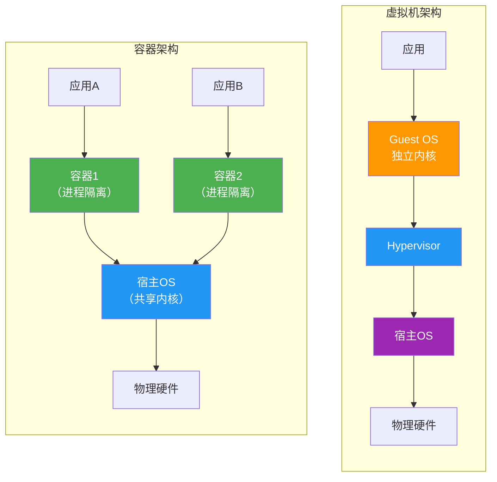

### 核心区别

| 维度 | 虚拟机 | 容器 |
|-----|--------|------|
| **隔离级别** | 操作系统级（独立内核） | 进程级（共享内核） |
| **隔离机制** | Hypervisor + 硬件虚拟化 | Namespace + Cgroups |
| **启动速度** | 分钟级（1-5分钟） | 秒级（< 3秒） |
| **资源占用** | 重（数百MB~数GB） | 轻（数十~数百MB） |
| **资源密度** | ~10:1 | ~100:1 |
| **内核** | 每个VM独立内核 | 共享宿主内核 |
| **兼容性** | 任意操作系统 | 同内核操作系统 |
| **安全边界** | 强（硬件级） | 中（进程级） |
| **性能** | 接近原生（95-99%） | 几乎原生（99-100%） |
| **持久化** | 独立磁盘镜像 | 联合文件系统 |
| **迁移** | 热迁移（复杂） | 镜像迁移（简单） |
| **Docker支持** | 需要完整OS | 原生支持 |

### 对比图示

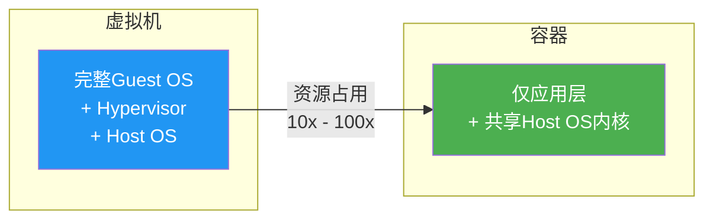

## 二、Linux 命名空间（Namespace）

### 命名空间概述

**命名空间（Namespace）** 是 Linux 内核提供的一种资源隔离机制。每个命名空间中的进程看到的是该命名空间的"视图"，无法感知或操作其他命名空间的资源。

> [!important] 命名空间的核心思想
> 通过为进程创建独立的资源视图，实现进程间的**资源隔离**。每个命名空间中的资源对该命名空间内的进程来说是"独占"的。

### 六大命名空间

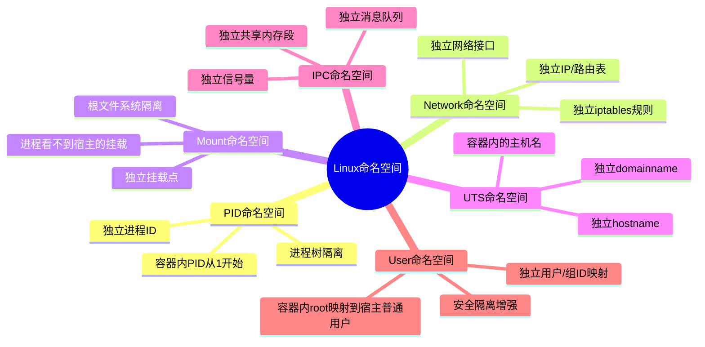

### 各命名空间详解

#### PID 命名空间

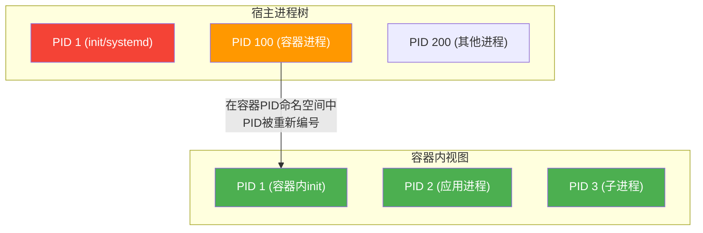

**特点**：
- 容器内的进程有独立的 PID 编号空间
- 容器内的 PID 1 对应宿主中的某个进程
- 容器内无法看到或发送信号到其他命名空间的进程

#### Network 命名空间

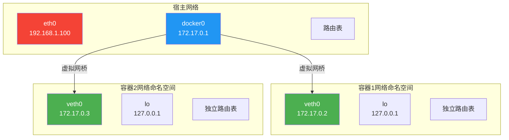

**特点**：
- 每个容器有独立的网络接口、IP 地址、路由表
- 通过 veth pair 连接到虚拟网桥（Docker 默认 docker0）
- 容器内只能看到自己的网络接口
- 支持多种网络模式：bridge、host、overlay、none

#### Mount 命名空间

**特点**：
- 容器有独立的根文件系统视图
- 容器内的进程无法看到宿主的挂载点
- 每个容器可以有不同的根文件系统
- 支持联合挂载（UnionFS）实现镜像分层

#### UTS 命名空间

**特点**：
- 容器有独立的 hostname 和 domainname
- `uname -n` 在容器内返回容器自己的主机名

#### IPC 命名空间

**特点**：
- 容器有独立的 IPC 资源（消息队列、信号量、共享内存）
- 容器间的 IPC 资源完全隔离

#### User 命名空间

**特点**：
- 容器内的用户 ID 与宿主映射
- 容器内的 root（UID 0）可以映射到宿主的普通用户
- 增强了容器的安全性

### 命名空间使用示例

```bash
# 创建 PID 命名空间
sudo unshare --fork --pid --mount-proc bash

# 创建 Network 命名空间
sudo ip netns add mynet
sudo ip netns exec mynet bash

# 在 Docker 中查看命名空间
docker run --rm -it --pid=host ubuntu bash  # 使用宿主PID命名空间
```

## 三、控制组（cgroups）

### cgroups 概述

**控制组（Control Groups, cgroups）** 是 Linux 内核提供的另一个资源隔离机制，用于**限制、统计和分配**进程组的系统资源（CPU、内存、I/O 等）。

> [!important] 命名空间 vs cgroups
> - **命名空间（Namespace）**：实现资源的"视图隔离"——进程看到的是独立的资源视图
> - **控制组（cgroups）**：实现资源的"数量限制"——进程能使用的资源有上限

### cgroups 核心功能

| 功能 | 说明 |
|-----|------|
| **资源限制** | 限制进程组的 CPU 时间、内存使用量、磁盘 I/O 等 |
| **优先级分配** | 为不同进程组分配不同的 CPU 时间片权重 |
| **资源统计** | 统计进程组的资源使用情况（CPU 时间、内存用量等） |
| **进程控制** | 挂起、恢复、杀死进程组中的所有进程 |

### cgroups 子系统

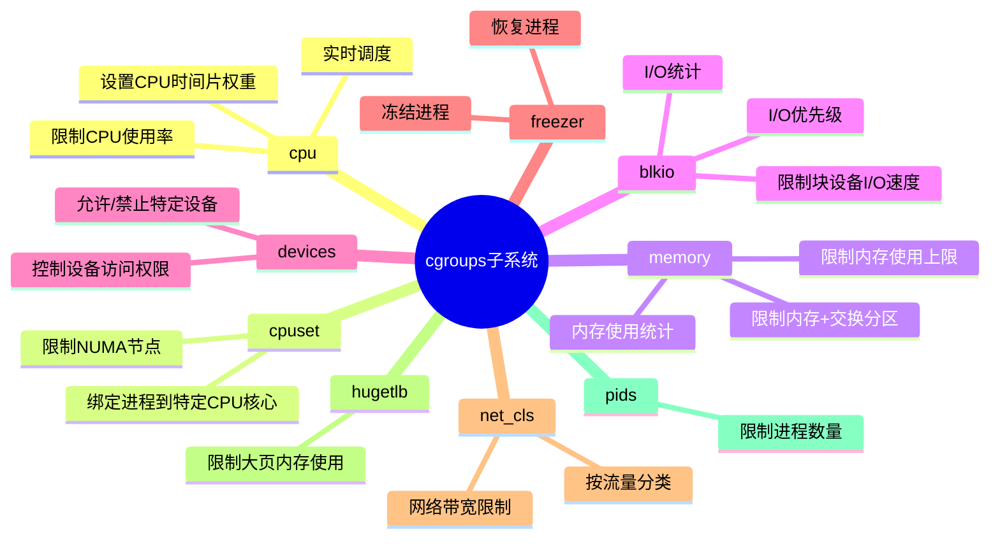

### cgroups v1 vs v2

| 维度 | cgroups v1 | cgroups v2 |
|-----|-----------|-----------|
| **挂载方式** | 每个子系统独立挂载 | 统一挂载（cgroup2fs） |
| **层级结构** | 每个控制器独立树 | 统一层级树 |
| **控制器** | 多个子系统 | 统一控制器接口 |
| **灵活性** | 较高（可独立配置） | 更高（统一管理） |
| **安全性** | 较弱 | 更强（支持User namespace） |
| **推荐状态** | 旧版兼容 | 推荐使用 |

### cgroups 使用示例

```bash
# 创建 cgroup
mkdir /sys/fs/cgroup/cpu/mycontainer

# 限制 CPU 使用率（相对于一个CPU核心）
echo 50000 > /sys/fs/cgroup/cpu/mycontainer/cpu.cfs_quota_us
echo 100000 > /sys/fs/cgroup/cpu/mycontainer/cpu.cfs_period_us

# 限制内存使用量
mkdir /sys/fs/cgroup/memory/mycontainer
echo 256M > /sys/fs/cgroup/memory/mycontainer/memory.limit_in_bytes

# 将进程加入 cgroup
echo 1234 > /sys/fs/cgroup/cpu/mycontainer/tasks
echo 1234 > /sys/fs/cgroup/memory/mycontainer/tasks
```

### Docker 与 cgroups 集成

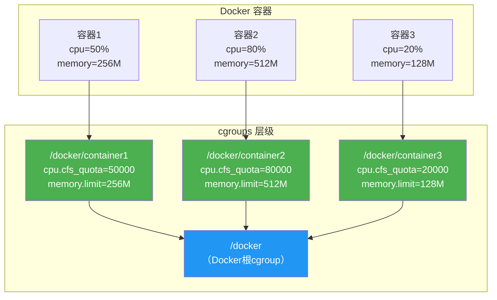

## 四、容器隔离原理

### 隔离全景图

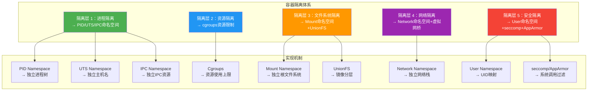

### 隔离机制协同工作

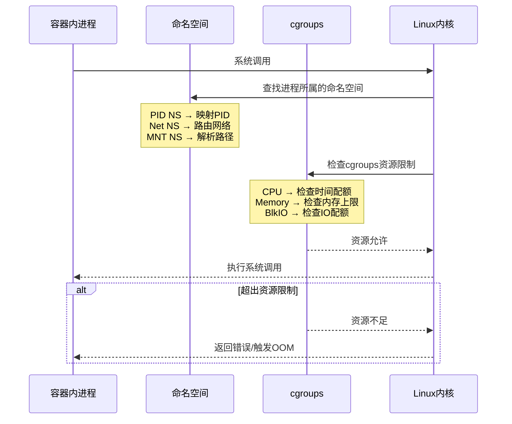

## 五、OCI（Open Container Initiative）标准

### OCI 概述

**OCI（开放容器倡议）** 是由 Linux 基金会在 2015 年发起的开源组织，旨在制定容器技术的开放标准。

### OCI 标准组成

| 标准 | 说明 | 代表实现 |
|-----|------|---------|
| **OCI Runtime Specification** | 容器运行时规范，定义容器的生命周期 | runc、crun、Kata Containers |
| **OCI Image Specification** | 容器镜像规范，定义镜像的格式和内容 | Docker、containerd、CRI-O |
| **OCI Distribution Specification** | 容器镜像分发规范，定义镜像仓库协议 | Docker Registry、Harbor |

### OCI 生态

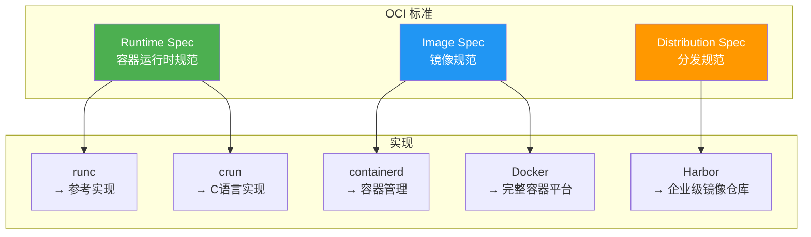

## 六、容器运行时

### 容器运行时架构

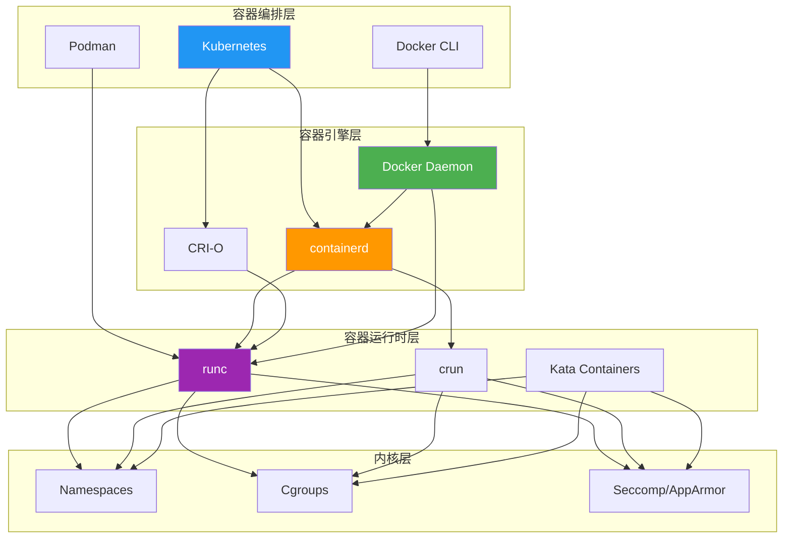

### 主流容器运行时

| 运行时 | 语言 | 特点 | 适用场景 |
|-------|------|------|---------|
| **runc** | Go | OCI 参考实现，轻量、稳定 | Docker、containerd 底层 |
| **crun** | C | 轻量级，启动更快，内存占用更小 | 资源受限环境、边缘计算 |
| **Kata Containers** | Go/Rust | 基于虚拟化的轻量级容器 | 强隔离需求场景 |
| **gVisor** | Go | Google 开发，用户态内核 | 沙箱隔离、安全敏感场景 |
| **Firecracker** | Rust | AWS 开发，基于 KVM 的微虚拟机 | Serverless、函数计算 |

### containerd 架构

**containerd** 是一个工业级的容器运行时，自 Docker 1.11 开始从中拆分出来，专注于容器的运行和管理。

| 组件 | 说明 |
|-----|------|
| **containerd** | 守护进程，管理容器的完整生命周期 |
| **containerd-shim** | 为每个容器创建一个 shim 进程，确保容器独立运行 |
| **ctr** | containerd 的命令行工具 |
| **content store** | 镜像内容存储 |
| **snapshot store** | 容器快照存储 |

### Docker → containerd → runc 调用链

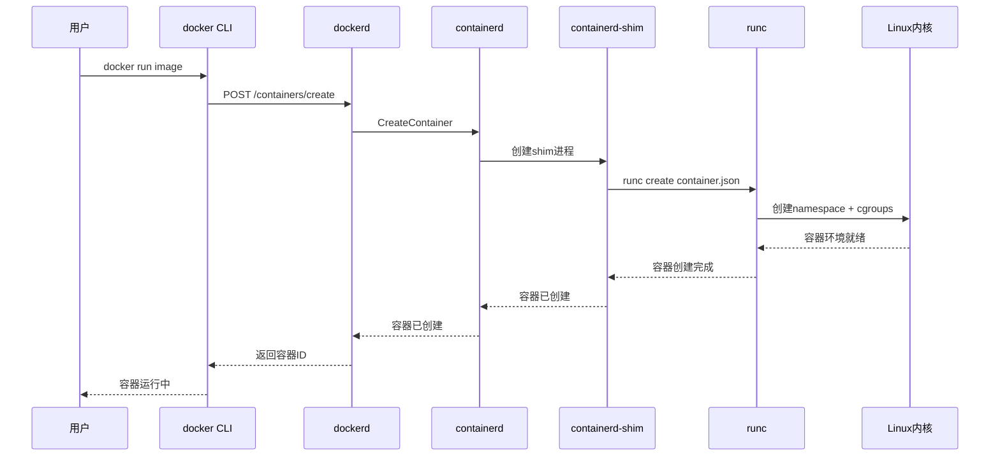

## 七、小结

> [!summary] 本节要点回顾
> 1. **容器vs虚拟机**：容器共享内核、轻量、快速启动；虚拟机独立内核、强隔离、较重
> 2. **命名空间**：PID、Network、Mount、UTS、IPC、User 六大命名空间实现资源视图隔离
> 3. **cgroups**：CPU、内存、blkio 等子系统实现资源使用量限制
> 4. **隔离原理**：命名空间隔离视图 + cgroups 限制资源 + seccomp/AppArmor 安全加固
> 5. **OCI标准**：Runtime、Image、Distribution 三大标准确保生态兼容
> 6. **容器运行时**：Docker → containerd → runc 三层架构，runc 是 OCI 参考实现

## 关联知识点

| 关联知识点 | 关系 |
|-----------|------|
| [[2.1 虚拟化概述与分类]] | 容器是操作系统级虚拟化 |
| [[2.2 Hypervisor与虚拟化架构]] | 容器vs虚拟机的架构对比 |
| [[3.2 Docker核心架构]] | Docker基于本节的容器技术实现 |
| [[10. 主流云平台与云原生技术]] | Kubernetes容器编排 |