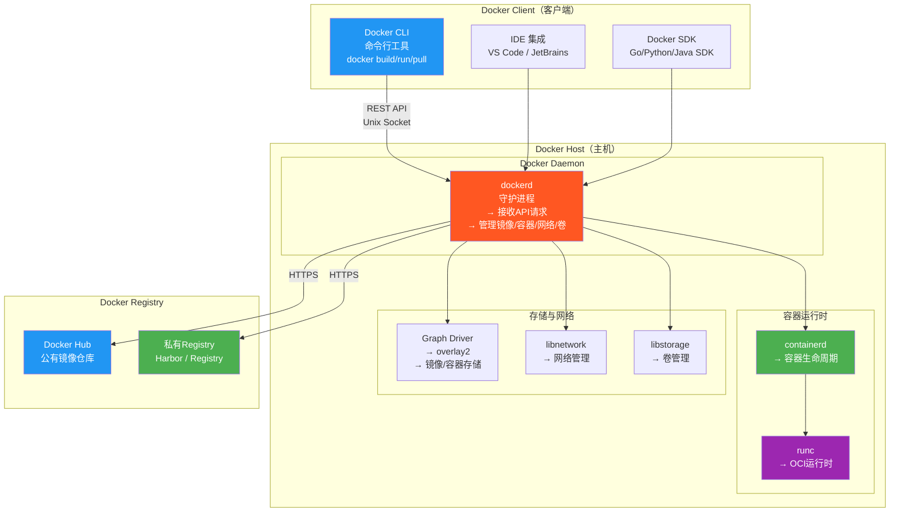
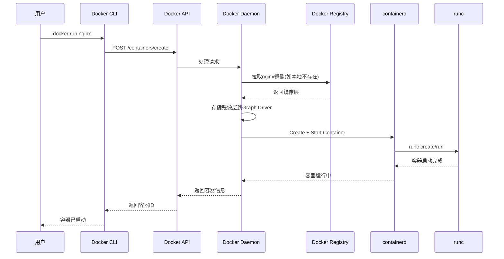
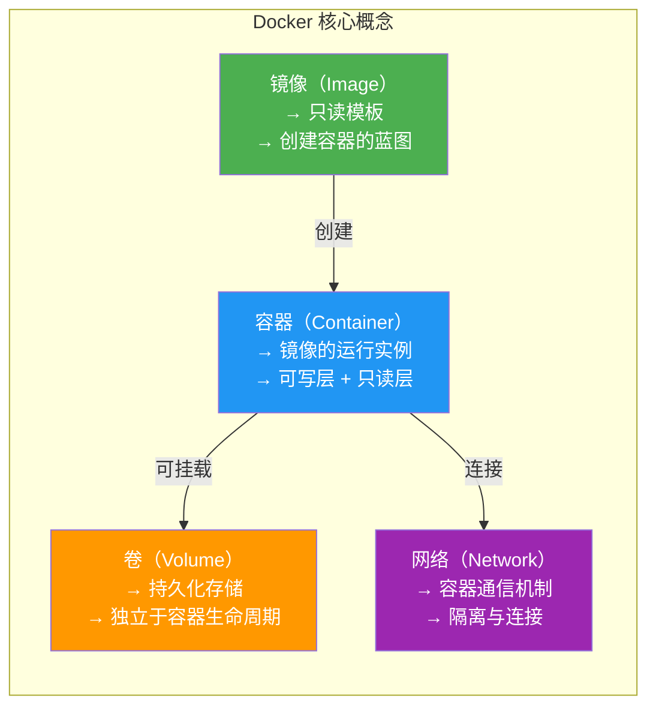
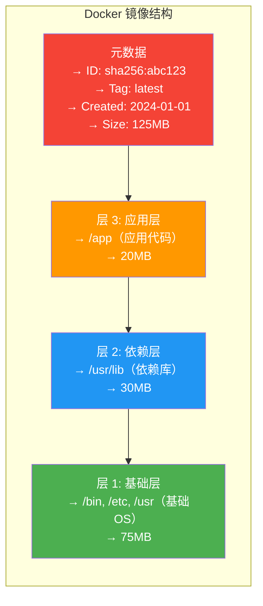
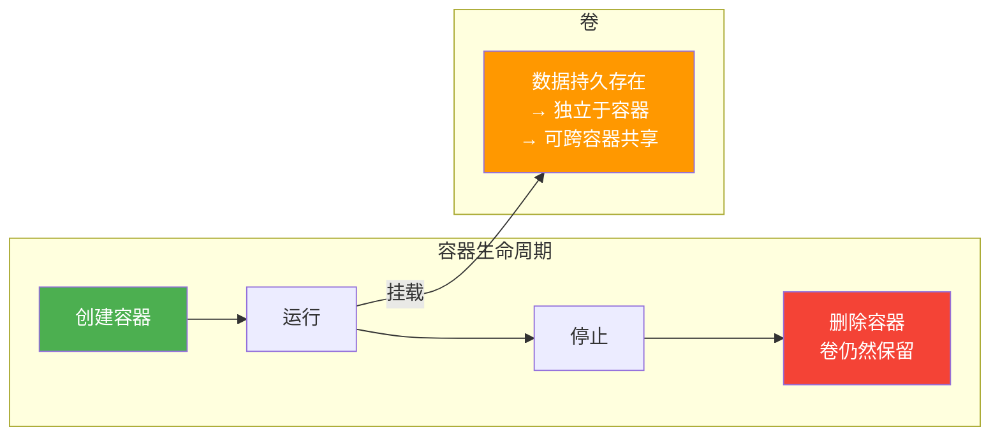
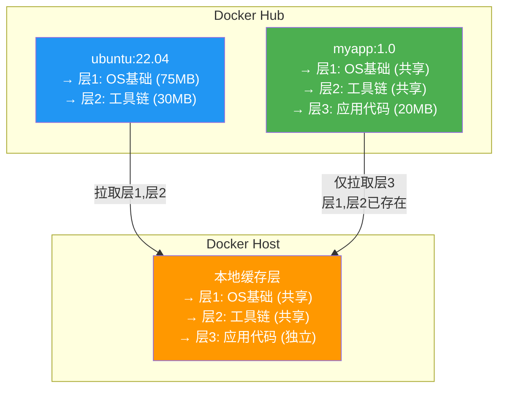
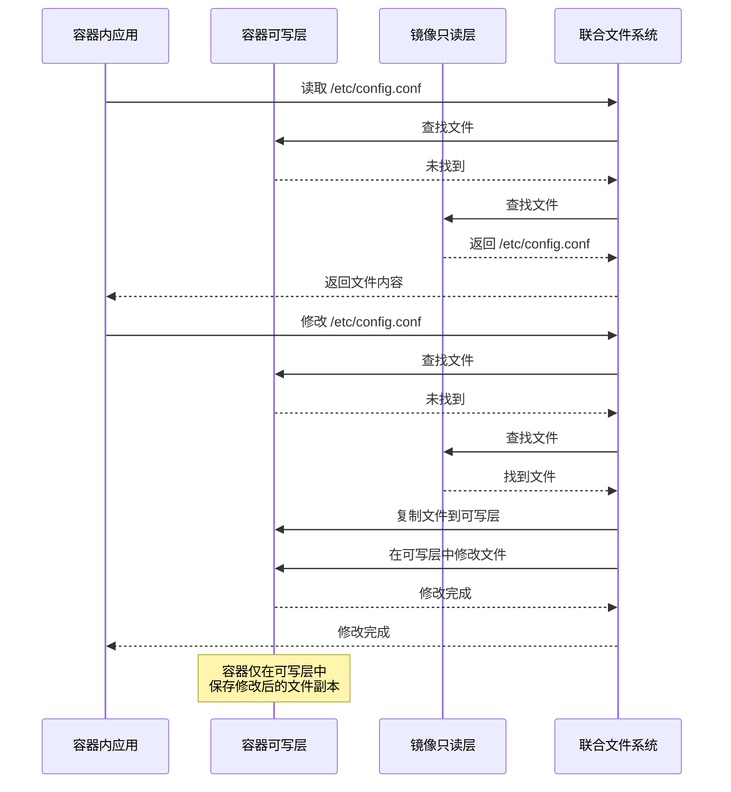

# 3.2 Docker 核心架构

> [!abstract] 本节导读
> Docker 是目前最流行的容器化平台。本节系统介绍 Docker 的 Client-Server 架构，深入解析镜像、容器、卷、网络四大核心概念，重点阐述 Docker 镜像的分层存储与 Copy-on-Write 机制，最后提供常用 Docker 命令速查表。

## 一、Docker 架构

### Client-Server 架构



### 核心组件详解

| 组件 | 说明 |
|-----|------|
| **Docker CLI** | 命令行客户端，用户通过它与 Docker Daemon 交互 |
| **Docker Daemon（dockerd）** | 核心守护进程，管理镜像、容器、网络、卷 |
| **containerd** | 容器运行时，负责容器的创建、启动、停止等生命周期 |
| **runc** | OCI 兼容的容器运行时，真正创建和管理容器 |
| **Docker Registry** | 镜像仓库，存储和分发 Docker 镜像 |
| **Graph Driver** | 存储驱动，管理镜像和容器的分层存储 |

### 交互流程



## 二、核心概念：镜像、容器、卷、网络

### 四大核心概念关系图



### 镜像（Image）

> [!definition] Docker 镜像
> Docker 镜像是一个只读模板，包含运行应用所需的一切：应用代码、运行时环境、库、环境变量和配置文件。镜像是创建容器的"蓝图"。

**镜像的组成**：
- **元数据**：镜像 ID、标签、创建时间、作者等
- **文件系统层**：一组只读的文件系统层（Layers）
- **配置信息**：启动命令、环境变量、端口等



### 容器（Container）

> [!definition] Docker 容器
> 容器是镜像的一个运行实例，在镜像的只读层之上添加了一个可写层。多个容器可以共享同一个镜像的只读层。

**容器的组成**：
- **只读层**：来自镜像的所有只读层
- **可写层（Container Layer）**：容器运行时的修改都写入此层
- **容器元数据**：容器 ID、状态、网络配置等

### 卷（Volume）

> [!definition] Docker 卷
> 卷是 Docker 提供的持久化存储机制，独立于容器的生命周期。删除容器时卷不会被删除。



**卷 vs 绑定挂载**：

| 维度 | Docker 卷 | 绑定挂载 |
|-----|-----------|---------|
| **管理** | 由 Docker 管理 | 手动指定路径 |
| **存储位置** | /var/lib/docker/volumes/ | 任意宿主路径 |
| **使用场景** | 应用数据持久化 | 配置文件、代码热更新 |
| **备份** | docker volume create | 直接复制目录 |
| **跨平台** | 可移植 | 路径绑定，不可移植 |

### 网络（Network）

Docker 提供多种网络模式：

| 网络模式 | 说明 | 场景 |
|---------|------|------|
| **bridge** | 默认模式，容器通过虚拟网桥通信 | 单机容器通信 |
| **host** | 容器共享宿主网络命名空间 | 性能敏感场景 |
| **none** | 无网络连接 | 安全隔离场景 |
| **overlay** | 跨主机容器通信（VXLAN） | 集群、Swarm |
| **macvlan** | 容器获取独立MAC和IP | 需要直接访问物理网络 |

## 三、镜像分层与 Copy-on-Write

### 镜像分层原理



### Copy-on-Write 机制

> [!important] Copy-on-Write (COW)
> 当容器需要修改一个文件时，不会直接修改镜像中的只读层，而是将该文件从只读层复制到容器的可写层中进行修改。



### 联合文件系统（UnionFS）

Docker 使用 **UnionFS** 实现镜像分层，默认使用 **overlay2** 存储驱动：

| 存储驱动 | 说明 | 状态 |
|---------|------|------|
| **overlay2** | 默认推荐，性能好，稳定 | ✅ 推荐 |
| **aufs** | 旧版驱动，Linux 内核 3.x | 兼容模式 |
| **devicemapper** | 基于块设备，适合裸设备 | 兼容模式 |
| **vfs** | 最简单，无分层支持 | 测试用 |
| **zfs** | 基于 ZFS 文件系统 | 特定场景 |

### 镜像分层的优势

> [!success] 镜像分层的好处
> 
> | 优势 | 说明 |
> |-----|------|
> **节省空间** | 多个镜像共享相同的基础层，避免重复存储 |
> **快速拉取** | 仅需拉取新增的层，已有层自动复用 |
> **快速构建** | Dockerfile 构建时，基础层已缓存 |
> **高效传输** | 推送/拉取时仅传输差异层 |

### 镜像层缓存示例

```
# 基础镜像层（共享）
ubuntu:22.04 → 层1, 层2

# 基于ubuntu的应用1（共享层1,2，新增层3）
myapp:1.0 → 层1, 层2, 层3

# 基于ubuntu的应用2（共享层1,2，新增层4）
myapp:2.0 → 层1, 层2, 层4

# 存储优化：层1,2仅存储一份，总占用 = 75+30+20+30MB = 155MB
# 无分层：(75+30+20) + (75+30+30) = 260MB
```

## 四、Docker Hub 与私有仓库

### Docker Hub

**Docker Hub** 是 Docker 官方提供的公有镜像仓库：

| 功能 | 说明 |
|-----|------|
| **镜像托管** | 存储和分发 Docker 镜像 |
| **自动构建** | 与 GitHub 集成，自动构建镜像 |
| **权限控制** | 公开/私有仓库、团队协作 |
| **版本管理** | 镜像标签、历史版本 |
| **Webhook** | 镜像推送通知 |

### 私有仓库

企业通常需要部署私有镜像仓库以满足安全和合规需求：

| 方案 | 特点 | 适用场景 |
|-----|------|---------|
| **Docker Registry** | Docker 官方开源仓库 | 简单场景、个人使用 |
| **Harbor** | VMware 开源，企业级 | 企业生产环境 |
| **Nexus** | Sonatype，支持多种格式 | 多格式仓库管理 |
| **阿里云 ACR** | 阿里云托管的容器镜像服务 | 阿里云生态 |
| **AWS ECR** | AWS 托管容器仓库 | AWS 生态 |

## 五、常用 Docker 命令速查

### 镜像管理

| 命令 | 说明 |
|-----|------|
| `docker pull <image>` | 从仓库拉取镜像 |
| `docker images` | 列出本地镜像 |
| `docker rmi <image>` | 删除镜像 |
| `docker tag <image> <tag>` | 为镜像打标签 |
| `docker push <image>` | 推送镜像到仓库 |
| `docker build -t <tag> .` | 根据 Dockerfile 构建镜像 |
| `docker save <image> > file.tar` | 导出镜像到文件 |
| `docker load < file.tar` | 从文件加载镜像 |
| `docker history <image>` | 查看镜像构建历史 |
| `docker inspect <image>` | 查看镜像详细信息 |

### 容器管理

| 命令 | 说明 |
|-----|------|
| `docker run [opts] <image>` | 创建并启动容器 |
| `docker create [opts] <image>` | 创建容器但不启动 |
| `docker start <container>` | 启动已存在的容器 |
| `docker stop <container>` | 停止容器（优雅终止） |
| `docker kill <container>` | 强制终止容器 |
| `docker rm <container>` | 删除容器 |
| `docker ps` | 列出运行中的容器 |
| `docker ps -a` | 列出所有容器（含停止） |
| `docker restart <container>` | 重启容器 |
| `docker pause <container>` | 暂停容器 |
| `docker unpause <container>` | 恢复容器 |
| `docker logs <container>` | 查看容器日志 |
| `docker exec -it <container> bash` | 进入容器的shell |
| `docker attach <container>` | 附加到容器的前台进程 |
| `docker stats` | 查看容器资源使用统计 |
| `docker inspect <container>` | 查看容器详细信息 |

### 卷管理

| 命令 | 说明 |
|-----|------|
| `docker volume create <name>` | 创建卷 |
| `docker volume ls` | 列出卷 |
| `docker volume inspect <name>` | 查看卷详情 |
| `docker volume rm <name>` | 删除卷 |
| `docker volume prune` | 删除未使用的卷 |

### 网络管理

| 命令 | 说明 |
|-----|------|
| `docker network create <name>` | 创建网络 |
| `docker network ls` | 列出网络 |
| `docker network inspect <name>` | 查看网络详情 |
| `docker network connect <net> <container>` | 连接容器到网络 |
| `docker network disconnect <net> <container>` | 断开容器网络 |
| `docker network rm <name>` | 删除网络 |
| `docker network prune` | 删除未使用的网络 |

### 常用参数说明

```bash
# docker run 常用参数
docker run -d \          # 后台运行
    --name myapp \        # 容器名称
    -p 8080:80 \          # 端口映射（主机:容器）
    -v /data:/app/data \  # 卷挂载
    -e ENV=prod \         # 环境变量
    --network mynet \     # 指定网络
    --memory 512m \       # 内存限制
    --cpus 0.5 \          # CPU限制
    --restart always \    # 重启策略
    -it \                 # 交互式终端
    nginx:latest          # 镜像名
```

## 六、小结

> [!summary] 本节要点回顾
> 1. **Docker架构**：Client-Server模式，CLI → dockerd → containerd → runc 四层架构
> 2. **四大概念**：镜像（只读模板）、容器（运行实例）、卷（持久化存储）、网络（通信机制）
> 3. **镜像分层**：UnionFS实现镜像分层，Copy-on-Write确保容器间隔离与空间复用
> 4. **存储驱动**：overlay2是当前推荐的默认存储驱动
> 5. **镜像仓库**：Docker Hub是公有仓库，Harbor等是企业私有仓库
> 6. **命令速查**：掌握镜像、容器、卷、网络的常用管理命令

## 关联知识点

| 关联知识点 | 关系 |
|-----------|------|
| [[3.1 容器技术基础]] | Docker基于容器技术实现 |
| [[3.3 Dockerfile与容器编排]] | Docker命令的深入应用 |
| [[第10章 主流云平台与云原生技术]] | Kubernetes对Docker的调度与编排 |