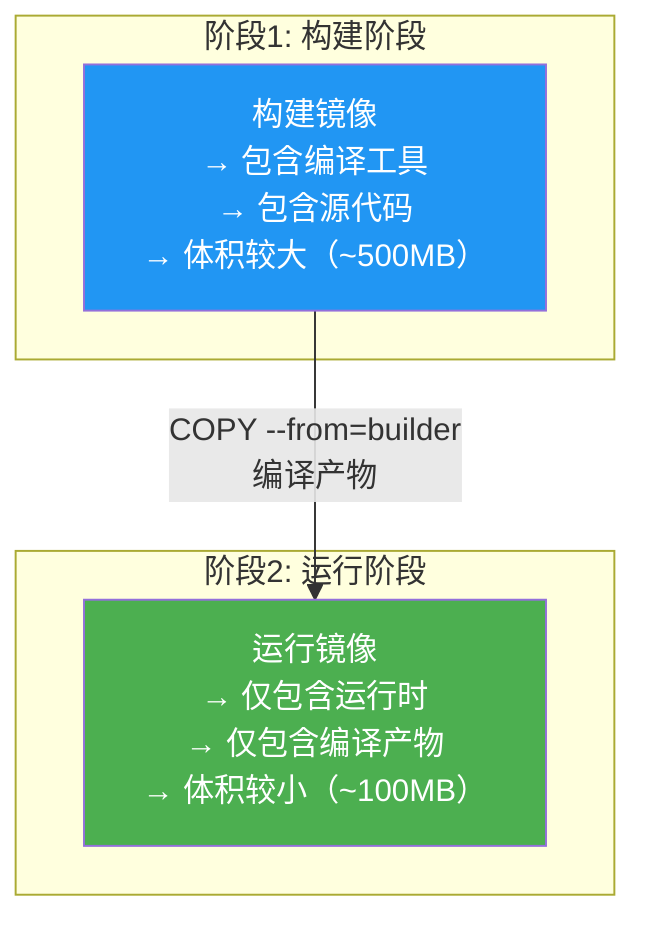
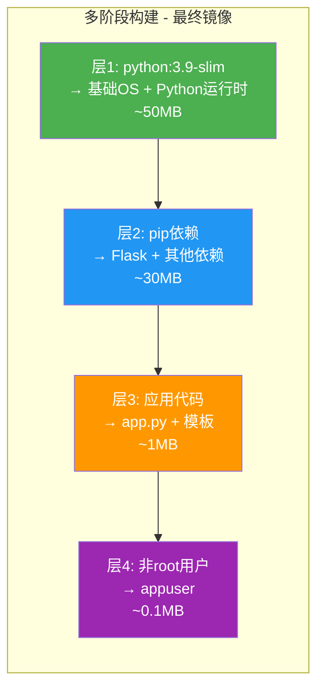
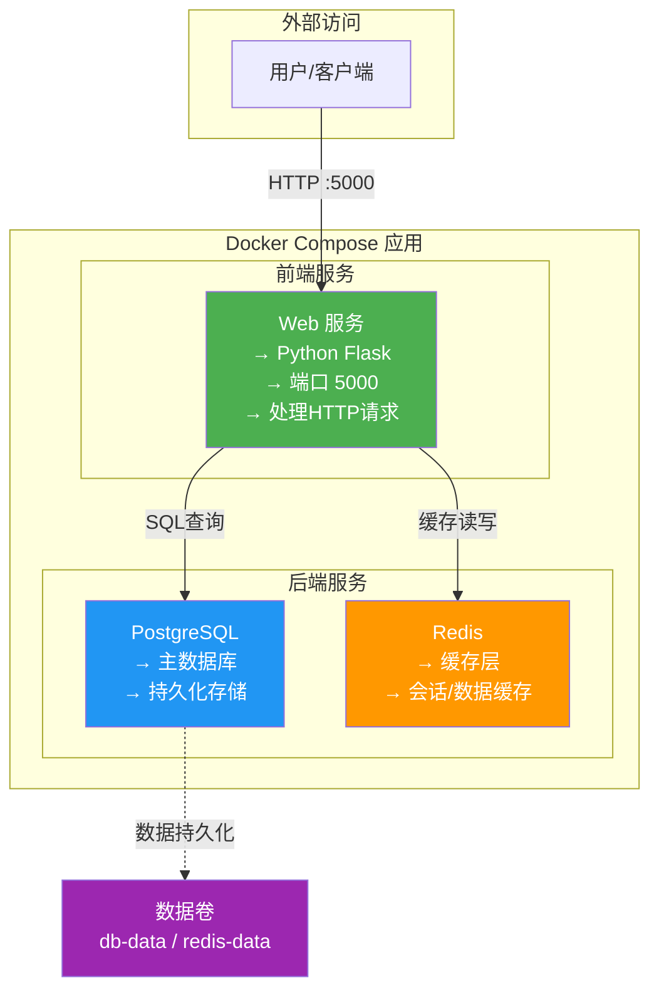
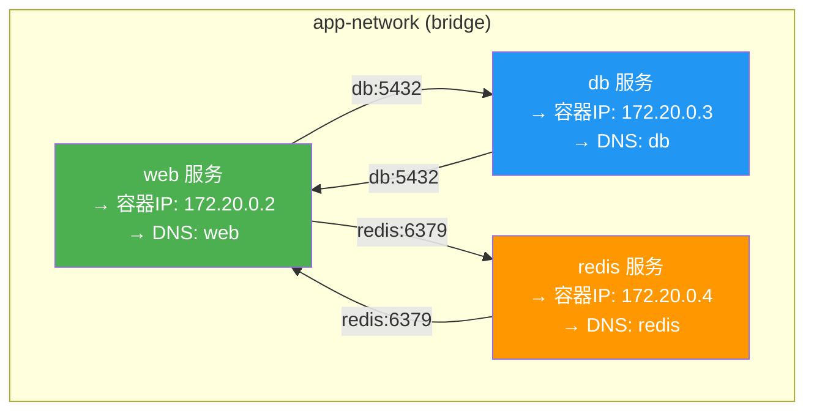

# 3.3 Dockerfile 与容器编排

> [!abstract] 本节导读
> Dockerfile 是构建 Docker 镜像的蓝图，Docker Compose 是多容器编排工具。本节系统讲解 Dockerfile 的核心语法与最佳实践，通过一个 Python Web 应用的完整示例展示多阶段构建，最后介绍 Docker Compose 的服务、卷、网络编排，并提供一个 Web+DB+Redis 的三层应用实战案例。

## 一、Dockerfile 基础语法

### 核心指令一览

| 指令 | 语法 | 说明 |
|-----|------|------|
| **FROM** | `FROM <image>[:tag]` | 指定基础镜像，必须是第一条指令 |
| **WORKDIR** | `WORKDIR <path>` | 设置工作目录 |
| **COPY** | `COPY <src> <dest>` | 复制文件到镜像中 |
| **ADD** | `ADD <src> <dest>` | 复制文件（支持自动解压、远程URL） |
| **RUN** | `RUN <command>` | 在镜像构建时执行命令 |
| **CMD** | `CMD <command>` | 容器启动时的默认命令 |
| **ENTRYPOINT** | `ENTRYPOINT <command>` | 容器入口点（不可被覆盖） |
| **ENV** | `ENV <key>=<value>` | 设置环境变量 |
| **EXPOSE** | `EXPOSE <port>` | 声明容器监听的端口 |
| **VOLUME** | `VOLUME <path>` | 声明数据卷挂载点 |
| **USER** | `USER <name>` | 设置运行命令的用户 |
| **ARG** | `ARG <name>[=<default>]` | 构建时的变量 |
| **ONBUILD** | `ONBUILD <command>` | 当镜像被用作基础镜像时执行 |
| **LABEL** | `LABEL <key>=<value>` | 添加镜像元数据 |

### CMD vs ENTRYPOINT

| 维度 | CMD | ENTRYPOINT |
|-----|-----|-----------|
| **作用** | 默认命令/参数 | 固定入口命令 |
| **可覆盖** | 可被 `docker run` 的参数覆盖 | 可被 `--entrypoint` 覆盖 |
| **参数处理** | 整个命令被替换 | 参数追加到命令后 |
| **典型用法** | 提供默认启动命令 | 固定容器的启动方式 |

```dockerfile
# CMD: 可被覆盖
CMD ["nginx", "-g", "daemon off;"]
# 执行: docker run nginx → 运行nginx
# 执行: docker run nginx bash → 运行bash（CMD被完全替换）

# ENTRYPOINT: 固定入口
ENTRYPOINT ["python", "app.py"]
CMD ["--port", "8080"]
# 执行: docker run myapp → python app.py --port 8080
# 执行: docker run myapp --port 3000 → python app.py --port 3000
```

### COPY vs ADD

| 维度 | COPY | ADD |
|-----|------|-----|
| **基本复制** | ✅ | ✅ |
| **自动解压 tar** | ❌ | ✅ |
| **支持 URL** | ❌ | ✅ |
| **推荐使用** | ✅ 优先 | 仅在需要解压或URL时 |

> [!tip] 最佳实践
> 优先使用 `COPY`，仅在需要自动解压 tar 文件或从 URL 下载文件时使用 `ADD`。

## 二、Dockerfile 最佳实践

### 设计原则

| 原则 | 说明 |
|-----|------|
| **最小化基础镜像** | 选择尽可能小的基础镜像（如 alpine） |
| **减少层数** | 合并 RUN 指令，减少镜像层数 |
| **利用构建缓存** | 变化少的指令放前面，变化多的放后面 |
| **合理使用 .dockerignore** | 排除不需要的文件，减小构建上下文 |
| **不安装不必要的包** | 仅安装运行时需要的依赖 |
| **指定标签** | 使用具体版本标签而非 latest |
| **使用多阶段构建** | 分离构建环境与运行环境 |

### 减少镜像层数

```dockerfile
# ❌ 不好：多个RUN指令，产生多层
RUN apt-get update
RUN apt-get install -y python3
RUN apt-get install -y python3-pip
RUN rm -rf /var/lib/apt/lists/*

# ✅ 好：合并为一个RUN指令
RUN apt-get update && \
    apt-get install -y --no-install-recommends python3 python3-pip && \
    rm -rf /var/lib/apt/lists/*
```

### 利用构建缓存

```dockerfile
# ❌ 不好：COPY源码放在依赖安装前，源码变动导致缓存失效
FROM python:3.9
COPY . /app
RUN pip install -r /app/requirements.txt

# ✅ 好：先COPY依赖文件，源码变动不影响缓存
FROM python:3.9
COPY requirements.txt /app/
RUN pip install -r /app/requirements.txt
COPY . /app
```

### .dockerignore

```gitignore
# 版本控制
.git
.gitignore

# 依赖
node_modules
__pycache__
*.pyc

# 环境
.env
.venv
venv

# IDE
.vscode
.idea

# 文档
*.md
Dockerfile
docker-compose.yml

# 日志
logs
*.log
```

### 多阶段构建

多阶段构建可以在构建阶段使用完整的工具链，在运行阶段仅保留运行时文件，大幅减小镜像体积。



## 三、示例：Python Web 应用 Dockerfile

### 单阶段构建版本

```dockerfile
FROM python:3.9-slim

WORKDIR /app

COPY requirements.txt .
RUN pip install --no-cache-dir -r requirements.txt

COPY . .

ENV FLASK_APP=app.py
ENV FLASK_ENV=production

EXPOSE 5000

CMD ["flask", "run", "--host=0.0.0.0", "--port=5000"]
```

### 多阶段构建版本（推荐）

```dockerfile
FROM python:3.9-slim AS builder

WORKDIR /app

COPY requirements.txt .
RUN pip install --no-cache-dir -r requirements.txt

COPY . .

FROM python:3.9-slim

WORKDIR /app

COPY --from=builder /usr/local /usr/local
COPY --from=builder /app .

RUN useradd -m appuser
USER appuser

ENV FLASK_APP=app.py
ENV FLASK_ENV=production

EXPOSE 5000

CMD ["flask", "run", "--host=0.0.0.0", "--port=5000"]
```

### 构建与运行

```bash
# 构建镜像
docker build -t mywebapp:1.0 .

# 查看镜像大小
docker images mywebapp

# 运行容器
docker run -d \
    --name myweb \
    -p 5000:5000 \
    -e FLASK_ENV=production \
    mywebapp:1.0

# 查看日志
docker logs -f myweb

# 停止并删除
docker stop myweb && docker rm myweb
```

### 镜像层分析



## 四、Docker Compose 基础

### Docker Compose 概述

**Docker Compose** 是 Docker 官方提供的多容器编排工具，通过一个 YAML 文件定义多容器应用的配置，然后用一条命令管理应用的整个生命周期。

> [!important] Docker Compose 的核心价值
> - **声明式配置**：用 YAML 文件描述整个应用架构
> - **一键管理**：一条命令完成构建、启动、停止
> - **环境一致性**：开发、测试、生产环境保持一致
> - **依赖管理**：自动处理服务间的启动依赖

### Compose 文件结构

```yaml
version: "3.8"

services:
  # 服务定义
  web:
    image: nginx:latest
    ports:
      - "80:80"
    volumes:
      - ./html:/usr/share/nginx/html
    networks:
      - frontend

  db:
    image: postgres:15
    environment:
      POSTGRES_PASSWORD: example
    volumes:
      - db-data:/var/lib/postgresql/data
    networks:
      - backend
    restart: always

volumes:
  db-data:

networks:
  frontend:
  backend:
    internal: true
```

### 核心配置项

| 配置项 | 说明 | 示例 |
|-------|------|------|
| **image** | 使用的镜像 | `image: nginx:latest` |
| **build** | 从 Dockerfile 构建 | `build: ./app` |
| **ports** | 端口映射 | `ports: ["8080:80"]` |
| **volumes** | 卷挂载 | `volumes: ["data:/app/data"]` |
| **environment** | 环境变量 | `environment: [DB_HOST=db]` |
| **depends_on** | 服务依赖 | `depends_on: [db]` |
| **networks** | 网络配置 | `networks: [frontend]` |
| **restart** | 重启策略 | `restart: always` |
| **command** | 覆盖启动命令 | `command: python app.py` |
| **deploy** | 部署配置（Swarm） | `deploy: {replicas: 3}` |
| **healthcheck** | 健康检查 | `healthcheck: {test: curl -f http://localhost}` |

## 五、实战案例：Web + DB + Redis 三层应用

### 架构图



### 项目文件结构

```
my-webapp/
├── docker-compose.yml
├── web/
│   ├── Dockerfile
│   ├── requirements.txt
│   └── app.py
└── .env
```

### web/Dockerfile

```dockerfile
FROM python:3.9-slim

WORKDIR /app

COPY requirements.txt .
RUN pip install --no-cache-dir -r requirements.txt

COPY . .

EXPOSE 5000

CMD ["python", "app.py"]
```

### web/requirements.txt

```
flask==3.0.0
psycopg2-binary==2.9.9
redis==5.0.1
gunicorn==21.2.0
```

### web/app.py

```python
import os
from flask import Flask, jsonify
import psycopg2
import redis

app = Flask(__name__)

DB_HOST = os.environ.get('DB_HOST', 'db')
DB_NAME = os.environ.get('DB_NAME', 'myapp')
DB_USER = os.environ.get('DB_USER', 'postgres')
DB_PASSWORD = os.environ.get('DB_PASSWORD', 'postgres')
REDIS_HOST = os.environ.get('REDIS_HOST', 'redis')

def get_db_connection():
    return psycopg2.connect(
        host=DB_HOST,
        dbname=DB_NAME,
        user=DB_USER,
        password=DB_PASSWORD
    )

def get_redis():
    return redis.Redis(host=REDIS_HOST, port=6379, decode_responses=True)

@app.route('/')
def index():
    r = get_redis()
    count = r.incr('visit_count')
    return jsonify({
        'message': 'Hello, Docker Compose!',
        'visits': count
    })

@app.route('/health')
def health():
    return jsonify({'status': 'healthy'}), 200

@app.route('/items')
def get_items():
    conn = get_db_connection()
    cur = conn.cursor()
    cur.execute('SELECT id, name FROM items LIMIT 10')
    items = cur.fetchall()
    cur.close()
    conn.close()
    return jsonify([{'id': row[0], 'name': row[1]} for row in items])

if __name__ == '__main__':
    app.run(host='0.0.0.0', port=5000)
```

### docker-compose.yml

```yaml
version: "3.8"

services:
  web:
    build: ./web
    ports:
      - "5000:5000"
    environment:
      - DB_HOST=db
      - DB_NAME=myapp
      - DB_USER=postgres
      - DB_PASSWORD=postgres
      - REDIS_HOST=redis
    depends_on:
      db:
        condition: service_healthy
      redis:
        condition: service_started
    networks:
      - app-network
    restart: unless-stopped

  db:
    image: postgres:15-alpine
    environment:
      - POSTGRES_DB=myapp
      - POSTGRES_USER=postgres
      - POSTGRES_PASSWORD=postgres
    volumes:
      - db-data:/var/lib/postgresql/data
    networks:
      - app-network
    healthcheck:
      test: ["CMD-SHELL", "pg_isready -U postgres"]
      interval: 5s
      timeout: 5s
      retries: 5
    restart: unless-stopped

  redis:
    image: redis:7-alpine
    command: redis-server --appendonly yes
    volumes:
      - redis-data:/data
    networks:
      - app-network
    restart: unless-stopped

volumes:
  db-data:
  redis-data:

networks:
  app-network:
    driver: bridge
```

### .env 文件

```
DB_PASSWORD=postgres
REDIS_HOST=redis
FLASK_ENV=production
```

## 六、Docker Compose 命令速查

### 核心命令

| 命令 | 说明 |
|-----|------|
| `docker compose up` | 创建并启动所有服务 |
| `docker compose up -d` | 后台启动所有服务 |
| `docker compose up --build` | 构建镜像并启动 |
| `docker compose down` | 停止并移除所有服务 |
| `docker compose down -v` | 停止并移除，同时删除卷 |
| `docker compose start` | 启动已停止的服务 |
| `docker compose stop` | 停止运行中的服务 |
| `docker compose restart` | 重启服务 |
| `docker compose ps` | 列出所有服务状态 |
| `docker compose logs` | 查看所有服务日志 |
| `docker compose logs -f <service>` | 实时查看指定服务日志 |
| `docker compose exec <service> <cmd>` | 在服务容器中执行命令 |
| `docker compose run <service> <cmd>` | 运行一次性命令 |
| `docker compose build` | 构建或重建服务镜像 |
| `docker compose pull` | 拉取服务镜像 |
| `docker compose push` | 推送服务镜像 |
| `docker compose config` | 验证并显示配置 |
| `docker compose kill` | 强制终止服务 |
| `docker compose rm` | 移除已停止的服务容器 |

### 常用参数

```bash
# 指定 compose 文件
docker compose -f docker-compose.yml up -d

# 指定项目名
docker compose -p myproject up -d

# 设置环境变量
docker compose -e .env up -d

# 仅启动特定服务
docker compose up -d web

# 缩放到3个实例
docker compose up -d --scale web=3

# 查看资源使用
docker compose stats
```

### 服务间通信

Docker Compose 中的服务通过**服务名**互相访问：



> [!tip] 服务发现
> Compose 自动为每个服务分配 DNS 名称（即服务名），容器之间可以通过服务名互相访问，无需关心容器的实际 IP 地址。

## 七、小结

> [!summary] 本节要点回顾
> 1. **Dockerfile 语法**：FROM、RUN、COPY、ADD、CMD、ENTRYPOINT、EXPOSE、ENV、WORKDIR 等核心指令
> 2. **最佳实践**：最小镜像、减少层数、利用缓存、多阶段构建、.dockerignore
> 3. **多阶段构建**：分离构建与运行环境，大幅减小镜像体积
> 4. **Docker Compose**：声明式定义多容器应用，一键编排管理
> 5. **三层应用示例**：Web + PostgreSQL + Redis，包含完整的 Dockerfile、compose 文件、应用代码
> 6. **服务通信**：通过服务名 DNS 解析实现容器间通信

## 关联知识点

| 关联知识点 | 关系 |
|-----------|------|
| [[3.1 容器技术基础]] | Dockerfile 构建的容器基于本节技术 |
| [[3.2 Docker核心架构]] | Compose 编排 Docker 架构中的组件 |
| [[第10章 主流云平台与云原生技术]] | Kubernetes 是更强大的容器编排 |
| [[第4章 云计算架构与资源调度]] | OpenStack 与容器技术的集成 |