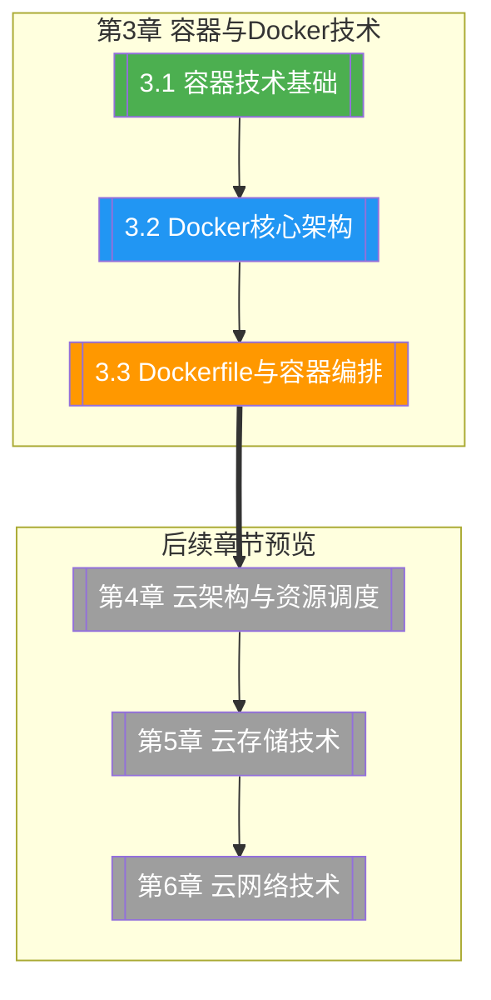

# 第3章 容器与Docker技术

> [!abstract] 章节概述
> 容器技术是云原生时代的核心驱动力。本章从容器与虚拟机的对比切入，深入剖析 Linux 命名空间与控制组的隔离原理，系统介绍 Docker 的架构、镜像、容器、卷和网络等核心概念，最后讲解 Dockerfile 编写与 Docker Compose 编排，帮助读者掌握容器化应用的开发与部署。

## 学习路线图

## 知识点导航

| 编号 | 知识点 | 核心内容 | 重要程度 |
|-----|--------|---------|---------|
| 3.1 | [[3.1 容器技术基础]] | 容器vs虚拟机、Linux命名空间、cgroups、OCI标准、容器运行时 | ⭐⭐⭐⭐⭐ |
| 3.2 | [[3.2 Docker核心架构]] | Docker架构、镜像/容器/卷/网络、镜像分层、常用命令 | ⭐⭐⭐⭐⭐ |
| 3.3 | [[3.3 Dockerfile与容器编排]] | Dockerfile语法、最佳实践、Docker Compose编排 | ⭐⭐⭐⭐⭐ |

## 核心概念速览

> [!tip] 本章必须掌握的核心概念
> - **容器（Container）**：基于操作系统级虚拟化的轻量级隔离环境，共享宿主内核
> - **命名空间（Namespace）**：Linux 内核提供的资源隔离机制，包括 PID、Network、Mount、UTS、IPC、User
> - **控制组（cgroups）**：Linux 内核提供的资源限制与统计机制
> - **OCI（Open Container Initiative）**：开放容器倡议，制定容器标准
> - **Docker 架构**：Client-Server 架构，包含 daemon、CLI、API、registry
> - **镜像分层（Image Layers）**：Docker 镜像基于联合文件系统实现分层存储与 Copy-on-Write
> - **Dockerfile**：构建 Docker 镜像的脚本文件
> - **Docker Compose**：多容器编排工具

## 核心考点

> [!important] 期末高频考点

| 考点 | 所属知识点 | 考查形式 | 难度 |
|-----|-----------|---------|------|
| 容器与虚拟机的本质区别 | 3.1 | 对比题/简答题 | ★★★ |
| Linux 六大命名空间的作用 | 3.1 | 简答题/选择题 | ★★★★ |
| cgroups 的资源限制与隔离机制 | 3.1 | 简答题 | ★★★ |
| OCI 标准与容器运行时生态 | 3.1 | 简答题 | ★★★ |
| Docker 架构及各组件交互 | 3.2 | 简答题/论述题 | ★★★★ |
| Docker 镜像分层与 Copy-on-Write 原理 | 3.2 | 论述题 | ★★★★ |
| Dockerfile 核心指令与最佳实践 | 3.3 | 编程题/案例分析 | ★★★★★ |
| Docker Compose 多服务编排 | 3.3 | 案例分析 | ★★★★ |

## 自测题

> [!question] 章节自测
> 1. 对比容器与虚拟机的实现原理、隔离级别、性能表现和适用场景，分析容器技术在云原生时代兴起的原因。
> 2. 阐述 Linux 命名空间（PID、Network、Mount、UTS、IPC、User）如何实现容器的隔离，并说明 cgroups 如何实现资源限制。
> 3. 请编写一个 Dockerfile，基于 Python 3.9 镜像构建一个 Web 应用，使用多阶段构建优化镜像大小，并说明 Dockerfile 的核心设计原则。
> 4. 使用 Docker Compose 设计一个包含 Web 服务（Python Flask）、数据库（PostgreSQL）、缓存（Redis）的三层应用架构，写出 compose 文件并说明服务间通信机制。

## 章节导航

| 方向 | 链接 |
|-----|------|
| ⬆ 返回课程总览 | [[MOC - 云计算技术]] |
| ⬅ 上一章 | [[第2章 虚拟化技术原理/MOC - 第2章]] |
| ➡ 下一章 | [[第4章 云计算架构与资源调度/MOC - 第4章]] |