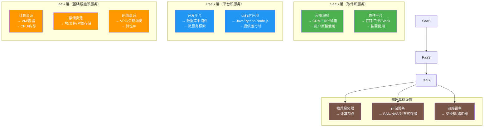
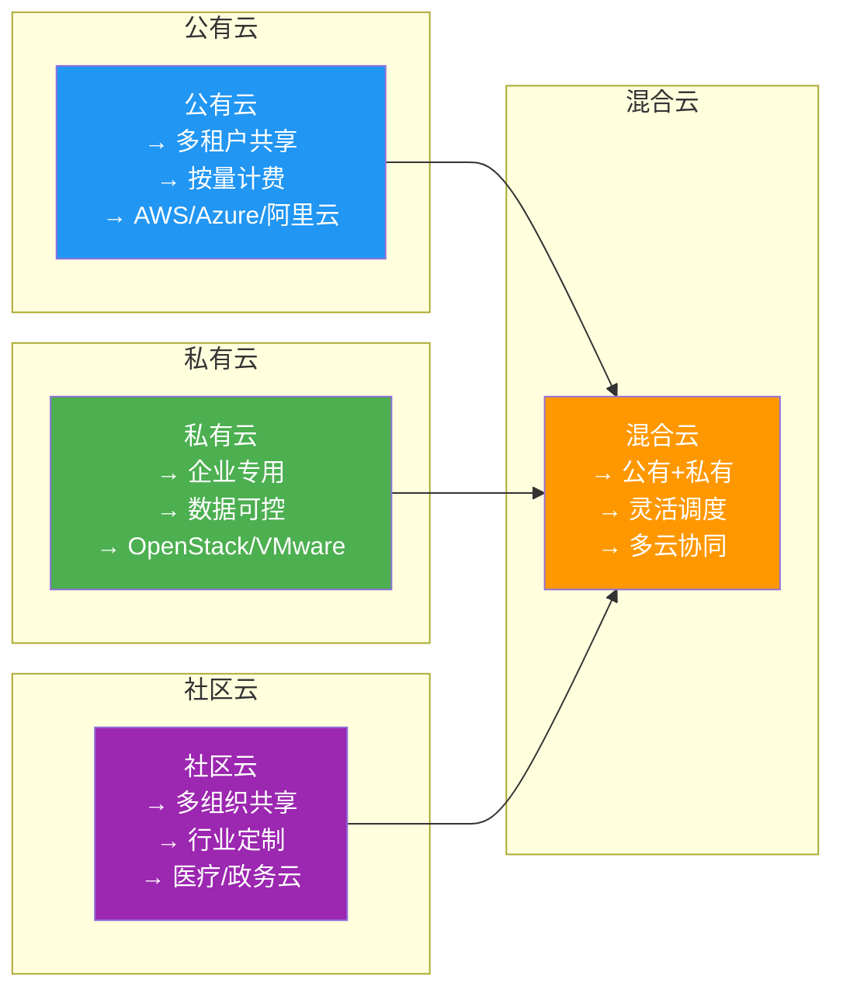
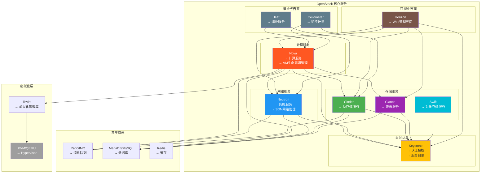
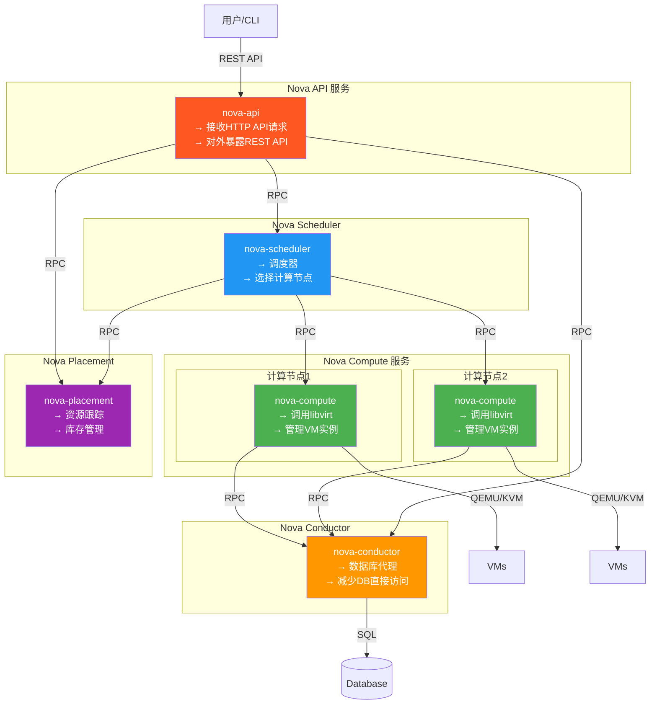
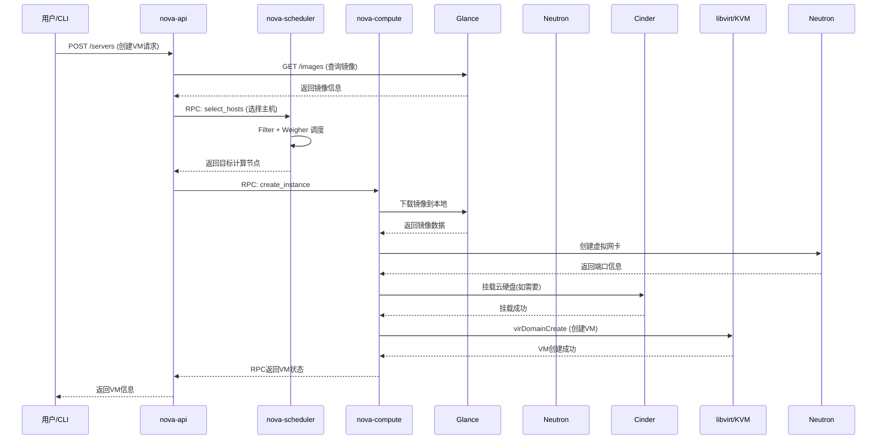
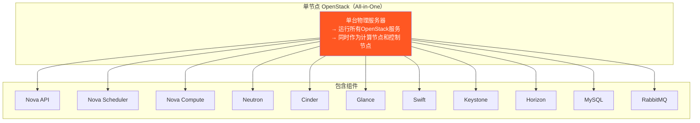
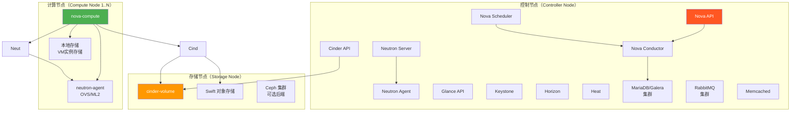
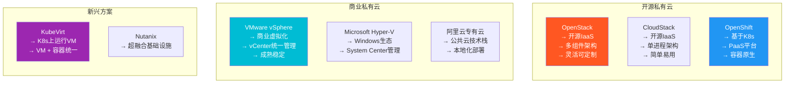

# 4.1 云架构设计与 OpenStack

> [!abstract] 本节导读
> 本节从云架构的分层设计出发，系统介绍 IaaS、PaaS、SaaS 三层架构的定位与协作关系，深入剖析 OpenStack 云操作系统的核心组件架构、工作机制与部署模式，最后对比 OpenStack 与其他私有云解决方案的差异，帮助读者建立云平台架构设计的整体认知。

## 一、云架构分层设计

### SPI 三层架构

云计算架构遵循 SPI（SaaS-PaaS-IaaS）分层模型，自底向上逐层抽象：

### 各层对比

| 维度 | IaaS | PaaS | SaaS |
|-----|------|------|------|
| **抽象层级** | 基础设施 | 开发运行平台 | 应用服务 |
| **用户掌控** | OS 及以上全部 | 应用及配置 | 仅使用 |
| **维护责任** | 用户管理 OS、中间件 | 用户管理应用 | 供应商全权管理 |
| **灵活性** | 最高 | 中等 | 最低 |
| **典型产品** | AWS EC2、阿里云 ECS | AWS Elastic Beanstalk、阿里云 RDS | AWS WorkMail、钉钉 |
| **计费模式** | 按实例/小时 | 按资源使用量 | 按用户/订阅 |

### 部署架构模式

## 二、OpenStack 架构概述

### OpenStack 是什么

> [!definition] OpenStack
> OpenStack 是一个开源云计算平台，提供 IaaS 层的计算、存储、网络等基础设施服务。它由多个相互独立的服务组件组成，通过 API 进行通信，支持 KVM、QEMU、VMware 等多种虚拟化后端。

### 核心组件架构

### 核心组件详解

| 组件 | 全称 | 职责描述 |
|-----|------|---------|
| **Nova** | Compute | 计算服务，管理虚拟机的创建、调度、启停、迁移等全生命周期 |
| **Neutron** | Networking | 网络服务，提供虚拟网络、子网、路由、安全组、负载均衡等功能 |
| **Cinder** | Block Storage | 块存储服务，为虚拟机提供可挂载的云硬盘 |
| **Glance** | Image Service | 镜像服务，管理 VM 镜像的上传、存储、注册和分发 |
| **Swift** | Object Storage | 对象存储服务，提供大规模、可扩展的对象存储 |
| **Keystone** | Identity Service | 身份认证与授权，管理用户、角色、租户和服务目录 |
| **Horizon** | Dashboard | Web 可视化管理界面，提供图形化操作入口 |
| **Heat** | Orchestration | 编排服务，支持模板化的云资源自动化部署（类似 AWS CloudFormation） |
| **Ceilometer** | Telemetry | 监控与计量服务，采集资源使用数据，支持计费和告警 |

### Nova 子组件架构

### 创建虚拟机流程

## 三、OpenStack 部署架构

### 单节点部署

| 特点 | 说明 |
|-----|------|
| **优点** | 部署简单、资源需求低、快速验证 |
| **缺点** | 无高可用、性能受限、无法生产使用 |
| **适用场景** | 学习、测试、POC 验证 |

### 多节点部署

| 特点 | 说明 |
|-----|------|
| **优点** | 高可用、性能可扩展、生产就绪 |
| **缺点** | 部署复杂、资源需求高 |
| **适用场景** | 企业生产环境、多租户云平台 |

### 部署工具

| 工具 | 特点 |
|-----|------|
| **DevStack** | 开发测试，快速部署单节点 |
| **Packstack** | 基于 Puppet 的快速部署 |
| **TripleO** | 基于 Heat 的完整部署方案 |
| **Kolla-ansible** | 容器化 OpenStack 部署 |
| **MicroStack** | Canonical 的轻量级方案 |

## 四、OpenStack 与其他私有云方案对比

### 主流私有云方案

### 对比表

| 维度 | OpenStack | CloudStack | VMware vSphere | OpenShift |
|-----|-----------|------------|----------------|-----------|
| **类型** | IaaS | IaaS | 商业IaaS | PaaS |
| **架构** | 多组件RPC | 单体Java | 单体C++ | K8s微服务 |
| **虚拟化后端** | KVM/QEMU等 | KVM/VMware | ESXi | KVM/KubeVirt |
| **API** | RESTful | RESTful | vCenter API | Kubernetes API |
| **网络** | Neutron SDN | 内置SDN | NSX | OpenShift SDN |
| **对象存储** | Swift | 内置 | - | - |
| **社区活跃度** | ⭐⭐⭐⭐⭐ | ⭐⭐⭐ | N/A | ⭐⭐⭐⭐ |
| **学习曲线** | 陡峭 | 中等 | 平缓 | 陡峭 |
| **适用规模** | 大中 | 中小 | 大中 | 大中 |
| **典型用户** | 运营商/大型企业 | 中小企业 | 中小企业 | 开发者/DevOps |

## 五、小结

> [!summary] 本节要点回顾
> 1. **云架构分层**：IaaS→PaaS→SaaS 三层模型，逐层抽象，各有定位
> 2. **OpenStack 核心组件**：Nova(计算)、Neutron(网络)、Cinder(块存储)、Glance(镜像)、Swift(对象存储)、Keystone(认证)、Horizon(界面)
> 3. **Nova 架构**：API→Scheduler→Compute→Conductor 的多层 RPC 架构
> 4. **部署模式**：单节点 All-in-One 适合测试，多节点适合生产
> 5. **私有云对比**：OpenStack 最灵活，VMware 最成熟，OpenShift 面向容器

## 关联知识点

| 关联知识点 | 关系 |
|-----------|------|
| [[4.2 资源虚拟化与调度算法]] | OpenStack 调度器详细解析 |
| [[4.3 云资源自动化管理]] | OpenStack IaC 编排 |
| [[5.1 云存储体系架构]] | OpenStack Cinder/Swift 存储详解 |
| [[第10章 主流云平台与云原生技术]] | OpenShift 与 OpenStack 对比 |