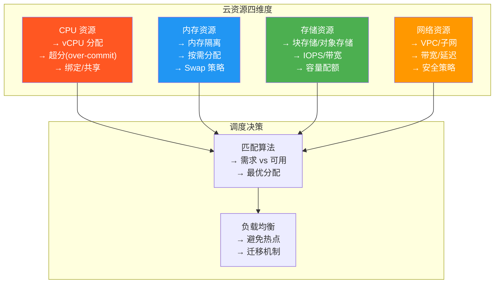
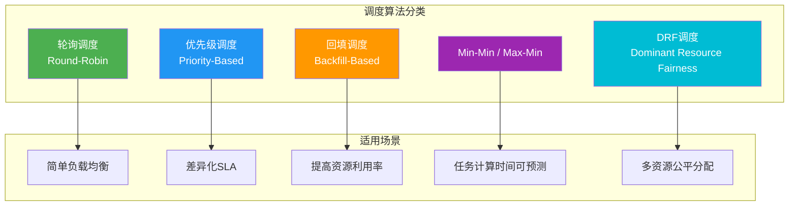
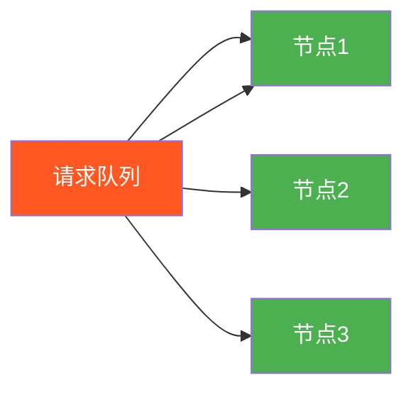
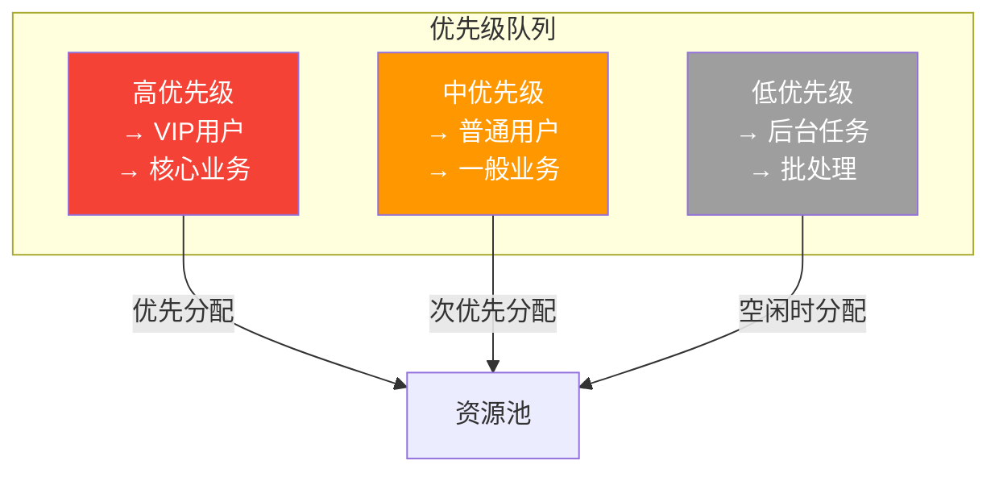
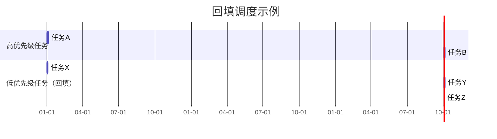
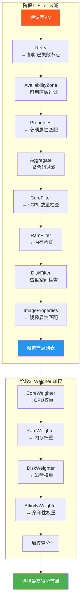
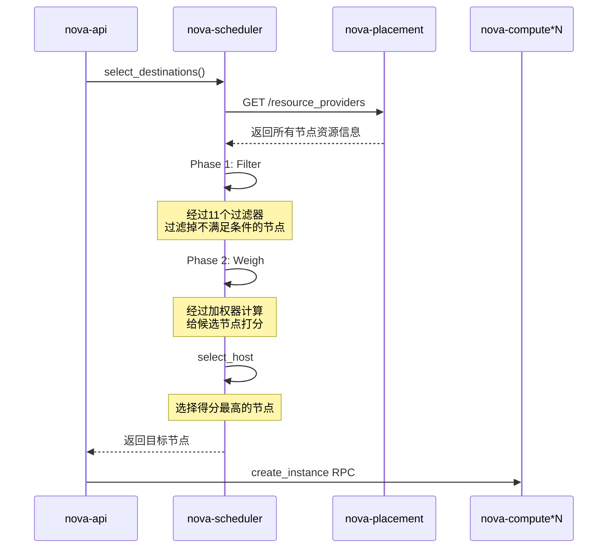
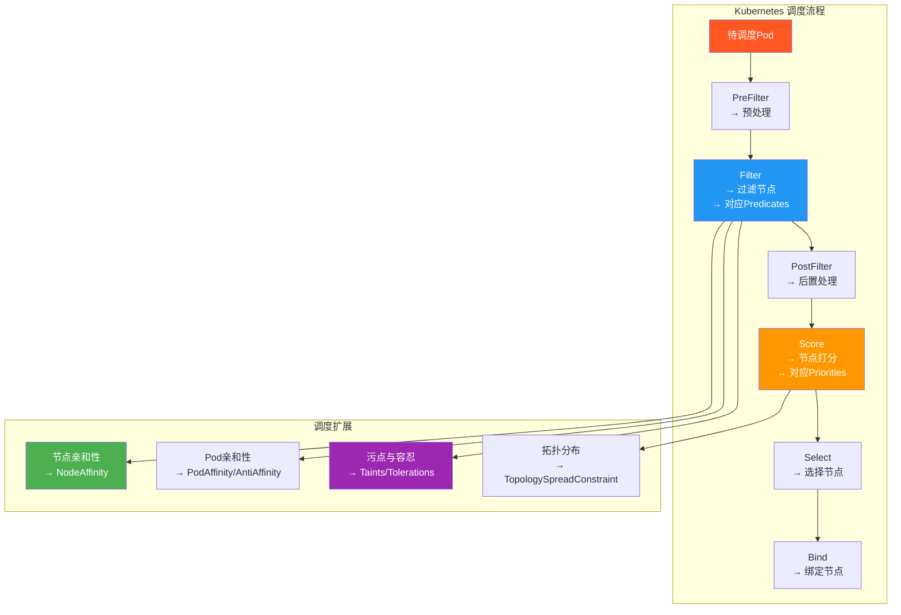
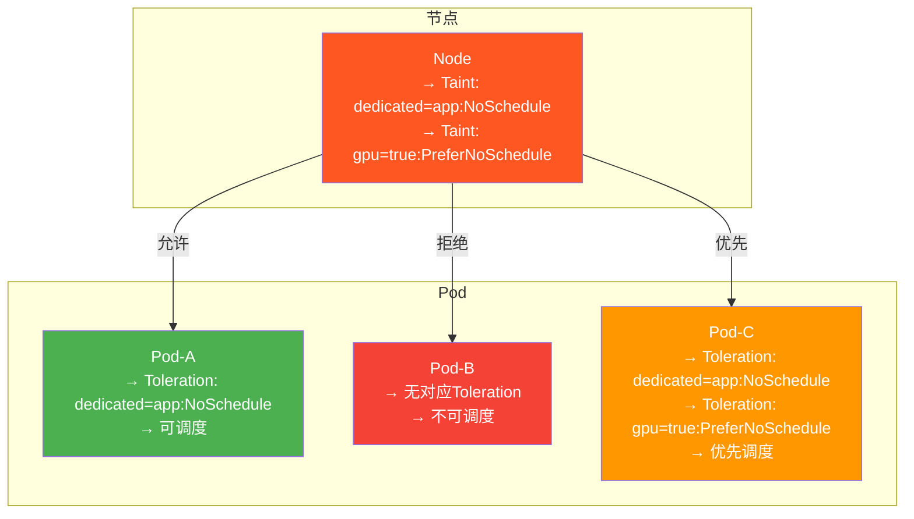

# 4.2 资源虚拟化与调度算法

> [!abstract] 本节导读
> 资源调度是云平台的核心能力。本节从 CPU、内存、存储、网络四类核心资源的分配原理出发，讲解轮询、优先级、回填等经典调度算法，深入剖析 OpenStack 的 Filter+Weigher 两阶段调度模型与 Kubernetes 的 Predicate+Priority 调度器，最后讨论节点亲和性、污点容忍等高级调度特性。

## 一、云资源分配基础

### 四类核心资源



### 资源分配关键概念

| 概念 | 说明 | 示例 |
|-----|------|------|
| **超分（Over-commit）** | 虚拟资源总量超过物理资源 | 16核物理CPU分配32个vCPU（超分比2:1） |
| **亲和性（Affinity）** | 指定实例的部署位置关系 | Web和DB部署在不同物理节点 |
| **反亲和性（Anti-Affinity）** | 实例分散部署 | 高可用集群的副本分散 |
| **配额（Quota）** | 用户/租户的资源使用上限 | 每租户最多可创建100个VM |
| **预留（Reservation）** | 预留部分物理资源不超分 | 预留20%内存用于突发需求 |

## 二、经典调度算法

### 调度算法对比



### 轮询调度（Round-Robin）

> [!definition] 轮询调度
> 依次将请求分配到可用资源，确保每个资源获得大致均等的请求量。适合资源同质、请求同质的场景。



**优点**：简单公平，易实现
**缺点**：不考虑资源差异，可能导致热点

### 优先级调度（Priority-Based）

> [!definition] 优先级调度
> 按任务优先级排序，高优先级任务优先分配资源。适合有明确SLA等级的场景。



### 回填调度（Backfill-Based）

> [!definition] 回填调度
> 在不影响高优先级任务预期启动时间的前提下，允许低优先级任务"回填"到资源空闲时段执行，最大化资源利用率。



### DRF 调度（Dominant Resource Fairness）

DRF 是面向多资源（CPU、内存、存储等）的公平调度算法，核心思想是用户应获得与其需求主导资源成比例的资源份额。

**DRF 分配示例**：

| 用户 | CPU需求 | 内存需求 | 主导资源 | 分配比例 |
|-----|---------|---------|---------|---------|
| 用户A | 2核 | 4GB | 内存 (4GB/总16GB=25%) | 25% |
| 用户B | 4核 | 2GB | CPU (4核/总16核=25%) | 25% |
| 用户C | 1核 | 8GB | 内存 (8GB/总16GB=50%) | 50% |

## 三、OpenStack 调度器

### Filter + Weigher 两阶段调度



### 常用 Filter 过滤器

| 过滤器 | 作用 |
|-------|------|
| **CoreFilter** | 检查节点可用 vCPU 数量是否满足需求 |
| **RamFilter** | 检查节点可用内存是否满足需求 |
| **DiskFilter** | 检查节点可用磁盘空间是否满足需求 |
| **AggregateFilter** | 检查节点是否在指定聚合组内 |
| **AvailabilityZoneFilter** | 检查节点是否在指定可用域 |
| **ImagePropertiesFilter** | 检查镜像属性是否匹配节点能力 |
| **ComputeCapabilitiesFilter** | 检查节点计算能力 |
| **NUMATopologyFilter** | 检查 NUMA 拓扑匹配 |
| **PciPassthroughFilter** | 检查 PCI 直通设备可用 |
| **ServerGroupAntiAffinityFilter** | 反亲和性检查（不同节点） |
| **ServerGroupAffinityFilter** | 亲和性检查（相同节点） |

### 常用 Weigher 加权器

| 加权器 | 作用 |
|-------|------|
| **CoreWeighter** | 按剩余 vCPU 数加权 |
| **RamWeighter** | 按剩余内存加权 |
| **DiskWeighter** | 按剩余磁盘加权 |
| **AffinityWeighter** | 按亲和性打分 |
| **IoOpsWeighter** | 按 I/O 负载加权 |

### 调度流程示例



## 四、Kubernetes 调度器

### Kubernetes 调度架构



### Predicate（过滤器）与 Priority（打分器）

#### 核心 Predicate（过滤器）

| Predicate | 作用 |
|-----------|------|
| **NodeResourcesFit** | 检查节点 CPU/内存是否满足 Pod 需求 |
| **NodeName** | 指定节点名调度 |
| **NodeAffinity** | 节点标签亲和性匹配 |
| **TaintNode** | 检查 Pod 是否容忍节点污点 |
| **PodAffinity** | Pod 间亲和/反亲和 |
| **VolumeBinding** | 检查卷绑定 |
| **VolumeZone** | 检查卷可用区 |
| **MaxCSIVolumeCount** | 检查 CSI 卷数量限制 |
| **NodeUnschedulable** | 跳过不可调度节点 |
| **NodeSelector** | 基于标签的节点选择 |

#### 核心 Priority（打分器）

| Priority | 作用 |
|----------|------|
| **LeastAllocated** | 优先调度到资源最少的节点（平衡） |
| **MostAllocated** | 优先调度到资源最多的节点（打包） |
| **ImageLocality** | 优先调度到已有镜像的节点 |
| **NodeAffinity** | 节点亲和性打分 |
| **InterPodAffinity** | Pod 间亲和打分 |
| **NodeResourcesBalancedAllocation** | 资源平衡分配打分 |
| **NodeResourcesFit** | 剩余资源量打分 |
| **PodSpread** | Pod 分散度打分 |

### 节点亲和性（Node Affinity）

```yaml
# 节点亲和性示例：将Pod调度到带特定标签的节点
apiVersion: v1
kind: Pod
metadata:
  name: nginx-affinity
spec:
  affinity:
    nodeAffinity:
      requiredDuringSchedulingIgnoredDuringExecution:
        nodeSelectorTerms:
        - matchExpressions:
          - key: kubernetes.io/hostname
            operator: In
            values:
            - node-1
            - node-2
      preferredDuringSchedulingIgnoredDuringExecution:
      - weight: 80
        preference:
          matchExpressions:
          - key: disk-type
            operator: In
            values:
            - ssd
  containers:
  - name: nginx
    image: nginx
```

### 污点与容忍（Taints & Tolerations）



**污点效果类型**：

| 效果 | 说明 |
|-----|------|
| **NoSchedule** | Pod 不会被调度到该节点（硬性拒绝） |
| **PreferNoSchedule** | 调度器尽量避免（软性偏好） |
| **NoExecute** | Pod 不仅不会调度，已在运行的也会被驱逐 |

### OpenStack vs Kubernetes 调度器对比

| 维度 | OpenStack Scheduler | Kubernetes Scheduler |
|-----|---------------------|----------------------|
| **调度模型** | Filter + Weigher | Filter + Score |
| **扩展机制** | 插件式 Filter/Weigher | 框架式 Scheduler Framework |
| **资源维度** | vCPU、内存、磁盘 | CPU、Memory、GPU、Ephemeral-Storage |
| **亲和性** | Aggregate + ServerGroup | NodeAffinity + PodAffinity |
| **污点机制** | 无 | Taints/Tolerations |
| **目标对象** | 虚拟机实例 | Pod |
| **调度周期** | 毫秒级 | 秒级 |
| **存储关联** | Cinder 块存储直接挂载 | PV/PVC 间接关联 |

## 五、小结

> [!summary] 本节要点回顾
> 1. **资源四维度**：CPU、内存、存储、网络是云资源调度的核心
> 2. **经典算法**：轮询、优先级、回填、DRF 各有适用场景
> 3. **OpenStack 调度**：Filter（过滤）+ Weigher（加权）两阶段模型
> 4. **K8s 调度**：Filter + Score 两阶段，支持节点亲和性、污点容忍等
> 5. **K8s 高级特性**：NodeAffinity、Taints/Tolerations、TopologySpread 等

## 关联知识点

| 关联知识点 | 关系 |
|-----------|------|
| [[4.1 云架构设计与OpenStack]] | OpenStack 调度器的架构背景 |
| [[4.3 云资源自动化管理]] | 调度器的自动化编排 |
| [[第3章 容器与Docker技术]] | Kubernetes 调度的容器基础 |
| [[第10章 主流云平台与云原生技术]] | Kubernetes 编排与调度进阶 |