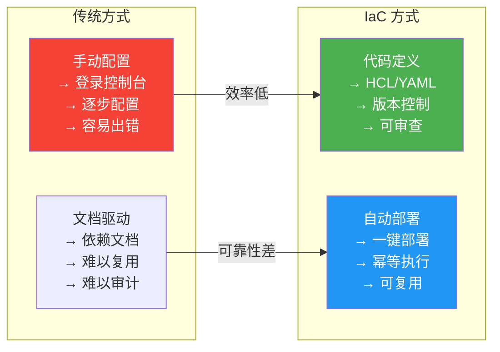
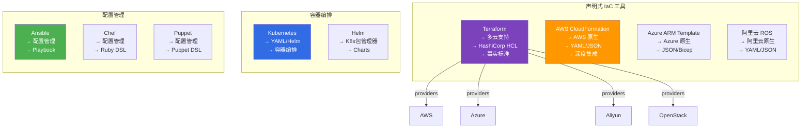
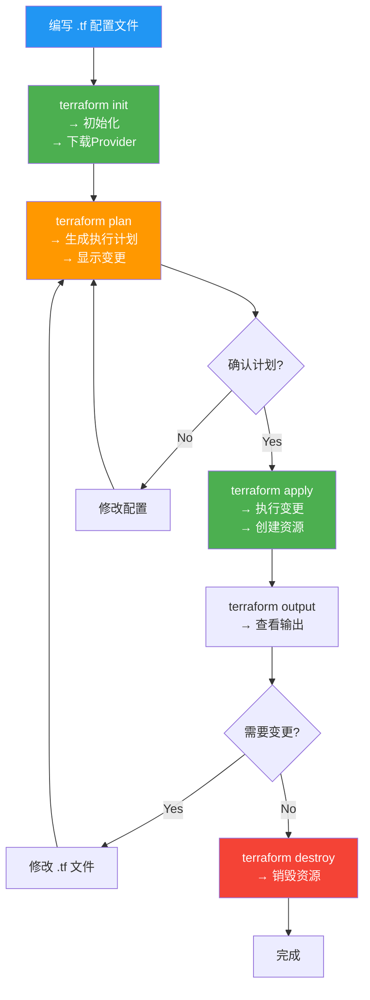
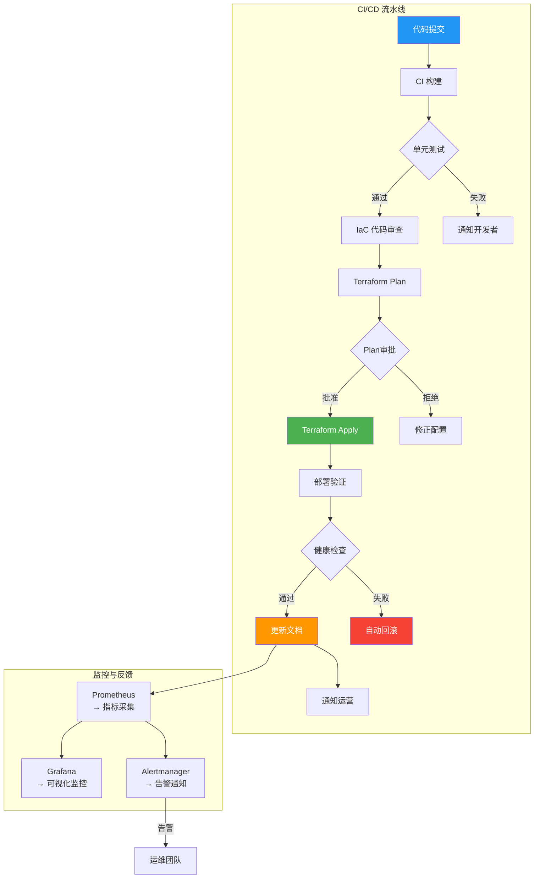
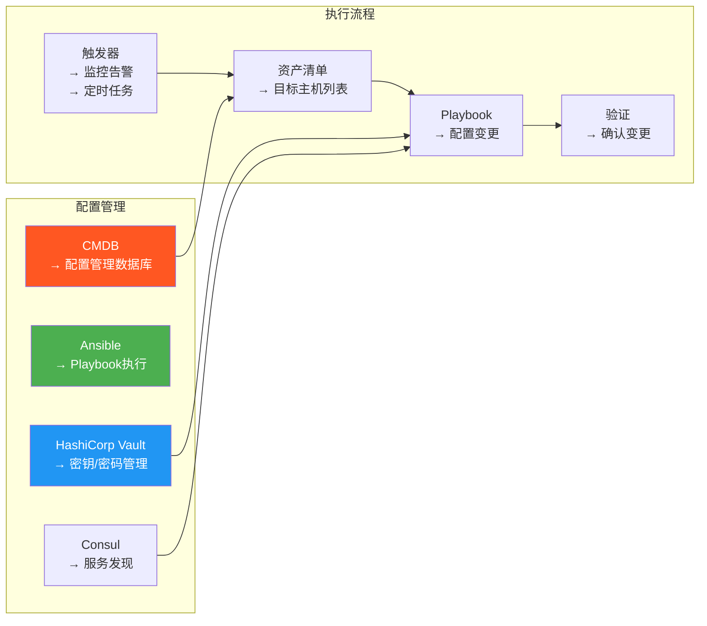

# 4.3 云资源自动化管理

> [!abstract] 本节导读
> 基础设施即代码（IaC）是云原生时代的核心实践。本节系统介绍 IaC 的概念与主流工具（Terraform、CloudFormation），讲解基于模板的自动化部署流程，演示 Python SDK（boto3、openstacksdk）进行云资源管理的代码示例，最后介绍从需求到部署的完整自动化工作流。

## 一、IaC（Infrastructure as Code）

### IaC 概念与价值

> [!definition] 基础设施即代码（IaC）
> 使用代码（声明式或命令式）来定义和管理基础设施，实现基础设施的版本控制、自动化部署和可重复执行。



### IaC 工具生态



### Terraform 核心概念

| 概念 | 说明 |
|-----|------|
| **Provider** | 云提供商插件（AWS、Azure、OpenStack 等） |
| **Resource** | 基础设施资源（EC2、VPC、S3 等） |
| **Data Source** | 查询现有资源的数据源 |
| **Variable** | 输入参数，支持多环境配置 |
| **Output** | 输出值，跨模块引用 |
| **Module** | 可复用的资源集合 |
| **State** | Terraform 状态文件，记录已创建资源 |
| **Plan** | 执行计划，显示将要执行的变更 |

### Terraform 工作流



### 示例：Terraform 创建 Web 服务器集群

```hcl
# main.tf - AWS Web 服务器集群

terraform {
  required_version = ">= 1.0"

  required_providers {
    aws = {
      source  = "hashicorp/aws"
      version = "~> 5.0"
    }
  }

  backend "s3" {
    bucket = "terraform-state-bucket"
    key    = "web-cluster/terraform.tfstate"
    region = "us-east-1"
  }
}

provider "aws" {
  region = var.region
}

# ---- 变量定义 ----
variable "region" {
  description = "AWS 区域"
  type        = string
  default     = "us-east-1"
}

variable "instance_count" {
  description = "实例数量"
  type        = number
  default     = 3
}

variable "instance_type" {
  description = "实例类型"
  type        = string
  default     = "t3.micro"
}

# ---- VPC 与网络 ----
resource "aws_vpc" "main" {
  cidr_block           = "10.0.0.0/16"
  enable_dns_support   = true

  tags = {
    Name        = "web-vpc"
    Environment = var.environment
  }
}

resource "aws_subnet" "public" {
  count                   = 2
  vpc_id                  = aws_vpc.main.id
  cidr_block              = "10.0.${count.index + 1}.0/24"
  availability_zone       = "${var.region}${count.index == 0 ? "a" : "b"}"
  map_public_ip_on_launch = true

  tags = {
    Name = "public-subnet-${count.index}"
  }
}

resource "aws_internet_gateway" "main" {
  vpc_id = aws_vpc.main.id
}

resource "aws_route_table" "public" {
  vpc_id = aws_vpc.main.id

  route {
    cidr_block = "0.0.0.0/0"
    gateway_id = aws_internet_gateway.main.id
  }
}

# ---- 安全组 ----
resource "aws_security_group" "web" {
  name        = "web-sg"
  description = "Web server security group"
  vpc_id      = aws_vpc.main.id

  ingress {
    from_port   = 80
    to_port     = 80
    protocol    = "tcp"
    cidr_blocks = ["0.0.0.0/0"]
  }

  ingress {
    from_port   = 22
    to_port     = 22
    protocol    = "tcp"
    cidr_blocks = ["10.0.0.0/16"]
  }

  egress {
    from_port   = 0
    to_port     = 0
    protocol    = "-1"
    cidr_blocks = ["0.0.0.0/0"]
  }

  tags = {
    Name = "web-sg"
  }
}

# ---- EC2 实例 ----
resource "aws_instance" "web" {
  count                  = var.instance_count
  ami                    = "ami-0c55b159cbfafe1f0"
  instance_type          = var.instance_type
  subnet_id              = aws_subnet.public[count.index].id
  vpc_security_group_ids = [aws_security_group.web.id]
  key_name               = var.key_pair_name

  user_data = <<-EOF
    #!/bin/bash
    yum update -y
    yum install -y httpd
    systemctl start httpd
    systemctl enable httpd
    echo "<h1>Web Server ${count.index}</h1>" > /var/www/html/index.html
  EOF

  tags = {
    Name = "web-instance-${count.index}"
  }
}

# ---- 输出 ----
output "vpc_id" {
  value       = aws_vpc.main.id
  description = "VPC ID"
}

output "instance_public_ips" {
  value       = aws_instance.web[*].public_ip
  description = "Web 实例公网 IP"
}

output "web_sg_id" {
  value       = aws_security_group.web.id
  description = "Web 安全组 ID"
}
```

### CloudFormation 示例对比

```yaml
# cloudformation.yaml - 等价的 CloudFormation 模板
AWSTemplateFormatVersion: "2010-09-09"
Description: Web Server Cluster

Parameters:
  InstanceCount:
    Type: Number
    Default: 3
  InstanceType:
    Type: String
    Default: t3.micro

Resources:
  VPC:
    Type: AWS::EC2::VPC
    Properties:
      CidrBlock: 10.0.0.0/16
      EnableDnsSupport: true

  Subnet1:
    Type: AWS::EC2::Subnet
    Properties:
      VpcId: !Ref VPC
      CidrBlock: 10.0.1.0/24
      AvailabilityZone: !Select [0, !GetAZs ""]

  WebSecurityGroup:
    Type: AWS::EC2::SecurityGroup
    Properties:
      GroupDescription: Web Server SG
      VpcId: !Ref VPC
      SecurityGroupIngress:
        - IpProtocol: tcp
          FromPort: 80
          ToPort: 80
          CidrIp: 0.0.0.0/0

Outputs:
  VpcId:
    Value: !Ref VPC
```

## 二、模板化部署

### Heat 模板（OpenStack 编排）

```yaml
# heat-template.yaml - OpenStack Heat 编排模板
heat_template_version: 2018-08-27

description: Simple Web Server Stack

parameters:
  image:
    type: string
    default: cirros
  flavor:
    type: string
    default: m1.small
  network:
    type: string

resources:
  web_server_sg:
    type: OS::Neutron::SecurityGroup
    properties:
      name: web-sg
      rules:
        - protocol: tcp
          port_range_min: 80
          port_range_max: 80
          remote_ip_prefix: 0.0.0.0/0
        - protocol: tcp
          port_range_min: 22
          port_range_max: 22
          remote_ip_prefix: 10.0.0.0/16

  web_server:
    type: OS::Nova::Server
    properties:
      name: web-server
      image: !Ref image
      flavor: !Ref flavor
      networks:
        - network: !Ref network
      security_groups:
        - !Ref web_server_sg
      user_data: |
        #!/bin/bash
        apt-get update && apt-get install -y nginx
        systemctl start nginx

outputs:
  server_ip:
    value: !get_attr [web_server, first_address]
    description: Web server IP
```

## 三、Python SDK 云资源管理

### AWS boto3 示例

```python
import boto3
from botocore.exceptions import ClientError

ec2_client = boto3.client('ec2', region_name='us-east-1')
s3_client = boto3.client('s3')

def create_ec2_instance(image_id, instance_type, count=1):
    try:
        response = ec2_client.run_instances(
            ImageId=image_id,
            InstanceType=instance_type,
            MinCount=count,
            MaxCount=count,
            TagSpecifications=[{
                'ResourceType': 'instance',
                'Tags': [{'Key': 'Name', 'Value': 'my-instance'}]
            }]
        )
        instance_id = response['Instances'][0]['InstanceId']
        print(f"Instance created: {instance_id}")
        return instance_id
    except ClientError as e:
        print(f"Error: {e}")
        return None

def list_running_instances():
    response = ec2_client.describe_instances(
        Filters=[{'Name': 'instance-state-name', 'Values': ['running']}]
    )
    instances = []
    for reservation in response['Reservations']:
        for instance in reservation['Instances']:
            instances.append({
                'InstanceId': instance['InstanceId'],
                'PublicIp': instance.get('PublicIp', 'N/A'),
                'State': instance['State']['Name']
            })
    return instances

def stop_instance(instance_id):
    try:
        ec2_client.stop_instances(InstanceIds=[instance_id])
        print(f"Stopping instance: {instance_id}")
    except ClientError as e:
        print(f"Error: {e}")

def create_s3_bucket(bucket_name, region='us-east-1'):
    try:
        if region == 'us-east-1':
            s3_client.create_bucket(Bucket=bucket_name)
        else:
            s3_client.create_bucket(
                Bucket=bucket_name,
                CreateBucketConfiguration={'LocationConstraint': region}
            )
        print(f"Bucket created: {bucket_name}")
    except ClientError as e:
        print(f"Error: {e}")

def upload_file_to_s3(file_path, bucket_name, key):
    try:
        s3_client.upload_file(file_path, bucket_name, key)
        print(f"Uploaded {file_path} -> s3://{bucket_name}/{key}")
    except ClientError as e:
        print(f"Error: {e}")

def list_s3_objects(bucket_name, prefix=''):
    response = s3_client.list_objects_v2(Bucket=bucket_name, Prefix=prefix)
    objects = []
    if 'Contents' in response:
        for obj in response['Contents']:
            objects.append({
                'Key': obj['Key'],
                'Size': obj['Size'],
                'LastModified': str(obj['LastModified'])
            })
    return objects

if __name__ == '__main__':
    instance_id = create_ec2_instance('ami-0c55b159cbfafe1f0', 't3.micro')
    running = list_running_instances()
    print(f"Running instances: {len(running)}")
    bucket = create_s3_bucket('my-test-bucket-12345')
```

### OpenStack SDK 示例

```python
import openstack

conn = openstack.connect(cloud='openstack')

def create_server(name, image_name, flavor_name, network_name):
    image = conn.compute.find_image(image_name)
    flavor = conn.compute.find_flavor(flavor_name)
    network = conn.network.find_network(network_name)

    server = conn.compute.create_server(
        name=name,
        image_id=image.id,
        flavor_id=flavor.id,
        networks=[{"uuid": network.id}]
    )
    server = conn.compute.wait_for_server(server, status='ACTIVE')
    print(f"Server created: {server.id}, IP: {server.public_v4_ip}")
    return server

def list_servers():
    servers = conn.compute.servers()
    for server in servers:
        print(f"Server: {server.name}, Status: {server.status}")

def create_network(name, cidr):
    network = conn.network.create_network(name=name)
    subnet = conn.network.create_subnet(
        name=f"{name}-subnet",
        network_id=network.id,
        ip_version=4,
        cidr=cidr
    )
    print(f"Network created: {network.id}")
    return network

def create_security_group(name, description=''):
    sg = conn.network.create_security_group(name=name, description=description)
    conn.network.create_security_group_rule(
        security_group_id=sg.id,
        direction='ingress',
        protocol='tcp',
        port_range_min=80,
        port_range_max=80,
        remote_ip_prefix='0.0.0.0/0'
    )
    print(f"Security group created: {sg.id}")
    return sg

if __name__ == '__main__':
    network = create_network('my-network', '10.0.0.0/24')
    sg = create_security_group('web-sg', 'Web security group')
    server = create_server('my-vm', 'cirros', 'm1.small', 'public')
    list_servers()
```

## 四、自动化工作流

### 完整自动化部署流水线



### 自动化扩缩容

```python
import boto3
from datetime import datetime

autoscaling = boto3.client('autoscaling')
cloudwatch = boto3.client('cloudwatch')

def create_auto_scaling_group():
    autoscaling.create_auto_scaling_group(
        AutoScalingGroupName='web-asg',
        LaunchTemplate={'LaunchTemplateId': 'lt-xxxxx', 'Version': '$Default'},
        MinSize=2,
        MaxSize=10,
        DesiredCapacity=3,
        AvailabilityZones=['us-east-1a', 'us-east-1b'],
        TargetGroupARNs=['arn:aws:elasticloadbalancing:...'],
        HealthCheckType='EC2',
        HealthCheckGracePeriod=300
    )

    autoscaling.put_scaling_policy(
        AutoScalingGroupName='web-asg',
        PolicyName='scale-up-cpu',
        PolicyType='TargetTrackingScaling',
        TargetTrackingScalingPolicyConfiguration={
            'TargetValue': 70.0,
            'PredefinedMetricSpecification': {
                'PredefinedMetricType': 'ASGAverageCPUUtilization'
            },
            'ScaleInCooldown': 300,
            'ScaleOutCooldown': 60
        }
    )

def get_auto_scaling_status():
    response = autoscaling.describe_auto_scaling_groups(
        AutoScalingGroupNames=['web-asg']
    )
    for asg in response['AutoScalingGroups']:
        print(f"ASG: {asg['AutoScalingGroupName']}")
        print(f"  Min: {asg['MinSize']}, Max: {asg['MaxSize']}, Desired: {asg['DesiredCapacity']}")
        print(f"  Instances: {len(asg['Instances'])}")

if __name__ == '__main__':
    create_auto_scaling_group()
    get_auto_scaling_status()
```

### 配置管理自动化



## 五、小结

> [!summary] 本节要点回顾
> 1. **IaC 价值**：代码化基础设施 → 可版本控制、可审查、可复用
> 2. **Terraform**：最主流的多云 IaC 工具，使用 HCL 语言定义资源
> 3. **CloudFormation**：AWS 原生 IaC，深度集成 AWS 服务
> 4. **Heat**：OpenStack 编排服务，模板化部署
> 5. **Python SDK**：boto3（AWS）和 openstacksdk（OpenStack）用于代码化资源管理
> 6. **自动化工作流**：CI/CD + IaC + 监控形成完整闭环
> 7. **自动扩缩容**：基于指标的弹性伸缩策略

## 关联知识点

| 关联知识点 | 关系 |
|-----------|------|
| [[4.1 云架构设计与OpenStack]] | OpenStack Heat 编排 |
| [[4.2 资源虚拟化与调度算法]] | 调度器的自动化配置 |
| [[第10章 主流云平台与云原生技术]] | Kubernetes + Terraform 集成 |
| [[第7章 云安全技术]] | IaC 安全与密钥管理 |