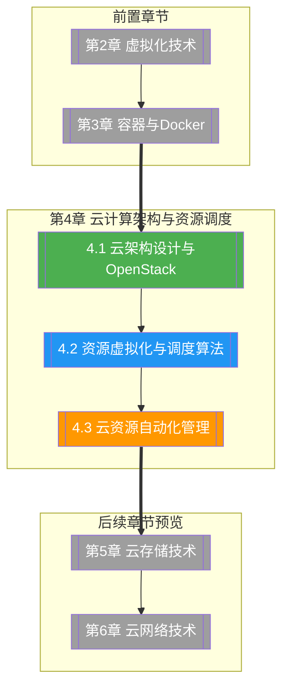

# 第4章 云计算架构与资源调度

> [!abstract] 章节概述
> 云架构是云计算系统的骨架，资源调度是云平台的大脑。本章从云架构分层设计切入，系统介绍 IaaS/PaaS/SaaS 各层架构与部署模式，深入剖析 OpenStack 的核心组件与架构设计，进而讨论资源分配原理与调度算法（含 Kubernetes 调度器），最后讲解基础设施即代码（IaC）与云资源自动化管理实践。

## 学习路线图

## 知识点导航

| 编号 | 知识点 | 核心内容 | 重要程度 |
|-----|--------|---------|---------|
| 4.1 | [[4.1 云架构设计与OpenStack]] | IaaS/PaaS/SaaS架构、OpenStack组件(Nova/Neutron/Cinder等)、部署架构、私有云对比 | ⭐⭐⭐⭐⭐ |
| 4.2 | [[4.2 资源虚拟化与调度算法]] | CPU/内存/存储/网络分配、轮询/优先级/回填算法、OpenStack/Kubernetes调度器 | ⭐⭐⭐⭐⭐ |
| 4.3 | [[4.3 云资源自动化管理]] | IaC(Terraform/CloudFormation)、模板部署、Python SDK、自动化工作流 | ⭐⭐⭐⭐ |

## 核心概念速览

> [!tip] 本章必须掌握的核心概念
> - **云架构分层**：IaaS（基础设施层）→ PaaS（平台层）→ SaaS（应用层），逐层抽象、逐层服务
> - **OpenStack**：开源云操作系统，由 Nova、Neutron、Cinder、Glance、Swift、Keystone、Horizon 等组件组成
> - **资源调度**：将虚拟资源（CPU/内存/存储/网络）按需分配给 workload 的过程
> - **Filter + Weigher 调度**：OpenStack 的两阶段调度模型，先过滤后加权
> - **Kubernetes 调度器**：基于 Predicate（过滤）和 Priority（打分）的调度机制，支持节点亲和性和污点容忍
> - **IaC（基础设施即代码）**：使用代码定义和管理基础设施，代表工具为 Terraform
> - **自动化工作流**：从模板定义到自动部署、监控、扩缩容的完整自动化流程

## 核心考点

> [!important] 期末高频考点

| 考点 | 所属知识点 | 考查形式 | 难度 |
|-----|-----------|---------|------|
| IaaS/PaaS/SaaS 三层架构与对比 | 4.1 | 简答题/对比题 | ★★★ |
| OpenStack 核心组件及其职责 | 4.1 | 简答题/选择题 | ★★★★ |
| OpenStack 单节点与多节点部署差异 | 4.1 | 简答题 | ★★★ |
| OpenStack vs CloudStack vs OpenShift | 4.1 | 对比题 | ★★★ |
| 轮询、优先级、回填调度算法 | 4.2 | 简答题/计算题 | ★★★ |
| OpenStack Filter + Weigher 调度流程 | 4.2 | 论述题 | ★★★★ |
| Kubernetes Predicate + Priority 调度 | 4.2 | 论述题 | ★★★★ |
| Kubernetes 污点/容忍与节点亲和性 | 4.2 | 简答题 | ★★★ |
| Terraform IaC 工作流（HCL 语言） | 4.3 | 编程题/案例分析 | ★★★★ |
| 云资源自动化管理流程 | 4.3 | 论述题/案例分析 | ★★★ |

## 自测题

> [!question] 章节自测
> 1. 请画出 IaaS/PaaS/SaaS 三层云架构的层次关系，说明每层提供的服务抽象和用户需要管理的内容。
> 2. 阐述 OpenStack 的 Nova、Neutron、Cinder、Glance、Keystone 五大核心组件的职责，并说明它们之间的交互关系。
> 3. 对比 OpenStack 的 Filter+Weigher 调度器与 Kubernetes 的 Predicate+Priority 调度器在设计理念和工作流程上的异同。
> 4. 使用 Terraform HCL 语言编写一个简单的云服务器（EC2）创建脚本，包含安全组配置和 SSH 密钥设置。
> 5. 某企业需要将传统手动运维的虚拟机部署方式迁移到自动化云平台，请设计一个从 IaC 模板定义到自动部署与监控的完整自动化工作流。

## 章节导航

| 方向 | 链接 |
|-----|------|
| ⬆ 返回课程总览 | [[MOC - 云计算技术]] |
| ⬅ 上一章 | [[第3章 容器与Docker技术/MOC - 第3章]] |
| ➡ 下一章 | [[第5章 云存储技术体系/MOC - 第5章]] |