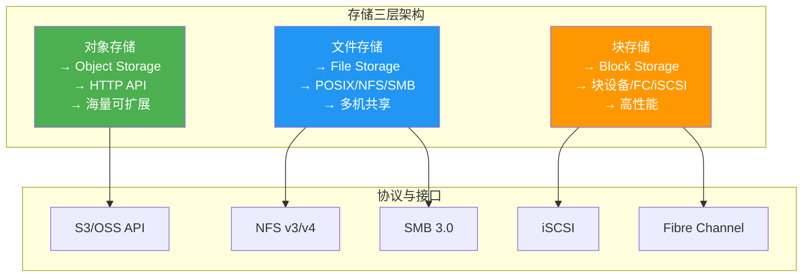
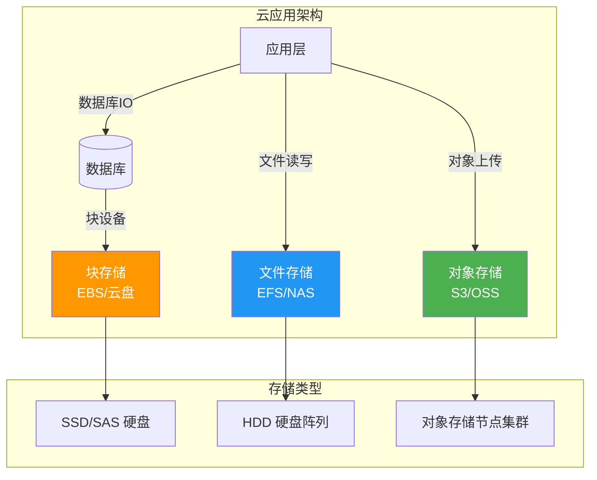
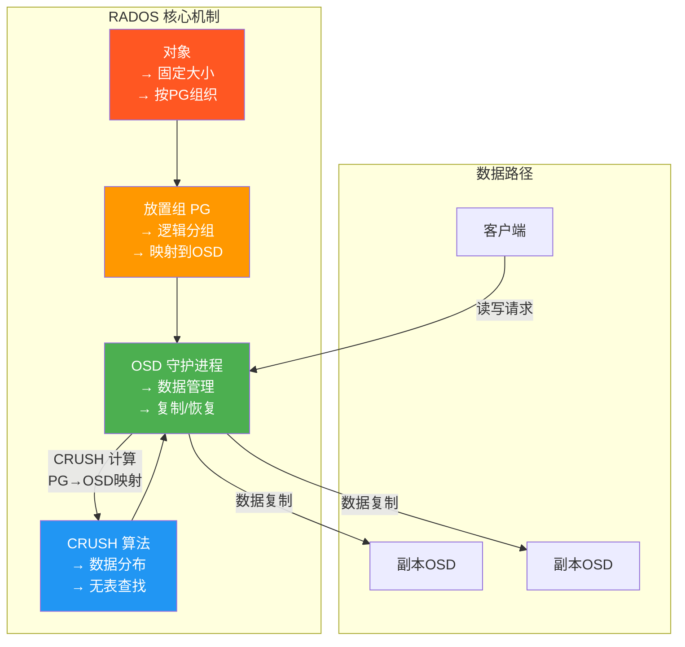
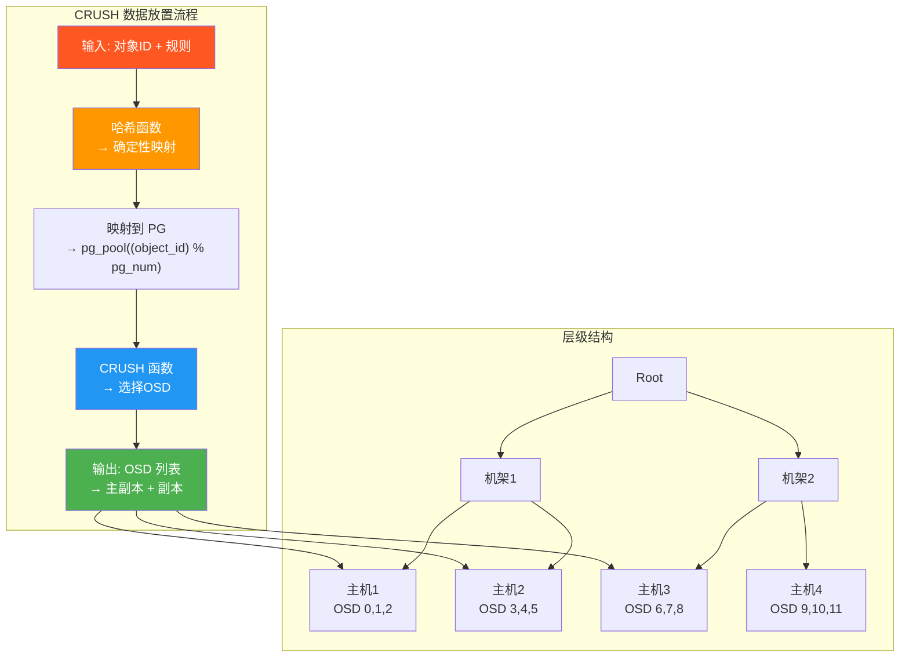
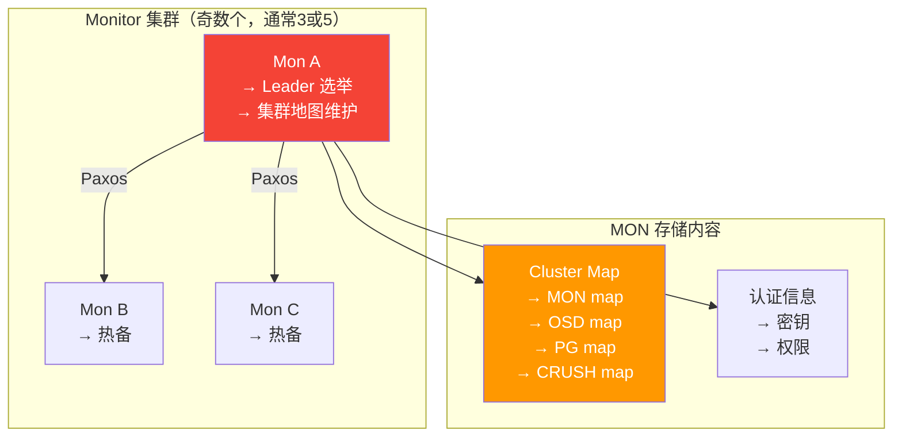
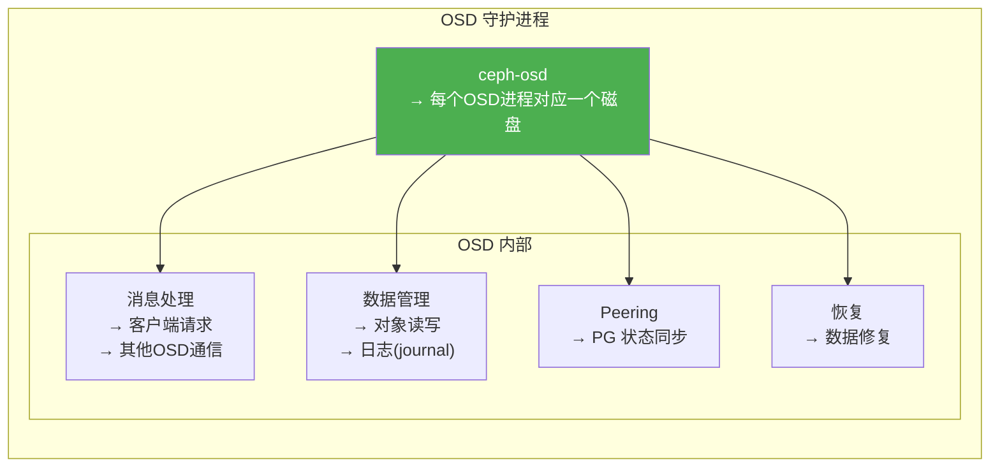
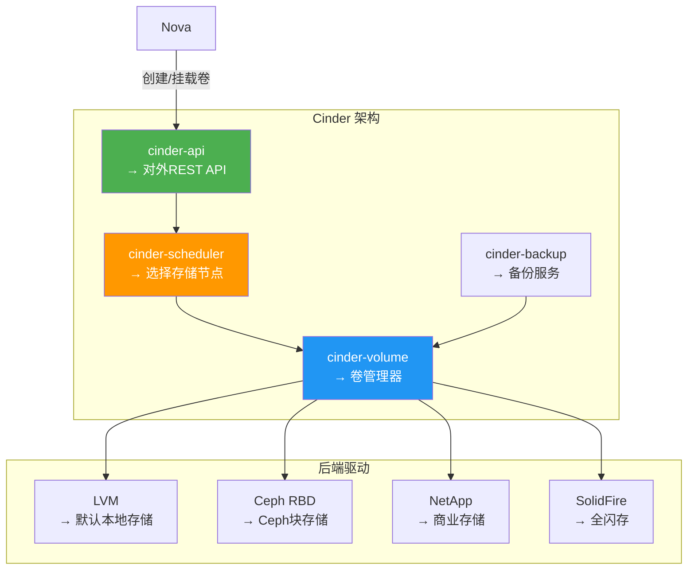
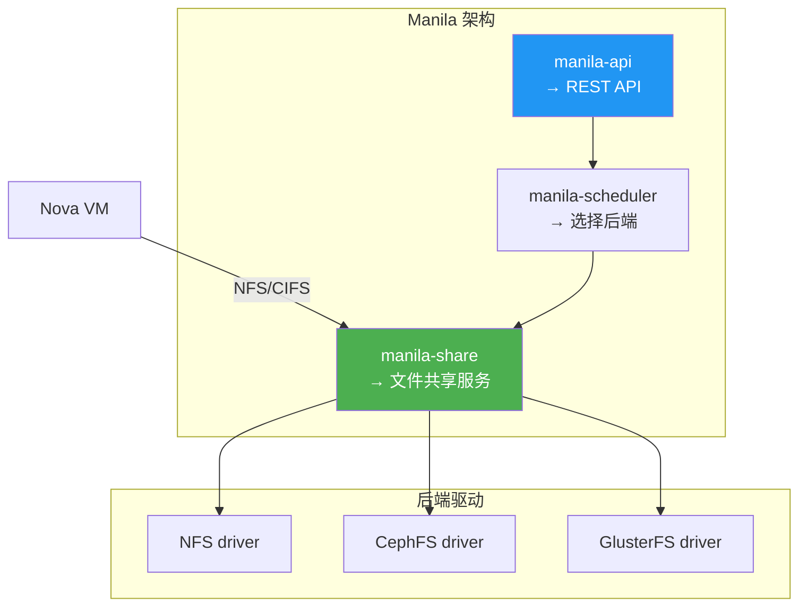
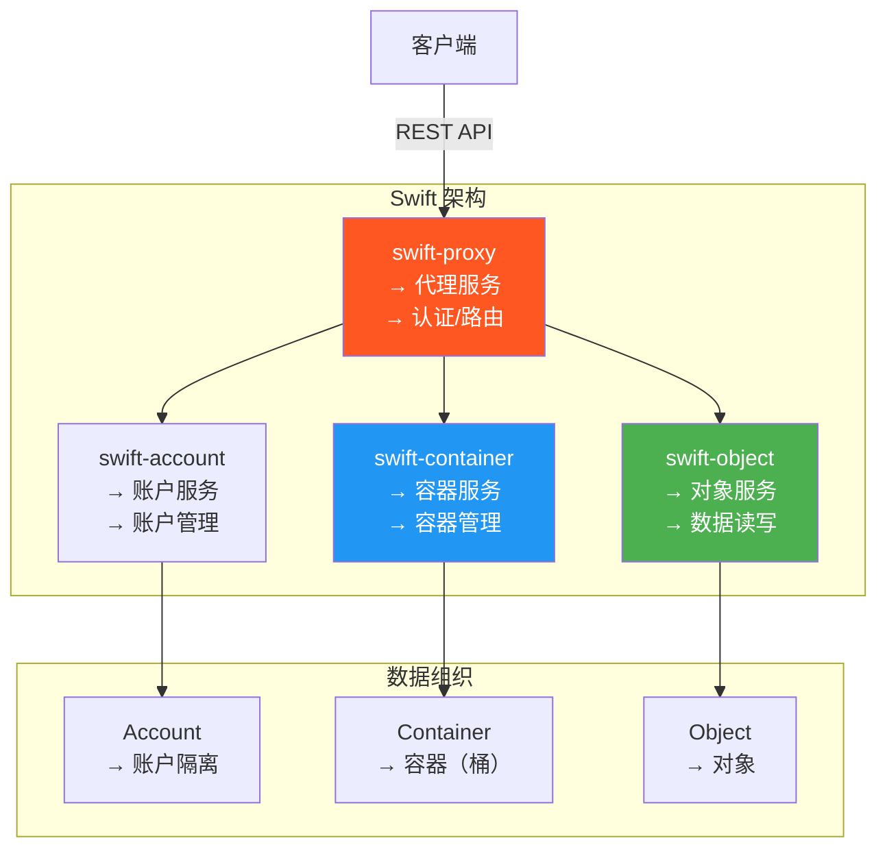
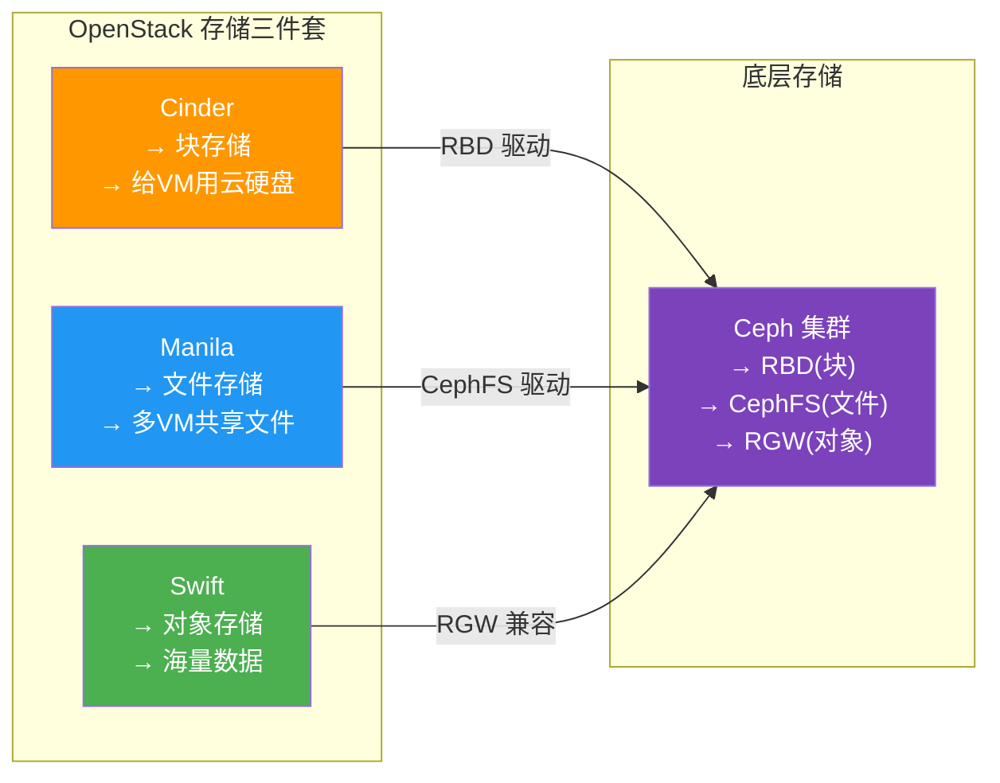

# 5.1 云存储体系架构

> [!abstract] 本节导读
> 云存储不是单一技术，而是一个完整的技术体系。本节从块存储、文件存储、对象存储三大类型的分层架构出发，系统对比其特性、接口与适用场景，深入剖析 Ceph 分布式存储的 RADOS、CRUSH、Monitor、OSD 核心架构，最后介绍 OpenStack 存储三件套（Cinder、Manila、Swift）的定位与协作。

## 一、云存储三层架构

### 存储类型对比



### 详细对比表

| 维度 | 块存储 (Block) | 文件存储 (File) | 对象存储 (Object) |
|-----|---------------|----------------|-------------------|
| **数据组织** | 扇区/块 (512B-4KB) | 目录/文件 | 对象 (Key-Value) |
| **访问接口** | 块设备 `/dev/sda` | POSIX 文件系统 | HTTP REST API |
| **共享能力** | 单主机独占（可多路径） | 多主机共享 | 多主机并发访问 |
| **性能** | 最高（微秒级延迟） | 中等（毫秒级） | 较低（毫秒级） |
| **扩展性** | 垂直扩展为主 | 有限水平扩展 | 无限水平扩展 |
| **典型协议** | iSCSI, FC, SATA | NFS, SMB, CIFS | S3, OSS, Swift API |
| **典型产品** | AWS EBS, 阿里云云盘 | AWS EFS, 阿里云NAS | AWS S3, 阿里云OSS |
| **适用场景** | 数据库、VM 系统盘 | 共享文件、日志目录 | 海量数据、备份归档 |
| **成本** | 最高 | 中等 | 最低 |

### 云存储分层使用示例



## 二、Ceph 分布式存储

### Ceph 架构概览

> [!definition] Ceph
> Ceph 是一个开源的分布式存储系统，提供对象存储（RGW）、块存储（RBD）和文件存储（CephFS）的统一接口，无单点故障，可水平扩展至 EB 级。

```mermaid
graph TB
    subgraph "客户端层"
        direction TB
        RBD["RBD<br/>→ 块存储客户端<br/>→ 内核模块/用户态"]
        RGW["RGW<br/>→ 对象存储网关<br/>→ S3/Swift API"]
        CephFS["CephFS<br/>→ 文件存储客户端<br/>→ FUSE/内核"]
    end

    subgraph "Ceph 核心"
        direction TB
        subgraph "Monitor 集群"
            Mon1["Mon A<br/>→ 集群状态<br/>→ 认证信息"]
            Mon2["Mon B"]
            Mon3["Mon C"]
        end

        subgraph "MDS 集群"
            MDS1["MDS<br/>→ 元数据服务<br/>→ 文件系统元数据"]
        end

        subgraph "OSD 集群"
            direction TB
            OSD1["OSD 1<br/>→ 对象存储守护进程<br/>→ 管理数据和元数据"]
            OSD2["OSD 2"]
            OSD3["OSD 3"]
            OSDn["... OSD N"]
        end

        subgraph "RADOS"
            RADOS_Layer["RADOS<br/>→ 可靠自主分布式对象存储<br/>→ Ceph的基石"]
        end
    end

    subgraph "存储介质"
        direction TB
        HDD["HDD<br/>→ 大容量"]
        SSD["SSD<br/>→ 高性能"]
        NVMe["NVMe<br/>→ 极致性能"]
    end

    RBD -->|"块IO"| Mon1
    RBD -->|"元数据查询"| MDS1
    RBD -->|"读写数据"| OSD1
    RGW -->|"HTTP API"| Mon1
    RGW -->|"读写对象"| OSD1
    CephFS -->|"文件IO"| MDS1
    CephFS -->|"文件数据"| OSD1
    Mon1 -- Mon2
    Mon2 -- Mon3
    MDS1 -- Mon1
    OSD1 --> RADOS_Layer
    OSD2 --> RADOS_Layer
    OSD3 --> RADOS_Layer
    OSDn --> RADOS_Layer
    RADOS_Layer --> HDD
    RADOS_Layer --> SSD
    RADOS_Layer --> NVMe

    style RBD fill:#FF9800,color:#fff
    style RGW fill:#4CAF50,color:#fff
    style CephFS fill:#2196F3,color:#fff
    style Mon1 fill:#F44336,color:#fff
    style MDS1 fill:#9C27B0,color:#fff
    style RADOS_Layer fill:#7B42BC,color:#fff
```

### RADOS 架构

> [!definition] RADOS
> RADOS（Reliable Autonomous Distributed Object Store）是 Ceph 的核心存储引擎，实现了可靠、自主的分布式对象存储。



**RADOS 核心特性**：
- **自主**：无需中心节点，每个 OSD 自主管理数据
- **可靠**：多副本机制，支持故障自动恢复
- **分布式**：数据均匀分布在所有 OSD 上
- **可扩展**：线性扩展，EB 级规模

### CRUSH 算法

> [!definition] CRUSH
> CRUSH（Controlled Replication Under Scalable Hashing）是 Ceph 的核心数据分布算法，无需查表即可计算数据的存储位置。



**CRUSH vs 一致性哈希**：

| 维度 | CRUSH | 一致性哈希 |
|-----|-------|-----------|
| **查找方式** | 无需查表，O(1)计算 | 需维护哈希环 |
| **元数据** | 无 | 需要 |
| **副本放置** | 支持复杂规则（机架/主机） | 简单映射 |
| **故障处理** | 有规则约束的副本迁移 | 单节点影响 |
| **负载均衡** | 均匀分布 | 基本均匀 |

### Monitor 与 OSD 详解

#### Monitor 集群



**Monitor 职责**：维护集群状态，包括 MON、OSD、PG、CRUSH 等地图（Map），实现分布式一致性。

#### OSD 守护进程



**OSD 状态**：

| 状态 | 说明 |
|-----|------|
| **Up** | OSD 进程正常运行 |
| **Down** | OSD 进程停止或无响应 |
| **In** | OSD 在集群中，有数据映射 |
| **Out** | OSD 不在集群中，数据已迁移 |

## 三、OpenStack 存储组件

### Cinder（块存储）

> [!definition] Cinder
> OpenStack 块存储服务，为虚拟机提供可持久化、可挂载的云硬盘，类似 AWS EBS。



**Cinder 核心概念**：

| 概念 | 说明 |
|-----|------|
| **Volume** | 块存储卷，可挂载到 VM |
| **Snapshot** | 卷快照，用于备份或创建新卷 |
| **Backup** | 卷备份，独立于卷的存储 |
| **Types** | 卷类型（SSD/HDD/加密等） |

### Manila（文件存储）

> [!definition] Manila
> OpenStack 文件存储服务，提供共享文件系统，支持 NFS、CIFS 等协议，类似 AWS EFS。



### Swift（对象存储）

> [!definition] Swift
> OpenStack 对象存储服务，提供 RESTful API 访问的海量、可扩展的对象存储，类似 AWS S3。



### 三件套协作关系



## 四、小结

> [!summary] 本节要点回顾
> 1. **存储三层**：块存储（高性能、单主机）、文件存储（共享、POSIX）、对象存储（海量、HTTP API）
> 2. **Ceph 架构**：Monitor（集群管理）+ OSD（数据存储）+ MDS（文件元数据）+ RGW（对象网关）
> 3. **RADOS**：Ceph 的可靠自主分布式对象存储引擎
> 4. **CRUSH**：无表查找的数据分布算法，支持复杂故障域规则
> 5. **OpenStack 三件套**：Cinder（块）、Manila（文件）、Swift（对象），可基于 Ceph 统一部署

## 关联知识点

| 关联知识点 | 关系 |
|-----------|------|
| [[5.2 分布式存储HDFS与对象存储]] | 对象存储 API 与 HDFS 对比 |
| [[5.3 存储优化与数据管理]] | Ceph 性能优化与数据管理 |
| [[4.1 云架构设计与OpenStack]] | OpenStack 整体架构 |
| [[第2章 虚拟化技术原理]] | 虚拟化存储基础 |