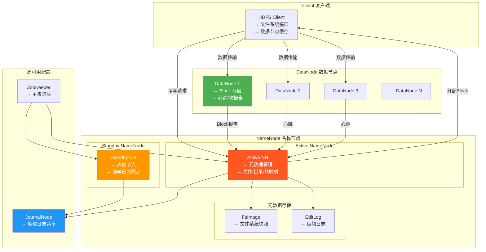
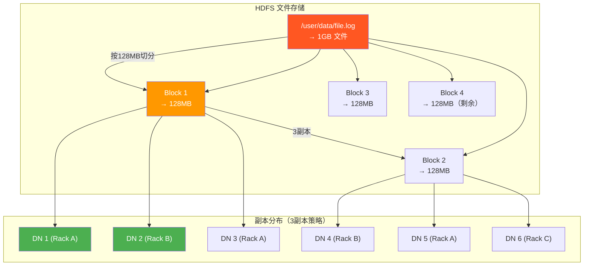
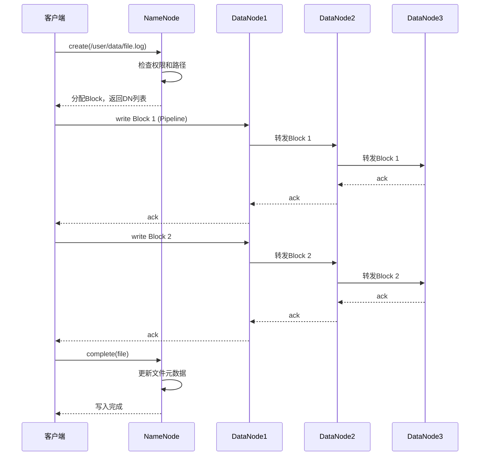
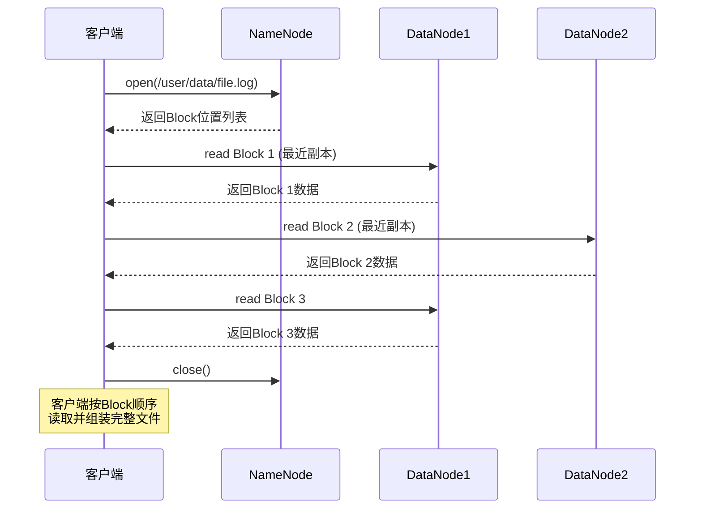
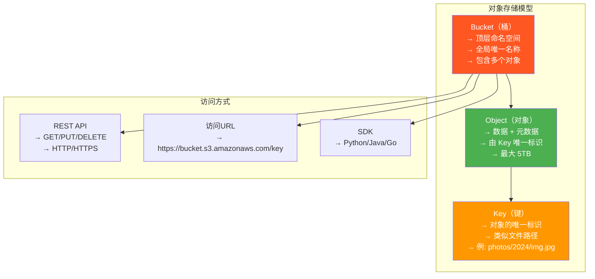
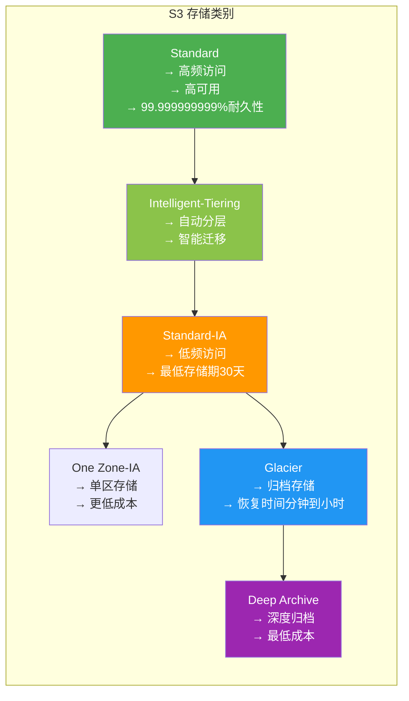
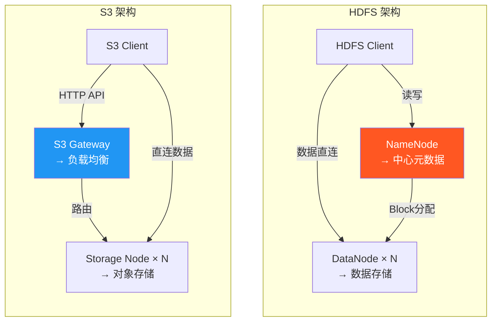

# 5.2 分布式存储 HDFS 与对象存储

> [!abstract] 本节导读
> HDFS 是大数据时代的分布式文件系统，S3 是云时代的对象存储事实标准。本节系统剖析 HDFS 的 NameNode、DataNode 架构与读写流程，讲解对象存储的 Bucket、Object、Key 模型与 S3 API 操作，最后对比 HDFS 与 S3 在设计理念、数据模型、访问方式上的本质差异与选型策略。

## 一、HDFS 架构

### HDFS 设计目标

> [!important] HDFS 核心设计目标
> - 处理超大规模数据集（PB 级以上）
> - 高容错性，自动故障恢复
> - 高吞吐顺序读写
> - 简单一致性模型，一次写入多次读取
> - 低成本，使用廉价硬件

### 核心架构



### NameNode 详解

| 功能 | 说明 |
|-----|------|
| **元数据管理** | 文件/目录/Block 的映射关系 |
| **Block 分配** | 为新文件分配 Block 及副本位置 |
| **命名空间操作** | 创建/删除/重命名文件和目录 |
| **心跳监控** | 监听 DataNode 心跳，检测故障 |
| **FsImage** | 文件系统元数据的持久化快照 |
| **EditLog** | 元数据变更的日志记录 |

### DataNode 详解

| 功能 | 说明 |
|-----|------|
| **Block 存储** | 实际存储数据 Block |
| **读写服务** | 响应客户端的 Block 读写请求 |
| **心跳报告** | 定期向 NameNode 发送心跳和 Block 报告 |
| **Block 复制** | 接收其他 DataNode 的 Block 复制指令 |
| **数据校验** | 使用 CRC32 校验数据完整性 |

### Block 与副本机制



**副本放置策略（机架感知）**：
1. 第 1 副本：本地节点
2. 第 2 副本：不同机架的随机节点
3. 第 3 副本：第 2 副本同机架的另一节点

### HDFS 写流程



### HDFS 读流程



### HDFS 常用命令

```bash
# 文件系统操作
hdfs dfs -mkdir /user/data
hdfs dfs -put localfile.txt /user/data/
hdfs dfs -get /user/data/file.log ./
hdfs dfs -ls /user/data/
hdfs dfs -cat /user/data/file.log
hdfs dfs -rm /user/data/file.log
hdfs dfs -du -h /user/data/
hdfs dfs -df /

# 管理命令
hdfs dfsadmin -report
hdfs dfsadmin -safemode get
hdfs dfsadmin -safemode leave
hdfs haadmin -getServiceState nn1
hdfs haadmin -failover nn1 nn2
```

## 二、对象存储（S3/OSS）

### 对象存储模型

> [!definition] 对象存储
> 以对象为单位的分布式存储，每个对象由唯一 Key 标识，通过 HTTP REST API 访问，具备无限扩展、高持久性的特点。



### S3 核心概念

| 概念 | 说明 | 示例 |
|-----|------|------|
| **Bucket** | 存储桶，顶层容器 | `my-photo-bucket` |
| **Object** | 对象，存储的数据单元 | 一张照片、一个备份文件 |
| **Key** | 对象键，唯一标识 | `vacation/2024/beach.jpg` |
| **Endpoint** | 访问端点 | `s3.amazonaws.com` |
| **Region** | 存储区域 | `us-east-1`、`cn-hangzhou` |
| **ACL** | 访问控制列表 | 公开读、私有读写 |
| **Storage Class** | 存储类别 | Standard、IA、Glacier |
| **Versioning** | 版本控制 | 保留对象历史版本 |

### S3 API 核心操作

```python
import boto3
from botocore.exceptions import ClientError

s3 = boto3.client('s3', region_name='us-east-1')

def create_bucket(bucket_name, region='us-east-1'):
    try:
        if region == 'us-east-1':
            s3.create_bucket(Bucket=bucket_name)
        else:
            s3.create_bucket(
                Bucket=bucket_name,
                CreateBucketConfiguration={'LocationConstraint': region}
            )
        print(f"Bucket created: {bucket_name}")
        return True
    except ClientError as e:
        print(f"Error: {e}")
        return False

def put_object(bucket, key, file_path=None, content=None):
    try:
        if file_path:
            s3.upload_file(file_path, bucket, key)
        elif content is not None:
            s3.put_object(Bucket=bucket, Key=key, Body=content)
        print(f"Uploaded: s3://{bucket}/{key}")
        return True
    except ClientError as e:
        print(f"Error: {e}")
        return False

def get_object(bucket, key, download_path=None):
    try:
        if download_path:
            s3.download_file(bucket, key, download_path)
            print(f"Downloaded: {key} -> {download_path}")
        else:
            response = s3.get_object(Bucket=bucket, Key=key)
            data = response['Body'].read()
            print(f"Read: s3://{bucket}/{key}, size: {len(data)}")
            return data
    except ClientError as e:
        print(f"Error: {e}")
        return None

def list_objects(bucket, prefix=''):
    try:
        paginator = s3.get_paginator('list_objects_v2')
        for page in paginator.paginate(Bucket=bucket, Prefix=prefix):
            for obj in page.get('Contents', []):
                print(f"  {obj['Key']} ({obj['Size']} bytes, {obj['LastModified']})")
    except ClientError as e:
        print(f"Error: {e}")

def delete_object(bucket, key):
    try:
        s3.delete_object(Bucket=bucket, Key=key)
        print(f"Deleted: s3://{bucket}/{key}")
    except ClientError as e:
        print(f"Error: {e}")

def delete_bucket(bucket):
    try:
        s3.delete_bucket(Bucket=bucket)
        print(f"Bucket deleted: {bucket}")
    except ClientError as e:
        print(f"Error: {e}")

def generate_presigned_url(bucket, key, expiration=3600):
    try:
        url = s3.generate_presigned_url(
            'get_object',
            Params={'Bucket': bucket, 'Key': key},
            ExpiresIn=expiration
        )
        print(f"Presigned URL (expires in {expiration}s): {url}")
        return url
    except ClientError as e:
        print(f"Error: {e}")

if __name__ == '__main__':
    bucket = 'my-test-bucket-12345'
    create_bucket(bucket)
    put_object(bucket, 'hello.txt', content=b'Hello, S3!')
    put_object(bucket, 'data/report.csv', file_path='report.csv')
    list_objects(bucket)
    data = get_object(bucket, 'hello.txt')
    delete_object(bucket, 'hello.txt')
    delete_bucket(bucket)
```

### S3 存储类别



## 三、HDFS vs S3 对比

### 架构对比图



### 详细对比表

| 维度 | HDFS | S3 对象存储 |
|-----|------|------------|
| **设计目标** | 大数据分析（Hadoop生态） | 通用云存储 |
| **数据模型** | 文件系统（目录/文件） | 对象存储（Bucket/Object） |
| **访问接口** | POSIX-like API、Java API | HTTP REST API |
| **元数据管理** | NameNode 集中管理 | 分布式，无单点 |
| **数据访问** | 顺序读写为主 | 随机读写 + 顺序读写 |
| **文件大小** | 大文件（GB~TB级） | 任意大小（0~5TB） |
| **一致性模型** | 一次写入，多次读取 | 强一致（新Bucket默认） |
| **扩展性** | 元数据受限于NameNode | 无限水平扩展 |
| **持久性** | 3副本，99.999999999% | 99.999999999%（11个9） |
| **性能** | 高吞吐（GB/s级） | 高并发（百万级IOPS） |
| **成本** | 中等（专用集群） | 低（按量付费） |
| **典型应用** | Hadoop/Spark批处理 | 备份、归档、静态资源 |
| **部署** | 自建集群 | 云服务托管 |

### 选型建议

```mermaid
graph TD
    Start{存储需求分析}
    Start -->|"大数据分析<br/>需要分布式计算"| HDFS_Choose[选择 HDFS]
    Start -->|"海量非结构化数据<br/>需要低成本存储"| S3_Choose[选择 S3/OSS]
    Start -->|"两者都需要"| Hybrid[混合方案]
    
    Hybrid --> HDFS_S3[HDFS 计算层 + S3 存储层<br/>→ HDFS on S3 (s3a://)]
    
    style HDFS_Choose fill:#4CAF50,color:#fff
    style S3_Choose fill:#2196F3,color:#fff
    style Hybrid fill:#FF9800,color:#fff
```

> [!tip] 混合使用场景
> 现代数据湖架构通常采用 HDFS（计算层）+ S3（存储层）的分离架构：
> - **HDFS 负责计算**：Spark/Hive 等计算引擎运行在 HDFS 集群
> - **S3 负责存储**：数据存放在 S3，通过 s3a:// 协议访问
> - 这种"存算分离"架构更具弹性和成本效益

## 四、小结

> [!summary] 本节要点回顾
> 1. **HDFS 架构**：NameNode（元数据）+ DataNode（数据），主备高可用
> 2. **HDFS 流程**：Pipeline 写入、就近读取、3副本机架感知
> 3. **对象存储模型**：Bucket + Object + Key，通过 HTTP REST API 访问
> 4. **S3 API**：PUT/GET/DELETE/LIFY 核心操作，boto3 SDK 使用
> 5. **HDFS vs S3**：HDFS 面向计算，S3 面向存储；HDFS 有中心元数据，S3 完全分布式
> 6. **现代趋势**：存算分离的数据湖架构（HDFS on S3）

## 关联知识点

| 关联知识点 | 关系 |
|-----------|------|
| [[5.1 云存储体系架构]] | 存储类型分层架构 |
| [[5.3 存储优化与数据管理]] | 对象存储生命周期管理 |
| [[第1章 云计算基础概论]] | 云服务模式 |
| 大数据分析技术/Hadoop生态 | HDFS 在大数据中的应用 |