# 5.3 存储优化与数据管理

> [!abstract] 本节导读
> 数据是云时代的核心资产，如何高效、可靠、经济地管理数据是云运维的关键课题。本节从数据去重与压缩原理出发，讲解冷热分层存储的设计与实践，介绍生命周期管理策略、备份与容灾方案，最后讨论存储性能优化与成本优化策略。

## 一、数据去重与压缩

### 数据去重（Deduplication）

> [!definition] 数据去重
> 识别并消除存储系统中的重复数据，仅保留一份副本引用，可大幅节省存储空间。

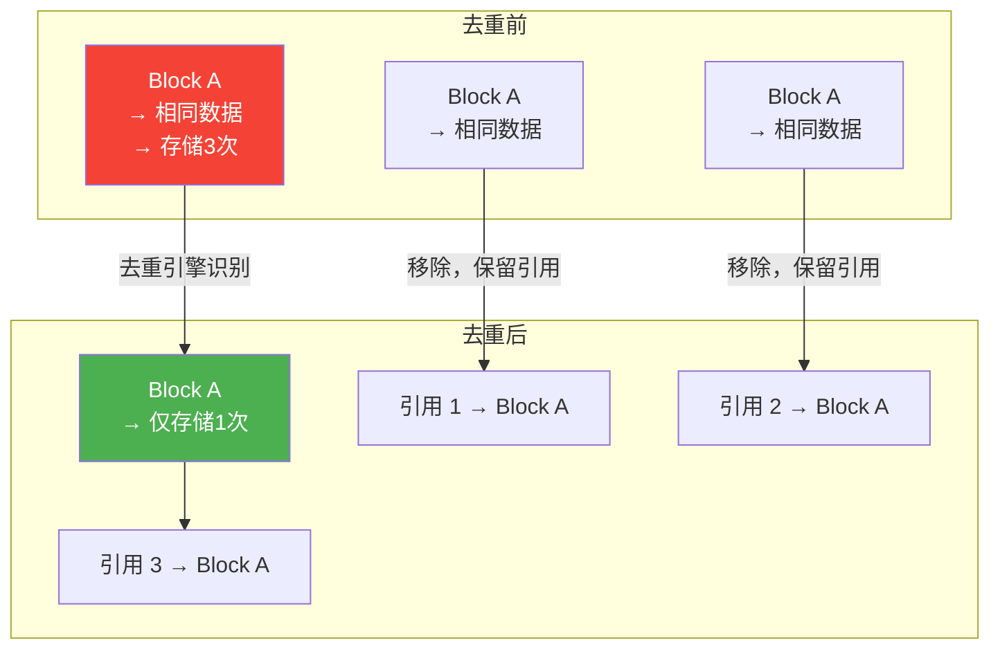

### 去重方式对比

| 方式 | 说明 | 适用场景 |
|-----|------|---------|
| **源端去重** | 数据写入前在客户端去重 | 备份场景 |
| **目标端去重** | 数据到达存储节点后去重 | 主存储场景 |
| **文件级去重** | 按文件哈希判断重复 | VM 镜像、容器层 |
| **块级去重** | 按固定大小块哈希判断 | 通用存储 |
| **字节级去重** | 按字节比对 | 极致空间节省 |

### 数据压缩

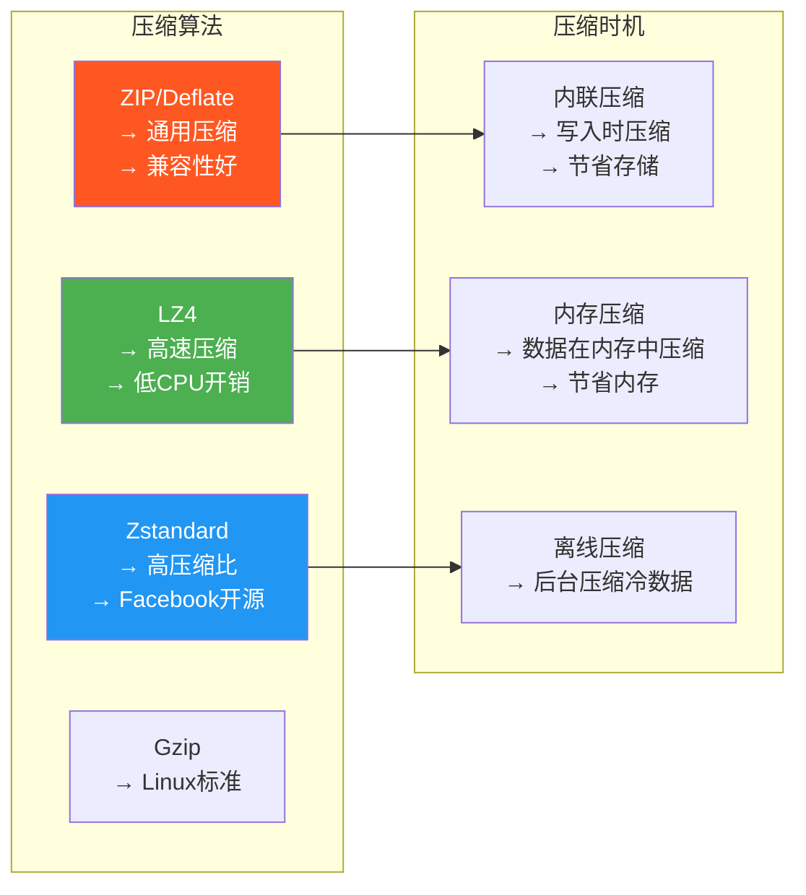

**压缩 vs 去重效果**：

| 场景 | 压缩效果 | 去重效果 |
|-----|---------|---------|
| 文本/日志 | ⭐⭐⭐⭐⭐ | ⭐⭐ |
| 数据库 | ⭐⭐⭐ | ⭐⭐⭐⭐ |
| VM 镜像 | ⭐⭐ | ⭐⭐⭐⭐⭐ |
| 媒体文件 | ⭐ | ⭐ |
| 通用数据 | ⭐⭐⭐ | ⭐⭐⭐ |

## 二、分层存储（Tiered Storage）

### 四级存储分层

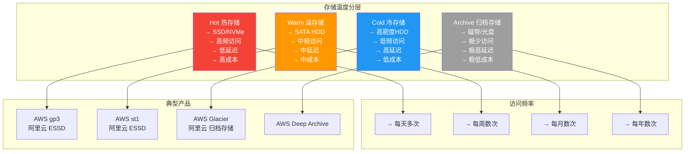

### 自动分层流程

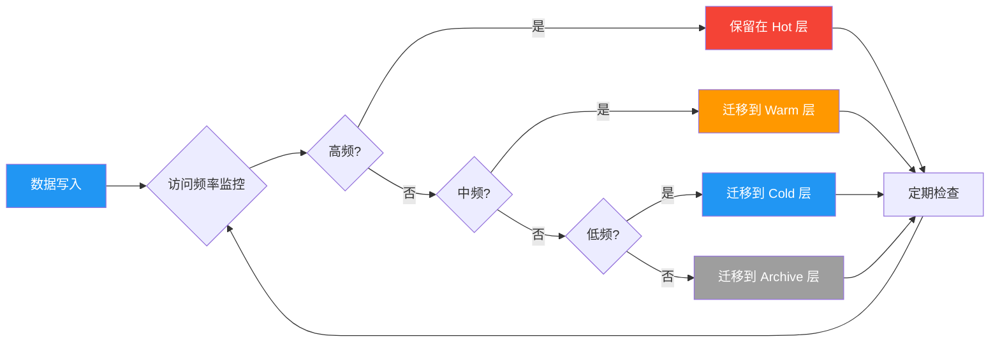

### 分层存储实现

#### Ceph 分层存储

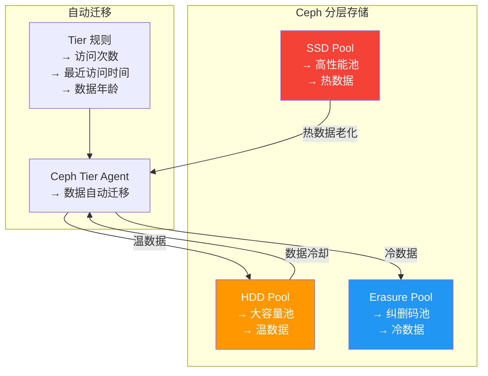

#### AWS S3 智能分层

```python
import boto3

s3 = boto3.client('s3')

def configure_intelligent_tiering(bucket_name):
    s3.put_bucket_intelligent_tiering_configuration(
        Bucket=bucket_name,
        Id='IntelligentTieringConfiguration',
        IntelligentTieringConfiguration={
            'Id': 'AutoTiering',
            'Status': 'Enabled',
            'Tiering': {
                'AccessTier': 'FREQUENT_ACCESS',
                'Days': 300
            }
        }
    )
    print(f"Intelligent Tiering configured for {bucket_name}")

def configure_lifecycle(bucket_name):
    s3.put_bucket_lifecycle_configuration(
        Bucket=bucket_name,
        LifecycleConfiguration={
            'Rules': [
                {
                    'ID': 'Transition rules',
                    'Status': 'Enabled',
                    'Filter': {
                        'Prefix': ''
                    },
                    'Transitions': [
                        {
                            'Days': 30,
                            'StorageClass': 'STANDARD_IA'
                        },
                        {
                            'Days': 90,
                            'StorageClass': 'GLACIER'
                        },
                        {
                            'Days': 365,
                            'StorageClass': 'DEEP_ARCHIVE'
                        }
                    ],
                    'Expiration': {
                        'Days': 2555
                    }
                }
            ]
        }
    )
    print(f"Lifecycle configured for {bucket_name}")

if __name__ == '__main__':
    configure_intelligent_tiering('my-data-bucket')
    configure_lifecycle('my-data-bucket')
```

## 三、生命周期管理策略

### 生命周期管理流程

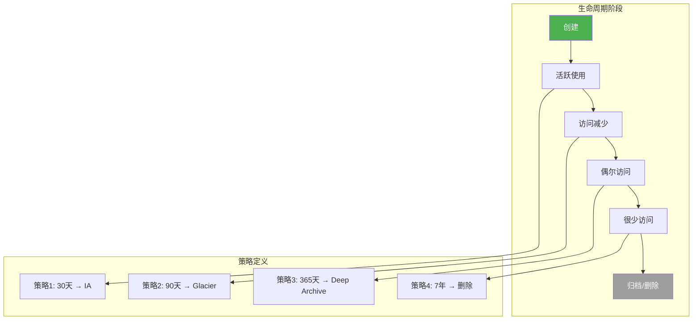

### S3 生命周期规则示例

```xml
<!-- AWS S3 生命周期配置 XML -->
<LifecycleConfiguration>
  <Rule>
    <ID>transition-rules</ID>
    <Status>Enabled</Status>
    <Filter>
      <Prefix>logs/</Prefix>
    </Filter>
    <Transition>
      <Days>30</Days>
      <StorageClass>STANDARD_IA</StorageClass>
    </Transition>
    <Transition>
      <Days>90</Days>
      <StorageClass>GLACIER</StorageClass>
    </Transition>
    <Expiration>
      <Days>365</Days>
    </Expiration>
  </Rule>
  <Rule>
    <ID>versioning-rules</ID>
    <Status>Enabled</Status>
    <NoncurrentVersionTransition>
      <NoncurrentDays>30</NoncurrentDays>
      <StorageClass>STANDARD_IA</StorageClass>
    </NoncurrentVersionTransition>
    <NoncurrentVersionExpiration>
      <NoncurrentDays>365</NoncurrentDays>
    </NoncurrentVersionExpiration>
  </Rule>
</LifecycleConfiguration>
```

### 策略设计原则

| 原则 | 说明 |
|-----|------|
| **数据分类** | 按业务价值、访问频率、合规要求分类 |
| **自动迁移** | 使用生命周期策略自动迁移，避免人工操作 |
| **版本管理** | 非当前版本设置更激进的迁移策略 |
| **保留策略** | 根据合规要求设置最小保留期 |
| **测试验证** | 先在小范围测试，再全量推广 |

## 四、数据备份与容灾

### 备份策略

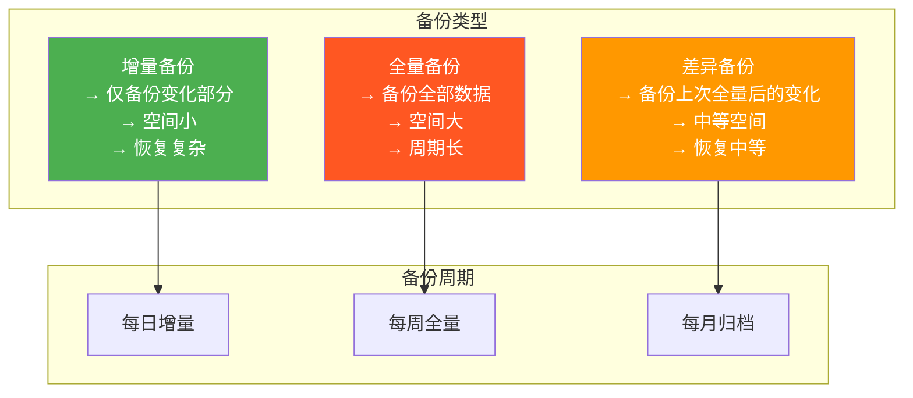

### 3-2-1 备份原则

> [!important] 3-2-1 备份原则
> - **3** 份数据副本（1 份生产 + 2 份备份）
> - **2** 种存储介质类型（如 SSD + 磁带）
> - **1** 份异地备份（不同地理位置）

### 容灾架构

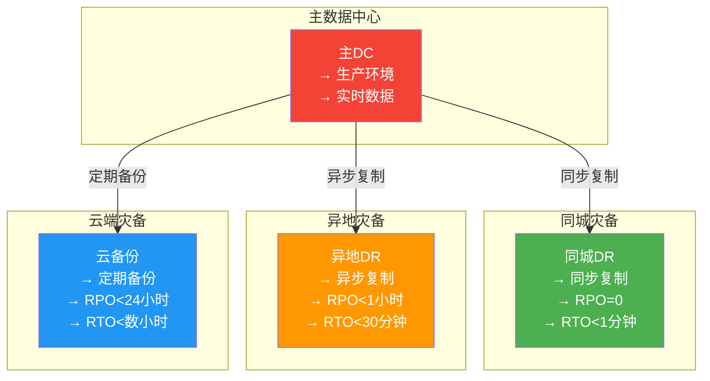

### RPO 与 RTO

| 指标 | 含义 | 示例 |
|-----|------|------|
| **RPO** (Recovery Point Objective) | 可接受的数据丢失时间 | RPO=1h 表示最多丢失1小时数据 |
| **RTO** (Recovery Time Objective) | 可接受的恢复时间 | RTO=30min 表示30分钟内恢复 |

| 业务等级 | RPO | RTO | 备份策略 |
|---------|-----|-----|---------|
| **核心业务** | 0 | < 5分钟 | 同步复制 + 自动故障切换 |
| **重要业务** | < 1小时 | < 30分钟 | 异步复制 + 热备 |
| **一般业务** | < 24小时 | < 数小时 | 定期备份 + 冷备 |
| **非关键业务** | < 7天 | < 1天 | 归档备份 + 离线存储 |

### 云备份方案示例

```python
import boto3
from datetime import datetime, timedelta

backup = boto3.client('backup')

def create_backup_vault(vault_name, region='us-east-1'):
    backup.create_backup_vault(
        BackupVaultName=vault_name,
        EncryptionKeyArn='arn:aws:kms:us-east-1:123456789:key/xxxx'
    )
    print(f"Backup vault created: {vault_name}")

def create_backup_plan(plan_name, vault_name, schedule_expression):
    response = backup.create_backup_plan(
        BackupPlanName=plan_name,
        Rules=[{
            'RuleName': 'DailyBackup',
            'ScheduleExpression': schedule_expression,
            'Lifecycle': {
                'MoveToColdStorageAfterDays': 30,
                'DeleteAfterDays': 365
            }
        }]
    )
    print(f"Backup plan created: {response['BackupPlanId']}")
    return response['BackupPlanId']

def assign_resource_to_plan(plan_id, resource_arn):
    backup.create_backup_selection(
        BackupPlanId=plan_id,
        SelectionName='MySelection',
        IamRoleArn='arn:aws:iam::123456789:role/BackupRole',
        Resources=[resource_arn]
    )
    print(f"Resource {resource_arn} assigned to plan {plan_id}")

if __name__ == '__main__':
    create_backup_vault('my-backup-vault')
    plan_id = create_backup_plan(
        'daily-backup-plan',
        'my-backup-vault',
        'cron(0 2 ? * * *)'
    )
    assign_resource_to_plan(plan_id, 'arn:aws:rds:us-east-1:123456789:db:mydb')
```

## 五、存储性能优化

### 性能指标

| 指标 | 说明 | 典型值 |
|-----|------|--------|
| **IOPS** | 每秒读写操作数 | HDD: 100-200, SSD: 10K+, NVMe: 100K+ |
| **吞吐量** | 每秒数据传输量 | HDD: 100-200MB/s, SSD: 500MB/s, NVMe: 2GB/s+ |
| **延迟** | 单次IO操作耗时 | HDD: 5-10ms, SSD: 0.1-0.5ms, NVMe: 0.01ms |
| **并发数** | 同时处理的IO请求数 | 与缓存和队列深度相关 |

### 优化策略

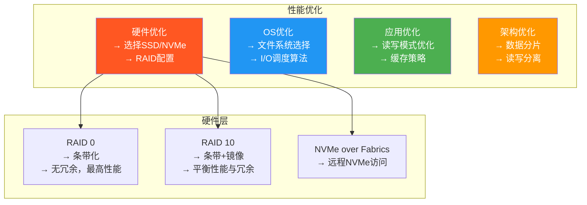

### Ceph 性能调优

```bash
# Ceph OSD 性能调优

# 1. 设置 OSD 并行线程
ceph tell osd.0 injectargs '"osd_op_num_threads_per_shard"="2"'

# 2. 调整恢复/回填并发
ceph osd set-backfill-full-ratio 0.8
ceph osd set-nearfull-ratio 0.7

# 3. 客户端缓存
cat > ceph.conf << 'EOF'
[client]
    rbd_cache = true
    rbd_cache_size = 10240
    rbd_cache_max_dirty = 1024
    rbd_cache_max_dirty_age = 10
[osd]
    osd_op_num_threads_per_shard = 2
    osd_max_backfills = 4
    osd_recovery_max_active = 4
EOF

# 4. 使用 BlueStore（替代 FileStore）
# BlueStore 直接管理裸设备，性能更优
```

## 六、成本优化策略

### 成本分析维度

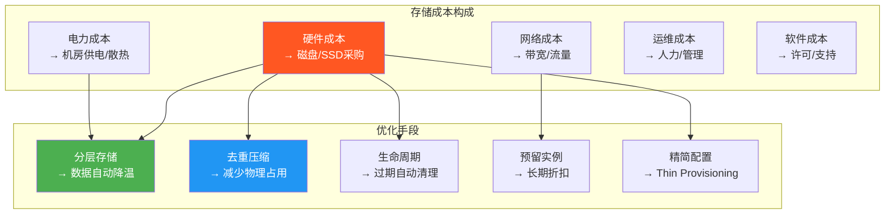

### 成本优化清单

| 策略 | 节省幅度 | 实施难度 |
|-----|---------|---------|
| 冷热分层存储 | 30-60% | 低 |
| 数据去重 | 20-50% | 中 |
| 数据压缩 | 10-30% | 低 |
| 生命周期管理 | 10-20% | 低 |
| 预留实例（1-3年） | 30-75% | 低 |
| 精简配置 | 20-40% | 中 |
| 冗余编码替代3副本 | 33-50% | 高 |
| 多云存储策略 | 10-30% | 高 |

### 纠删码（Erasure Coding）

> [!definition] 纠删码
> 通过数据分片和校验片实现冗余，相比3副本机制可节省约50%的存储空间。

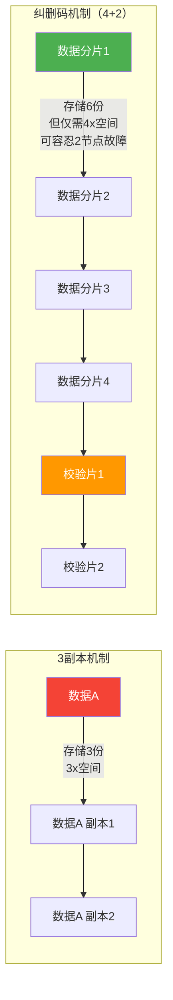

**副本 vs 纠删码对比**：

| 维度 | 3副本 | 纠删码 (4+2) |
|-----|-------|-------------|
| **存储效率** | 33% | 67% |
| **冗余度** | 3副本 | 2校验 |
| **故障容忍** | 2节点 | 2节点 |
| **写入性能** | 高 | 较低（需计算校验） |
| **读取性能** | 高 | 较高（并行读取分片） |
| **计算开销** | 低 | 中 |
| **适用场景** | 热数据 | 冷/温数据 |

## 七、小结

> [!summary] 本节要点回顾
> 1. **去重与压缩**：源端/目标端去重，文件级/块级去重，多种压缩算法
> 2. **分层存储**：Hot → Warm → Cold → Archive 四级分层，自动迁移
> 3. **生命周期管理**：按数据年龄和访问频率设置自动迁移和过期策略
> 4. **备份与容灾**：3-2-1 原则，RPO/RTO 指标，同步/异步/定时复制
> 5. **性能优化**：IOPS、吞吐量、延迟，硬件/OS/应用/架构四层优化
> 6. **成本优化**：分层+去重+压缩+生命周期+预留实例+纠删码

## 关联知识点

| 关联知识点 | 关系 |
|-----------|------|
| [[5.1 云存储体系架构]] | Ceph 分层存储实现 |
| [[5.2 分布式存储HDFS与对象存储]] | S3 生命周期 API |
| [[第7章 云安全技术]] | 数据加密与安全 |
| [[第4章 云计算架构与资源调度]] | 存储资源调度 |