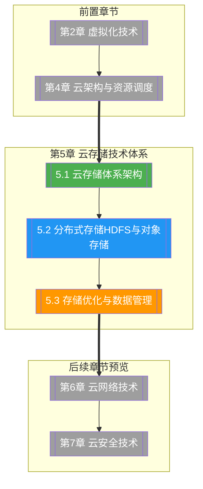

# 第5章 云存储技术体系

> [!abstract] 章节概述
> 存储是云计算的"粮仓"。本章系统构建云存储的完整技术体系：从块存储、文件存储、对象存储三大类型的分层架构出发，深入剖析 Ceph 分布式存储与 OpenStack 存储组件（Cinder、Manila、Swift），进而讲解 HDFS 与对象存储（S3/OSS）的架构原理与数据流，最后讨论存储优化、数据管理、生命周期策略与容灾备份等生产实践技术。

## 学习路线图

## 知识点导航

| 编号 | 知识点 | 核心内容 | 重要程度 |
|-----|--------|---------|---------|
| 5.1 | [[5.1 云存储体系架构]] | 块/文件/对象存储对比、Ceph架构(RADOS/CRUSH)、OpenStack Cinder/Manila/Swift | ⭐⭐⭐⭐⭐ |
| 5.2 | [[5.2 分布式存储HDFS与对象存储]] | HDFS架构(NameNode/DataNode)、S3对象存储模型、HDFS vs S3对比、数据流 | ⭐⭐⭐⭐⭐ |
| 5.3 | [[5.3 存储优化与数据管理]] | 去重与压缩、冷热分层、生命周期管理、备份与容灾、成本优化 | ⭐⭐⭐⭐ |

## 核心概念速览

> [!tip] 本章必须掌握的核心概念
> - **块存储（Block Storage）**：以块为单位的低级存储，高性能，适合数据库
> - **文件存储（File Storage）**：以文件为单位的共享存储，支持POSIX文件接口（NFS/SMB）
> - **对象存储（Object Storage）**：以对象为单位的海量存储，HTTP API访问（S3/OSS）
> - **Ceph**：开源分布式存储，提供对象、块、文件存储统一接口
> - **CRUSH算法**：Ceph的数据分布与副本放置算法，无需查表即可计算数据位置
> - **HDFS**：Hadoop分布式文件系统，面向大数据分析的高吞吐文件存储
> - **S3 API**：Amazon Simple Storage Service API，事实标准的对象存储接口
> - **冷热分层存储**：Hot（高性能）→ Warm（中性能）→ Cold（低成本）→ Archive（归档）
> - **数据去重与压缩**：节省存储空间的关键优化技术

## 核心考点

> [!important] 期末高频考点

| 考点 | 所属知识点 | 考查形式 | 难度 |
|-----|-----------|---------|------|
| 块存储、文件存储、对象存储的对比 | 5.1 | 对比题/简答题 | ★★★ |
| Ceph 架构：RADOS、CRUSH、Mon、OSD | 5.1 | 论述题 | ★★★★ |
| OpenStack Cinder、Manila、Swift 的定位 | 5.1 | 简答题/选择题 | ★★★ |
| HDFS 架构与读写流程 | 5.2 | 论述题 | ★★★★ |
| S3 对象存储模型与核心 API | 5.2 | 简答题/编程题 | ★★★★ |
| HDFS vs S3 的设计差异与适用场景 | 5.2 | 对比题 | ★★★★ |
| 数据去重与压缩原理 | 5.3 | 简答题 | ★★★ |
| 冷热分层存储与生命周期管理 | 5.3 | 案例分析 | ★★★ |
| 云备份与容灾策略 | 5.3 | 论述题/案例分析 | ★★★★ |
| 存储成本优化策略 | 5.3 | 案例分析 | ★★★ |

## 自测题

> [!question] 章节自测
> 1. 对比块存储、文件存储、对象存储的接口协议、访问粒度、性能特点和典型应用场景，各举一个云厂商产品实例。
> 2. 阐述 Ceph 的 CRUSH 算法如何实现数据的无表查找分布式放置，它相比传统一致性哈希有什么优势？
> 3. 画出 HDFS 的读数据流程时序图，说明 Client、NameNode、DataNode 之间的交互步骤。
> 4. 使用 Python 的 boto3 库编写一个 S3 对象存储的完整操作示例，包括创建桶、上传对象、列出对象、下载对象和删除对象。
> 5. 某企业拥有 100TB 的热数据需要存储，数据访问频率随时间递减。请设计一个分层存储策略，包括数据迁移规则、生命周期管理策略和成本优化方案。

## 章节导航

| 方向 | 链接 |
|-----|------|
| ⬆ 返回课程总览 | [[MOC - 云计算技术]] |
| ⬅ 上一章 | [[第4章 云计算架构与资源调度/MOC - 第4章]] |
| ➡ 下一章 | [[第6章 云网络技术/MOC - 第6章]] |