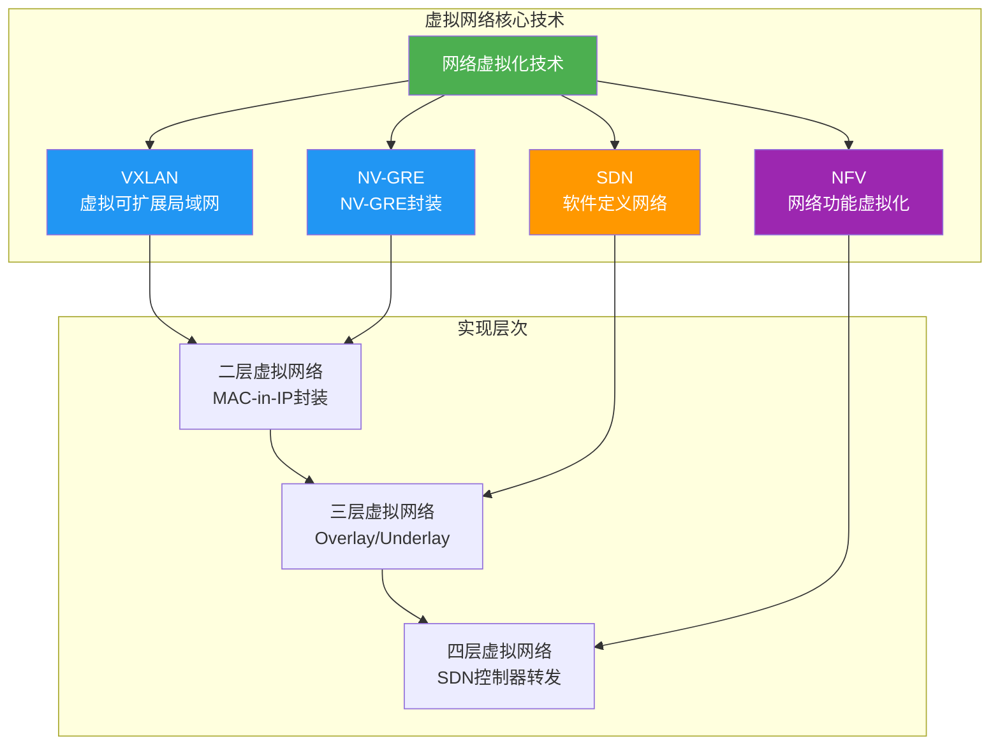
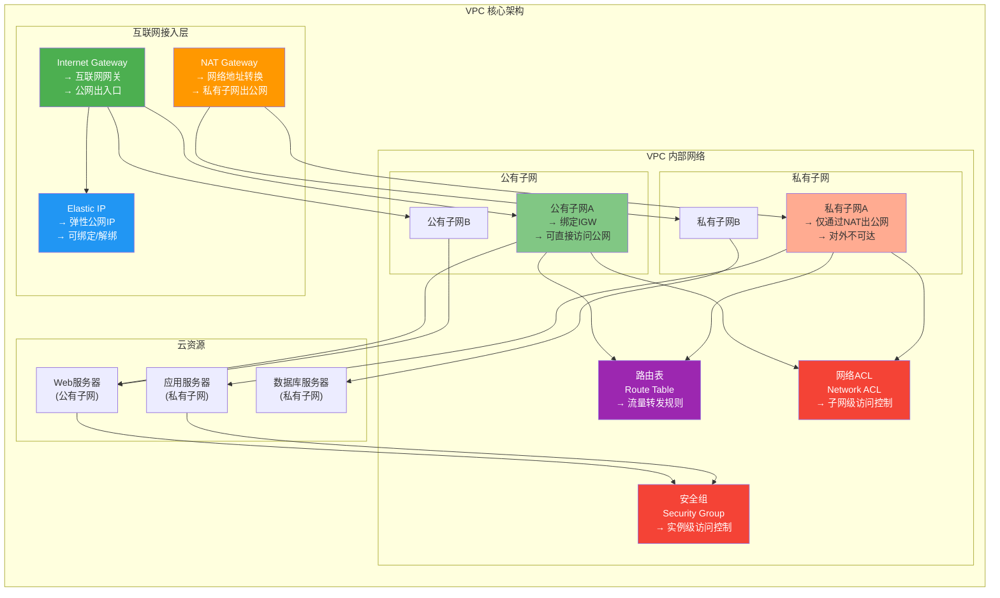
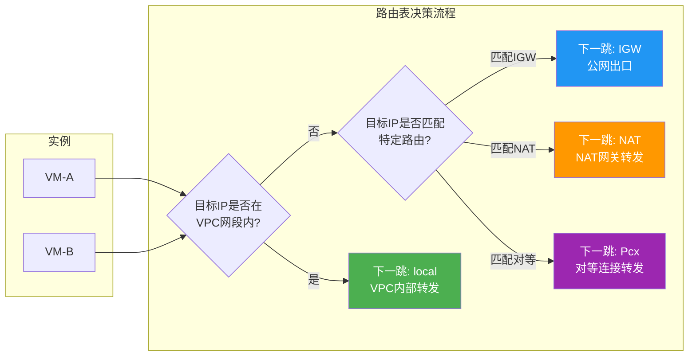
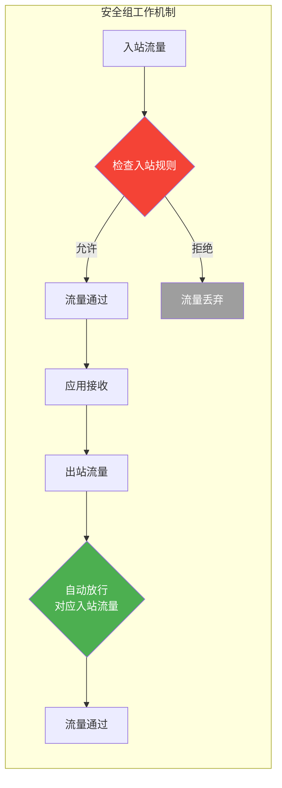
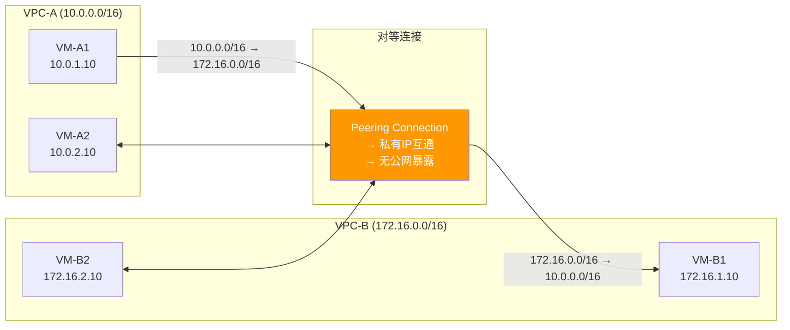
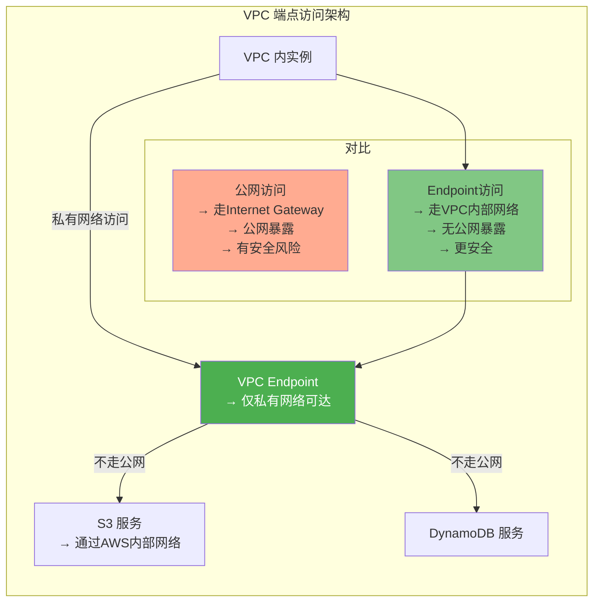

# 6.1 虚拟网络与VPC

> [!abstract] 本节导读
> 虚拟网络是云计算网络虚拟化的基础，而 VPC（Virtual Private Cloud）则是虚拟网络的核心实现。本节从虚拟网络的基本概念出发，系统介绍 VPC 的核心组件——子网、路由表、安全组和网络 ACL，阐述 VPC 的整体架构与公网/私有子网的设计差异，最后讲解 VPC 对等连接、VPC 端点及 VPC 设计最佳实践。

## 一、虚拟网络概述

### 什么是虚拟网络

> [!definition] 虚拟网络（Virtual Network）
> 虚拟网络是在物理网络基础设施之上，通过软件定义技术构建的逻辑网络。它为每个租户提供独立、隔离的网络环境，包含虚拟路由器、虚拟交换机、虚拟防火墙等功能，实现网络资源的池化和按需分配。

### 虚拟网络 vs 物理网络

| 维度 | 物理网络 | 虚拟网络 |
|-----|---------|---------|
| **资源分配** | 固定硬件分配 | 软件按需分配 |
| **隔离性** | VLAN/VXLAN 有限隔离 | 全逻辑隔离，独立地址空间 |
| **灵活性** | 静态配置，变更困难 | 动态编排，分钟级部署 |
| **成本** | 专用硬件成本高 | 复用物理基础设施，成本低 |
| **扩展性** | 受限于物理端口 | 逻辑上几乎无限扩展 |
| **典型实现** | 传统交换机/路由器 | VPC、Hyper-V 虚拟网络、Open vSwitch |

### 虚拟网络核心技术



## 二、VPC 核心组件

### VPC 架构全景

> [!definition] VPC（Virtual Private Cloud）
> VPC 是云厂商提供的隔离网络空间，用户可以在 VPC 内自定义 IP 地址段、创建子网、配置路由表和安全策略，完全掌控自己的虚拟网络环境。



### 子网（Subnet）

> [!definition] 子网
> 子网是 VPC 内的 IP 地址段划分，是 VPC 的最小网络单元。每个子网只存在于一个可用区（AZ）内，同一 VPC 可跨越多个可用区。

**子网类型对比**：

| 维度 | 公有子网（Public Subnet） | 私有子网（Private Subnet） |
|-----|------------------------|-------------------------|
| **路由表网关** | Internet Gateway (IGW) | NAT Gateway / 无 |
| **公网访问** | 可直接访问互联网 | 通过 NAT 间接访问 |
| **外部可达** | 公网可访问 | 仅 VPC 内部可达 |
| **典型用途** | Web 服务器、负载均衡器 | 数据库、应用服务器 |
| **IP 类型** | 需要公有 IP 或 EIP | 仅私有 IP |
| **安全等级** | 较低（暴露在公网） | 高（隔离保护） |

**子网划分最佳实践**：
- VPC CIDR 建议使用 `/16` 至 `/20`
- 每个子网 CIDR 建议使用 `/24`（256 个 IP）
- 公有子网和私有子网成对分布在每个可用区
- 预留足够的 IP 空间应对未来扩展

### 路由表（Route Table）

> [!definition] 路由表
> 路由表定义了流量在 VPC 内的转发规则，每条规则包含目标网段和下一跳（下一个转发目标）。

**路由表示例**：

| 目标网段 | 下一跳 | 说明 |
|---------|-------|------|
| `10.0.0.0/16` | local | VPC 内部流量 |
| `0.0.0.0/0` | igw-xxxx | 所有流量发往互联网网关（公有子网） |
| `0.0.0.0/0` | nat-xxxx | 所有流量发往 NAT 网关（私有子网） |
| `192.168.0.0/16` | pcx-xxxx | 发往对等连接的流量 |
| `10.0.0.5/32` | eni-xxxx | 指向特定实例的路由 |



### 安全组（Security Group）

> [!definition] 安全组
> 安全组是实例级别的虚拟防火墙，通过规则控制出入站流量。安全组在实例网卡（ENI）层面生效，是有状态的（Stateful）。

**安全组核心特性**：
- **有状态**：响应流量自动放行，无需单独配置出站规则
- **默认拒绝入站**：默认拒绝所有入站流量，需显式放通
- **允许出站**：默认允许所有出站流量
- **实例级生效**：绑定在 ENI 上，不区分子网
- **规则优先级**：评估所有规则，最宽松的规则生效

**安全组规则配置示例**：

```
入站规则：
  协议    端口    来源            用途
  TCP     80      0.0.0.0/0      HTTP 公网访问
  TCP     443     0.0.0.0/0      HTTPS 公网访问
  TCP     22      10.0.0.0/16    SSH 仅 VPC 内部

出站规则：
  所有    所有    0.0.0.0/0      默认放行所有出站
```



### 网络 ACL（Network ACL）

> [!definition] 网络 ACL
> 网络 ACL 是子网级别的无状态访问控制列表，作为安全组的补充安全层。NACL 在子网层面生效，是无状态的（Stateless）。

**安全组 vs 网络 ACL**：

| 维度 | 安全组 (Security Group) | 网络 ACL (NACL) |
|-----|------------------------|----------------|
| **作用范围** | 实例级（ENI） | 子网级 |
| **状态** | 有状态（Stateful） | 无状态（Stateless） |
| **默认规则** | 拒绝入站，允许出站 | 允许入站和出站（可配置） |
| **规则方向** | 入站/出站分开 | 入站/出站列表独立 |
| **优先级** | 所有规则取最宽松 | 规则按序号匹配，先匹配先生效 |
| **典型用途** | 应用层安全控制 | 子网边界安全、防御纵深 |
| **响应流量** | 自动放行 | 需显式配置允许端口 |

## 三、VPC 互联方案

### VPC 对等连接（VPC Peering）

> [!definition] VPC 对等连接
> VPC 对等连接实现两个 VPC 之间的私有网络互联，无需公网中转，适用于同区域 VPC 之间的低延迟通信。



**对等连接限制**：
- 不能跨区域（部分云厂商已支持跨区域对等）
- 不能传递路由（A 与 B 对等，B 与 C 对等，A 不能自动访问 C）
- CIDR 段不能重叠
- 路由表需手动添加对方 VPC 的路由

### VPC 端点（VPC Endpoint）

> [!definition] VPC 端点
> VPC 端点允许 VPC 内的实例通过私有网络访问云服务（如 S3、DynamoDB），流量不会经过公网，提供更好的安全性和更低的延迟。

**端点类型**：

| 类型 | 说明 | 适用场景 |
|-----|------|---------|
| **网关端点** | 支持 S3、DynamoDB 等服务 | 无状态的云服务访问 |
| **接口端点** | 通过 PrivateLink 访问任意服务 | 需要细粒度访问控制的场景 |



## 四、VPC 设计最佳实践

### VPC 设计参考架构

```mermaid
graph TB
    subgraph "生产环境 VPC 设计"
        direction TB
        subgraph "公有子网层 (Public Subnets)"
            direction LR
            ALB[负载均衡器<br/>公有子网-AZ1]
            NAT_GW1[NAT网关-AZ1]
            ALB2[负载均衡器<br/>公有子网-AZ2]
            NAT_GW2[NAT网关-AZ2]
        end

        subgraph "应用层 (Private Subnets)"
            direction LR
            App1[应用服务器-AZ1<br/>私有子网]
            App2[应用服务器-AZ2<br/>私有子网]
        end

        subgraph "数据层 (Private Subnets)"
            direction LR
            DB1[主数据库-AZ1<br/>私有子网]
            DB2[从数据库-AZ2<br/>私有子网]
            Cache[缓存集群<br/>私有子网]
        end

        subgraph "安全边界"
            direction TB
            SG_WEB[Web层安全组]
            SG_APP[App层安全组]
            SG_DB[DB层安全组]
        end

        ALB --> SG_WEB
        App1 --> SG_APP
        DB1 --> SG_DB
        ALB --> App1
        ALB2 --> App2
        App1 --> DB1
        App2 --> DB2
        NAT_GW1 --> App1
        NAT_GW2 --> App2

        style ALB fill:#4CAF50,color:#fff
        style App1 fill:#2196F3,color:#fff
        style DB1 fill:#FF9800,color:#fff
        style SG_WEB fill:#F44336,color:#fff
        style SG_APP fill:#F44336,color:#fff
        style SG_DB fill:#F44336,color:#fff
```

### 设计原则总结

> [!tip] VPC 设计最佳实践
> 1. **CIDR 规划**：合理规划 VPC 和子网的 IP 段，预留扩展空间
> 2. **多可用区**：每个功能层至少分布在两个可用区，实现高可用
> 3. **分层安全**：公有子网 → 私有子网 → 数据库层，逐层收紧访问
> 4. **安全组最小权限**：只放通必要的端口和来源
> 5. **NAT 高可用**：每个可用区独立部署 NAT 网关
> 6. **路由精细化**：使用路由表精确控制流量路径
> 7. **监控与日志**：开启 VPC Flow Logs 记录网络流量
> 8. **命名规范**：统一资源命名便于运维管理

### Python 模拟 VPC 核心组件

```python
class SecurityGroup:
    def __init__(self, name):
        self.name = name
        self.rules = []

    def add_rule(self, protocol, port, source, direction="inbound"):
        self.rules.append({
            "protocol": protocol,
            "port": port,
            "source": source,
            "direction": direction,
            "action": "allow"
        })

    def check_access(self, source_ip, port, protocol, direction="inbound"):
        for rule in self.rules:
            if (rule["direction"] == direction
                    and rule["port"] == port
                    and rule["protocol"] == protocol):
                if self._cidr_match(source_ip, rule["source"]):
                    return True
        return False

    def _cidr_match(self, ip, cidr):
        if cidr == "0.0.0.0/0":
            return True
        ip_parts = list(map(int, ip.split(".")))
        cidr_parts = list(map(int, cidr.split("/")[0].split(".")))
        prefix_len = int(cidr.split("/")[1]) if "/" in cidr else 32
        match_bytes = prefix_len // 8
        for i in range(match_bytes):
            if ip_parts[i] != cidr_parts[i]:
                return False
        return True


class Subnet:
    def __init__(self, name, cidr, is_public=True):
        self.name = name
        self.cidr = cidr
        self.is_public = is_public
        self.route_table = None
        self.security_group = None

    def get_gateway_type(self):
        return "IGW" if self.is_public else "NAT"


class VPC:
    def __init__(self, vpc_cidr):
        self.cidr = vpc_cidr
        self.subnets = []
        self.route_tables = []
        self.security_groups = []

    def create_subnet(self, name, cidr, is_public=True):
        subnet = Subnet(name, cidr, is_public)
        self.subnets.append(subnet)
        return subnet

    def create_security_group(self, name):
        sg = SecurityGroup(name)
        self.security_groups.append(sg)
        return sg

    def create_route_table(self, name):
        rt = {"name": name, "routes": []}
        self.route_tables.append(rt)
        return rt


vpc = VPC("10.0.0.0/16")
public_subnet = vpc.create_subnet("public-subnet-a", "10.0.1.0/24", is_public=True)
private_subnet = vpc.create_subnet("private-subnet-a", "10.0.2.0/24", is_public=False)

web_sg = vpc.create_security_group("web-sg")
web_sg.add_rule("tcp", 80, "0.0.0.0/0", "inbound")
web_sg.add_rule("tcp", 443, "0.0.0.0/0", "inbound")

db_sg = vpc.create_security_group("db-sg")
db_sg.add_rule("tcp", 3306, "10.0.0.0/16", "inbound")

print(f"公有子网网关: {public_subnet.get_gateway_type()}")
print(f"私有子网网关: {private_subnet.get_gateway_type()}")
print(f"Web SG 检查 10.0.5.10:80 -> {web_sg.check_access('10.0.5.10', 80, 'tcp')}")
print(f"DB SG 检查 10.0.5.10:3306 -> {db_sg.check_access('10.0.5.10', 3306, 'tcp')}")
print(f"DB SG 检查 192.168.1.1:3306 -> {db_sg.check_access('192.168.1.1', 3306, 'tcp')}")
```

## 五、小结

> [!summary] 本节要点回顾
> 1. **虚拟网络**：在物理网络之上通过软件构建的隔离逻辑网络，是云计算网络的基础
> 2. **VPC 核心组件**：子网（IP 段划分）、路由表（流量转发）、安全组（实例级状态过滤）、NACL（子网级无状态过滤）
> 3. **公有 vs 私有子网**：公有子网绑定 IGW 可直接访问公网，私有子网仅通过 NAT 间接访问
> 4. **安全组 vs NACL**：安全组有状态、实例级；NACL 无状态、子网级，两者互补
> 5. **VPC 互联**：对等连接（VPC 间互通）、VPC 端点（访问云服务不走公网）
> 6. **设计原则**：多可用区高可用、分层安全、最小权限、精细化路由

## 关联知识点

| 关联知识点 | 关系 |
|-----------|------|
| [[6.2 SDN与NFV技术]] | VPC 底层的 SDN/NFV 实现技术 |
| [[6.3 云网络互联与SD-WAN]] | VPC 与本地数据中心的互联方案 |
| [[第4章 云计算架构与资源调度]] | 云架构设计与 VPC 规划 |
| [[第7章 弹性伸缩与负载均衡技术]] | VPC 内的负载均衡和弹性伸缩 |