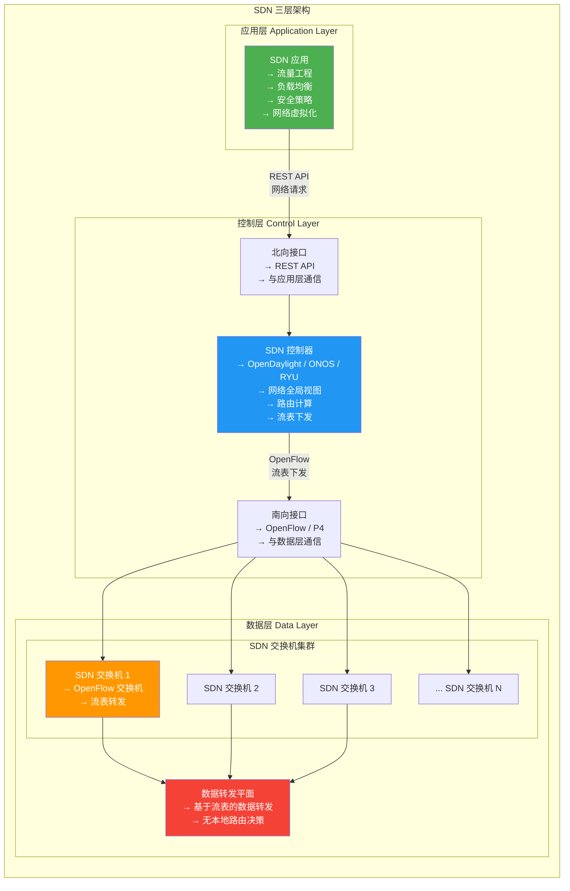
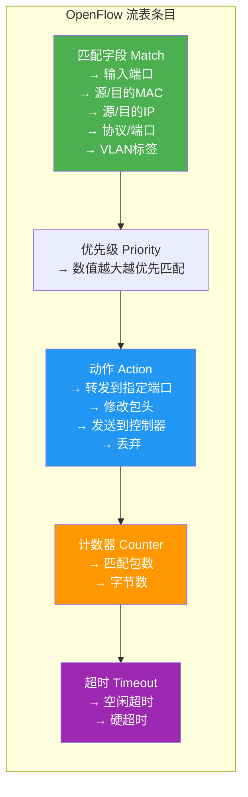
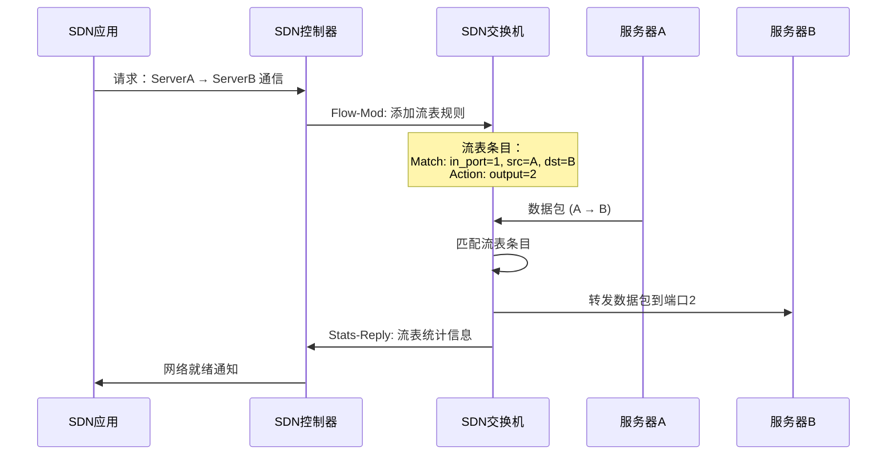
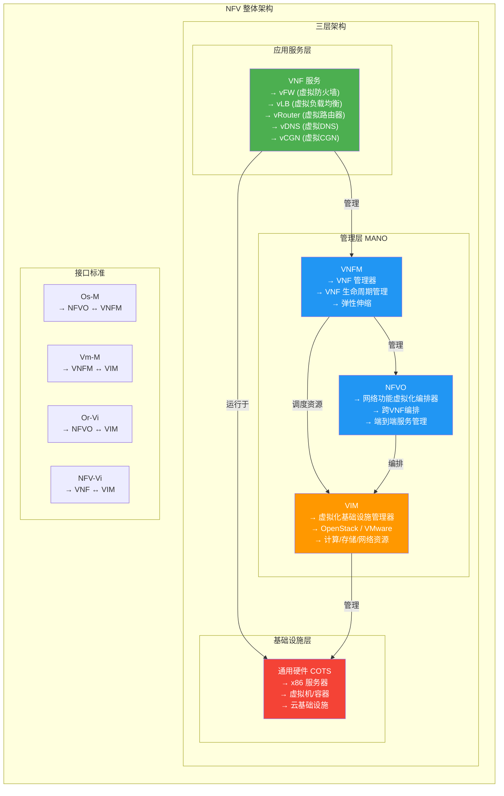
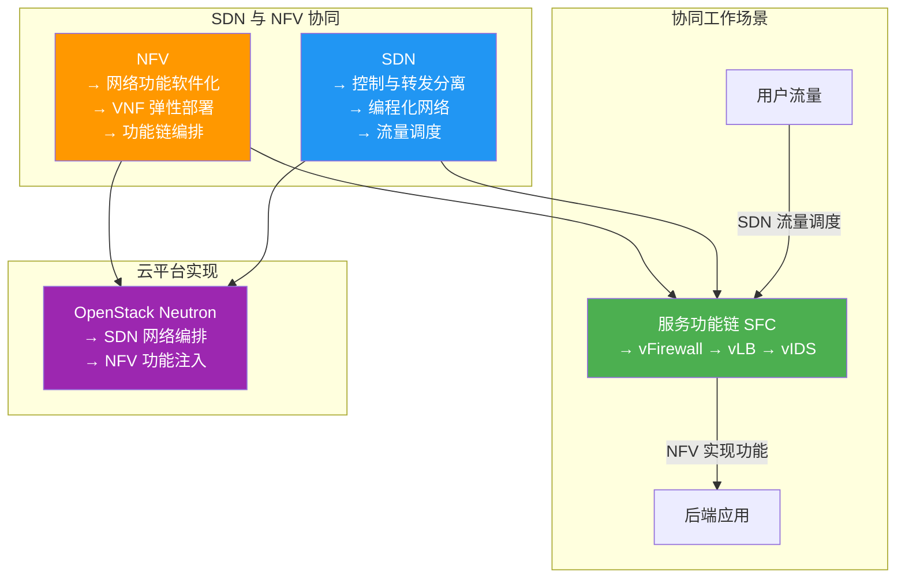
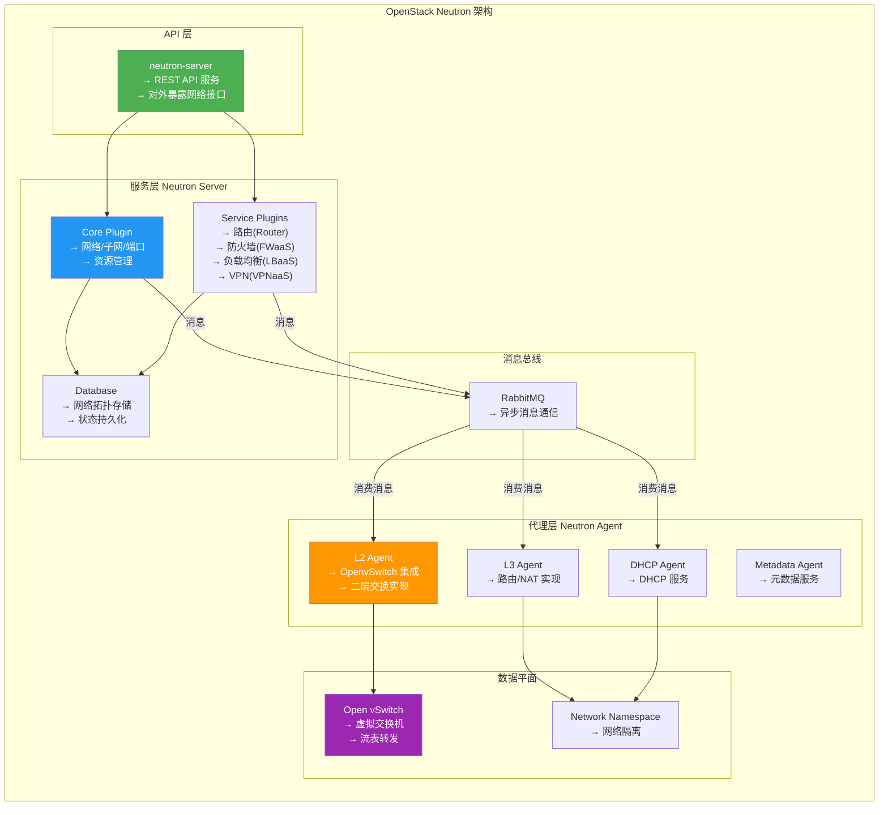

# 6.2 SDN与NFV技术

> [!abstract] 本节导读
> SDN（软件定义网络）和 NFV（网络功能虚拟化）是云网络技术的两大核心支柱。SDN 实现了网络控制与转发的分离，让网络像软件一样可编程；NFV 将传统专用硬件设备的网络功能以软件形式运行在通用服务器上。本节将深入剖析 SDN 的三层架构与 OpenFlow 协议、NFV 的 VNF 与 MANO 框架，并介绍 OpenStack Neutron 如何集成 SDN/NFV 技术实现云网络。

## 一、SDN（软件定义网络）

### SDN 基本概念

> [!definition] SDN（Software Defined Networking）
> SDN 是一种新型网络架构，其核心思想是将网络的控制平面（Control Plane）与数据平面（Data Plane）分离，通过集中式的控制器对网络进行编程化管理，实现网络资源的灵活调度和自动化编排。

### SDN 三层架构



**三层架构详解**：

| 层级 | 功能 | 核心组件 | 通信接口 |
|-----|------|---------|---------|
| **应用层** | 提供网络服务，实现业务逻辑 | SDN 应用（流量工程、LB、安全） | 北向接口（REST API） |
| **控制层** | 网络的"大脑"，计算路由、管理拓扑 | SDN 控制器（OpenDaylight、ONOS、RYU） | 北向/南向接口 |
| **数据层** | 网络的"肌肉"，基于流表转发数据 | SDN 交换机（OpenFlow 交换机） | 南向接口（OpenFlow） |

### OpenFlow 协议

> [!definition] OpenFlow
> OpenFlow 是 SDN 控制器与交换机之间的通信协议，定义了流表（Flow Table）的格式和交换机与控制器的交互标准，是 SDN 技术的事实标准。

**OpenFlow 流表结构**：



**OpenFlow 消息类型**：

| 消息类型 | 方向 | 功能 |
|---------|------|------|
| **Hello** | 双向 | 建立连接时的握手消息 |
| **Features** | Switch → Controller | 交换机能力通告 |
| **Packet-in** | Switch → Controller | 未匹配的数据包上报控制器 |
| **Packet-out** | Controller → Switch | 控制器下发数据包处理指令 |
| **Flow-mod** | Controller → Switch | 添加/修改/删除流表条目 |
| **Flow-removed** | Switch → Controller | 流表条目超时删除通知 |
| **Stats** | 双向 | 流表/端口统计信息查询 |

### OpenFlow 工作流程



### SDN vs 传统网络

| 维度 | 传统网络 | SDN |
|-----|---------|-----|
| **控制平面** | 分布式（每台交换机独立决策） | 集中式（控制器统一决策） |
| **数据平面** | 硬件绑定（ASIC 芯片） | 可编程（通用硬件 + 软件） |
| **配置方式** | CLI 逐台配置 | 软件编程统一编排 |
| **网络视图** | 分散管理，难以全局优化 | 控制器全局视图 |
| **变更速度** | 小时级（重新配置） | 分钟/秒级（编程下发） |
| **多租户** | VLAN/VXLAN 有限隔离 | 可编排网络虚拟化 |
| **成本** | 专用硬件成本高 | 通用硬件 + 软件 |
| **厂商锁定** | 强厂商锁定 | 开放标准，多厂商支持 |

## 二、NFV（网络功能虚拟化）

### NFV 基本概念

> [!definition] NFV（Network Functions Virtualization）
> NFV 是将传统专用硬件实现的网络功能（如防火墙、负载均衡器、路由器、DNS 等）虚拟化，以软件形式运行在通用服务器上的技术，实现网络功能的灵活部署和弹性伸缩。

### NFV 架构



**MANO 三层详解**：

| 层级 | 全称 | 职责 |
|-----|------|------|
| **NFVO** | NFV Orchestrator | 端到端服务编排，跨 VNF 编排，资源调度 |
| **VNFM** | VNF Manager | 单个 VNF 的生命周期管理（部署、伸缩、故障处理） |
| **VIM** | Virtualized Infrastructure Manager | 管理底层计算/存储/网络资源 |

### VNF 典型应用

| VNF 类型 | 功能 | 对应物理设备 |
|---------|------|-------------|
| **vFW** | 虚拟防火墙 | 硬件防火墙（如 ASA、Palo Alto） |
| **vLB** | 虚拟负载均衡 | 硬件负载均衡器（如 F5） |
| **vRouter** | 虚拟路由器 | 硬件路由器（如 Cisco ASR） |
| **vDNS** | 虚拟 DNS 解析 | 专用 DNS 设备 |
| **vCGN** | 虚拟运营商级 NAT | 专用 CGN 设备 |
| **vIPS** | 虚拟入侵防御 | 硬件 IPS 设备 |
| **vWAF** | 虚拟 Web 应用防火墙 | 硬件 WAF 设备 |

### NFV vs 传统硬件

| 维度 | 传统专用硬件 | NFV |
|-----|------------|-----|
| **部署时间** | 数天/周 | 分钟级 |
| **扩展能力** | 垂直扩展为主 | 水平弹性伸缩 |
| **成本** | 硬件采购成本高 | 通用硬件 + 软件 |
| **功能灵活性** | 固件固定功能 | 软件定义，可快速迭代 |
| **多租户支持** | 需要物理隔离 | 软件隔离，成本低 |
| **资源利用率** | 独立设备，利用率低 | 共享硬件，利用率高 |
| **管理复杂度** | 多厂商设备管理 | 统一管理平台 |

## 三、SDN 与 NFV 的关系



## 四、OpenStack Neutron 架构

### Neutron 组件概览

> [!definition] Neutron
> Neutron 是 OpenStack 的网络服务组件，提供虚拟网络的创建、配置和管理，深度集成 SDN 和 NFV 技术，是 OpenStack 云网络的核心。



### Neutron 核心资源

| 资源 | 说明 | 对应物理网络概念 |
|-----|------|----------------|
| **Network** | 二层网络，隔离的广播域 | VLAN / VXLAN |
| **Subnet** | 子网，IP 地址池 | IP 子网 |
| **Port** | 端口，网络连接点 | 交换机端口 |
| **Router** | 三层路由器 | 物理路由器 |
| **Security Group** | 安全组 | 虚拟防火墙 |
| **Floating IP** | 浮动 IP | 公有 IP 地址 |
| **LBaaS** | 负载均衡即服务 | 负载均衡器 |
| **VPNaaS** | VPN 即服务 | VPN 网关 |
| **FWaaS** | 防火墙即服务 | 硬件防火墙 |

### OpenFlow 流表编程示例

```python
from ryu.base import app_manager
from ryu.controller import ofp_event
from ryu.controller.handler import MAIN_DISPATCHER, CONFIG_DISPATCHER
from ryu.controller.handler import set_ev_cls
from ryu.ofproto import ofproto_v1_3


class SimpleSwitch(app_manager.RyuApp):
    OFP_VERSIONS = [ofproto_v1_3.OFP_VERSION]

    def __init__(self, *args, **kwargs):
        super(SimpleSwitch, self).__init__(*args, **kwargs)
        self.mac_to_port = {}

    @set_ev_cls(ofp_event.EventOFPSwitchFeatures, CONFIG_DISPATCHER)
    def switch_features_handler(self, ev):
        datapath = ev.msg.datapath
        ofproto = datapath.ofproto
        parser = datapath.ofproto_parser

        match = parser.OFPMatch()
        actions = [parser.OFPActionOutput(ofproto.OFPP_CONTROLLER,
                                          ofproto.OFPCML_NO_BUFFER)]
        self.add_flow(datapath, 0, match, actions)

    def add_flow(self, datapath, priority, match, actions,
                 buffer_id=None):
        ofproto = datapath.ofproto
        parser = datapath.ofproto_parser

        inst = [parser.OFPInstructionActions(ofproto.OFPIT_APPLY_ACTIONS,
                                             actions)]
        if buffer_id:
            mod = parser.OFPFlowMod(datapath=datapath, buffer_id=buffer_id,
                                    priority=priority, match=match,
                                    instructions=inst)
        else:
            mod = parser.OFPFlowMod(datapath=datapath, priority=priority,
                                    match=match, instructions=inst)
        datapath.send_msg(mod)

    @set_ev_cls(ofp_event.EventOFPPacketIn, MAIN_DISPATCHER)
    def _packet_in_handler(self, ev):
        msg = ev.msg
        datapath = msg.datapath
        ofproto = datapath.ofproto
        parser = datapath.ofproto_parser
        in_port = msg.match['in_port']

        pkt = packet.Packet(msg.data)
        eth = pkt.get_protocols(ethernet.ethernet)[0]

        dst = eth.dst
        src = eth.src

        dpid = datapath.id
        self.mac_to_port.setdefault(dpid, {})

        self.logger.info("packet in %s %s %s %s", dpid, src, dst, in_port)

        self.mac_to_port[dpid][src] = in_port

        if dst in self.mac_to_port[dpid]:
            out_port = self.mac_to_port[dpid][dst]
        else:
            out_port = ofproto.OFPP_FLOOD

        actions = [parser.OFPActionOutput(out_port)]

        data = None
        if msg.buffer_id == ofproto.OFP_NO_BUFFER:
            data = msg.data

        match = parser.OFPMatch(in_port=in_port, eth_dst=dst)
        self.add_flow(datapath, 1, match, actions,
                      msg.buffer_id)

        out = parser.OFPPacketOut(datapath=datapath, buffer_id=msg.buffer_id,
                                  in_port=in_port, actions=actions, data=data)
        datapath.send_msg(out)
```

## 五、小结

> [!summary] 本节要点回顾
> 1. **SDN 核心思想**：控制平面与数据平面分离，集中式控制器通过软件编程管理网络
> 2. **SDN 三层架构**：应用层（业务逻辑）→ 控制层（SDN 控制器）→ 数据层（OpenFlow 交换机）
> 3. **OpenFlow**：SDN 控制器与交换机的通信协议，定义了流表的匹配-转发模型
> 4. **NFV 核心思想**：将网络功能以 VNF 形式运行在通用服务器上，替代专用硬件
> 5. **NFV 架构**：VNF（功能实现）+ MANO（NFVO + VNFM + VIM，三层管理编排）
> 6. **SDN 与 NFV 关系**：SDN 负责网络流量调度，NFV 负责网络功能软件化，两者协同实现云网络
> 7. **OpenStack Neutron**：OpenStack 网络组件，集成 SDN/NFV，提供完整的虚拟网络服务

## 关联知识点

| 关联知识点 | 关系 |
|-----------|------|
| [[6.1 虚拟网络与VPC]] | VPC 底层基于 SDN 实现网络虚拟化 |
| [[6.3 云网络互联与SD-WAN]] | SD-WAN 基于 SDN 技术构建 |
| [[第4章 云计算架构与资源调度]] | OpenStack 整体架构中的 Neutron 组件 |
| [[第2章 虚拟化技术原理]] | NFV 依赖的虚拟化基础 |