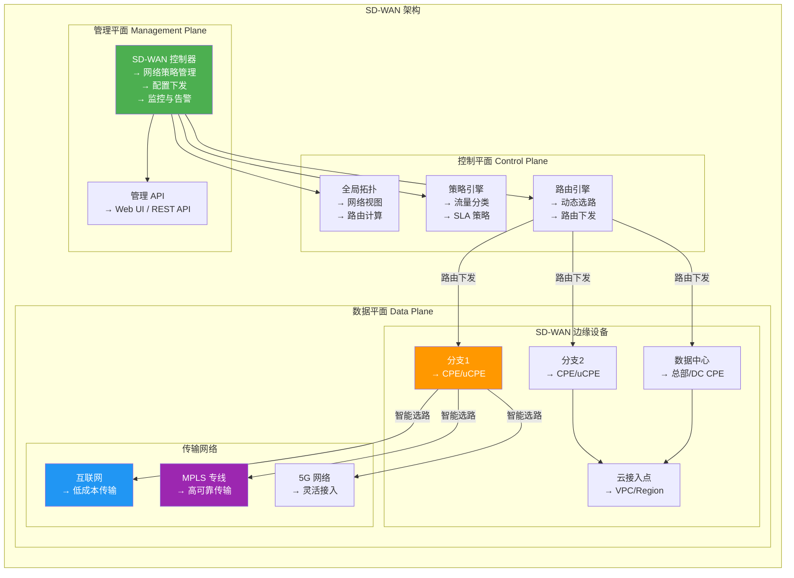
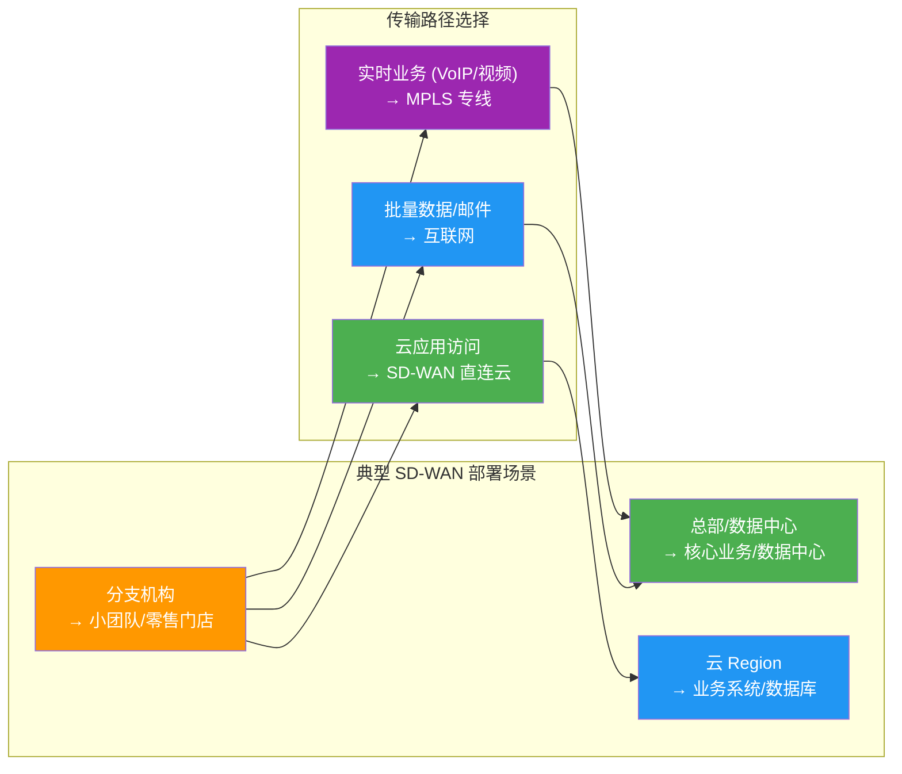
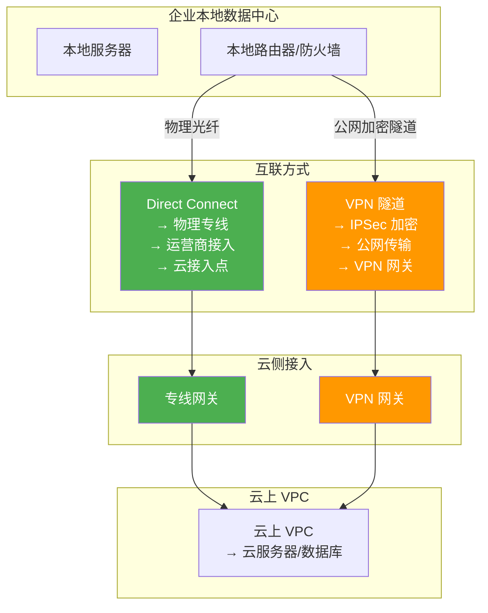
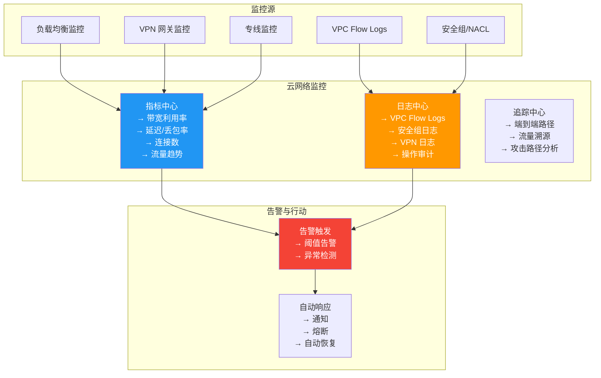
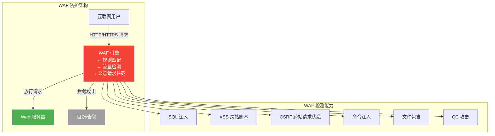
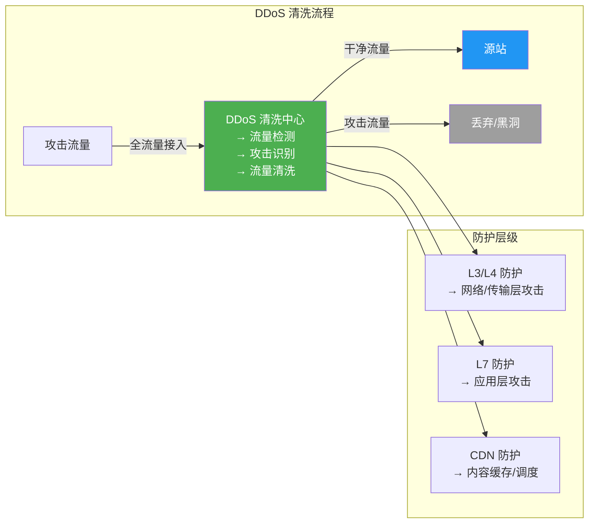

# 6.3 云网络互联与SD-WAN

> [!abstract] 本节导读
> 在多云和混合云成为主流架构的背景下，云网络互联技术至关重要。本节首先介绍云厂商的核心网络组件（VNet、VSwitch、VGateway），然后深入讲解 SD-WAN 的架构与应用场景，对比 Direct Connect 专线与 VPN 的差异，最后介绍云网络监控、故障排查和网络安全防护（WAF、DDoS 防护）等运维实践技术。

## 一、云网络核心组件

### 阿里云网络组件

> [!definition] VPC（Virtual Private Cloud）
> 阿里云的 VPC 与 AWS VPC 概念一致，是用户在云上的隔离私有网络空间。

> [!definition] VSwitch（虚拟交换机）
> VSwitch 是 VPC 内的虚拟交换机，对应 AWS 的 Subnet，是 VPC 的最小网络单元。

> [!definition] VGateway（虚拟网关）
> VGateway 是 VPC 的网络出入口，包括：
> - **Internet Gateway**：公网出入口
> - **NAT Gateway**：NAT 转换服务
> - **VPN Gateway**：VPN 接入服务
> - **Direct Connect Gateway**：专线接入网关

```mermaid
graph TB
    subgraph "阿里云 VPC 网络组件"
        direction TB

        subgraph "公网接入层"
            IGW[Internet Gateway<br/>→ 公网出入口]
            NAT_GW[NAT Gateway<br/>→ 私有子网出公网]
            VPN_GW[VPN Gateway<br/>→ VPN 站点接入]
            DC_GW[Direct Connect<br/>→ 专线接入]
        end

        subgraph "VPC 内部"
            direction TB
            VSwitch_Pub[VSwitch 公有<br/>→ 绑定 IGW]
            VSwitch_Priv[VSwitch 私有<br/>→ 绑定 NAT]
            RouteTable[路由表<br/>→ 流量策略]
            SecurityGroup[安全组<br/>→ 访问控制]
        end

        subgraph "云资源"
            direction TB
            ECS[ECS 实例]
            RDS[RDS 数据库]
            SLB[SLB 负载均衡]
        end

        IGW --> VSwitch_Pub
        NAT_GW --> VSwitch_Priv
        VPN_GW --> VSwitch_Priv
        DC_GW --> VSwitch_Priv
        VSwitch_Pub --> ECS
        VSwitch_Priv --> RDS
        VSwitch_Pub --> SLB
        RouteTable --> VSwitch_Pub
        RouteTable --> VSwitch_Priv
        SecurityGroup --> ECS

        style IGW fill:#4CAF50,color:#fff
        style NAT_GW fill:#FF9800,color:#fff
        style VPN_GW fill:#2196F3,color:#fff
        style DC_GW fill:#9C27B0,color:#fff
```

## 二、SD-WAN 架构

### SD-WAN 基本概念

> [!definition] SD-WAN（Software Defined Wide Area Network）
> SD-WAN 是利用 SDN 技术构建的新型广域网解决方案，通过集中控制和智能流量调度，实现企业分支机构与数据中心/云之间的高效、低成本互联。

### SD-WAN 三层平面架构



### SD-WAN 核心功能

| 功能 | 说明 |
|-----|------|
| **智能选路** | 根据 SLA/QoE 自动选择最优传输路径 |
| **流量分类** | 识别应用类型（视频、语音、数据）并差异化处理 |
| **策略路由** | 基于策略的路由，精细控制流量走向 |
| **动态带宽** | 根据流量需求动态调整带宽分配 |
| **多路径融合** | 同时使用互联网、MPLS、5G 等多种传输路径 |
| **云直连** | 分支机构直接访问云服务，无需经过总部 |
| **零信任安全** | 集成安全策略，实现端到端安全 |

### SD-WAN 应用场景



## 三、Direct Connect vs VPN

### 两种云互联方式对比

| 维度 | Direct Connect (专线) | VPN (Site-to-Site VPN) |
|-----|----------------------|----------------------|
| **连接方式** | 物理专线接入点 | 基于公网的加密隧道 |
| **带宽** | 1Gbps / 10Gbps 独享 | 共享公网带宽 |
| **延迟** | 稳定低延迟（<5ms） | 不稳定（依赖公网） |
| **可靠性** | SLA 保障（99.99%+） | 尽力而为 |
| **安全性** | 物理隔离，最高安全 | IPSec/TLS 加密 |
| **部署时间** | 数天至数周 | 分钟级 |
| **成本** | 高（专线月租费） | 低（VPN 网关费） |
| **适用场景** | 核心业务、大数据传输、金融交易 | 远程办公、小流量接入 |
| **典型协议** | 以太网、MPLS | IPSec、SSL VPN |

### 互联方案架构图



### 选型建议

> [!tip] 何时选择 Direct Connect
> - 核心业务系统（如交易系统）需要稳定低延迟
> - 大批量数据传输（如数据库迁移、大数据分析）
> - 金融、医疗等对数据安全和合规性要求高的行业
> - 需要 SLA 保障的生产环境

> [!tip] 何时选择 VPN
> - 初创企业或中小型企业，预算有限
> - 远程员工接入或分支机构互联
> - 灾备备份链路（作为专线的补充）
> - 临时或短期互联需求

## 四、网络监控与故障排查

### 云网络监控体系



### 常见网络故障排查

| 故障现象 | 可能原因 | 排查方法 |
|---------|---------|---------|
| VPC 内实例无法访问公网 | 路由表无默认路由、NAT 未配置 | 检查路由表、NAT 网关状态 |
| 跨 VPC 无法互通 | 对等连接未建立、CIDR 重叠 | 检查对等连接状态、路由配置 |
| 实例无法被公网访问 | 安全组未放通、无公网 IP | 检查安全组规则、绑定 EIP |
| VPN 连接断开 | 网络不稳定、配置错误 | 检查 VPN 网关日志、预共享密钥 |
| 网络延迟高 | 路径不理想、带宽瓶颈 | 使用 ping/mtr 检查路径、优化路由 |

## 五、云网络安全

### WAF（Web 应用防火墙）

> [!definition] WAF（Web Application Firewall）
> WAF 是专门保护 Web 应用的防火墙，通过对 HTTP/HTTPS 流量的深度检测，防御 SQL 注入、XSS、CSRF 等 Web 层攻击。



### DDoS 防护

> [!definition] DDoS 防护
> DDoS（Distributed Denial of Service）防护通过清洗流量、黑洞引流等方式抵御分布式拒绝服务攻击，保障业务可用性。

**DDoS 攻击类型与防护**：

| 攻击类型 | 层级 | 防护方式 |
|---------|------|---------|
| **SYN Flood** | 传输层 | SYN Cookie、连接速率限制 |
| **UDP Flood** | 传输层 | 流量清洗、协议限速 |
| **ICMP Flood** | 网络层 | 流量清洗、黑洞引流 |
| **HTTP Flood** | 应用层 | 频率限制、验证码人机识别 |
| **Slowloris** | 应用层 | 连接数限制、超时检测 |
| **DNS Flood** | 应用层 | DNS 缓存、Anycast 调度 |



## 六、Python 网络自动化示例

### VPC 网络自动化脚本

```python
import ipaddress
import json


class VPNAutomation:
    def __init__(self, vpc_cidr):
        self.vpc_cidr = ipaddress.IPv4Network(vpc_cidr, strict=False)
        self.subnets = []
        self.routes = []

    def calculate_subnets(self, subnet_cidrs):
        for cidr in subnet_cidrs:
            subnet = ipaddress.IPv4Network(cidr, strict=False)
            if subnet.subnet_of(self.vpc_cidr):
                self.subnets.append({
                    "cidr": cidr,
                    "gateway": str(list(subnet.hosts())[0]),
                    "usable_ips": subnet.num_addresses - 2
                })
            else:
                raise ValueError(f"{cidr} 不在 VPC {self.vpc_cidr} 内")
        return self.subnets

    def generate_route_table(self, public_subnet=True, nat_subnet=False,
                              peer_cidr=None):
        routes = [
            {"destination": str(self.vpc_cidr), "next_hop": "local",
             "description": "VPC 内部路由"}
        ]
        if public_subnet:
            routes.append({"destination": "0.0.0.0/0",
                           "next_hop": "Internet Gateway",
                           "description": "公网出口"})
        if nat_subnet:
            routes.append({"destination": "0.0.0.0/0",
                           "next_hop": "NAT Gateway",
                           "description": "NAT 出口"})
        if peer_cidr:
            routes.append({"destination": peer_cidr,
                           "next_hop": "VPC Peering",
                           "description": "对等连接路由"})
        self.routes = routes
        return routes

    def to_dict(self):
        return {
            "vpc_cidr": str(self.vpc_cidr),
            "subnets": self.subnets,
            "routes": self.routes
        }


vpn_auto = VPNAutomation("10.0.0.0/16")
subnets = vpn_auto.calculate_subnets(["10.0.1.0/24", "10.0.2.0/24", "10.0.3.0/24"])
routes = vpn_auto.generate_route_table(public_subnet=True,
                                        nat_subnet=True,
                                        peer_cidr="172.16.0.0/16")
print(json.dumps(vpn_auto.to_dict(), indent=2, ensure_ascii=False))


class SecurityGroupAutomation:
    def __init__(self, name):
        self.name = name
        self.inbound_rules = []
        self.outbound_rules = []

    def add_inbound_web(self, cidr="0.0.0.0/0"):
        self.inbound_rules.append({
            "protocol": "tcp", "port": 80, "source": cidr, "action": "allow"
        })
        self.inbound_rules.append({
            "protocol": "tcp", "port": 443, "source": cidr, "action": "allow"
        })

    def add_inbound_ssh(self, cidr="10.0.0.0/16"):
        self.inbound_rules.append({
            "protocol": "tcp", "port": 22, "source": cidr, "action": "allow"
        })

    def add_inbound_db(self, cidr="10.0.0.0/16"):
        self.inbound_rules.append({
            "protocol": "tcp", "port": 3306, "source": cidr, "action": "allow"
        })

    def add_outbound_all(self):
        self.outbound_rules.append({
            "protocol": "-1", "port": -1, "destination": "0.0.0.0/0",
            "action": "allow"
        })

    def export_rules(self):
        return {
            "security_group": self.name,
            "inbound": self.inbound_rules,
            "outbound": self.outbound_rules
        }


sg = SecurityGroupAutomation("web-sg")
sg.add_inbound_web("0.0.0.0/0")
sg.add_inbound_ssh("10.0.0.0/16")
sg.add_outbound_all()
print(json.dumps(sg.export_rules(), indent=2, ensure_ascii=False))
```

## 七、小结

> [!summary] 本节要点回顾
> 1. **云网络组件**：VNet/VSwitch/VGateway 构成云网络的基本单元，对应 VPC/Subnet/Gateway
> 2. **SD-WAN**：基于 SDN 的广域网方案，管理平面、控制平面、数据平面三层架构，实现智能选路
> 3. **SD-WAN 应用**：多分支互联、云直连、多路径融合、动态带宽调整
> 4. **Direct Connect vs VPN**：专线高带宽低延迟高成本，VPN 低成本但依赖公网质量
> 5. **网络监控**：指标监控、日志审计、流量追踪三位一体
> 6. **网络安全**：WAF 防御 Web 攻击，DDoS 防护清洗恶意流量

## 关联知识点

| 关联知识点 | 关系 |
|-----------|------|
| [[6.1 虚拟网络与VPC]] | VPC 的互联配置是本节的基础 |
| [[6.2 SDN与NFV技术]] | SD-WAN 基于 SDN 技术实现 |
| [[第7章 弹性伸缩与负载均衡技术]] | 云网络中的负载均衡器 |
| [[第8章 云安全技术]] | WAF、DDoS 与云安全的深入讨论 |