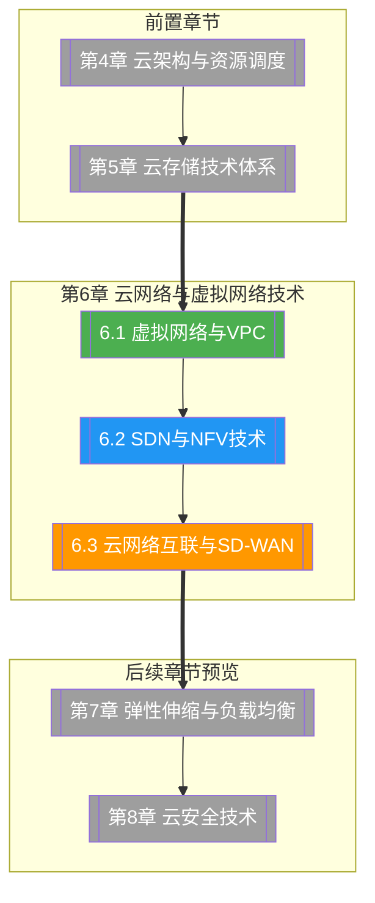

# 第6章 云网络与虚拟网络技术

> [!abstract] 章节概述
> 网络是云计算的"血管和神经"。本章系统构建云网络的完整技术体系：首先介绍虚拟网络与 VPC 的核心概念与架构设计，深入剖析 SDN（软件定义网络）与 NFV（网络功能虚拟化）的技术原理，最后讲解云网络互联方案与 SD-WAN 的应用实践。通过本章学习，读者将理解云环境下网络从硬件依赖走向软件定义的演进路径，掌握 VPC 设计、SDN/NFV 架构、云网络互联等关键技能。

## 学习路线图

## 知识点导航

| 编号 | 知识点 | 核心内容 | 重要程度 |
|-----|--------|---------|---------|
| 6.1 | [[6.1 虚拟网络与VPC]] | 虚拟网络概述、VPC架构(子网/路由表/安全组/NACL)、VPC对等连接与端点、公有/私有子网对比、VPC设计最佳实践 | ⭐⭐⭐⭐⭐ |
| 6.2 | [[6.2 SDN与NFV技术]] | SDN架构与OpenFlow、NFV与VNF/MANO、SDN vs 传统网络、OpenStack Neutron架构、流表编程 | ⭐⭐⭐⭐⭐ |
| 6.3 | [[6.3 云网络互联与SD-WAN]] | VNet/VSwitch/VGateway、SD-WAN架构与应用场景、Direct Connect vs VPN、网络监控与故障排查、网络安全(WAF/DDoS) | ⭐⭐⭐⭐ |

## 核心概念速览

> [!tip] 本章必须掌握的核心概念
> - **虚拟网络**：在物理网络之上通过软件模拟的网络，实现网络资源的虚拟化
> - **VPC（Virtual Private Cloud）**：云上隔离的私有网络空间，用户可自定义 IP 段、路由表和子网
> - **安全组（Security Group）**：实例级别的状态化防火墙规则，默认拒绝入站流量
> - **NACL（网络访问控制列表）**：子网级别的无状态 ACL，作为安全组的补充
> - **SDN（软件定义网络）**：控制平面与数据平面分离的新型网络架构，通过软件编程实现网络调度
> - **NFV（网络功能虚拟化）**：将传统硬件网络功能（防火墙、LB、路由器等）虚拟化，以软件形式实现
> - **SD-WAN（软件定义广域网）**：基于 SDN 技术的广域网方案，实现智能选路和流量调度
> - **OpenFlow**：SDN 控制器与交换机之间的通信协议，定义了流表的标准接口
> - **Direct Connect**：云厂商提供的专线接入服务，比 VPN 提供更高带宽和更低延迟

## 核心考点

> [!important] 期末高频考点

| 考点 | 所属知识点 | 考查形式 | 难度 |
|-----|-----------|---------|------|
| 虚拟网络与 VPC 的核心组件 | 6.1 | 简答题/选择题 | ★★★ |
| 安全组与 NACL 的区别与联系 | 6.1 | 对比题 | ★★★ |
| VPC 公有子网与私有子网的设计 | 6.1 | 案例分析 | ★★★★ |
| SDN 三层架构与 OpenFlow 工作原理 | 6.2 | 论述题 | ★★★★ |
| SDN 与传统网络的对比 | 6.2 | 对比题/简答题 | ★★★ |
| NFV 架构：VNF、MANO 各层职责 | 6.2 | 简答题 | ★★★★ |
| OpenStack Neutron 组件与工作流程 | 6.2 | 论述题 | ★★★★ |
| SD-WAN 架构与三大平面的作用 | 6.3 | 简答题 | ★★★ |
| Direct Connect 与 VPN 的对比与选型 | 6.3 | 对比题/案例分析 | ★★★★ |
| 云网络安全：WAF、DDoS 防护原理 | 6.3 | 简答题 | ★★★ |

## 自测题

> [!question] 章节自测
> 1. 阐述 VPC 的核心组件（子网、路由表、安全组、NACL）各自的作用，并说明它们之间的协作关系。
> 2. 简述 SDN 三层架构（应用层、控制层、数据层）的主要功能，并说明 OpenFlow 协议在其中的作用。
> 3. 对比 NFV 与传统专用硬件网络设备的优缺点，分析 NFV 为何成为云时代的关键技术。
> 4. 某企业需要将本地数据中心与阿里云 VPC 互联，业务包括实时交易系统（低延迟要求）和批量数据同步。请选择合适的互联方案并说明理由。
> 5. 使用 Python 编写一个简单的网络自动化脚本，实现 VPC 安全组规则的批量配置功能。

## 章节导航

| 方向 | 链接 |
|-----|------|
| ⬆ 返回课程总览 | [[MOC - 云计算技术]] |
| ⬅ 上一章 | [[第5章 云存储技术体系/MOC - 第5章]] |
| ➡ 下一章 | [[第7章 弹性伸缩与负载均衡技术/MOC - 第7章]] |