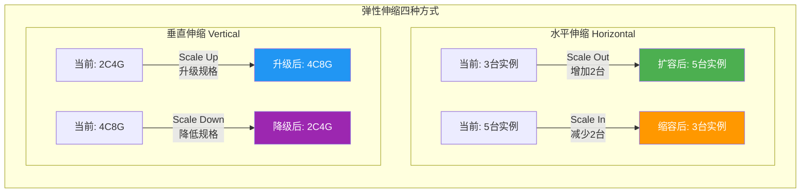
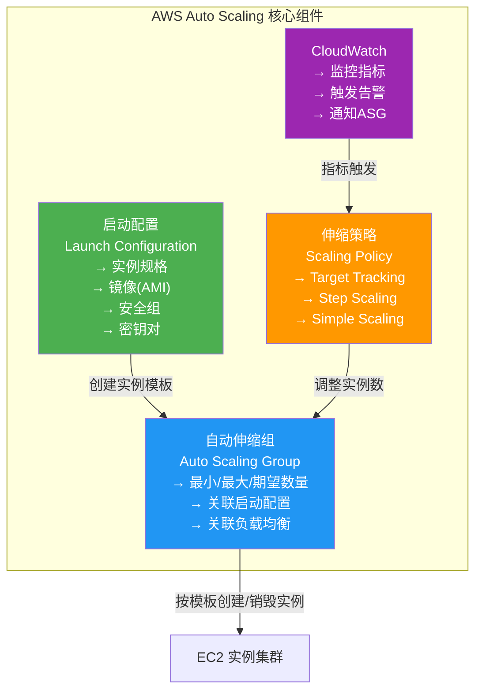
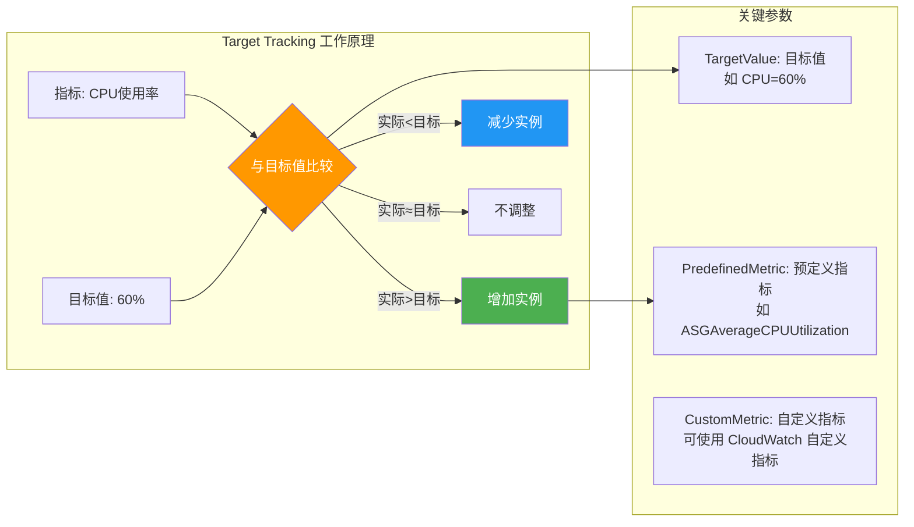
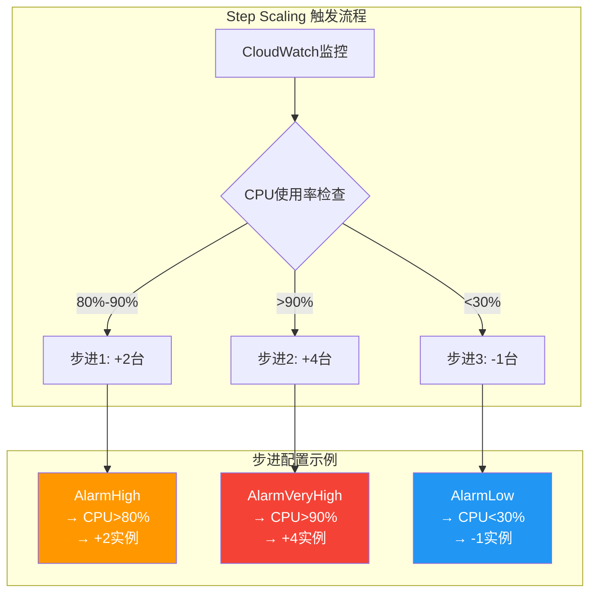
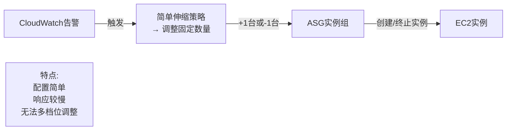
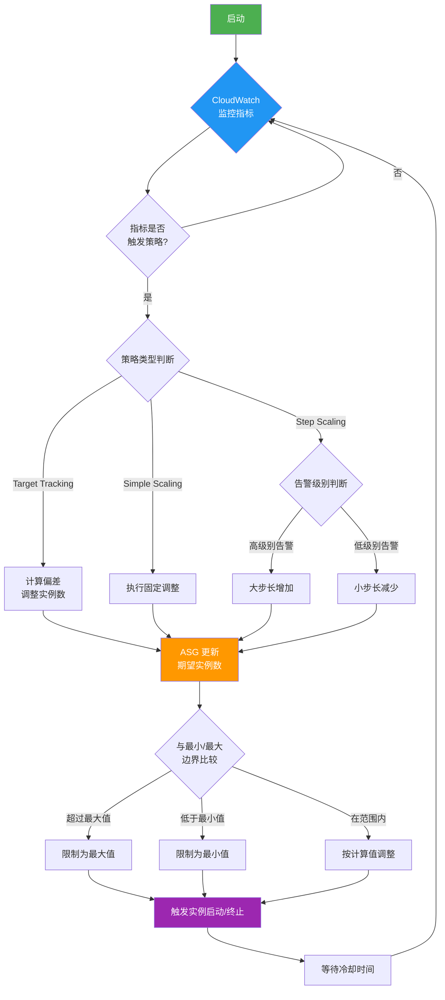
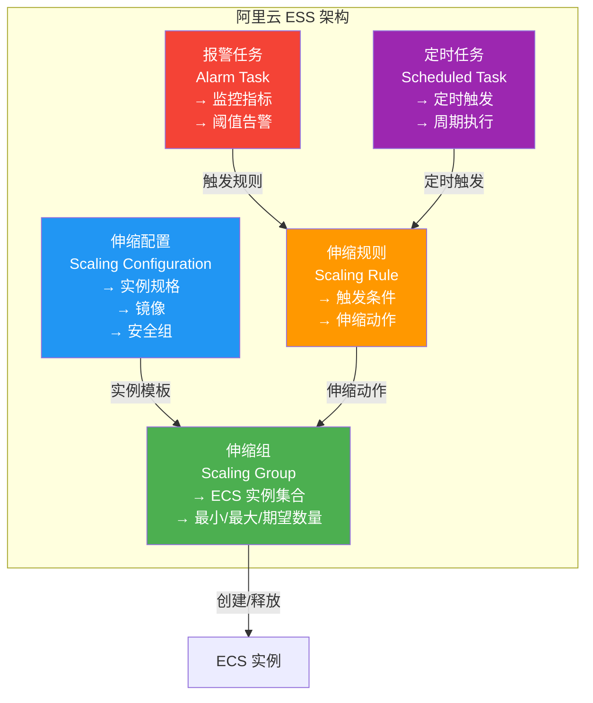
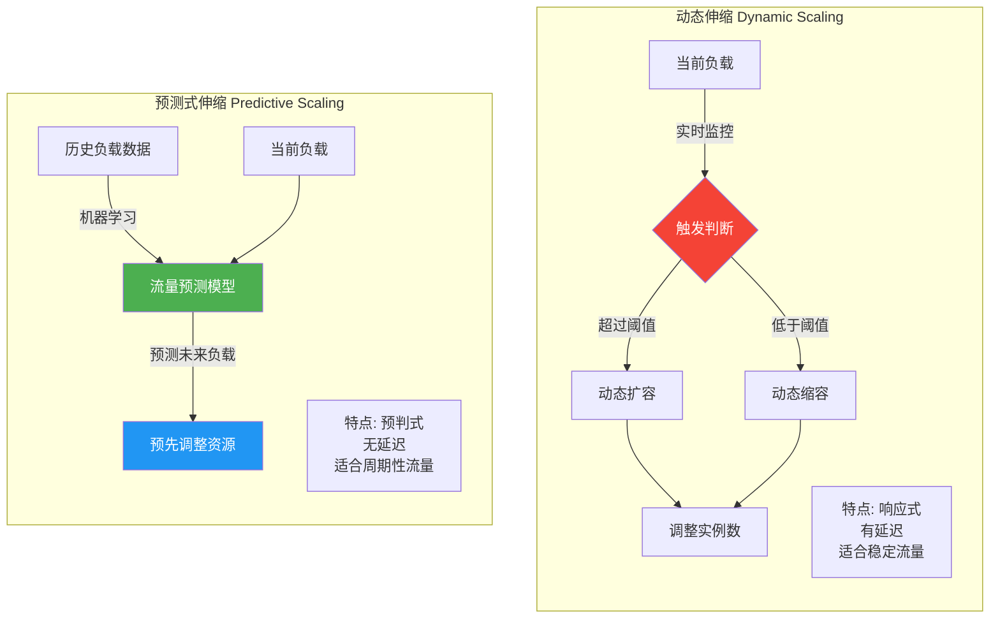

# 7.1 弹性伸缩技术

> [!abstract] 本节导读
> 弹性伸缩是云计算"按需付费"理念的核心实现。本节首先介绍弹性伸缩的基本概念和四种类型（Scale In/Out/Up/Down），然后以 AWS Auto Scaling 为蓝本深入讲解弹性伸缩的核心组件和三种扩展策略，接着介绍阿里云 ESS 的实现方式，最后讨论预测式伸缩与动态伸缩的区别，并通过 Mermaid 流程图展示完整的伸缩工作流。

## 一、弹性伸缩概述

### 什么是弹性伸缩

> [!definition] 弹性伸缩（Auto Scaling）
> 弹性伸缩是一种根据业务负载动态调整云资源数量的能力，确保在流量高峰时自动增加资源（扩容），在流量低谷时自动减少资源（缩容），实现资源利用率和成本的最优化。

### 弹性伸缩四象限

```mermaid
quadrantChart
    title 弹性伸缩四象限
    x-axis "减少资源" --> "增加资源"
    y-axis "垂直方向（规格）" --> "水平方向（数量）"
    quadrant-1 Scale Up: "Scale Up<br/>垂直扩容<br/>增加CPU/内存"
    quadrant-2 Scale Out: "Scale Out<br/>水平扩容<br/>增加实例数量"
    quadrant-3 Scale Down: "Scale Down<br/>垂直缩容<br/>减少CPU/内存"
    quadrant-4 Scale In: "Scale In<br/>水平缩容<br/>减少实例数量"
```

### 四种伸缩类型对比

| 类型 | 方向 | 操作 | 适用场景 | 注意事项 |
|-----|------|------|---------|---------|
| **Scale Out** | 水平增加 | 增加实例数量 | 无状态应用、Web 服务 | 需要负载均衡支持 |
| **Scale In** | 水平减少 | 减少实例数量 | 流量下降时 | 注意会话一致性 |
| **Scale Up** | 垂直增加 | 增加 CPU/内存规格 | 单实例性能不足 | 需要停机或热升级 |
| **Scale Down** | 垂直减少 | 降低 CPU/内存规格 | 资源闲置时 | 评估业务最低需求 |



## 二、AWS Auto Scaling

### 核心组件

> [!definition] AWS Auto Scaling
> AWS Auto Scaling 是 Amazon Web Services 提供的弹性伸缩服务，通过自动调整 EC2 实例数量来维持应用的性能和可用性。



**组件详解**：

| 组件 | 说明 | 核心配置项 |
|-----|------|-----------|
| **启动配置** | 定义新实例的创建模板 | 实例类型、AMI、安全组、IAM 角色、用户数据 |
| **ASG** | 管理一组相同配置的实例 | 最小数、最大数、期望数、冷却时间、健康检查 |
| **伸缩策略** | 定义何时以及如何伸缩 | 策略类型、调整参数、 cooldown 时间 |
| **CloudWatch** | 监控指标并触发伸缩 | 指标类型、阈值、告警动作 |

### 三种伸缩策略

#### 1. Target Tracking Scaling（目标跟踪伸缩）

> [!definition] Target Tracking
> 目标跟踪伸缩是最常用的策略，自动调整实例数量使目标指标（如 CPU 使用率）维持在设定的目标值附近。



#### 2. Step Scaling（步进伸缩）

> [!definition] Step Scaling
> 步进伸缩根据告警触发，按照预设的步进调整实例数量，每个步进定义了触发阈值和调整幅度。

| 步进 | 触发条件 | 调整动作 |
|-----|---------|---------|
| Step 1 | CPU > 80% 持续 5 分钟 | 增加 2 台实例 |
| Step 2 | CPU > 90% 持续 5 分钟 | 增加 4 台实例 |
| Step 3 | CPU < 30% 持续 10 分钟 | 减少 1 台实例 |



#### 3. Simple Scaling（简单伸缩）

> [!definition] Simple Scaling
> 简单伸缩基于单个告警触发，每次触发时调整固定数量的实例，配置简单但不够灵活。



### 三种策略对比

| 维度 | Target Tracking | Step Scaling | Simple Scaling |
|-----|----------------|-------------|----------------|
| **复杂度** | 低（自动调整） | 中（需配置步进） | 低 |
| **灵活性** | 高（自动适应） | 中（多档位） | 低 |
| **响应速度** | 中等 | 快（步进触发） | 慢（单次调整） |
| **适用场景** | 大部分通用场景 | 流量突变场景 | 简单固定场景 |
| **配置项** | 目标指标和值 | 多个告警+步进动作 | 单个告警+固定动作 |
| **精确度** | 高（持续跟踪） | 中（步进调整） | 低（一次调整） |

### 伸缩工作流



## 三、阿里云 ESS

### ESS 核心概念

> [!definition] ESS（Elastic Scaling Service）
> ESS 是阿里云的弹性伸缩服务，提供与 AWS Auto Scaling 类似的功能，支持针对 ECS 实例的自动化伸缩管理。



**ESS 与 AWS ASG 对应关系**：

| 阿里云 ESS | AWS Auto Scaling | 功能 |
|-----------|-----------------|------|
| 伸缩组 (Scaling Group) | ASG | 管理实例集合 |
| 伸缩配置 (Scaling Configuration) | 启动配置 | 实例创建模板 |
| 伸缩规则 (Scaling Rule) | 伸缩策略 | 定义伸缩动作 |
| 报警任务 (Alarm Task) | CloudWatch 告警 | 监控触发 |
| 定时任务 (Scheduled Task) | 计划伸缩 | 定时触发 |

## 四、预测式伸缩 vs 动态伸缩

### 两种伸缩模式



| 维度 | 动态伸缩 | 预测式伸缩 |
|-----|---------|-----------|
| **触发方式** | 实时指标触发 | 历史数据预测 |
| **响应时机** | 事后响应（有延迟） | 事前预判（零延迟） |
| **实现复杂度** | 简单 | 复杂（需 ML 模型） |
| **适用场景** | 流量随机波动 | 流量有周期性规律 |
| **资源利用** | 可能有短暂过载 | 更平滑的资源分配 |
| **成本优化** | 中等 | 更高（更精准） |

### AWS Predictive Scaling 示例

> AWS 基于 CloudWatch 的历史数据和机器学习算法，预测特定时段的流量趋势，提前调整实例数量。例如，电商平台可以预测双十一、促销日的流量高峰，提前扩容。

## 五、Auto Scaling 配置示例

### AWS Auto Scaling (boto3)

```python
import boto3
from datetime import datetime, timedelta

autoscaling = boto3.client('autoscaling', region_name='us-east-1')
cloudwatch = boto3.client('cloudwatch', region_name='us-east-1')

launch_config = autoscaling.create_launch_configuration(
    LaunchConfigurationName='web-app-lc',
    ImageId='ami-0c55b159cbfafe1f0',
    InstanceType='t3.medium',
    SecurityGroups=['sg-xxxxxxxx'],
    KeyName='my-key-pair',
    UserData='''#!/bin/bash
                echo "Hello World" > /var/www/html/index.html
                ''',
    BlockDeviceMappings=[
        {
            'DeviceName': '/dev/sda1',
            'Ebs': {
                'VolumeSize': 30,
                'VolumeType': 'gp3'
            }
        }
    ]
)

asg = autoscaling.create_auto_scaling_group(
    AutoScalingGroupName='web-app-asg',
    LaunchConfigurationName='web-app-lc',
    MinSize=2,
    MaxSize=10,
    DesiredCapacity=3,
    AvailabilityZones=['us-east-1a', 'us-east-1b'],
    LoadBalancerNames=['web-app-elb'],
    HealthCheckType='ELB',
    HealthCheckGracePeriod=300,
    DefaultCooldown=300,
    TerminationPolicies=['OldestInstance']
)

target_tracking_policy = autoscaling.put_target_tracking_scaling_policy(
    AutoScalingGroupName='web-app-asg',
    PolicyName='cpu-target-tracking',
    TargetTrackingScalingPolicyConfiguration={
        'TargetValue': 60.0,
        'PredefinedMetricSpecification': {
            'PredefinedMetricType': 'ASGAverageCPUUtilization'
        },
        'ScaleInCooldown': 300,
        'ScaleOutCooldown': 300
    }
)

step_policy_high = autoscaling.put_scaling_policy(
    AutoScalingGroupName='web-app-asg',
    PolicyName='cpu-high-step',
    PolicyType='StepScaling',
    StepScalingPolicyConfiguration={
        'AdjustmentType': 'ChangeInCapacity',
        'StepAdjustments': [
            {
                'MetricIntervalLowerBound': 0,
                'MetricIntervalUpperBound': 50,
                'ScalingAdjustment': 2
            }
        ],
        'Cooldown': 300
    },
    CloudWatchAlarmSpecification={
        'CloudWatchAlarmName': 'cpu-high-alarm',
        'CloudWatchAlarmConfiguration': {
            'ComparisonOperator': 'GreaterThanThreshold',
            'EvaluationPeriods': 2,
            'MetricName': 'CPUUtilization',
            'Namespace': 'AWS/EC2',
            'Period': 300,
            'Statistic': 'Average',
            'Threshold': 80.0
        }
    }
)

print("Auto Scaling Group created successfully!")
print(f"ASG Name: web-app-asg")
print(f"Min: 2, Max: 10, Desired: 3")
print(f"Target Tracking CPU: 60%")
```

### 模拟伸缩过程

```python
import time
import random


class AutoScalingSimulator:
    def __init__(self, min_size, max_size, target_cpu=60.0):
        self.min_size = min_size
        self.max_size = max_size
        self.target_cpu = target_cpu
        self.current_size = (min_size + max_size) // 2
        self.cooldown = 300
        self.last_scale_time = 0
        self.history = []

    def get_current_cpu(self):
        base_cpu = 50.0
        load_factor = random.gauss(0, 10)
        if self.current_size < 3:
            load_factor += 20
        elif self.current_size > 8:
            load_factor -= 15
        return max(5, min(98, base_cpu + load_factor))

    def target_tracking_scale(self):
        current_time = time.time()
        if current_time - self.last_scale_time < self.cooldown:
            return self.current_size

        cpu = self.get_current_cpu()
        adjustment = 0

        if cpu > self.target_cpu + 5:
            scale_factor = cpu / self.target_cpu
            adjustment = max(1, int(self.current_size * (scale_factor - 1)))
        elif cpu < self.target_cpu - 10:
            scale_factor = cpu / self.target_cpu
            adjustment = -max(1, int(self.current_size * (1 - scale_factor)))

        new_size = self.current_size + adjustment
        new_size = max(self.min_size, min(self.max_size, new_size))

        if new_size != self.current_size:
            self.last_scale_time = current_time
            self.current_size = new_size
            action = "扩容" if adjustment > 0 else "缩容"
            print(f"[Target Tracking] CPU: {cpu:.1f}% → {action} → "
                  f"实例数: {self.current_size}")

        self.history.append({
            'time': current_time,
            'cpu': cpu,
            'size': self.current_size
        })
        return self.current_size

    def step_scale(self, cpu):
        current_time = time.time()
        if current_time - self.last_scale_time < self.cooldown:
            return self.current_size

        if cpu > 90:
            new_size = min(self.max_size, self.current_size + 4)
        elif cpu > 80:
            new_size = min(self.max_size, self.current_size + 2)
        elif cpu < 30:
            new_size = max(self.min_size, self.current_size - 1)
        else:
            new_size = self.current_size

        if new_size != self.current_size:
            self.last_scale_time = current_time
            self.current_size = new_size
            print(f"[Step Scaling] CPU: {cpu:.1f}% → 调整 → "
                  f"实例数: {self.current_size}")

        return self.current_size


simulator = AutoScalingSimulator(min_size=2, max_size=10, target_cpu=60.0)

for i in range(10):
    cpu = simulator.get_current_cpu()
    print(f"模拟周期 {i+1}: CPU={cpu:.1f}%, 当前实例数={simulator.current_size}")
    simulator.target_tracking_scale()
    time.sleep(1)

print(f"\n最终实例数: {simulator.current_size}")
print(f"历史记录: {len(simulator.history)} 条")
```

## 六、小结

> [!summary] 本节要点回顾
> 1. **弹性伸缩四象限**：Scale Out（水平扩容）、Scale In（水平缩容）、Scale Up（垂直扩容）、Scale Down（垂直缩容）
> 2. **AWS Auto Scaling 核心组件**：启动配置、ASG、伸缩策略、CloudWatch 监控
> 3. **三种伸缩策略**：Target Tracking（目标跟踪，最常用）、Step Scaling（步进伸缩，多档位）、Simple Scaling（简单伸缩）
> 4. **阿里云 ESS**：对应 AWS Auto Scaling，核心概念为伸缩组、伸缩配置、伸缩规则
> 5. **预测式 vs 动态伸缩**：预测式基于 ML 预判流量，动态基于实时指标响应
> 6. **最佳实践**：使用 Target Tracking 策略、合理设置冷却时间、配合负载均衡器、预测式伸缩应对周期流量

## 关联知识点

| 关联知识点 | 关系 |
|-----------|------|
| [[7.2 负载均衡技术]] | 弹性伸缩的实例自动注册到负载均衡器 |
| [[7.3 云资源监控与告警]] | CloudWatch 指标触发自动伸缩 |
| [[6.1 虚拟网络与VPC]] | 弹性伸缩组部署在 VPC 内的子网中 |
| [[第4章 云计算架构与资源调度]] | OpenStack 热伸缩与冷迁移 |