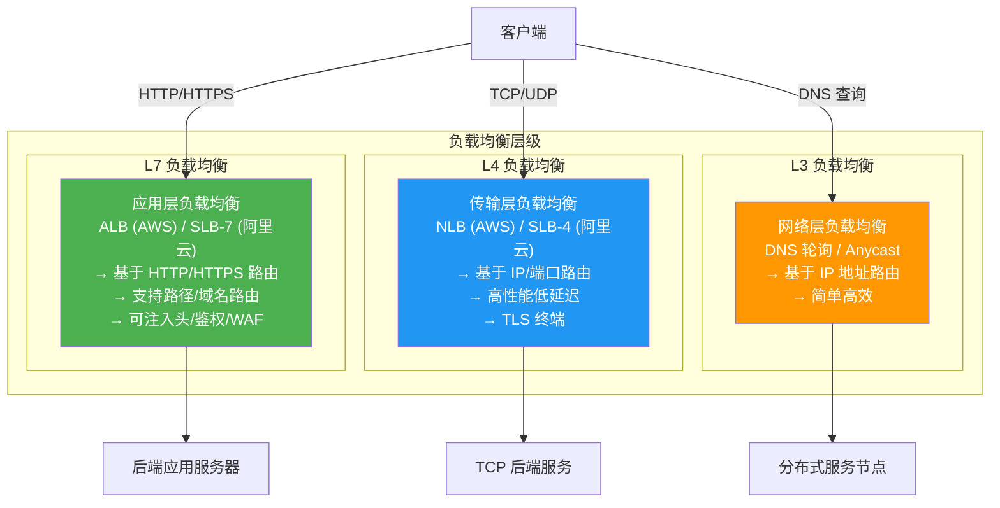
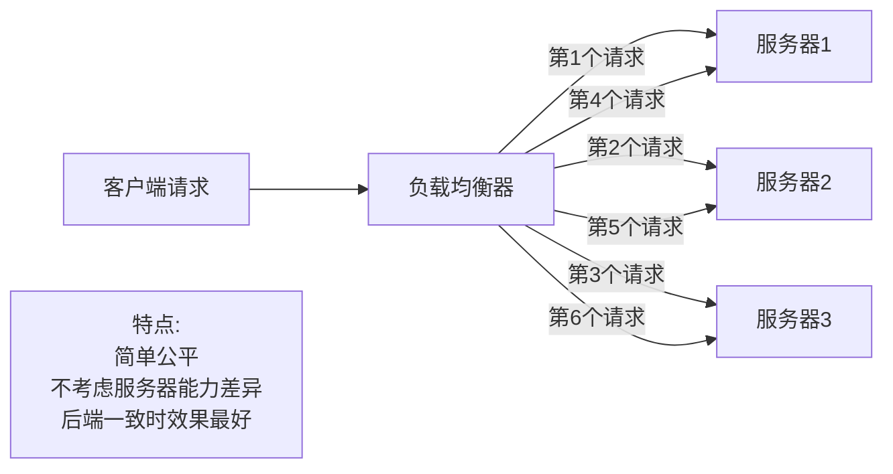
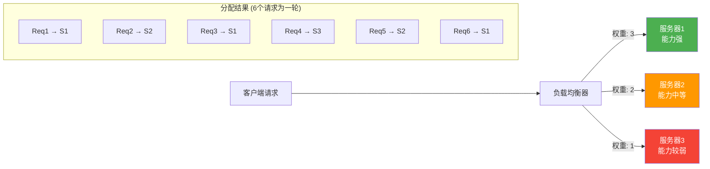
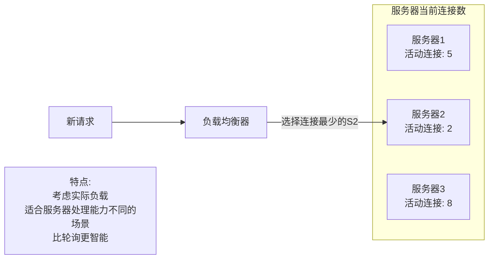
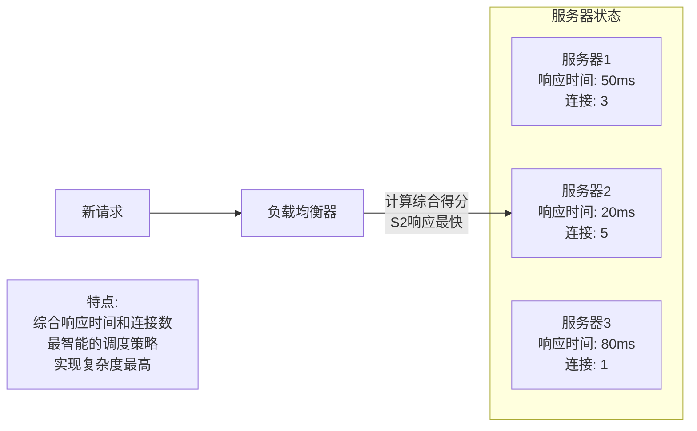
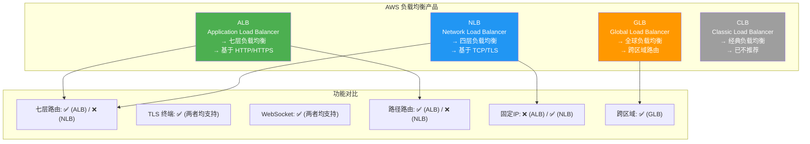
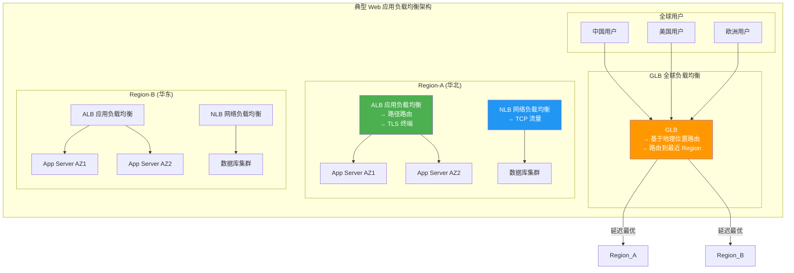
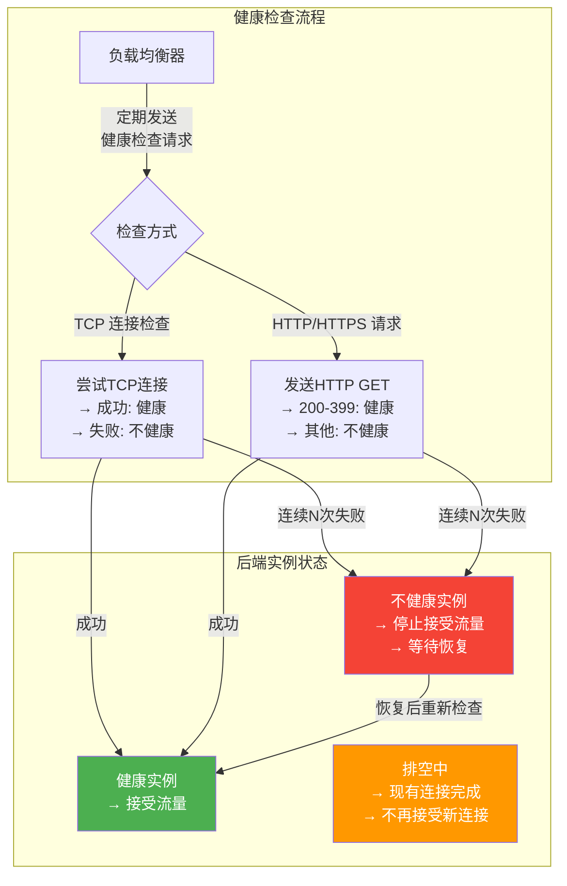
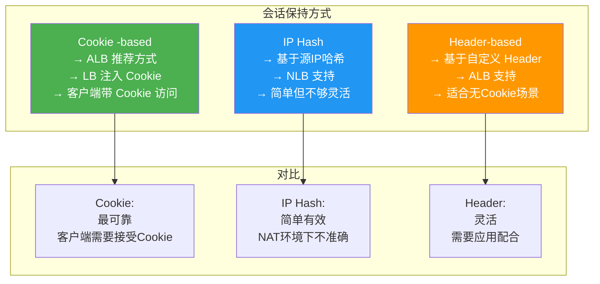

# 7.2 负载均衡技术

> [!abstract] 本节导读
> 负载均衡是云应用实现高可用和高性能的关键技术。本节首先介绍负载均衡的四种类型（L4/L7/全局/经典），然后深入讲解四种核心调度算法（轮询、加权轮询、最少连接、最短响应时间），接着对比云厂商的负载均衡产品（ALB、NLB、GLB、CLB），最后讨论健康检查机制和会话保持策略，并通过 Python 代码模拟负载均衡的核心算法。

## 一、负载均衡类型

### 按 OSI 层级分类



### L4 vs L7 负载均衡对比

| 维度 | L4 负载均衡 | L7 负载均衡 |
|-----|-----------|-----------|
| **OSI 层级** | 传输层（Layer 4） | 应用层（Layer 7） |
| **协议** | TCP/UDP | HTTP/HTTPS |
| **路由依据** | IP 地址、端口 | URL 路径、Host Header、Header |
| **性能** | 高（微秒级延迟） | 中（毫秒级延迟） |
| **连接处理** | 四层转发，无会话概念 | 七层解析，支持会话 |
| **TLS 终端** | 支持 TLS 终端卸载 | 支持 TLS 终端卸载 |
| **高级功能** | 有限 | 重定向、鉴权、WAF 集成、路径路由 |
| **典型产品** | AWS NLB、阿里云 SLB-4 | AWS ALB、阿里云 SLB-7 |
| **适用场景** | 高并发 TCP 服务、游戏、数据库 | Web 应用、API 网关、微服务路由 |
| **会话保持** | 基于 IP Hash | 基于 Cookie/Header |

## 二、负载均衡调度算法

### 四种核心算法

#### 1. 轮询（Round Robin）

> [!definition] 轮询算法
> 轮询算法按顺序将请求依次分发到后端所有服务器，实现最简单的负载均衡。



#### 2. 加权轮询（Weighted Round Robin）

> [!definition] 加权轮询
> 加权轮询根据服务器的权重分配请求，权重大的服务器接收更多请求。



#### 3. 最少连接（Least Connections）

> [!definition] 最少连接
> 最少连接算法将请求分发给当前活动连接数最少的服务器，考虑了服务器的实际负载。



#### 4. 最短响应时间（Shortest Response Time）

> [!definition] 最短响应时间
> 最短响应时间（加权最少连接的增强版）综合考虑服务器的响应时间和连接数，选择预计响应最快的服务器。



### 四种算法对比

| 维度 | 轮询 | 加权轮询 | 最少连接 | 最短响应时间 |
|-----|------|---------|---------|-------------|
| **复杂度** | 低 | 低 | 中 | 高 |
| **服务器能力感知** | 否 | 是（权重） | 是（连接数） | 是（响应时间） |
| **负载均衡效果** | 差 | 中 | 好 | 最好 |
| **实现难度** | 最简单 | 简单 | 中等 | 复杂 |
| **适用场景** | 服务器同质 | 服务器异质 | 长连接场景 | 高要求场景 |

## 三、云厂商负载均衡产品

### AWS 负载均衡矩阵



### AWS ALB vs NLB 详细对比

| 维度 | ALB (Application LB) | NLB (Network LB) |
|-----|---------------------|------------------|
| **工作层级** | L7（HTTP/HTTPS） | L4（TCP/TLS/UDP） |
| **路由能力** | 路径路由、主机路由、规则链 | 基于端口路由 |
| **健康检查** | HTTP/HTTPS 健康检查 | TCP 健康检查 |
| **固定 IP** | 无固定 IP | 支持固定 IP |
| **TLS 终端** | 支持，集成 AWS ACM | 支持，高性能 TLS 卸载 |
| **重写/重定向** | 支持 | 不支持 |
| **WAF 集成** | 原生集成 | 不支持 |
| **Sticky Sessions** | 基于 Cookie | 基于源 IP |
| **目标组** | IP 目标组、实例目标组 | IP 目标组、实例目标组、Lambda |
| **性能** | 中等延迟 | 超低延迟（微秒级） |
| **适用场景** | Web 应用、微服务 API 网关 | 高并发 TCP、游戏、数据库 |

### 负载均衡典型架构



## 四、健康检查

### 健康检查机制

> [!definition] 健康检查（Health Check）
> 健康检查是负载均衡器定期检测后端实例健康状态的机制，自动摘除不健康实例，确保流量只分发到健康实例。



### 健康检查配置参数

| 参数 | 说明 | 推荐值 |
|-----|------|--------|
| **检查间隔 (Interval)** | 两次检查的间隔时间 | 30 秒 |
| **超时时间 (Timeout)** | 单次检查的超时时间 | 5 秒 |
| **健康阈值 (Healthy Threshold)** | 连续成功多少次标记为健康 | 2 次 |
| **不健康阈值 (Unhealthy Threshold)** | 连续失败多少次标记为不健康 | 3 次 |
| **检查路径 (Path)** | HTTP/HTTPS 检查的 URL 路径 | `/health` 或 `/` |
| **检查端口 (Port)** | 健康检查的端口 | 通常为服务端口 |

## 五、会话保持策略

### 会话保持方法

> [!definition] 会话保持（Session Persistence）
> 会话保持确保同一客户端的请求始终路由到同一个后端实例，用于需要保存会话状态的场景。



### 会话保持 vs 无状态应用

| 维度 | 有状态应用（需会话保持） | 无状态应用（无需会话保持） |
|-----|----------------------|------------------------|
| **会话存储** | 存储在服务器本地 | 存储在外部（Redis/Database） |
| **会话保持** | 必须配置 | 不需要 |
| **伸缩性** | 受限于会话绑定 | 可任意伸缩 |
| **故障影响** | 某实例故障导致会话丢失 | 无影响 |
| **推荐做法** | 使用外部 Session 存储 | 天然支持无状态 |

## 六、Python 负载均衡算法模拟

```python
import random
import time


class LoadBalancerSimulator:
    def __init__(self, servers, algorithm="round_robin"):
        self.servers = [
            {"name": name, "weight": weight, "connections": 0,
             "response_time": 50, "healthy": True}
            for name, weight in servers
        ]
        self.algorithm = algorithm
        self.current_index = 0
        self.session_map = {}

    def set_server_healthy(self, name, healthy):
        for s in self.servers:
            if s["name"] == name:
                s["healthy"] = healthy
                if not healthy:
                    s["connections"] = 0

    def get_healthy_servers(self):
        return [s for s in self.servers if s["healthy"]]

    def distribute(self, client_id=None):
        healthy = self.get_healthy_servers()
        if not healthy:
            return None

        if self.algorithm == "round_robin":
            server = self._round_robin(healthy)
        elif self.algorithm == "weighted_round_robin":
            server = self._weighted_round_robin(healthy)
        elif self.algorithm == "least_connections":
            server = self._least_connections(healthy)
        elif self.algorithm == "shortest_response":
            server = self._shortest_response(healthy)
        elif self.algorithm == "ip_hash" and client_id:
            server = self._ip_hash(client_id, healthy)
        else:
            server = healthy[0]

        server["connections"] += 1
        server["response_time"] = random.gauss(50, 10)
        return server["name"]

    def _round_robin(self, healthy):
        server = healthy[self.current_index % len(healthy)]
        self.current_index += 1
        return server

    def _weighted_round_robin(self, healthy):
        total_weight = sum(s["weight"] for s in healthy)
        target = self.current_index % total_weight
        current_sum = 0
        for s in healthy:
            current_sum += s["weight"]
            if target < current_sum:
                self.current_index += 1
                return s
        self.current_index += 1
        return healthy[0]

    def _least_connections(self, healthy):
        return min(healthy, key=lambda s: s["connections"])

    def _shortest_response(self, healthy):
        scored = [(s["response_time"] * (1 + s["connections"] * 0.1), s)
                  for s in healthy]
        scored.sort(key=lambda x: x[0])
        return scored[0][1]

    def _ip_hash(self, client_id, healthy):
        hash_val = hash(client_id) % len(healthy)
        return healthy[hash_val]

    def release_connection(self, server_name):
        for s in self.servers:
            if s["name"] == server_name and s["connections"] > 0:
                s["connections"] -= 1

    def get_stats(self):
        return [{
            "name": s["name"],
            "healthy": s["healthy"],
            "connections": s["connections"],
            "response_time_ms": round(s["response_time"], 1)
        } for s in self.servers]


servers = [("server-1", 3), ("server-2", 2), ("server-3", 1)]
lb = LoadBalancerSimulator(servers, algorithm="weighted_round_robin")

print("=" * 60)
print("负载均衡模拟 - 加权轮询算法")
print("=" * 60)

for i in range(12):
    target = lb.distribute(client_id=f"client-{i % 4}")
    print(f"请求 {i+1:2d} → {target}")

print("\n服务器统计:")
for stat in lb.get_stats():
    print(f"  {stat['name']}: 健康={stat['healthy']}, "
          f"连接数={stat['connections']}, "
          f"响应时间={stat['response_time_ms']}ms")

lb.set_server_healthy("server-2", False)
print("\n--- server-2 标记为不健康 ---")

for i in range(3):
    target = lb.distribute()
    print(f"请求 {i+1:2d} → {target}")
```

## 七、小结

> [!summary] 本节要点回顾
> 1. **负载均衡类型**：L3（网络层）、L4（传输层）、L7（应用层），层级越高功能越丰富
> 2. **四种调度算法**：轮询（简单）→ 加权轮询（考虑能力）→ 最少连接（考虑负载）→ 最短响应时间（最智能）
> 3. **云 LB 产品矩阵**：ALB（L7）、NLB（L4）、GLB（全球）、CLB（经典，已过时）
> 4. **ALB vs NLB**：ALB 功能丰富（路由、WAF、重写），NLB 性能高（微秒延迟、固定 IP）
> 5. **健康检查**：TCP/HTTP 两种方式，自动摘除不健康实例
> 6. **会话保持**：Cookie（推荐）、IP Hash、Header 三种方式，建议使用无状态应用架构

## 关联知识点

| 关联知识点 | 关系 |
|-----------|------|
| [[7.1 弹性伸缩技术]] | 负载均衡的后端实例由弹性伸缩组自动管理 |
| [[6.1 虚拟网络与VPC]] | 负载均衡器部署在 VPC 的公有子网 |
| [[6.3 云网络互联与SD-WAN]] | 全球负载均衡（GLB）跨区域互联 |
| [[第4章 云计算架构与资源调度]] | OpenStack Neutron 的 LBaaS 实现 |