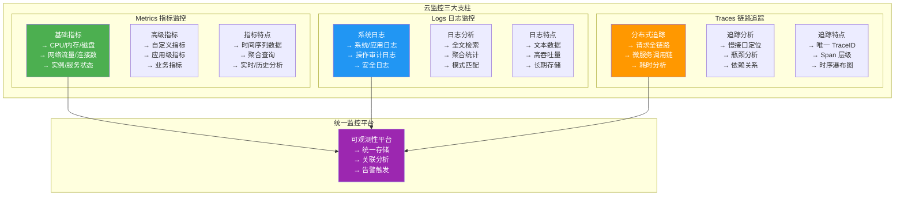
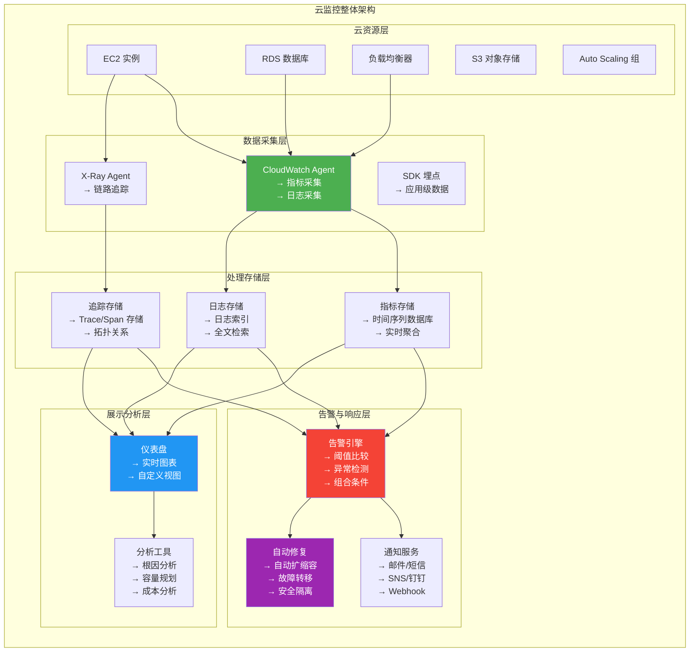
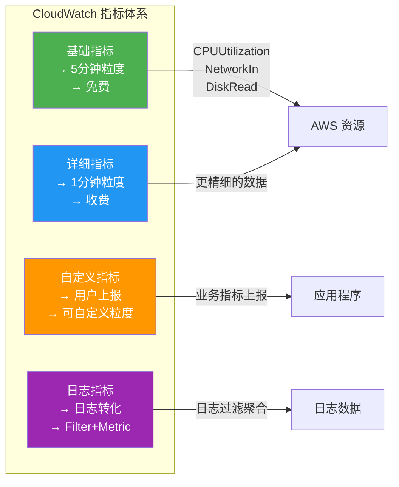
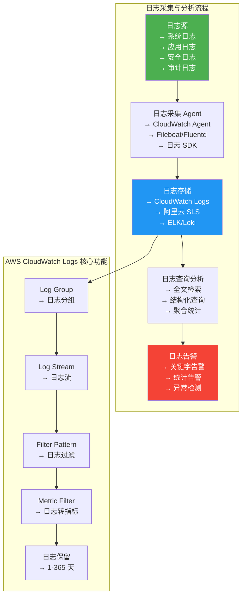
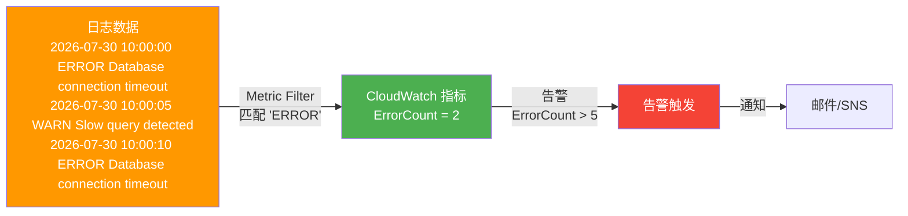
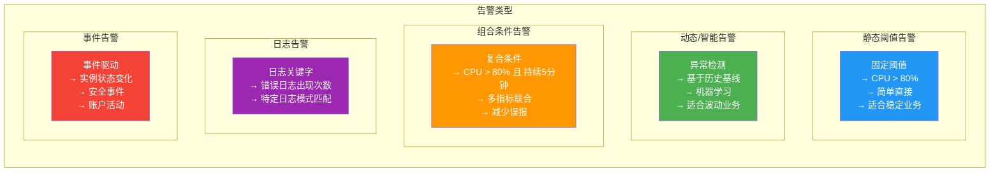
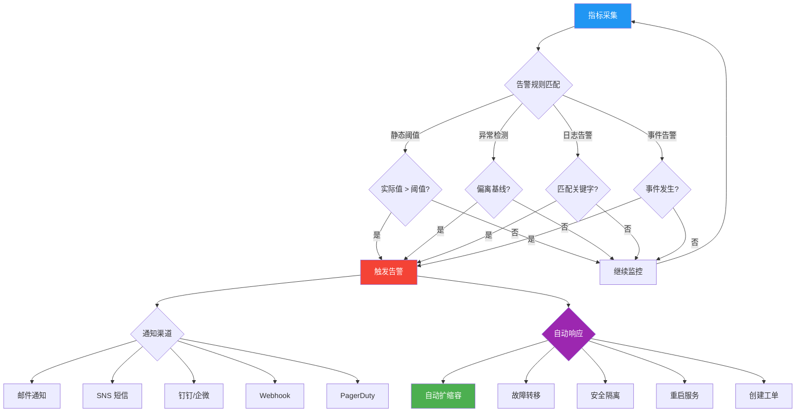
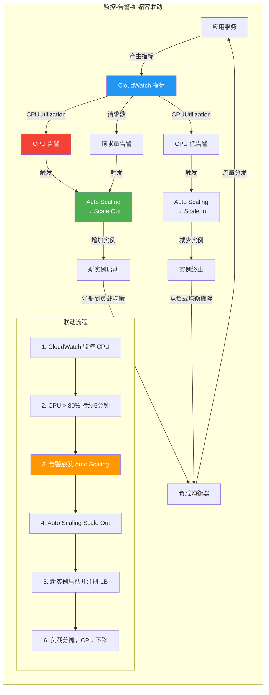
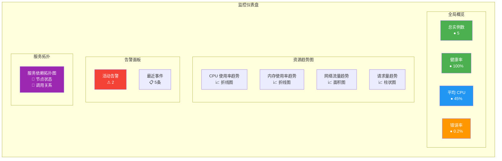

# 7.3 云资源监控与告警

> [!abstract] 本节导读
> 监控是云运维的"眼睛"和"耳朵"。本节系统构建云监控的完整体系架构，涵盖指标（Metrics）、日志（Logs）、链路追踪（Traces）三大支柱，然后分别介绍 AWS CloudWatch 和阿里云 CloudMonitor 的核心功能，深入讲解告警机制（静态阈值、智能异常检测、组合条件）与通知渠道，演示监控与自动扩缩容的联动，最后介绍仪表盘可视化和 Python CloudWatch SDK 的编程实践。

## 一、云监控体系架构

### 监控三大支柱

> [!definition] 云监控三大支柱
> 现代云监控体系由三大支柱构成：**指标（Metrics）**、**日志（Logs）** 和 **链路追踪（Traces）**，三者互补提供全面的可观测性（Observability）能力。



### 监控架构全景



## 二、指标监控（Metrics）

### AWS CloudWatch 指标

> [!definition] AWS CloudWatch
> CloudWatch 是 AWS 的监控服务，提供指标采集、存储、分析和告警功能，是 AWS 监控体系的核心。

**CloudWatch 指标分类**：

| 指标类型 | 说明 | 示例 |
|---------|------|------|
| **基础指标** | AWS 自动采集的免费指标 | CPUUtilization、NetworkIn、DiskReadOps |
| **详细指标** | 更精细的指标（额外收费） | 分钟级粒度的详细数据 |
| **自定义指标** | 用户通过 API 上报的指标 | 业务订单量、API 调用次数 |
| **日志指标** | 从日志中提取的指标 | 错误日志数量、特定日志出现次数 |



**常见监控指标**：

| 资源类型 | 核心指标 | 告警阈值参考 |
|---------|---------|-------------|
| **EC2** | CPU 使用率、内存使用率、网络流量 | CPU > 80% 持续 5 分钟 |
| **RDS** | 连接数、CPU、IOPS、延迟 | 连接数 > 最大连接数 80% |
| **S3** | 请求数、错误率、存储量 | 错误率 > 1% |
| **ELB** | 请求数、延迟、健康实例比 | 健康实例 < 50% |
| **Auto Scaling** | 实例数量、扩展活动 | 扩展失败告警 |
| **Lambda** | 调用次数、错误率、执行时间 | 错误率 > 5% |
| **API Gateway** | 请求数、延迟、4xx/5xx 错误 | 5xx > 1% |

### 阿里云 CloudMonitor 指标

**CloudMonitor 与 CloudWatch 对应关系**：

| 阿里云 CloudMonitor | AWS CloudWatch | 功能 |
|-------------------|---------------|------|
| 云监控基础指标 | CloudWatch Metrics | 资源指标监控 |
| 自定义监控 | 自定义指标 | 业务级指标 |
| 日志监控 | CloudWatch Logs + Metric Filter | 日志转指标 |
| 告警管理 | CloudWatch Alarms | 告警触发 |
| 事件中心 | CloudWatch Events | 事件驱动 |

## 三、日志监控（Logs）

### 日志采集与分析



### 日志转指标（Metric Filter）

> [!definition] Metric Filter
> Metric Filter 是 CloudWatch Logs 的核心功能，通过模式匹配从日志中提取数据并转化为 CloudWatch 指标，实现日志到告警的桥接。



## 四、告警机制

### 告警类型



### 告警工作流



### 告警配置示例

**常见告警规则**：

| 告警名称 | 指标 | 条件 | 严重级别 | 通知方式 |
|---------|------|------|---------|---------|
| **CPU 过高** | CPUUtilization | > 80% 持续 5 分钟 | P1 严重 | 电话+短信 |
| **内存不足** | MemoryUtilization | > 85% 持续 5 分钟 | P1 严重 | 电话+短信 |
| **磁盘空间** | FreeDiskSpace | < 10% | P2 警告 | 短信+邮件 |
| **网络异常** | NetworkIn | < 100KB/s 持续 3 分钟 | P2 警告 | 邮件 |
| **数据库连接** | DatabaseConnections | > 80% 最大值 | P1 严重 | 电话+短信 |
| **服务错误率** | 5xxErrorRate | > 1% 持续 2 分钟 | P1 严重 | 电话+短信 |
| **实例健康** | HealthyHostCount | < 总实例数 50% | P1 严重 | 电话+短信 |
| **API 延迟** | APILatency | P95 > 2s | P2 警告 | 邮件 |

## 五、监控与自动扩缩容联动

### 联动架构



### 联动配置示例

```python
import boto3

cloudwatch = boto3.client('cloudwatch', region_name='us-east-1')
autoscaling = boto3.client('autoscaling', region_name='us-east-1')

alarm_high = cloudwatch.put_metric_alarm(
    AlarmName='HighCPUAlarm',
    ComparisonOperator='GreaterThanThreshold',
    EvaluationPeriods=3,
    MetricName='CPUUtilization',
    Namespace='AWS/EC2',
    Period=300,
    Statistic='Average',
    Threshold=80.0,
    AlarmActions=['arn:aws:autoscaling:us-east-1:123456789012:scalingPolicy:resource/web-app-asg:policyName/cpu-target-tracking:policyArn/arn:aws:autoscaling:us-east-1:123456789012:scaling_policy:web-app-asg/cpu-target-tracking'],
    AlarmDescription='CPU utilization exceeds 80%',
    OKActions=[],
    TreatMissingData='breaching'
)

alarm_low = cloudwatch.put_metric_alarm(
    AlarmName='LowCPUAlarm',
    ComparisonOperator='LessThanThreshold',
    EvaluationPeriods=5,
    MetricName='CPUUtilization',
    Namespace='AWS/EC2',
    Period=300,
    Statistic='Average',
    Threshold=30.0,
    AlarmActions=['arn:aws:autoscaling:us-east-1:123456789012:scalingPolicy:resource/web-app-asg:policyName/cpu-target-tracking:policyArn/arn:aws:autoscaling:us-east-1:123456789012:scaling_policy:web-app-asg/cpu-target-tracking'],
    AlarmDescription='CPU utilization below 30%',
    TreatMissingData='notBreaching'
)

print("Alarms configured:")
print(f"  - HighCPUAlarm: CPU > 80% for 15 min → Scale Out")
print(f"  - LowCPUAlarm: CPU < 30% for 25 min → Scale In")
```

## 六、仪表盘与可视化

### 仪表盘设计



### AWS CloudWatch Dashboard API

```python
import boto3
import json

cloudwatch = boto3.client('cloudwatch', region_name='us-east-1')

dashboard = cloudwatch.put_dashboard(
    DashboardName='WebApp-Monitoring',
    DashboardBody=json.dumps({
        "widgets": [
            {
                "type": "metric",
                "x": 0, "y": 0, "width": 12, "height": 6,
                "properties": {
                    "metrics": [
                        ["AWS/EC2", "CPUUtilization", "AutoScalingGroupName",
                         "web-app-asg", {"label": "Average CPU"}]
                    ],
                    "period": 300,
                    "stat": "Average",
                    "title": "CPU Utilization",
                    "region": "us-east-1"
                }
            },
            {
                "type": "metric",
                "x": 12, "y": 0, "width": 12, "height": 6,
                "properties": {
                    "metrics": [
                        ["AWS/EC2", "NetworkIn", "AutoScalingGroupName",
                         "web-app-asg", {"label": "Network In"}]
                    ],
                    "period": 300,
                    "stat": "Sum",
                    "title": "Network Traffic",
                    "region": "us-east-1"
                }
            },
            {
                "type": "metric",
                "x": 0, "y": 6, "width": 12, "height": 6,
                "properties": {
                    "metrics": [
                        ["AWS/ApplicationELB", "RequestCount",
                         "LoadBalancer", "app/web-app-alb/12345",
                         {"label": "Total Requests"}],
                        ["AWS/ApplicationELB", "TargetResponseTime",
                         "LoadBalancer", "app/web-app-alb/12345",
                         {"label": "Response Time"}]
                    ],
                    "period": 300,
                    "stat": "Sum",
                    "title": "ALB Metrics",
                    "region": "us-east-1"
                }
            },
            {
                "type": "text",
                "x": 12, "y": 6, "width": 12, "height": 6,
                "properties": {
                    "markdown": "### 告警状态\n- [OK] CPU 使用率正常\n- [OK] 网络流量正常\n- [WARNING] 数据库连接数偏高\n\n**最近更新**: 实时"
                }
            }
        ]
    })
)

print(f"Dashboard created: WebApp-Monitoring")
print(f"Link: https://console.aws.amazon.com/cloudwatch/home#dashboards:name=WebApp-Monitoring")
```

## 七、Python CloudWatch SDK 综合示例

### 指标上报与告警查询

```python
import boto3
import random
import time
from datetime import datetime, timedelta


class CloudWatchMonitor:
    def __init__(self, region='us-east-1'):
        self.cloudwatch = boto3.client('cloudwatch', region_name=region)

    def put_custom_metric(self, metric_name, value, unit='Count',
                          dimensions=None):
        self.cloudwatch.put_metric_data(
            Namespace='Custom/WebApp',
            MetricData=[{
                'MetricName': metric_name,
                'Value': value,
                'Unit': unit,
                'Timestamp': datetime.utcnow(),
                'Dimensions': dimensions or []
            }]
        )

    def get_metric_statistics(self, metric_name, minutes=30,
                              statistic='Average', period=300):
        end_time = datetime.utcnow()
        start_time = end_time - timedelta(minutes=minutes)

        response = self.cloudwatch.get_metric_statistics(
            Namespace='AWS/EC2',
            MetricName=metric_name,
            Dimensions=[{
                'Name': 'AutoScalingGroupName',
                'Value': 'web-app-asg'
            }],
            StartTime=start_time,
            EndTime=end_time,
            Period=period,
            Statistics=[statistic]
        )
        return response['Datapoints']

    def list_alarms(self, state='ALARM'):
        response = self.cloudwatch.describe_alarms(
            StateValue=state
        )
        return [{
            'name': a['AlarmName'],
            'state': a['StateValue'],
            'reason': a.get('StateReason', '')
        } for a in response['MetricAlarms']]

    def create_alarm(self, name, metric, threshold, comparison='GreaterThanThreshold',
                     period=300, evaluation_periods=3, statistic='Average'):
        self.cloudwatch.put_metric_alarm(
            AlarmName=name,
            ComparisonOperator=comparison,
            EvaluationPeriods=evaluation_periods,
            MetricName=metric,
            Namespace='AWS/EC2',
            Period=period,
            Statistic=statistic,
            Threshold=threshold,
            AlarmDescription=f'{metric} {comparison} {threshold}',
            TreatMissingData='breaching'
        )

    def simulate_metrics(self, duration_seconds=60, interval=5):
        print(f"模拟采集 {duration_seconds} 秒的指标数据...")
        start = time.time()
        while time.time() - start < duration_seconds:
            cpu = random.gauss(50, 15)
            mem = random.gauss(60, 10)
            requests = random.randint(100, 500)

            self.put_custom_metric('CPUUsage', round(cpu, 2), 'Percent',
                                    [{'Name': 'InstanceId', 'Value': 'i-12345'}])
            self.put_custom_metric('MemoryUsage', round(mem, 2), 'Percent',
                                    [{'Name': 'InstanceId', 'Value': 'i-12345'}])
            self.put_custom_metric('RequestCount', requests, 'Count',
                                    [{'Name': 'Service', 'Value': 'api'}])

            print(f"  [{datetime.utcnow().strftime('%H:%M:%S')}] "
                  f"CPU={cpu:.1f}% | MEM={mem:.1f}% | Req={requests}")
            time.sleep(interval)


monitor = CloudWatchMonitor()

monitor.create_alarm(
    name='HighCPU-Alarm',
    metric='CPUUtilization',
    threshold=80.0,
    comparison='GreaterThanThreshold',
    period=300,
    evaluation_periods=3
)

monitor.create_alarm(
    name='HighMemory-Alarm',
    metric='MemoryUtilization',
    threshold=85.0,
    comparison='GreaterThanThreshold',
    period=300,
    evaluation_periods=3
)

print("告警规则已创建:")
print("  - HighCPU-Alarm: CPU > 80% 持续 15 分钟")
print("  - HighMemory-Alarm: MEM > 85% 持续 15 分钟")

datapoints = monitor.get_metric_statistics('CPUUtilization', minutes=60)
print(f"\n最近60分钟 CPU 数据点: {len(datapoints)} 条")

active_alarms = monitor.list_alarms(state='ALARM')
print(f"\n当前活动告警: {len(active_alarms)} 条")
for alarm in active_alarms:
    print(f"  ⚠ {alarm['name']}: {alarm['state']}")
```

## 八、小结

> [!summary] 本节要点回顾
> 1. **云监控三大支柱**：指标（Metrics）、日志（Logs）、链路追踪（Traces），共同构建可观测性体系
> 2. **CloudWatch 核心功能**：指标采集、日志存储、告警触发、仪表盘展示
> 3. **日志转指标**：通过 Metric Filter 将日志中的关键信息转化为可告警的指标
> 4. **告警机制**：静态阈值、异常检测、组合条件、日志告警、事件告警五种类型
> 5. **通知渠道**：邮件、短信、SNS、钉钉/企微、Webhook、PagerDuty
> 6. **监控-告警-扩缩容联动**：CloudWatch 指标 → 告警 → Auto Scaling 自动扩缩容
> 7. **仪表盘可视化**：实时图表、拓扑视图、告警面板，全方位展示系统状态

## 关联知识点

| 关联知识点 | 关系 |
|-----------|------|
| [[7.1 弹性伸缩技术]] | CloudWatch 指标触发自动扩缩容 |
| [[7.2 负载均衡技术]] | 负载均衡指标是监控的重要数据源 |
| [[6.3 云网络互联与SD-WAN]] | 网络监控与流量分析 |
| [[第8章 云安全技术]] | 安全告警与日志审计 |