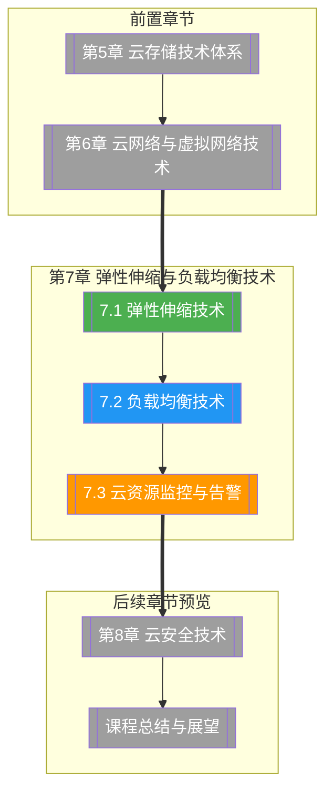

# 第7章 弹性伸缩与负载均衡技术

> [!abstract] 章节概述
> 弹性伸缩和负载均衡是云计算实现"按需使用、按量付费"的核心技术保障。本章系统介绍弹性伸缩的概念、策略与实现（AWS Auto Scaling、阿里云 ESS），深入剖析负载均衡的四种类型（L4/L7/全局/应用）与核心算法，最后讲解云资源监控体系（指标、日志、链路）与告警机制。通过本章学习，读者将掌握自动扩缩容的设计方法、负载均衡的选型策略和云监控告警的构建实践。

## 学习路线图

## 知识点导航

| 编号 | 知识点 | 核心内容 | 重要程度 |
|-----|--------|---------|---------|
| 7.1 | [[7.1 弹性伸缩技术]] | 弹性伸缩概念(scale in/out/up/down)、AWS Auto Scaling(启动配置/扩展策略)、阿里云ESS、预测式vs动态伸缩、伸缩工作流 | ⭐⭐⭐⭐⭐ |
| 7.2 | [[7.2 负载均衡技术]] | 负载均衡类型(L4/L7)、调度算法(轮询/加权/最少连接/最短响应)、云LB产品(ALB/NLB/GLB)、健康检查与会话保持 | ⭐⭐⭐⭐⭐ |
| 7.3 | [[7.3 云资源监控与告警]] | 监控体系(指标/日志/链路)、CloudWatch/CloudMonitor、告警机制(阈值/异常检测)、自动扩缩联动、仪表盘可视化 | ⭐⭐⭐⭐ |

## 核心概念速览

> [!tip] 本章必须掌握的核心概念
> - **弹性伸缩（Auto Scaling）**：根据负载自动调整资源数量的能力，分为横向伸缩（增减实例）和纵向伸缩（调整规格）
> - **Scale In/Out**：横向缩减/增加实例数量，适用于无状态应用
> - **Scale Up/Down**：纵向调整实例规格（CPU/内存），适用于单实例性能不足
> - **负载均衡（Load Balancing）**：将流量分发到多个后端实例，提高可用性和性能
> - **L4 负载均衡**：基于 IP/端口的传输层负载均衡，高性能低延迟
> - **L7 负载均衡**：基于 HTTP/HTTPS 内容的应用层负载均衡，可实现更精细的路由
> - **健康检查（Health Check）**：定期检测后端实例的健康状态，自动摘除异常实例
> - **会话保持（Session Persistence）**：确保同一客户端的请求始终路由到同一后端实例
> - **云监控三支柱**：指标（Metrics）、日志（Logs）、链路追踪（Traces）
> - **告警联动**：监控指标触发告警 → 自动扩缩容/故障转移

## 核心考点

> [!important] 期末高频考点

| 考点 | 所属知识点 | 考查形式 | 难度 |
|-----|-----------|---------|------|
| 弹性伸缩的四种类型（In/Out/Up/Down） | 7.1 | 选择题/简答题 | ★★ |
| AWS Auto Scaling 核心组件与工作流程 | 7.1 | 论述题 | ★★★★ |
| 三种扩展策略（Target Tracking/Step/Simple） | 7.1 | 简答题/对比题 | ★★★★ |
| 预测式伸缩与动态伸缩的区别 | 7.1 | 简答题 | ★★★ |
| L4 vs L7 负载均衡的对比与选型 | 7.2 | 对比题/案例分析 | ★★★★ |
| 四种负载均衡调度算法的原理与场景 | 7.2 | 简答题/选择题 | ★★★ |
| 健康检查与会话保持的配置 | 7.2 | 案例分析 | ★★★ |
| 云监控的三大支柱（指标/日志/链路） | 7.3 | 简答题 | ★★★ |
| 告警机制与自动扩缩容联动 | 7.3 | 案例分析/论述题 | ★★★★ |
| CloudWatch/CloudMonitor 的核心功能 | 7.3 | 简答题/选择题 | ★★★ |

## 自测题

> [!question] 章节自测
> 1. 某电商平台在促销期间流量暴增，请设计一套弹性伸缩方案，包括触发策略、扩展方式和与负载均衡的配合。
> 2. 对比轮询、加权轮询、最少连接和最短响应时间四种负载均衡算法的原理、优缺点和适用场景。
> 3. 阐述 AWS ALB、NLB、GLB 的区别和典型应用场景，为一个全球部署的 Web 应用设计负载均衡架构。
> 4. 设计一个完整的云监控告警体系，包括指标采集、告警规则、通知渠道和自动响应机制。
> 5. 使用 Python 的 boto3 库编写 AWS Auto Scaling 的配置脚本，实现基于 CPU 使用率的自动扩缩容。

## 章节导航

| 方向 | 链接 |
|-----|------|
| ⬆ 返回课程总览 | [[MOC - 云计算技术]] |
| ⬅ 上一章 | [[第6章 云网络与虚拟网络技术/MOC - 第6章]] |
| ➡ 下一章 | [[第8章 云安全技术/MOC - 第8章]] |