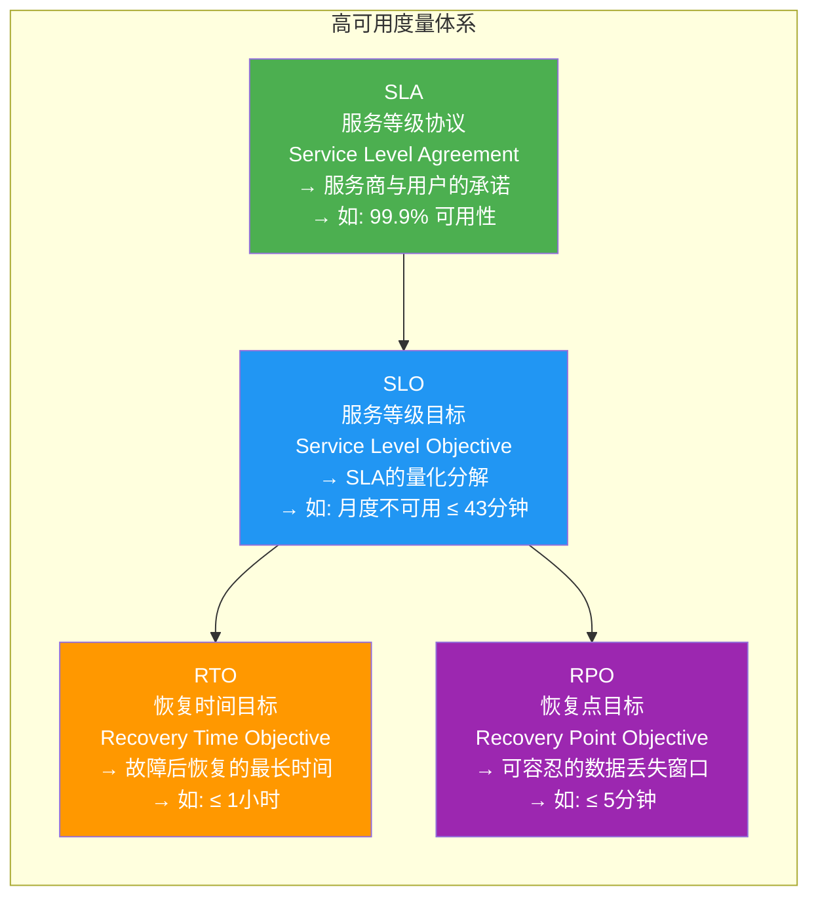
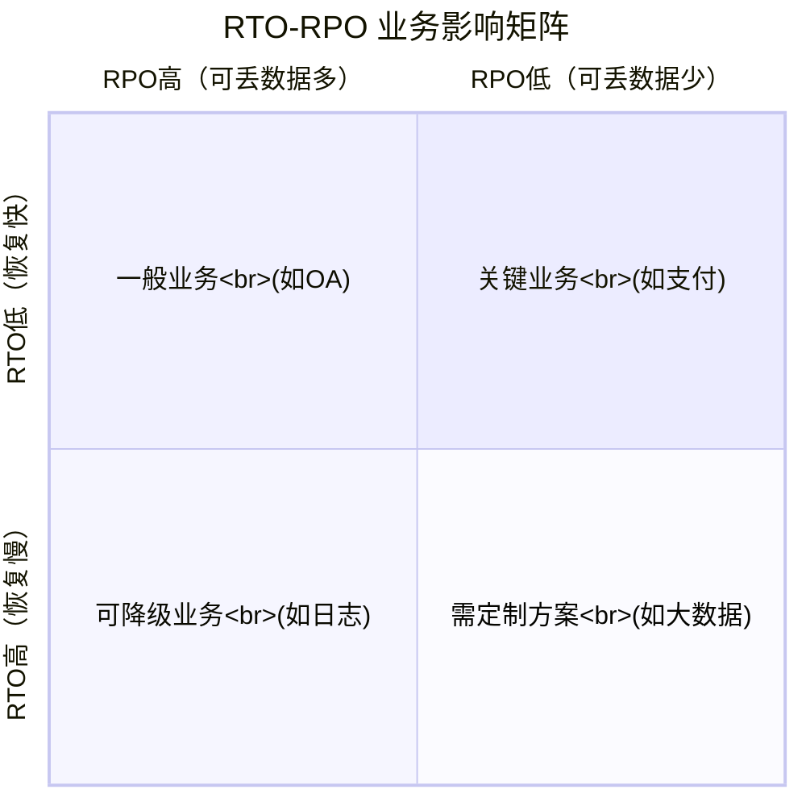
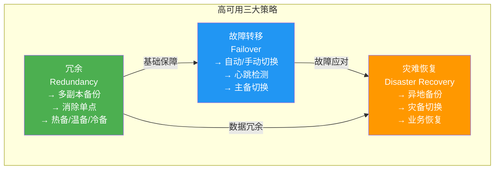
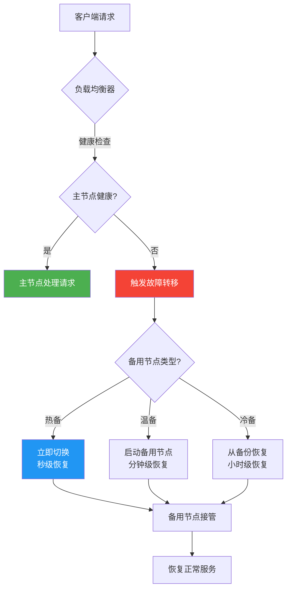
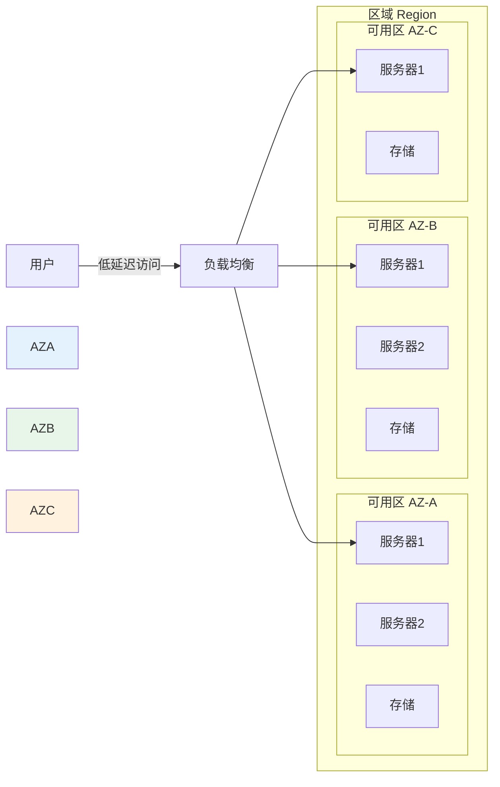
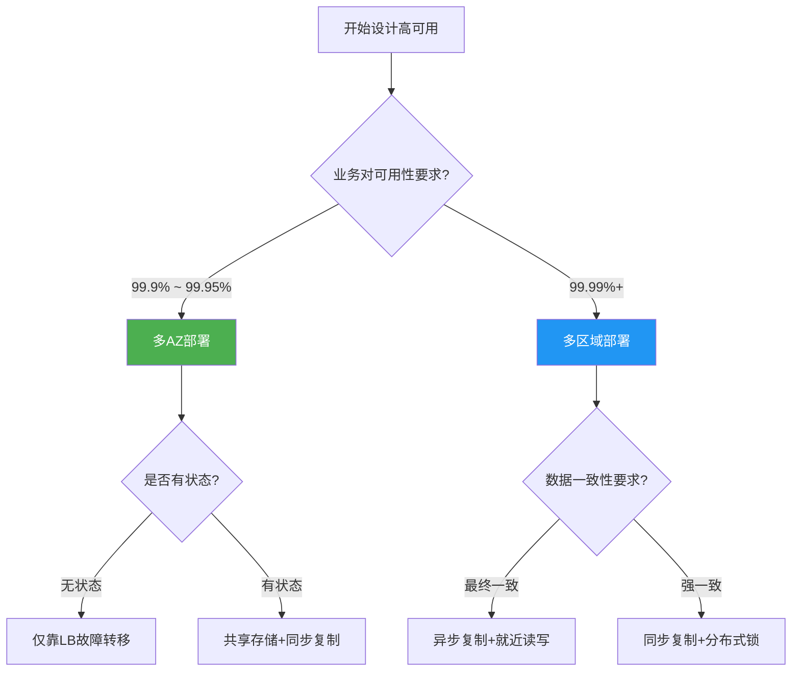
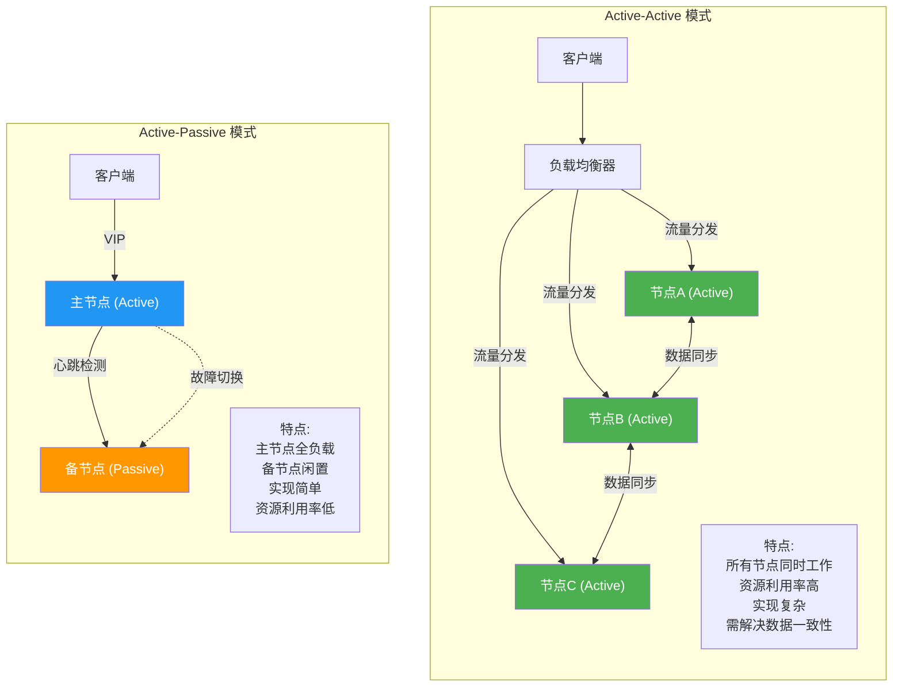
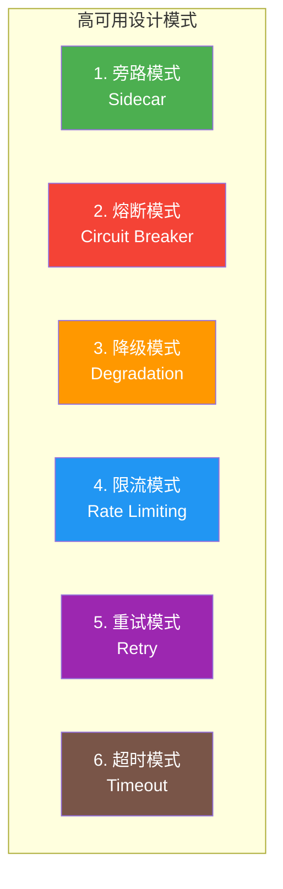
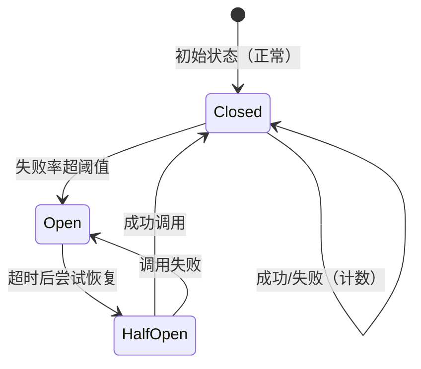
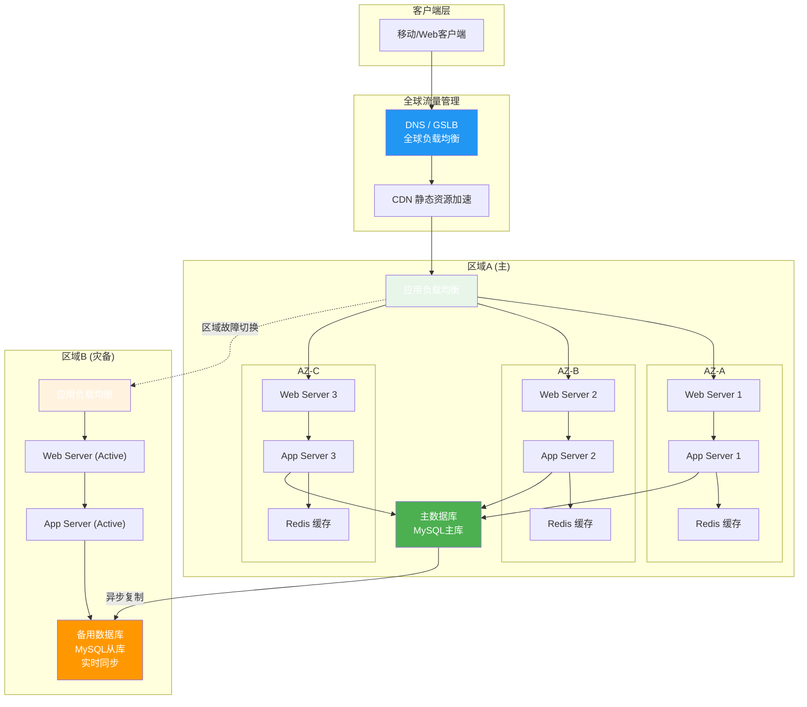

# 8.1 高可用架构设计

> [!abstract] 本节导读
> 高可用是云服务的生命线。本节首先介绍高可用的核心度量指标（SLA、SLO、RTO、RPO），然后讲解三大高可用策略（冗余、故障转移、灾难恢复），接着对比多AZ与多区域部署方案，分析Active-Active与Active-Passive两种模式的适用场景，最后通过Mermaid架构图展示完整的高可用设计模式。

## 一、高可用核心概念

### 什么是高可用

> [!definition] 高可用（High Availability，HA）
> 高可用是指系统在规定时间内提供持续服务的能力，通过消除单点故障、提供冗余备份和自动故障转移机制，确保服务的连续性和可靠性。

### 四大度量指标

### SLA等级与 downtime 对照

| SLA等级 | 月度可用性 | 月度不可用时间 | 年度不可用时间 | 适用场景 |
|---------|-----------|---------------|---------------|---------|
| 99% | 99% | ~7.2小时 | ~3.65天 | 内部系统、测试环境 |
| 99.5% | 99.5% | ~3.6小时 | ~1.83天 | 普通业务系统 |
| 99.9% | 99.9% | ~43分钟 | ~8.77小时 | 企业级应用 |
| 99.95% | 99.95% | ~22分钟 | ~4.38小时 | 电商、交易系统 |
| 99.99% | 99.99% | ~4.3分钟 | ~52.6分钟 | 金融、支付系统 |
| 99.999% | 99.999% | ~26秒 | ~5.26分钟 | 核心交易、证券系统 |

### RTO/RPO 与业务影响

| RTO等级 | 系统影响 | RPO等级 | 数据影响 |
|---------|---------|---------|---------|
| ≤ 1分钟 | 几乎无感 | ≤ 1分钟 | 数据丢失极少 |
| ≤ 10分钟 | 轻微影响 | ≤ 10分钟 | 少量数据丢失 |
| ≤ 1小时 | 明显影响 | ≤ 1小时 | 一定数据丢失 |
| ≤ 4小时 | 严重影响 | ≤ 4小时 | 较多数据丢失 |
| ≥ 8小时 | 灾难性影响 | ≥ 8小时 | 大量数据丢失 |

## 二、高可用策略

### 三大核心策略

### 冗余策略

> [!definition] 冗余（Redundancy）
> 通过部署多个资源副本，当主资源故障时备用资源可接管服务。

| 冗余类型 | 说明 | 切换速度 | 资源开销 | 适用场景 |
|---------|------|---------|---------|---------|
| **热备（Hot Standby）** | 备用节点实时同步数据，随时可接管 | 秒级 | 高 | 核心交易系统 |
| **温备（Warm Standby）** | 备用节点定期同步，需启动才能接管 | 分钟级 | 中 | 一般业务系统 |
| **冷备（Cold Standby）** | 备份存储在离线/近线，需完整启动流程 | 小时级 | 低 | 归档、容灾 |

### 故障转移机制

> [!definition] 故障转移（Failover）
> 当主节点故障时，自动或手动将流量切换到备用节点的过程。

### 灾难恢复

> [!definition] 灾难恢复（Disaster Recovery，DR）
> 针对区域性灾难（如数据中心故障），将业务切换到异地备份中心的过程。

**灾备等级（DR Level）**：

| 等级 | 描述 | RTO | RPO | 成本 |
|-----|------|-----|-----|------|
| L0 | 无异地备份 | ∞ | ∞ | 最低 |
| L1 | 本地备份+异地存储 | 小时级 | 天级 | 低 |
| L2 | 异地热备+定期同步 | 小时级 | 分钟级 | 中 |
| L3 | 异地热备+实时同步 | 分钟级 | 秒级 | 高 |
| L4 | 多活数据中心 | 秒级 | 零 | 极高 |

## 三、多AZ与多区域部署

### 云地理架构

### 多AZ vs 多区域

| 维度 | 多AZ部署 | 多区域部署 |
|-----|---------|-----------|
| **故障范围** | 应对单AZ故障 | 应对整个区域故障 |
| **网络延迟** | 低（同区域内） | 高（跨区域） |
| **数据一致性** | 易于维持 | 需要额外同步机制 |
| **成本** | 较低 | 较高（跨区域流量费） |
| **适用场景** | 大部分云应用 | 金融、核心业务 |
| **典型RTO** | 秒~分钟级 | 分钟~小时级 |

### 部署模式选择

## 四、Active-Active vs Active-Passive

### 两种模式对比

> [!definition] Active-Active
> 所有节点同时处于活跃状态，共同承担业务流量。任何节点故障不影响整体服务。

> [!definition] Active-Passive
> 只有主节点（Active）承担流量，备用节点（Passive）处于待命状态，主节点故障时备用节点接管。

### 模式选择决策

| 维度 | Active-Active | Active-Passive |
|-----|--------------|----------------|
| **资源利用率** | 高（所有节点工作） | 低（备节点闲置） |
| **故障切换** | 无需切换，直接摘除 | 自动/手动切换 |
| **实现复杂度** | 高（数据一致性挑战） | 低（心跳+切换） |
| **成本** | 高（更多实例） | 中（备节点资源闲置） |
| **数据一致性** | 需要分布式事务 | 主写从读，容易保证 |
| **典型场景** | 微服务、CDN、DNS | 数据库、核心交易系统 |

## 五、高可用设计模式

### 六大设计模式

### 熔断模式详解

> [!definition] 熔断模式（Circuit Breaker）
> 当服务调用失败率超过阈值时自动"熔断"，暂时不再调用，直接返回错误或降级响应，防止故障蔓延。

**三态转换**：

| 状态 | 描述 | 行为 |
|-----|------|------|
| **Closed（关闭）** | 正常状态，允许所有请求 | 统计失败次数，超阈值→Open |
| **Open（打开）** | 熔断状态，拒绝所有请求 | 超时等待→HalfOpen |
| **HalfOpen（半开）** | 探测状态，允许少量请求 | 成功→Closed，失败→Open |

### 高可用架构总览

## 六、小结

> [!summary] 本节要点回顾
> 1. **四大度量指标**：SLA（承诺）→ SLO（目标）→ RTO（恢复时间）→ RPO（数据丢失窗口）
> 2. **三大HA策略**：冗余（热备/温备/冷备）、故障转移（自动切换）、灾难恢复（异地灾备）
> 3. **多AZ vs 多区域**：多AZ应对单可用区故障，多区域应对整个区域故障
> 4. **Active-Active vs Active-Passive**：前者所有节点工作、资源利用率高但实现复杂；后者主备模式、实现简单但资源闲置
> 5. **六大设计模式**：旁路、熔断、降级、限流、重试、超时，构建弹性可靠的系统
> 6. **高可用架构**：全球DNS → 区域ALB → 多AZ应用集群 → 主从数据库 → 异地灾备

## 关联知识点

| 关联知识点 | 关系 |
|-----------|------|
| [[7.2 负载均衡技术]] | 负载均衡是高可用的第一道防线 |
| [[8.2 云运维自动化]] | 自动化是实现高可用运维的手段 |
| [[8.3 容器编排Kubernetes]] | K8s内置高可用调度机制 |
| [[第9章 云安全与隐私防护]] | 安全是高可用的前提 |