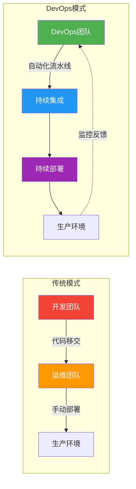
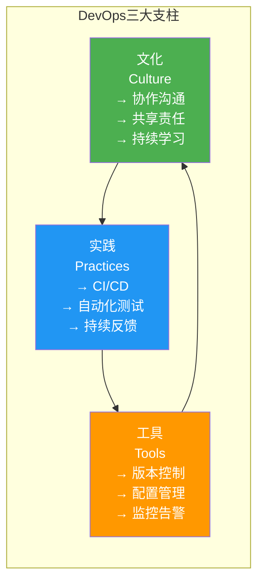
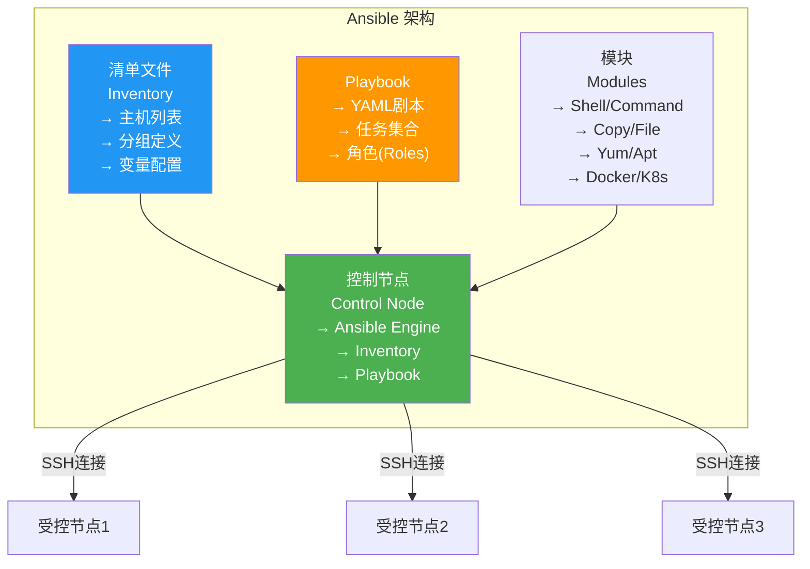
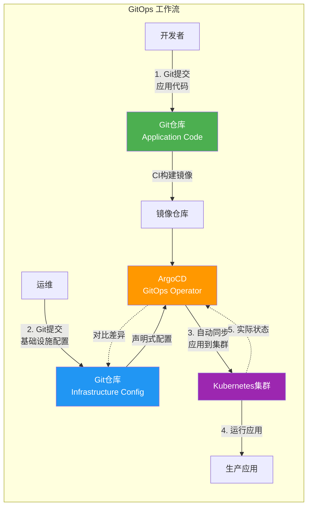
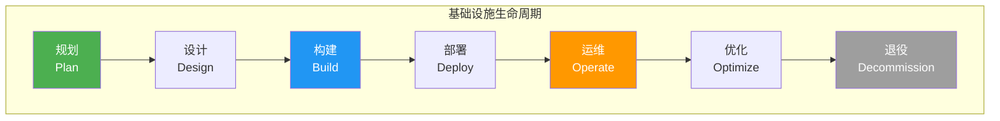

# 8.2 云运维自动化

> [!abstract] 本节导读
> 云运维自动化是实现规模化、标准化、高质量云治理的核心手段。本节首先介绍DevOps文化的核心理念及其与传统运维的区别，然后讲解配置管理工具（Ansible、Puppet）的原理与实践，接着深入剖析CI/CD流水线的各个阶段和关键工具，介绍GitOps模式与ArgoCD的工作流程，最后涵盖基础设施全生命周期管理。

## 一、DevOps文化与云运维

### 什么是DevOps

> [!definition] DevOps
> DevOps是一种强调开发（Dev）和运维（Ops）紧密协作的文化和实践，通过自动化工具链和持续反馈循环，实现软件的快速、可靠交付。

### 传统运维 vs DevOps

| 维度 | 传统运维 | DevOps |
|-----|---------|--------|
| **团队结构** | 开发与运维分离 | 开发与运维一体化 |
| **工作模式** | 瀑布式，交付后移交 | 敏捷，全程协作 |
| **部署频率** | 每月/每季度发布 | 每周/每日/小时级 |
| **自动化程度** | 手动操作为主 | 全流程自动化 |
| **故障响应** | 被动响应 | 主动预防+快速修复 |
| **度量指标** | 运维效率 | 交付速度+质量 |
| **核心文化** | 分工明确 | 持续学习+共享责任 |



### DevOps三大支柱



## 二、配置管理

### Ansible vs Puppet

| 维度 | Ansible | Puppet |
|-----|---------|--------|
| **架构** | Agentless（无代理） | Agent-based（有代理） |
| **通信协议** | SSH | 自定义协议（Puppet SSL） |
| **配置语言** | YAML（Playbook） | Ruby DSL / Puppet DSL（Manifest） |
| **执行模式** | 推模式（Push） | 拉模式（Pull） |
| **学习曲线** | 平缓 | 较陡 |
| **适用规模** | 中小规模（<1000节点） | 大规模（>1000节点） |
| **核心优势** | 简单易用、无需安装客户端 | 声明式、幂等性强 |

### Ansible 核心架构



### Ansible Playbook 示例

#### 安装与配置 Nginx

```yaml
# nginx_setup.yml
---
- name: 安装并配置Nginx Web服务器
  hosts: webservers
  become: yes
  vars:
    nginx_port: 80
    server_name: example.com
    doc_root: /var/www/html

  tasks:
    - name: 更新系统包
      apt:
        update_cache: yes
        upgrade: yes
      when: ansible_os_family == "Debian"

    - name: 安装Nginx
      apt:
        name: nginx
        state: present
      when: ansible_os_family == "Debian"

    - name: 安装Nginx (CentOS/RHEL)
      yum:
        name: nginx
        state: present
      when: ansible_os_family == "RedHat"

    - name: 创建文档根目录
      file:
        path: "{{ doc_root }}"
        state: directory
        owner: www-data
        group: www-data
        mode: '0755'

    - name: 下发Nginx配置文件
      template:
        src: nginx.conf.j2
        dest: /etc/nginx/nginx.conf
        owner: root
        group: root
        mode: '0644'
      notify: restart nginx

    - name: 下发默认网页
      copy:
        content: |
          <html>
          <head><title>{{ server_name }}</title></head>
          <body>
          <h1>Welcome to {{ server_name }}</h1>
          <p>Served by {{ ansible_hostname }}</p>
          </body>
          </html>
        dest: "{{ doc_root }}/index.html"

    - name: 启动并启用Nginx服务
      service:
        name: nginx
        state: started
        enabled: yes

    - name: 配置防火墙（开放HTTP）
      ufw:
        rule: allow
        port: "{{ nginx_port }}"
        proto: tcp
      when: ansible_os_family == "Debian"

  handlers:
    - name: restart nginx
      service:
        name: nginx
        state: restarted

    - name: reload nginx
      service:
        name: nginx
        state: reloaded
```

#### Inventory 文件示例

```ini
# inventory.ini
[webservers]
web1 ansible_host=192.168.1.10
web2 ansible_host=192.168.1.11
web3 ansible_host=192.168.1.12

[dbservers]
db1 ansible_host=192.168.1.20
db2 ansible_host=192.168.1.21

[production:children]
webservers
dbservers

[production:vars]
ansible_user=deploy
ansible_ssh_private_key_file=~/.ssh/deploy_key
env_type=production
```

#### 运行命令

```bash
# 测试连接
ansible all -m ping -i inventory.ini

# 执行Playbook
ansible-playbook -i inventory.ini nginx_setup.yml

# 限制执行目标
ansible-playbook -i inventory.ini nginx_setup.yml -l webservers

# 使用变量文件
ansible-playbook -i inventory.ini nginx_setup.yml -e @vars/prod.yml
```

## 三、CI/CD 流水线

### 什么是CI/CD

> [!definition] CI/CD
> 持续集成（CI）+ 持续交付（CD）+ 持续部署（CD），实现从代码提交到生产环境发布的自动化管道。

### CI/CD 全流程

```mermaid
flowchart LR
    subgraph "开发者"
        Dev["开发者"] -->|"git push"| SCM["源码仓库<br/>GitHub/GitLab"]
    end

    subgraph "CI 持续集成"
        SCM -->|"Webhook触发"| CI["CI Server<br/>Jenkins/GitLab CI"]
        CI --> Stage1["1. 代码拉取<br/>Checkout"]
        Stage1 --> Stage2["2. 静态代码分析<br/>SonarQube"]
        Stage2 --> Stage3["3. 单元测试<br/>pytest/JUnit"]
        Stage3 --> Stage4["4. 构建<br/>Maven/npm/docker build"]
    end

    subgraph "CD 持续交付/部署"
        Stage4 --> Stage5["5. 制品存储<br/>Nexus/Harbor"]
        Stage5 --> Stage6["6. 部署到测试环境<br/>Staging"]
        Stage6 --> Stage7["7. 集成测试<br/>Selenium/Cypress"]
        Stage7 --> Stage8["8. 部署到生产<br/>Production"]
    end

    subgraph "监控反馈"
        Stage8 --> Monitor["监控告警<br/>Prometheus/Grafana"]
        Monitor -.->|"反馈"| Dev
    end

    style SCM fill:#4CAF50,color:#fff
    style CI fill:#2196F3,color:#fff
    style Stage8 fill:#F44336,color:#fff
    style Monitor fill:#FF9800,color:#fff
```



### CI/CD 工具链

| 阶段 | 工具 | 说明 |
|-----|------|------|
| **源码管理** | Git, GitHub, GitLab | 版本控制与协作 |
| **CI服务器** | Jenkins, GitLab CI, GitHub Actions | 流水线编排 |
| **代码质量** | SonarQube, ESLint, Pylint | 静态分析与代码规范 |
| **构建工具** | Maven, Gradle, npm, Docker | 编译与打包 |
| **制品管理** | Nexus, Artifactory, Harbor | 存储构建产物 |
| **部署工具** | Ansible, Kubernetes, Terraform | 自动化部署 |
| **监控** | Prometheus, Grafana, ELK | 运行时监控与日志 |

### GitHub Actions 示例

```yaml
# .github/workflows/ci-cd.yml
name: CI/CD Pipeline

on:
  push:
    branches: [ main, develop ]
  pull_request:
    branches: [ main ]

env:
  REGISTRY: ghcr.io
  IMAGE_NAME: ${{ github.repository }}

jobs:
  test:
    name: Test
    runs-on: ubuntu-latest
    steps:
      - uses: actions/checkout@v4

      - name: Set up Python
        uses: actions/setup-python@v5
        with:
          python-version: '3.11'

      - name: Install dependencies
        run: |
          python -m pip install --upgrade pip
          pip install pytest pytest-cov flask

      - name: Run unit tests
        run: |
          pytest --cov=./ --cov-report=xml tests/

      - name: Upload coverage
        uses: codecov/codecov-action@v4

  build:
    name: Build Docker Image
    needs: test
    runs-on: ubuntu-latest
    permissions:
      contents: read
      packages: write
    steps:
      - uses: actions/checkout@v4

      - name: Log in to Container Registry
        uses: docker/login-action@v3
        with:
          registry: ${{ env.REGISTRY }}
          username: ${{ github.actor }}
          password: ${{ secrets.GITHUB_TOKEN }}

      - name: Extract metadata
        id: meta
        uses: docker/metadata-action@v5
        with:
          images: ${{ env.REGISTRY }}/${{ env.IMAGE_NAME }}
          tags: |
            type=ref,event=branch
            type=sha

      - name: Build and push
        uses: docker/build-push-action@v6
        with:
          context: .
          push: true
          tags: ${{ steps.meta.outputs.tags }}
          labels: ${{ steps.meta.outputs.labels }}

  deploy-staging:
    name: Deploy to Staging
    needs: build
    runs-on: ubuntu-latest
    if: github.ref == 'refs/heads/develop'
    steps:
      - name: Deploy to Staging
        run: |
          echo "Deploying to staging environment..."
          kubectl set image deployment/web-app \
            web-app=${{ env.REGISTRY }}/${{ env.IMAGE_NAME }}:sha-${{ github.sha }} \
            -n staging

  deploy-production:
    name: Deploy to Production
    needs: build
    runs-on: ubuntu-latest
    if: github.ref == 'refs/heads/main'
    environment:
      name: production
      url: https://example.com
    steps:
      - name: Deploy to Production
        run: |
          kubectl set image deployment/web-app \
            web-app=${{ env.REGISTRY }}/${{ env.IMAGE_NAME }}:sha-${{ github.sha }} \
            -n production

      - name: Verify deployment
        run: |
          kubectl rollout status deployment/web-app -n production
```

## 四、GitOps与ArgoCD

### GitOps理念

> [!definition] GitOps
> 一种以Git仓库作为基础设施和应用配置的唯一事实源（Single Source of Truth）的运维模式。任何基础设施变更都通过Git提交完成，系统自动同步Git状态。



### GitOps vs 传统CI/CD

| 维度 | 传统CI/CD | GitOps |
|-----|----------|--------|
| **配置存储** | Jenkins/CI服务器中 | Git仓库中 |
| **触发方式** | 推送触发 | 拉取（Pull）模式 |
| **状态管理** | 隐式、分散 | 显式、集中在Git |
| **回滚方式** | 手动部署旧版本 | Git revert提交 |
| **审计追踪** | CI日志 | Git历史记录 |
| **适用场景** | 传统应用、单体架构 | 云原生、微服务 |

### ArgoCD 核心组件

| 组件 | 说明 |
|-----|------|
| **Application Controller** | 监听Application资源，协调同步操作 |
| **Repository Server** | 代理Git仓库访问，缓存Helm Chart和K8s清单 |
| **Dex** | 提供SSO认证（GitHub/GitLab/Microsoft等） |
| **Redis** | 缓存和会话存储 |
| **Argo CD UI** | Web界面，可视化管理应用部署 |

### ArgoCD Application 示例

```yaml
# argocd-application.yaml
apiVersion: argoproj.io/v1alpha1
kind: Application
metadata:
  name: web-app
  namespace: argocd
  finalizers:
    - resources-finalizer.argocd.argoproj.io
spec:
  project: default
  source:
    repoURL: https://github.com/example/infra-repo.git
    targetRevision: HEAD
    path: overlays/production
  destination:
    server: https://kubernetes.default.svc
    namespace: production
  syncPolicy:
    automated:
      prune: true
      selfHeal: true
      allowEmpty: false
    syncOptions:
      - CreateNamespace=true
      - PrunePropagationPolicy=foreground
    retry:
      limit: 5
      backoff:
        duration: 5s
        factor: 2
        maxDuration: 3m
```

## 五、基础设施生命周期管理

### 全生命周期



| 阶段 | 关键活动 | 核心工具 |
|-----|---------|---------|
| **规划** | 容量评估、架构设计、成本预算 | CloudFormation Designer、Excel估算 |
| **设计** | 网络规划、安全策略、高可用设计 | Draw.io、AWS Architecture Center |
| **构建** | 基础设施即代码(IaC)、镜像制作 | Terraform、Packer、Ansible |
| **部署** | 自动化部署、配置下发、服务启动 | Ansible、ArgoCD、Jenkins |
| **运维** | 监控告警、日志分析、性能调优 | Prometheus、ELK、Grafana |
| **优化** | 成本分析、容量调整、架构演进 | AWS Cost Explorer、Trust Advisor |
| **退役** | 数据备份、服务下线、资源释放 | 快照备份、DNS切换、清理脚本 |

### Terraform 基础设施即代码示例

```hcl
# main.tf
terraform {
  required_version = ">= 1.0"
  required_providers {
    aws = {
      source  = "hashicorp/aws"
      version = "~> 5.0"
    }
  }
}

provider "aws" {
  region = "us-east-1"
}

variable "environment" {
  description = "部署环境"
  type        = string
  default     = "production"
}

variable "instance_count" {
  description = "EC2实例数量"
  type        = number
  default     = 2
}

resource "aws_vpc" "main" {
  cidr_block           = "10.0.0.0/16"
  enable_dns_support   = true
  enable_dns_hostnames  = true

  tags = {
    Name        = "${var.environment}-vpc"
    Environment = var.environment
    ManagedBy   = "Terraform"
  }
}

resource "aws_subnet" "public" {
  count                   = 2
  vpc_id                  = aws_vpc.main.id
  cidr_block              = "10.0.${count.index}.0/24"
  availability_zone       = "us-east-1${count.index == 0 ? "a" : "b"}"
  map_public_ip_on_launch = true

  tags = {
    Name = "${var.environment}-public-${count.index}"
  }
}

resource "aws_security_group" "web" {
  name        = "${var.environment}-web-sg"
  description = "允许HTTP和SSH入站"
  vpc_id      = aws_vpc.main.id

  ingress {
    from_port   = 80
    to_port     = 80
    protocol    = "tcp"
    cidr_blocks = ["0.0.0.0/0"]
  }

  ingress {
    from_port   = 22
    to_port     = 22
    protocol    = "tcp"
    cidr_blocks = ["10.0.0.0/16"]
  }

  egress {
    from_port   = 0
    to_port     = 0
    protocol    = "-1"
    cidr_blocks = ["0.0.0.0/0"]
  }
}

resource "aws_instance" "web" {
  count         = var.instance_count
  ami           = "ami-0c55b159cbfafe1f0"
  instance_type = "t3.medium"
  subnet_id     = aws_subnet.public[count.index].id
  vpc_security_group_ids = [aws_security_group.web.id]

  user_data = <<-EOF
    #!/bin/bash
    apt-get update -y
    apt-get install -y nginx
    systemctl start nginx
  EOF

  tags = {
    Name = "${var.environment}-web-${count.index}"
  }
}

output "vpc_id" {
  value = aws_vpc.main.id
}

output "public_subnets" {
  value = aws_subnet.public[*].id
}

output "instance_public_ips" {
  value = aws_instance.web[*].public_ip
}
```

## 六、小结

> [!summary] 本节要点回顾
> 1. **DevOps文化**：开发与运维一体化、自动化工具链、持续反馈循环，目标是快速可靠交付
> 2. **配置管理**：Ansible（Agentless、YAML、推模式）和Puppet（Agent-based、声明式、拉模式）
> 3. **CI/CD流水线**：源码管理→CI构建（检查、测试、构建）→CD部署（测试、生产）→监控反馈
> 4. **GitOps**：Git为唯一事实源，拉模式同步，支持自动回滚和审计追踪
> 5. **ArgoCD**：GitOps平台，声明式管理K8s应用，支持多环境部署和自动修复
> 6. **IaC与生命周期**：Terraform实现基础设施即代码，覆盖规划→设计→构建→部署→运维→优化→退役全流程

## 关联知识点

| 关联知识点 | 关系 |
|-----------|------|
| [[8.1 高可用架构设计]] | 自动化是高可用运维的基础 |
| [[8.3 容器编排Kubernetes]] | K8s是CI/CD和GitOps的核心运行平台 |
| [[第10章 主流云平台与云原生技术]] | 云原生是DevOps的演进方向 |
| [[7.3 云资源监控与告警]] | 监控是运维自动化的反馈闭环 |