# 8.3 容器编排Kubernetes

> [!abstract] 本节导读
> Kubernetes（K8s）是当今容器编排的事实标准，也是云原生生态的核心。本节首先介绍K8s的整体架构（Master节点 + Worker节点），然后深入讲解核心对象模型（Pod、Service、Deployment、StatefulSet等），接着介绍Ingress Controller和Helm包管理器，最后通过实际YAML示例演示完整的应用部署流程。

## 一、Kubernetes架构

### 整体架构

> [!definition] Kubernetes
> Kubernetes是一个开源的容器编排平台，能够自动化部署、扩缩、管理和运维容器化应用，由Google基于Borg系统开发，现为CNCF毕业项目。

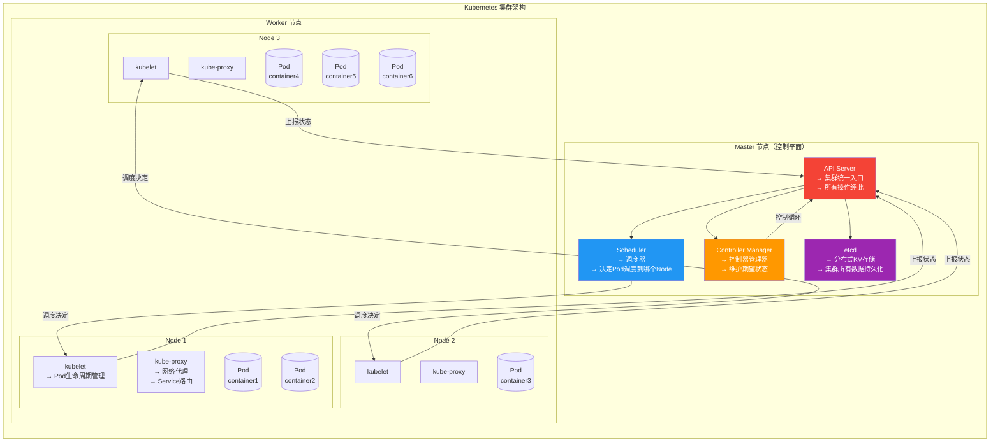

### Master 组件详解

| 组件 | 功能 | 核心职责 |
|-----|------|---------|
| **API Server** | 集群统一入口 | 所有操作经RESTful API处理，支持水平扩展 |
| **Scheduler** | 调度器 | 监听未绑定的Pod，选择合适的Node绑定 |
| **Controller Manager** | 控制器管理器 | 运行多个控制器（节点、副本、端点等） |
| **etcd** | 分布式KV存储 | 存储集群状态、配置元数据，基于Raft共识 |

### Worker 组件详解

| 组件 | 功能 | 核心职责 |
|-----|------|---------|
| **kubelet** | Pod代理 | 管理Pod生命周期，与API Server通信，启动容器 |
| **kube-proxy** | 网络代理 | 维护iptables规则，实现Service的负载均衡和路由 |
| **Container Runtime** | 容器运行时 | 运行容器（Docker/containerd/CRI-O） |

### Master/HA 部署

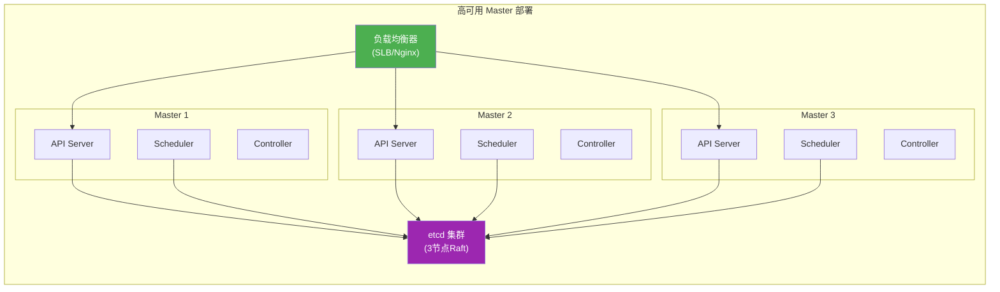

## 二、核心对象模型

### 对象关系总览

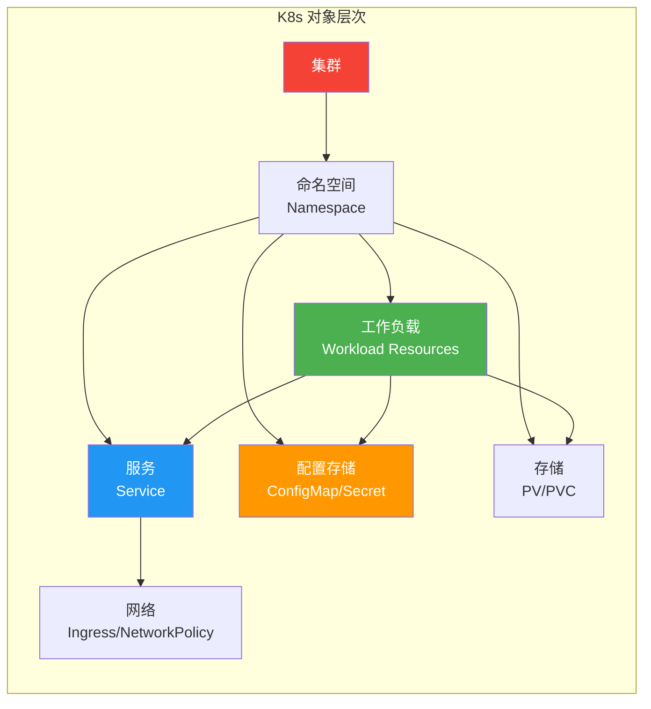

### Pod

> [!definition] Pod
> Pod是K8s中最小的部署和调度单元，包含一个或多个紧密协作的容器，共享网络（IP和端口）和存储（Volume）。

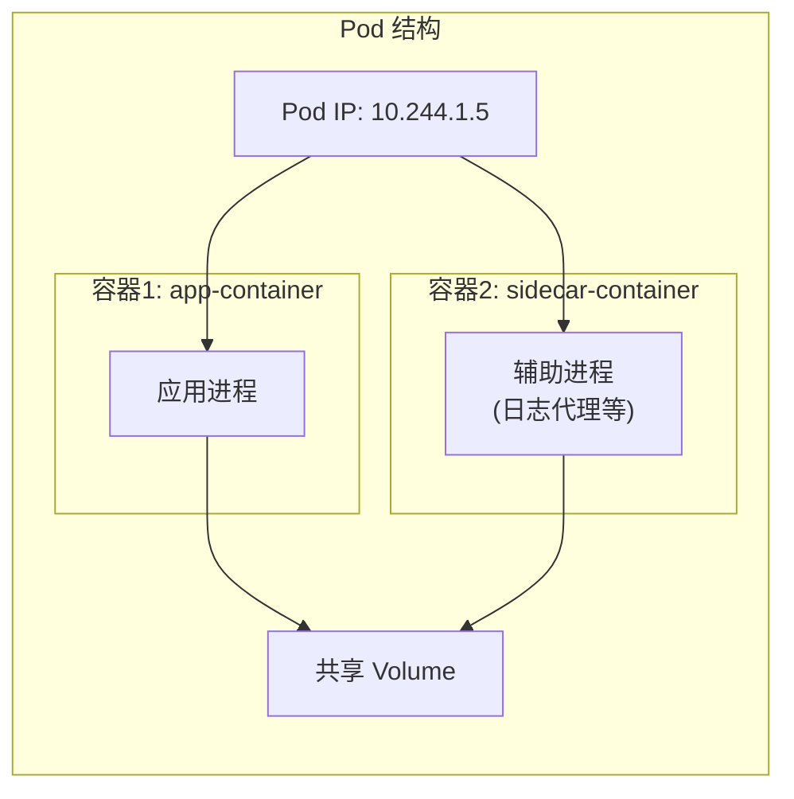

**Pod 生命周期状态**：

| 状态 | 说明 |
|-----|------|
| Pending | Pod已创建但尚未被调度 |
| Creating | Pod正在创建容器 |
| Running | Pod绑定到节点，容器正在运行或启动中 |
| Succeeded | 所有容器终止且成功退出 |
| Failed | 所有容器终止且至少一个失败退出 |
| Unknown | 无法获取Pod状态 |

### Service

> [!definition] Service
> Service为一组Pod提供稳定的网络访问入口，解决Pod IP动态变化的问题。

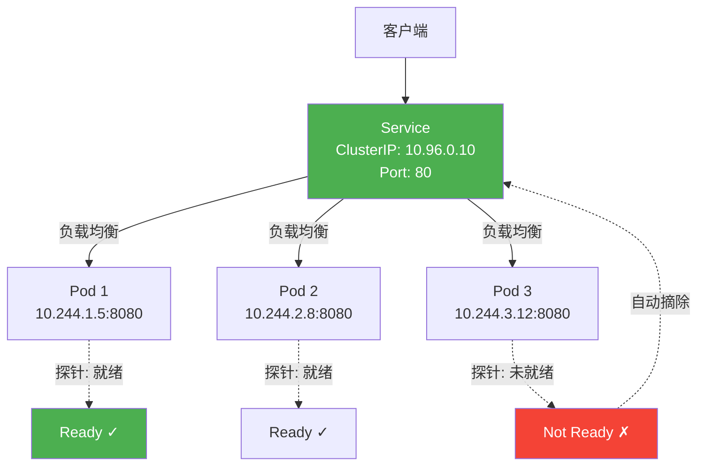

**四种Service类型**：

| 类型 | 说明 | 访问范围 | 场景 |
|-----|------|---------|------|
| **ClusterIP** | 默认类型，集群内部访问 | 仅集群内 | 内部服务间通信 |
| **NodePort** | 在每个Node上开放固定端口 | 外部通过Node IP:Port访问 | 测试、简单访问 |
| **LoadBalancer** | 使用云负载均衡器暴露 | 外部通过LB IP访问 | 云平台生产环境 |
| **ExternalName** | 映射到外部DNS名称 | CNAME方式 | 引用外部服务 |

### Deployment

> [!definition] Deployment
> Deployment为Pod提供声明式更新和自动扩缩能力，通过管理ReplicaSet实现Pod副本的滚动更新。

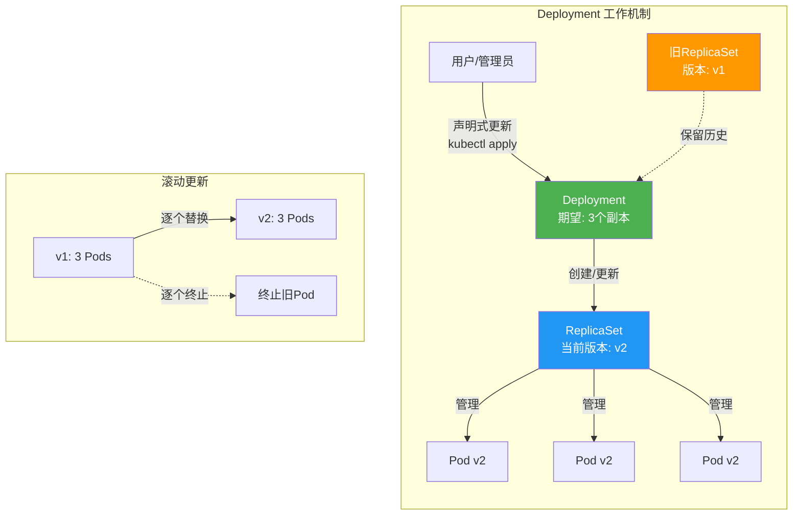

### StatefulSet

> [!definition] StatefulSet
> StatefulSet为有状态应用提供稳定的Pod名称和网络标识，有序的部署、扩缩和删除。

| 维度 | Deployment | StatefulSet |
|-----|-----------|-------------|
| **Pod名称** | 随机后缀（app-7d4f5b6c8-x2k9j） | 有序编号（app-0, app-1, app-2） |
| **DNS** | 无稳定DNS | 每个Pod有稳定DNS记录 |
| **存储** | 共享Volume | 每个Pod独立PVC |
| **更新顺序** | 并行/滚动 | 倒序逐个更新 |
| **适用场景** | 无状态应用（Web、API） | 有状态应用（DB、MQ） |

### DaemonSet

> [!definition] DaemonSet
> DaemonSet确保每个（或特定）节点上运行一个Pod副本，用于节点级的后台任务。

**典型应用场景**：
- 日志收集器（Fluentd、Logstash）
- 节点监控（Node Exporter）
- 网络插件（CNI Agent）
- 存储客户端（GlusterFS、Ceph Agent）

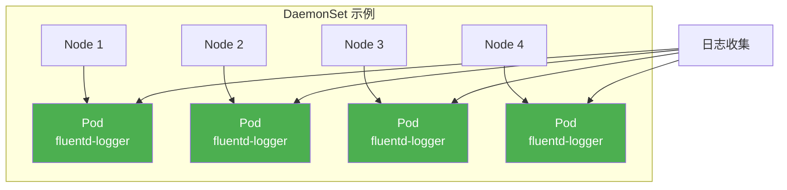

### ConfigMap 与 Secret

| 资源 | 用途 | 存储内容 | 访问方式 |
|-----|------|---------|---------|
| **ConfigMap** | 非敏感配置 | 配置文件、环境变量、命令行参数 | 挂载到Volume或注入环境变量 |
| **Secret** | 敏感信息 | 密码、Token、证书、密钥 | 同上，但加密存储 |

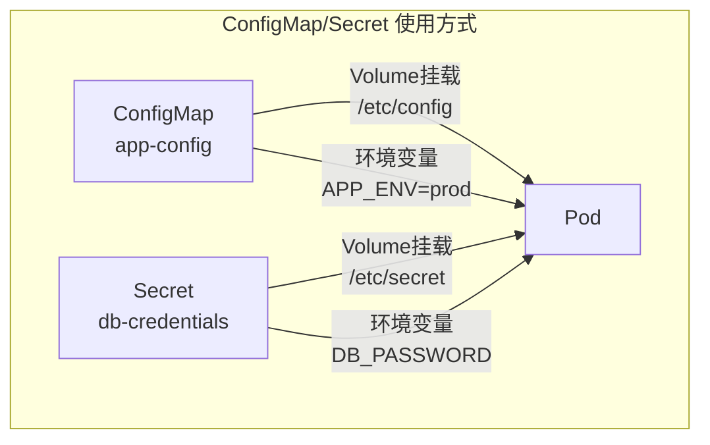

## 三、Ingress 与 Ingress Controller

### 什么是Ingress

> [!definition] Ingress
> Ingress是K8s中管理集群外部HTTP/HTTPS访问的规则集合，Ingress Controller是实现Ingress规则的控制器。

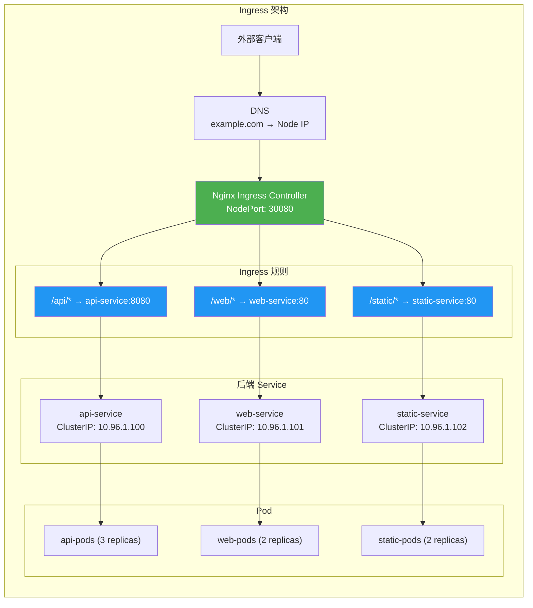

### 常用Ingress Controller

| Controller | 特点 | 适用场景 |
|-----------|------|---------|
| **Nginx Ingress** | 基于Nginx，功能完善 | 通用场景 |
| **Traefik** | 云原生，自动服务发现 | 微服务、动态路由 |
| **HAProxy Ingress** | 高性能，专注L7 | 高并发场景 |
| **AWS ALB Ingress** | 与AWS ALB集成 | AWS云环境 |
| **Istio Gateway** | Service Mesh集成 | 云原生服务网格 |

## 四、Helm包管理器

### Helm 核心概念

> [!definition] Helm
> Helm是K8s的包管理器，使用Chart定义、打包和部署应用，简化K8s应用的管理。

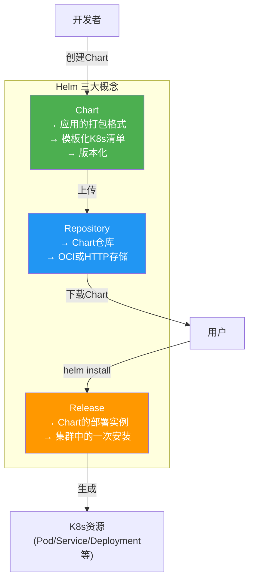

### Helm vs 原生YAML

| 维度 | 原生YAML | Helm |
|-----|---------|------|
| **复用性** | 复制粘贴多个YAML | 参数化模板，一次编写多次使用 |
| **版本管理** | 手动维护版本 | 内置版本号和版本历史 |
| **复杂部署** | 管理多个文件 | 单个Chart包含所有依赖 |
| **回滚** | 手动删除重建 | `helm rollback` 一键回滚 |
| **依赖管理** | 手动处理 | `requirements.yaml` 声明依赖 |

### Chart 结构

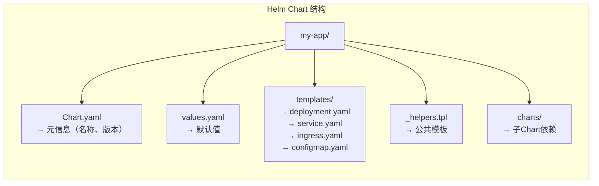

### Helm 常用命令

```bash
# 仓库管理
helm repo add bitnami https://charts.bitnami.com/bitnami
helm repo update
helm search repo nginx

# 安装与升级
helm install my-app bitnami/nginx
helm upgrade my-app bitnami/nginx --set replicas=5
helm upgrade --install my-app bitnami/nginx

# 查看与回滚
helm list
helm status my-app
helm history my-app
helm rollback my-app 2

# 卸载
helm uninstall my-app

# 自定义Chart
helm create my-chart
helm package my-chart
helm push my-chart-0.1.0.tgz oci://registry.example.com/charts
```

## 五、实战部署示例

### 完整的Web应用部署

#### Deployment + Service + Ingress YAML

```yaml
# web-app.yaml
apiVersion: apps/v1
kind: Deployment
metadata:
  name: web-app
  namespace: default
  labels:
    app: web-app
    tier: frontend
spec:
  replicas: 3
  strategy:
    type: RollingUpdate
    rollingUpdate:
      maxUnavailable: 1
      maxSurge: 1
  selector:
    matchLabels:
      app: web-app
  template:
    metadata:
      labels:
        app: web-app
        tier: frontend
    spec:
      containers:
        - name: web
          image: nginx:1.25-alpine
          ports:
            - containerPort: 80
          resources:
            requests:
              cpu: 100m
              memory: 128Mi
            limits:
              cpu: 500m
              memory: 256Mi
          readinessProbe:
            httpGet:
              path: /
              port: 80
            initialDelaySeconds: 5
            periodSeconds: 10
          livenessProbe:
            httpGet:
              path: /
              port: 80
            initialDelaySeconds: 15
            periodSeconds: 20
          env:
            - name: APP_ENV
              valueFrom:
                configMapKeyRef:
                  name: web-app-config
                  key: env
      nodeSelector:
        kubernetes.io/os: linux
      tolerations: []
---
apiVersion: v1
kind: Service
metadata:
  name: web-app-service
  labels:
    app: web-app
spec:
  type: ClusterIP
  selector:
    app: web-app
  ports:
    - protocol: TCP
      port: 80
      targetPort: 80
---
apiVersion: networking.k8s.io/v1
kind: Ingress
metadata:
  name: web-app-ingress
  annotations:
    nginx.ingress.kubernetes.io/rewrite-target: /
    cert-manager.io/cluster-issuer: letsencrypt-prod
spec:
  ingressClassName: nginx
  tls:
    - hosts:
        - www.example.com
      secretName: web-app-tls
  rules:
    - host: www.example.com
      http:
        paths:
          - path: /
            pathType: Prefix
            backend:
              service:
                name: web-app-service
                port:
                  number: 80
```

#### ConfigMap 与 Secret

```yaml
# configmap.yaml
apiVersion: v1
kind: ConfigMap
metadata:
  name: web-app-config
data:
  env: "production"
  log.level: "info"
  max.connections: "100"
  app.properties: |
    server.port=8080
    server.shutdown=graceful
    spring.datasource.url=jdbc:mysql://db.example.com:3306/app
---
# secret.yaml
apiVersion: v1
kind: Secret
metadata:
  name: web-app-secrets
type: Opaque
data:
  db-password: c3VwZXJfc2VjcmV0X3Bhc3N3b3Jk
  api-key: YXBpX2tleV9mb3JfcHJvZHVjdGlvbl9lbnY=
```

#### kubectl 操作命令

```bash
# 部署应用
kubectl apply -f web-app.yaml
kubectl apply -f configmap.yaml
kubectl apply -f secret.yaml

# 查看资源
kubectl get pods -o wide
kubectl get svc
kubectl get ingress
kubectl describe deployment web-app

# 查看日志
kubectl logs -f deployment/web-app
kubectl logs -f deployment/web-app --tail=100

# 进入容器
kubectl exec -it deployment/web-app -- /bin/bash

# 扩缩容
kubectl scale deployment web-app --replicas=5

# 滚动更新
kubectl set image deployment/web-app web=nginx:1.26-alpine
kubectl rollout status deployment/web-app
kubectl rollout history deployment/web-app
kubectl rollout undo deployment/web-app

# 调试
kubectl top pods
kubectl top nodes
kubectl get events --sort-by='.lastTimestamp' | tail -20

# 清理
kubectl delete -f web-app.yaml
```

## 六、小结

> [!summary] 本节要点回顾
> 1. **K8s架构**：Master（API Server、Scheduler、Controller Manager、etcd）+ Worker（kubelet、kube-proxy、容器运行时）
> 2. **核心对象**：Pod（最小单元）、Service（稳定入口）、Deployment（无状态管理）、StatefulSet（有状态管理）、DaemonSet（节点级任务）
> 3. **ConfigMap/Secret**：配置管理的两种方式，Secret用于敏感信息
> 4. **Ingress**：HTTP/HTTPS路由规则，需配合Ingress Controller实现
> 5. **Helm**：K8s包管理器，通过Chart打包和部署应用，支持版本管理和一键回滚
> 6. **部署实践**：完整使用Deployment+Service+Ingress+ConfigMap+Secret的组合部署应用

## 关联知识点

| 关联知识点 | 关系 |
|-----------|------|
| [[3.3 Dockerfile与容器编排]] | Docker是K8s的容器运行时基础 |
| [[8.2 云运维自动化]] | K8s是CI/CD和GitOps的核心运行平台 |
| [[10.2 云原生技术体系]] | K8s是云原生的核心编排引擎 |
| [[10.3 云原生应用开发实践]] | K8s是云原生应用的部署目标 |