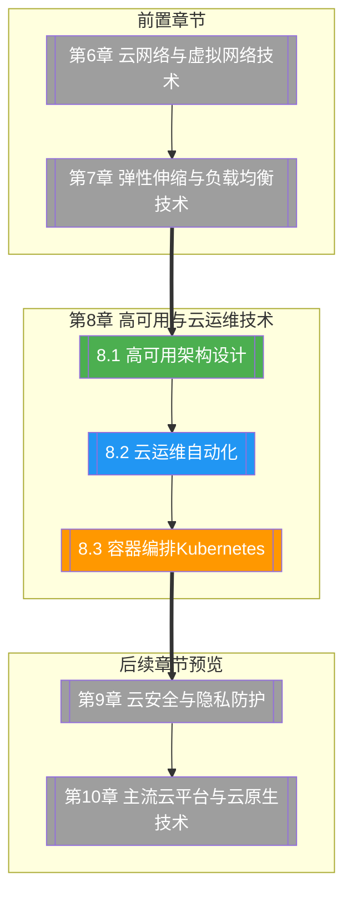

# 第8章 高可用与云运维技术

> [!abstract] 章节概述
> 高可用是云计算服务可靠性的核心保障，云运维自动化是实现规模化云治理的关键手段。本章系统介绍高可用架构设计（SLA/SLO/RTO/RPO、多AZ/多区域部署、故障转移策略）、云运维自动化（DevOps、配置管理、CI/CD、GitOps）以及容器编排技术Kubernetes（核心架构、对象模型、Helm生态）。通过本章学习，读者将掌握从架构设计到运维实践的完整高可用方案，并具备Kubernetes集群管理与自动化运维的实战能力。

## 学习路线图

## 知识点导航

| 编号 | 知识点 | 核心内容 | 重要程度 |
|-----|--------|---------|---------|
| 8.1 | [[8.1 高可用架构设计]] | SLA/SLO/RTO/RPO、冗余与故障转移、多AZ vs多区域部署、Active-Active vs Active-Passive、高可用设计模式 | ⭐⭐⭐⭐⭐ |
| 8.2 | [[8.2 云运维自动化]] | DevOps文化、Ansible/Puppet配置管理、CI/CD流水线、GitOps与ArgoCD、基础设施生命周期管理 | ⭐⭐⭐⭐⭐ |
| 8.3 | [[8.3 容器编排Kubernetes]] | K8s架构(Master+Node)、核心对象(Pod/Service/Deployment等)、Ingress Controller、Helm包管理器 | ⭐⭐⭐⭐⭐ |

## 核心概念速览

> [!tip] 本章必须掌握的核心概念
> - **SLA（服务等级协议）**：服务提供商与用户之间的协议，定义服务可用性承诺（如99.9%）
> - **SLO（服务等级目标）**：SLA的量化目标，如每月不可用时间不超过43分钟
> - **RTO（恢复时间目标）**：系统故障后恢复运行的最长时间
> - **RPO（恢复点目标）**：可容忍的数据丢失时间窗口
> - **多AZ部署**：在同一区域的多个可用区部署应用，实现同城容灾
> - **多区域部署**：在不同地理区域部署应用，实现异地容灾
> - **Active-Active**：所有节点同时提供服务，任何节点故障不影响整体
> - **Active-Passive**：主节点提供服务，备用节点待命，故障时自动切换
> - **DevOps**：开发与运维一体化的文化和实践，强调CI/CD与自动化
> - **CI/CD**：持续集成/持续部署，实现代码从提交到生产的自动化管道
> - **GitOps**：以Git为单一事实源的运维模式，基础设施配置存储在Git中
> - **Kubernetes**：容器编排系统，自动化部署、扩缩和管理容器化应用
> - **Pod**：K8s中最小的部署单元，包含一个或多个容器
> - **Service**：为一组Pod提供稳定访问入口的抽象层
> - **Helm**：K8s的包管理器，使用Chart定义和部署应用

## 核心考点

> [!important] 期末高频考点

| 考点 | 所属知识点 | 考查形式 | 难度 |
|-----|-----------|---------|------|
| SLA/SLO/RTO/RPO的定义与关系 | 8.1 | 选择题/简答题 | ★★ |
| 多AZ vs 多区域部署的对比与选型 | 8.1 | 对比题/案例分析 | ★★★★ |
| Active-Active vs Active-Passive的原理与场景 | 8.1 | 简答题 | ★★★ |
| 高可用架构设计模式（旁路、熔断等） | 8.1 | 论述题/案例分析 | ★★★★ |
| DevOps文化与传统运维的区别 | 8.2 | 简答题 | ★★★ |
| CI/CD流水线的阶段与工具链 | 8.2 | 简答题/论述题 | ★★★★ |
| Ansible Playbook的编写与执行 | 8.2 | 实操题/代码题 | ★★★★ |
| GitOps的原理与ArgoCD工作流程 | 8.2 | 论述题 | ★★★★ |
| Kubernetes架构组件（Master+Node） | 8.3 | 简答题/选择题 | ★★★ |
| K8s核心对象的作用与关系 | 8.3 | 简答题/对比题 | ★★★★ |
| Deployment YAML文件编写 | 8.3 | 实操题/代码题 | ★★★★ |
| Helm Chart的结构与使用 | 8.3 | 简答题/实操题 | ★★★ |

## 自测题

> [!question] 章节自测
> 1. 某金融系统要求99.99%的可用性，RTO < 1小时，RPO < 5分钟。请设计一套高可用架构，包括多AZ/多区域部署策略、故障转移机制和数据同步方案。
> 2. 使用Ansible编写一个Playbook，实现Web服务器（Nginx）的自动化部署和配置管理，包含安装、配置文件下发、服务启动等步骤。
> 3. 阐述CI/CD流水线的完整阶段，设计一个从代码提交到生产部署的CI/CD流程，说明每个阶段的工具和关键实践。
> 4. 使用Kubernetes部署一个包含Web前端（Nginx）和后端API服务（Python Flask）的完整应用，编写所有必要的YAML文件（Deployment、Service、Ingress）。
> 5. 对比传统运维、DevOps和GitOps三种模式的区别与联系，分析各自的适用场景和优缺点。

## 章节导航

| 方向 | 链接 |
|-----|------|
| ⬆ 返回课程总览 | [[MOC - 云计算技术]] |
| ⬅ 上一章 | [[第7章 弹性伸缩与负载均衡技术/MOC - 第7章]] |
| ➡ 下一章 | [[第9章 云安全与隐私防护/MOC - 第9章]] |