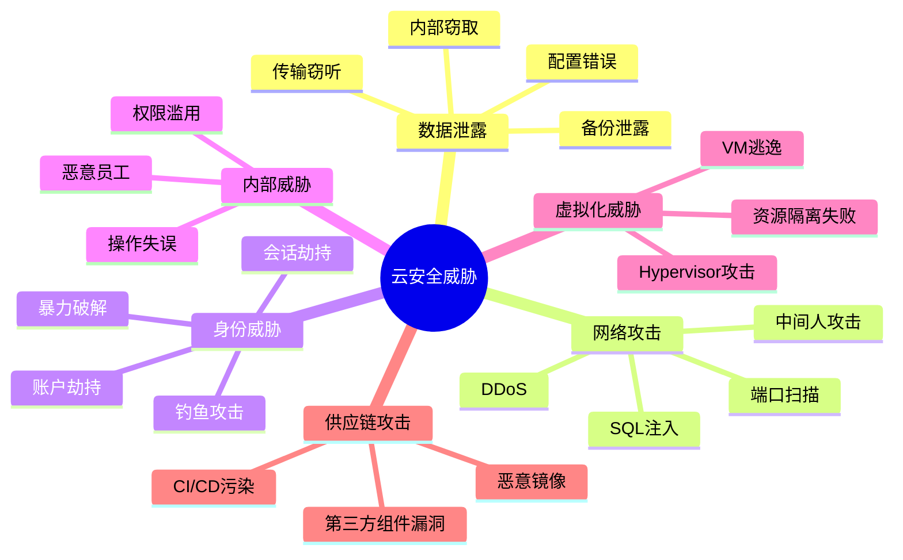
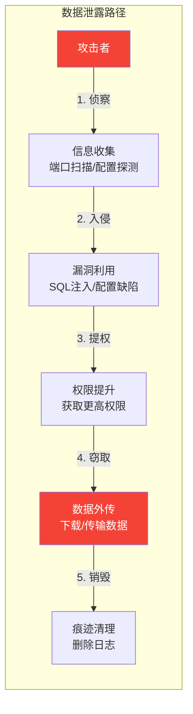
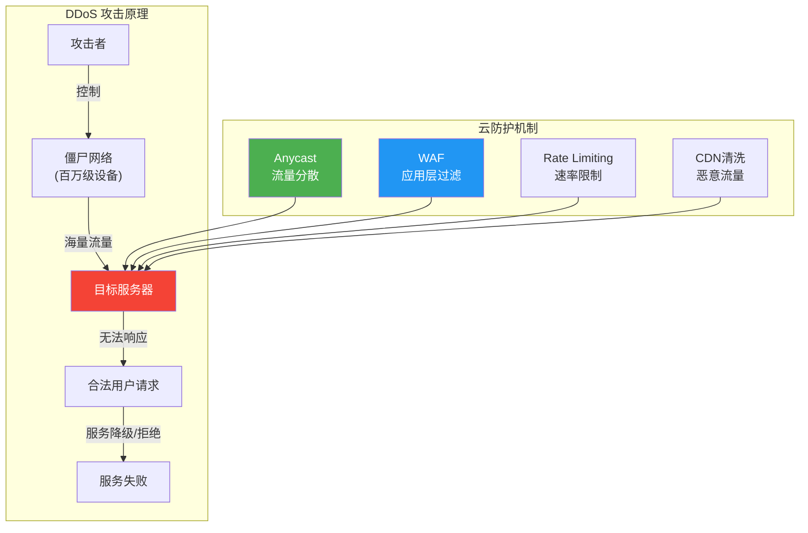
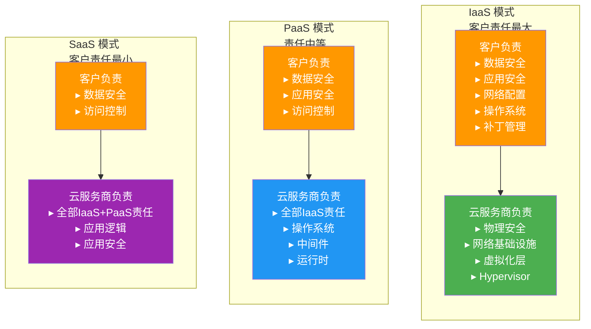
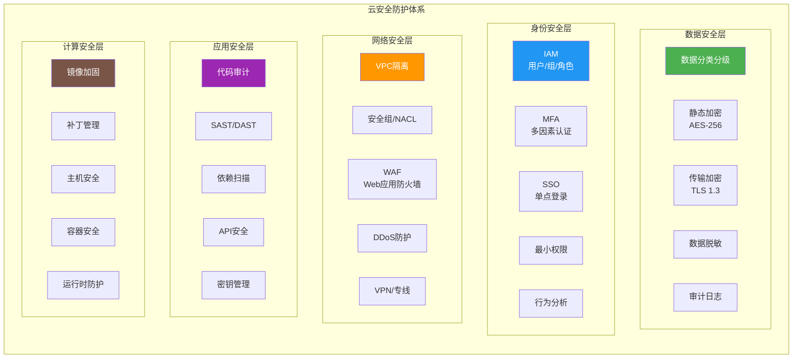
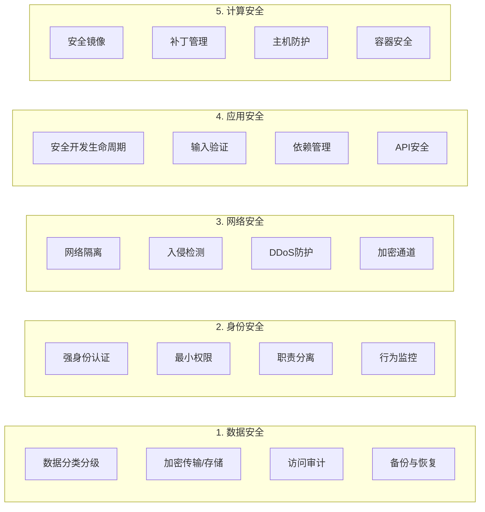
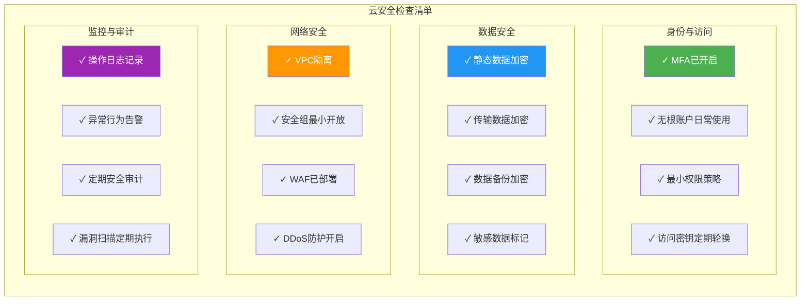

# 9.1 云安全威胁与防护体系

> [!abstract] 本节导读
> 云安全威胁日益多样化和复杂化。本节首先介绍云环境中最常见的安全威胁类型（数据泄露、DDoS攻击、内部威胁、账户劫持），然后深入讲解云安全的核心框架——共享责任模型，通过Mermaid架构图展示完整的云安全防护体系，最后详细剖析五大安全域（数据、身份、网络、应用、计算）的防护要点。

## 一、云安全威胁

### 主要威胁类型

### 六大威胁详解

#### 1. 数据泄露（Data Breach）

> [!warning] 数据泄露是云安全中最常见且危害最大的威胁，指敏感数据被未经授权的第三方获取。

**常见原因**：

| 原因 | 说明 | 典型案例 |
|-----|------|---------|
| **配置错误** | S3桶公开访问、数据库端口暴露 | Capital One 2019（防火墙配置错误） |
| **内部威胁** | 恶意员工或操作失误 | Facebook 2019（内部员工泄露5亿用户数据） |
| **传输窃听** | 未加密传输被中间人截获 | 公共Wi-Fi下的HTTP请求被窃听 |
| **应用漏洞** | SQL注入、XXE等OWASP Top10 | Equifax 2017（Web应用漏洞泄露1.43亿人数据） |
| **备份泄露** | 未加密的备份文件丢失或被盗 | 数据库备份硬盘遗失 |

#### 2. DDoS攻击

> [!warning] 分布式拒绝服务攻击，通过大量僵尸流量淹没目标服务，使其无法正常响应。

**DDoS攻击类型**：

| 类型 | 层级 | 原理 | 流量特征 |
|-----|------|------|---------|
| **Volume-based** | 网络/传输层 | 大量伪造UDP/ICMP包 | Tbps级 |
| **Protocol-based** | 传输层 | TCP SYN Flood、DNS Flood | 百万级PPS |
| **Application-based** | 应用层 | HTTP Flood、Slowloris | 高并发请求 |

#### 3. 内部威胁（Insider Threat）

| 类型 | 描述 | 检测难度 |
|-----|------|---------|
| **恶意内部人员** | 故意泄露或破坏数据的员工 | 高（行为正常） |
| **疏忽内部人员** | 无意中犯错（配置错误、点击钓鱼邮件） | 中 |
| **第三方/承包商** | 外部合作方的恶意或疏忽行为 | 高 |

#### 4. 账户劫持（Account Hijacking）

> [!warning] 攻击者获取合法用户凭证，冒用身份访问云资源。

**攻击手法**：
- 暴力破解密码
- 钓鱼网站窃取凭证
- 会话劫持（Session Hijacking）
- 凭证填充（Credential Stuffing）
- API密钥泄露

#### 5. 虚拟化威胁

> [!warning] 利用虚拟化层的弱点进行跨VM攻击。

| 威胁 | 描述 | 防护 |
|-----|------|------|
| **VM逃逸** | 从Guest OS突破到Hypervisor | Hypervisor安全加固、Intel VT-x |
| **VM跳跃** | 从一个VM跳到同一物理机的另一个VM | 网络隔离、微分段 |
| **侧信道攻击** | 通过缓存/CPU时间差异窃取数据 | 资源隔离、内存加密 |

## 二、共享责任模型

### 模型概述

> [!definition] 共享责任模型（Shared Responsibility Model）
> 云安全的基本原则：云服务商负责**基础设施层**的安全，客户负责**数据和应用层**的安全。不同服务模式下，双方责任不同。

### AWS 共享责任矩阵

| 层级 | IaaS (EC2) | PaaS (RDS) | SaaS (S3) |
|-----|-----------|-----------|-----------|
| 物理基础设施 | AWS | AWS | AWS |
| 网络基础设施 | AWS | AWS | AWS |
| 虚拟化层 | AWS | AWS | AWS |
| 操作系统 | 客户 | AWS | AWS |
| 应用中间件 | 客户 | AWS | AWS |
| 应用层 | 客户 | 客户 | AWS |
| 数据 | 客户 | 客户 | 客户 |
| 访问管理 | 客户 | 客户 | 客户 |

## 三、云安全防护架构

### 总体安全架构

### 五大安全域详解

### 数据安全域

| 防护措施 | 实现方式 | 云服务示例 |
|---------|---------|-----------|
| **数据分类分级** | 敏感/重要/一般/公开 | AWS Macie、阿里云数据安全中心 |
| **传输加密** | TLS 1.3、IPsec | 所有云API强制HTTPS |
| **存储加密** | AES-256、KMS托管密钥 | S3/S3 Object Lock、EBS加密 |
| **访问审计** | 操作日志、访问记录 | AWS CloudTrail、阿里云ActionTrail |
| **数据脱敏** | 动态/静态脱敏 | 阿里云数据脱敏、AWS Lake Formation |

### 身份安全域

| 防护措施 | 实现方式 | 云服务示例 |
|---------|---------|-----------|
| **强身份认证** | MFA、生物识别、硬件Key | AWS IAM MFA、阿里云RAM MFA |
| **最小权限** | 精确策略、临时凭证 | IAM Policy、STS临时Token |
| **职责分离** | 多人控制、审批流程 | AWS Break Glass、阿里云特权账号管理 |
| **行为监控** | 异常检测、UEBA | AWS GuardDuty、阿里云云盾态势感知 |

### 网络安全域

| 防护措施 | 实现方式 | 云服务示例 |
|---------|---------|-----------|
| **网络隔离** | VPC、子网、安全组 | AWS VPC、阿里云VPC |
| **入侵检测** | IDS/IPS、流量分析 | AWS GuardDuty、阿里云云盾IDS |
| **DDoS防护** | Anycast、清洗中心 | AWS Shield、阿里云DDoS高防 |
| **加密通道** | VPN Direct Connect | AWS VPN、阿里云VPN网关 |

### 应用安全域

| 防护措施 | 实现方式 | 云服务示例 |
|---------|---------|-----------|
| **安全开发生命周期** | SDL流程、威胁建模 | 微软SDL、OWASP SAMM |
| **输入验证** | WAF规则、参数校验 | AWS WAF、阿里云WAF |
| **依赖管理** | SCA扫描、漏洞数据库 | Snyk、OWASP Dependency-Check |
| **API安全** | 认证、限流、日志 | AWS API Gateway、阿里云API网关 |

### 计算安全域

| 防护措施 | 实现方式 | 云服务示例 |
|---------|---------|-----------|
| **安全镜像** | 镜像扫描、加固模板 | AWS AMI、阿里云ECS镜像市场 |
| **补丁管理** | 自动补丁、版本管理 | AWS Systems Manager、阿里云补丁管理 |
| **主机防护** | 杀毒、入侵防护 | AWS Detective、阿里云云盾安骑士 |
| **容器安全** | 镜像扫描、运行时防护 | AWS ECR扫描、阿里云容器镜像服务 |

## 四、云安全最佳实践

### 安全设计原则

> [!tip] 云安全设计五原则
> 1. **Defense in Depth（纵深防御）**：多层安全措施，每层独立有效
> 2. **Least Privilege（最小权限）**：仅授予必要权限
> 3. **Zero Trust（零信任）**：不信任任何流量，持续验证
> 4. **Secure by Default（默认安全）**：默认开启安全配置
> 5. **Shared Security（共享安全）**：理解并履行共享责任

### 安全检查清单

## 五、小结

> [!summary] 本节要点回顾
> 1. **六大云安全威胁**：数据泄露、DDoS攻击、内部威胁、账户劫持、虚拟化威胁、供应链攻击
> 2. **共享责任模型**：IaaS/PaaS/SaaS模式下客户和云服务商的责任划分
> 3. **五大安全域**：数据安全、身份安全、网络安全、应用安全、计算安全
> 4. **防护体系**：纵深防御、零信任、最小权限、默认安全等原则贯穿各安全域
> 5. **最佳实践**：MFA、加密、审计日志、定期漏洞扫描和安全审计

## 关联知识点

| 关联知识点 | 关系 |
|-----------|------|
| [[9.2 身份认证与访问控制IAM]] | IAM是身份安全域的核心实现 |
| [[9.3 数据加密与隐私保护]] | 数据安全域的深入展开 |
| [[6.1 虚拟网络与VPC]] | VPC隔离是网络安全域的基础 |
| [[8.1 高可用架构设计]] | 安全是高可用的前提 |