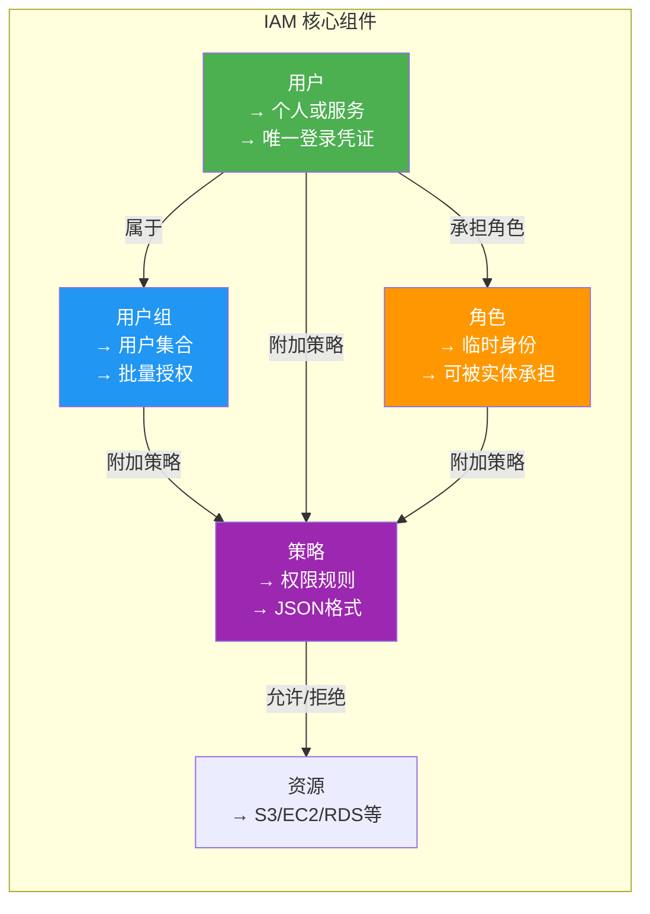
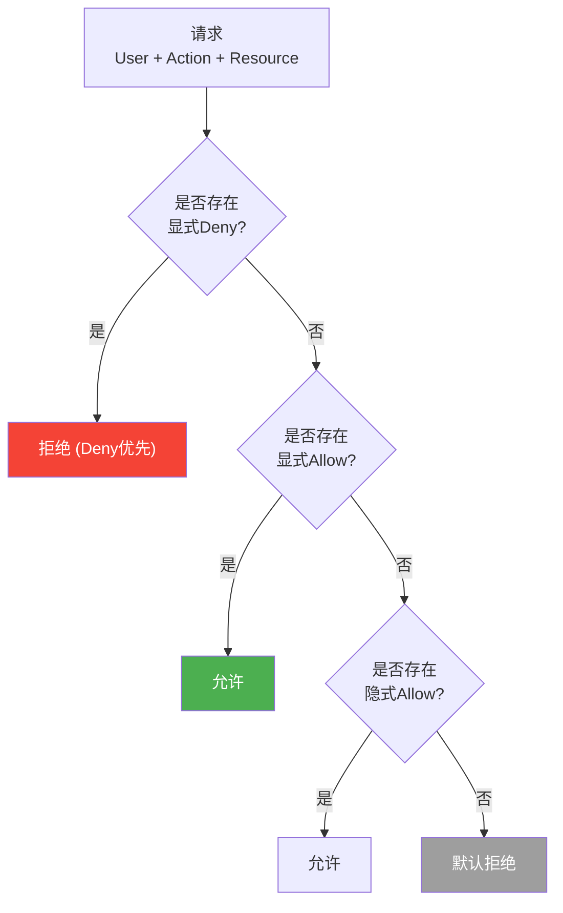
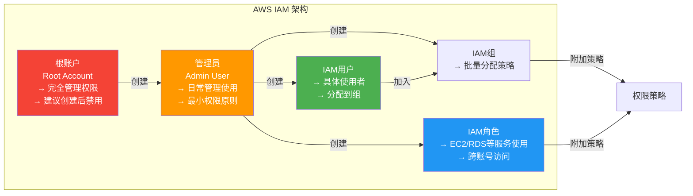
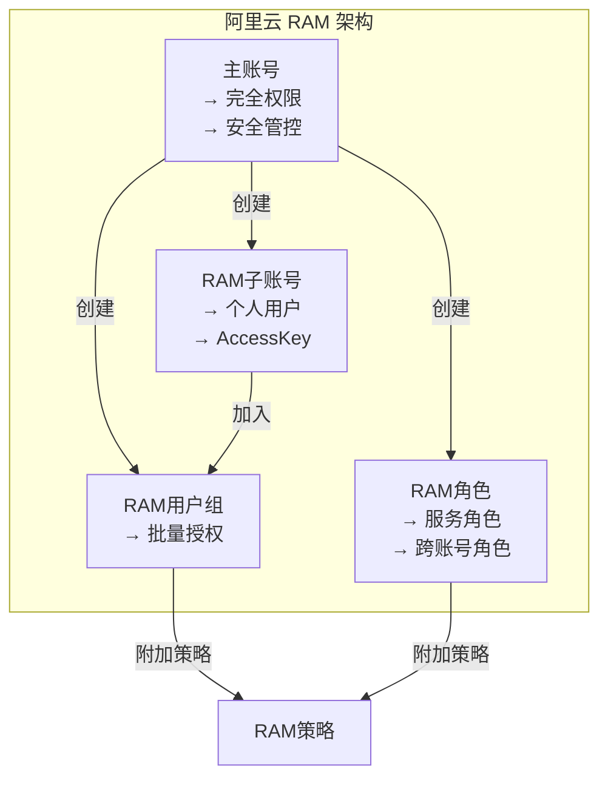
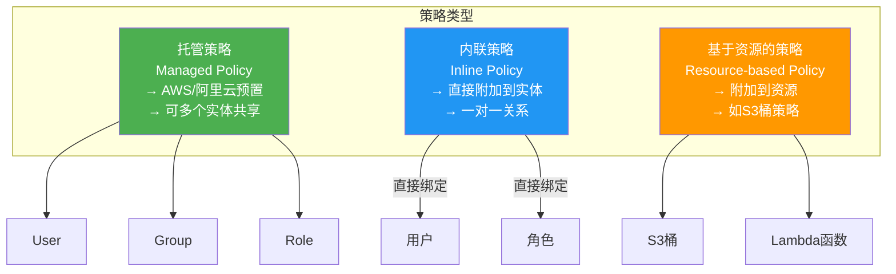
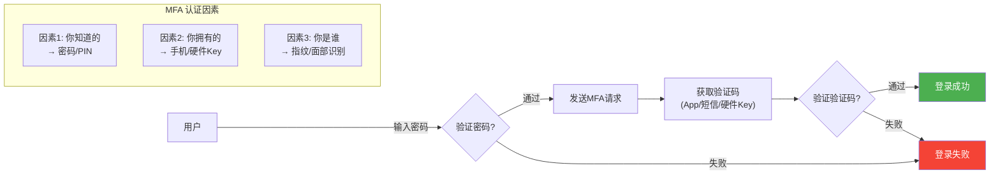
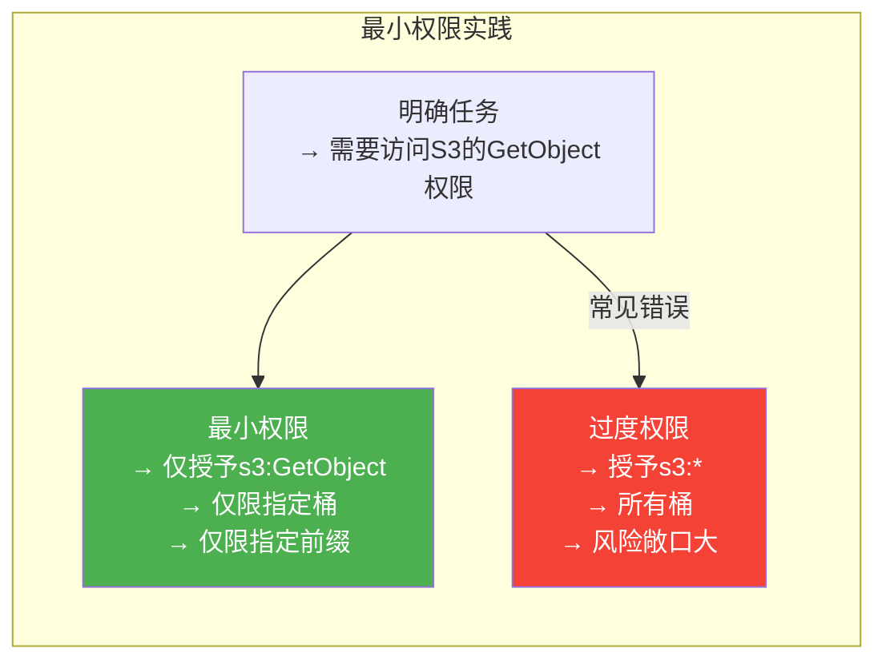
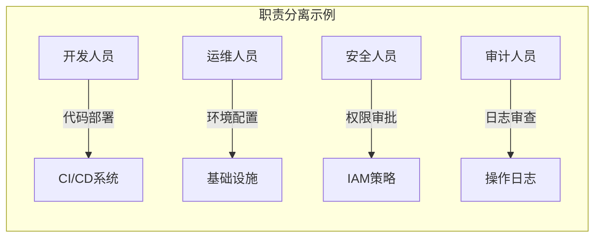

# 9.2 身份认证与访问控制IAM

> [!abstract] 本节导读
> IAM是云安全的核心基石。本节首先介绍IAM的基本概念和核心组件（用户、组、角色、策略），然后对比AWS IAM与阿里云RAM的实现差异，深入讲解三种策略类型（托管策略、内联策略、基于资源的策略），接着介绍MFA多因素认证和最小权限原则的实践，最后通过Python boto3代码演示IAM的完整配置流程。

## 一、IAM核心概念

### 什么是IAM

> [!definition] IAM（Identity and Access Management）
> 身份与访问管理是云平台提供的核心安全服务，用于管理用户身份、角色和访问权限，确保只有授权的主体才能访问相应的云资源。

### IAM核心组件



### 组件详解

| 组件 | 说明 | 核心特性 |
|-----|------|---------|
| **用户（User）** | 独立的云使用者 | 唯一ID、访问密钥、密码登录 |
| **用户组（Group）** | 用户的集合 | 批量管理权限，简化授权 |
| **角色（Role）** | 可被临时承担的身份 | 无长期凭证，通过STS获取临时Token |
| **策略（Policy）** | 权限规则集合 | JSON格式，定义允许/拒绝的操作和资源 |
| **资源（Resource）** | 云服务对象 | S3桶、EC2实例、RDS数据库等 |

### 权限判定流程



## 二、AWS IAM 与阿里云 RAM

### 对比总览

| 维度 | AWS IAM | 阿里云 RAM |
|-----|---------|-----------|
| **全称** | Identity and Access Management | Resource Access Management |
| **核心概念** | User, Group, Role, Policy | User, Group, Role, Policy |
| **策略语言** | JSON (IAM Policy) | JSON (RAM Policy) |
| **多因素认证** | 支持（虚拟/硬件/短信） | 支持（虚拟/硬件/短信） |
| **临时凭证** | STS (Security Token Service) | STS (Security Token Service) |
| **角色类型** | 服务角色、跨账号角色 | 服务角色、RAM角色 |
| **访问密钥** | Access Key ID + Secret Key | AccessKey ID + AccessKey Secret |

### AWS IAM 架构



### 阿里云 RAM 架构



## 三、策略类型与编写

### 三种策略类型

> [!definition] IAM Policy（策略）
> 策略是定义权限规则的JSON文档，指定哪些操作被允许或拒绝。



| 策略类型 | 附加对象 | 生命周期 | 适用场景 |
|---------|---------|---------|---------|
| **托管策略** | User/Group/Role | 独立于实体 | 通用权限（如只读、管理员） |
| **内联策略** | User/Role | 随实体删除 | 个性化临时权限 |
| **基于资源的策略** | 资源（S3/Lambda） | 随资源存在 | 特定资源的跨账号访问 |

### 策略结构

```json
{
  "Version": "2012-10-17",
  "Statement": [
    {
      "Effect": "Allow",
      "Principal": {
        "AWS": "*"
      },
      "Action": [
        "s3:GetObject",
        "s3:PutObject"
      ],
      "Resource": [
        "arn:aws:s3:::my-bucket/*"
      ],
      "Condition": {
        "IpAddress": {
          "aws:SourceIp": "192.168.1.0/24"
        },
        "StringEquals": {
          "aws:RequestedRegion": "us-east-1"
        }
      }
    }
  ]
}
```

**策略元素详解**：

| 元素 | 说明 | 必填 |
|-----|------|------|
| **Version** | 策略语言版本 | 是 |
| **Statement** | 声明数组 | 是 |
| **Effect** | Allow/Deny | 是 |
| **Principal** | 被授权实体 | 基于资源策略必填 |
| **Action** | 允许/拒绝的操作 | 是 |
| **Resource** | 操作的目标资源 | 是 |
| **Condition** | 附加条件 | 否 |

### 常用策略示例

#### 1. S3只读访问策略

```json
{
  "Version": "2012-10-17",
  "Statement": [
    {
      "Sid": "AllowS3Read",
      "Effect": "Allow",
      "Action": [
        "s3:GetObject",
        "s3:ListBucket",
        "s3:DescribeBucket"
      ],
      "Resource": [
        "arn:aws:s3:::company-data-bucket",
        "arn:aws:s3:::company-data-bucket/*"
      ]
    }
  ]
}
```

#### 2. EC2全管理策略

```json
{
  "Version": "2012-10-17",
  "Statement": [
    {
      "Sid": "AllowEC2All",
      "Effect": "Allow",
      "Action": [
        "ec2:*"
      ],
      "Resource": "*"
    },
    {
      "Sid": "AllowEC2Read",
      "Effect": "Allow",
      "Action": [
        "ec2:Describe*"
      ],
      "Resource": "*"
    },
    {
      "Sid": "DenyTermination",
      "Effect": "Deny",
      "Action": [
        "ec2:TerminateInstances",
        "ec2:DeleteSecurityGroup"
      ],
      "Resource": "*"
    }
  ]
}
```

#### 3. Lambda执行角色策略

```json
{
  "Version": "2012-10-17",
  "Statement": [
    {
      "Sid": "LambdaBasicExecution",
      "Effect": "Allow",
      "Action": [
        "lambda:InvokeFunction",
        "lambda:ListFunctions"
      ],
      "Resource": "arn:aws:lambda:us-east-1:123456789012:function:*"
    },
    {
      "Sid": "CloudWatchLogs",
      "Effect": "Allow",
      "Action": [
        "logs:CreateLogGroup",
        "logs:CreateLogStream",
        "logs:PutLogEvents"
      ],
      "Resource": "arn:aws:logs:us-east-1:123456789012:*"
    },
    {
      "Sid": "DynamoDBAccess",
      "Effect": "Allow",
      "Action": [
        "dynamodb:GetItem",
        "dynamodb:PutItem",
        "dynamodb:Query",
        "dynamodb:Scan"
      ],
      "Resource": "arn:aws:dynamodb:us-east-1:123456789012:table/app-data"
    }
  ]
}
```

## 四、MFA与最小权限

### 多因素认证（MFA）

> [!definition] MFA（Multi-Factor Authentication）
> 需要两种或以上的认证因素才能登录的安全机制，显著提高账户安全性。



### MFA设备类型

| 类型 | 说明 | 安全性 | 示例 |
|-----|------|--------|------|
| **虚拟MFA** | 手机App生成验证码 | 中 | Google Authenticator, Authy |
| **SMS MFA** | 短信发送验证码 | 较低（SIM劫持风险） | 阿里云短信MFA |
| **硬件MFA** | 物理硬件设备 | 高 | YubiKey、Gemalto |
| **生物识别** | 指纹/面部 | 高 | Windows Hello、Apple Face ID |

### 最小权限原则

> [!definition] 最小权限原则（Principle of Least Privilege）
> 只授予用户或服务完成其指定任务所需的最少权限，不多不少。



**实践步骤**：

1. **明确需求**：分析用户/服务需要执行的具体操作
2. **选择最小权限**：仅允许必要的Action
3. **限定资源范围**：精确到具体资源（桶、路径等）
4. **添加条件约束**：IP范围、时间窗口、标签等
5. **定期审查**：权限随时间变化，定期清理过期权限
6. **使用权限边界**：设置权限上限，防止越权

### 职责分离（SoD）

> [!definition] 职责分离（Separation of Duties）
> 将关键操作分配给多个实体，防止单个实体滥权。



## 五、Python boto3 IAM 脚本

### 创建IAM用户与策略

```python
import boto3
import json

iam = boto3.client('iam', region_name='us-east-1')

def create_iam_user(username):
    try:
        response = iam.create_user(
            UserName=username,
            Tags=[
                {'Key': 'Environment', 'Value': 'Production'},
                {'Key': 'Team', 'Value': 'Engineering'}
            ]
        )
        print(f"用户 {username} 创建成功")
        return response['User']
    except iam.exceptions.EntityAlreadyExistsException:
        print(f"用户 {username} 已存在")
        return iam.get_user(UserName=username)['User']

def create_policy(policy_name, policy_document):
    try:
        response = iam.create_policy(
            PolicyName=policy_name,
            PolicyDocument=json.dumps(policy_document),
            Description=f"Policy for {policy_name}"
        )
        policy_arn = response['Policy']['Arn']
        print(f"策略 {policy_name} 创建成功: {policy_arn}")
        return policy_arn
    except iam.exceptions.EntityAlreadyExistsException:
        response = iam.get_policy(
            PolicyArn=f"arn:aws:iam::123456789012:policy/{policy_name}"
        )
        return response['Policy']['Arn']

def attach_policy_to_user(username, policy_arn):
    iam.attach_user_policy(
        UserName=username,
        PolicyArn=policy_arn
    )
    print(f"策略已附加到用户 {username}")

def create_s3_readonly_policy():
    return {
        "Version": "2012-10-17",
        "Statement": [
            {
                "Sid": "S3ReadOnlyAccess",
                "Effect": "Allow",
                "Action": [
                    "s3:GetObject",
                    "s3:ListBucket",
                    "s3:GetBucketLocation"
                ],
                "Resource": [
                    "arn:aws:s3:::company-data-bucket",
                    "arn:aws:s3:::company-data-bucket/*"
                ]
            }
        ]
    }

def create_ec2_ops_policy():
    return {
        "Version": "2012-10-17",
        "Statement": [
            {
                "Sid": "EC2Describe",
                "Effect": "Allow",
                "Action": [
                    "ec2:Describe*",
                    "ec2:Get*",
                    "ec2:List*"
                ],
                "Resource": "*"
            },
            {
                "Sid": "EC2Manage",
                "Effect": "Allow",
                "Action": [
                    "ec2:StartInstances",
                    "ec2:StopInstances",
                    "ec2:RebootInstances",
                    "ec2:RunInstances"
                ],
                "Resource": "arn:aws:ec2:us-east-1:123456789012:instance/*"
            },
            {
                "Sid": "DenyTerminate",
                "Effect": "Deny",
                "Action": [
                    "ec2:TerminateInstances"
                ],
                "Resource": "*"
            }
        ]
    }

def setup_iam():
    policies = {
        's3-readonly': create_s3_readonly_policy(),
        'ec2-ops': create_ec2_ops_policy()
    }

    users = ['data-analyst', 'devops-engineer', 'app-service']

    for user in users:
        create_iam_user(user)

    s3_policy_arn = create_policy('s3-readonly-policy', policies['s3-readonly'])
    ec2_policy_arn = create_policy('ec2-ops-policy', policies['ec2-ops'])

    attach_policy_to_user('data-analyst', s3_policy_arn)
    attach_policy_to_user('devops-engineer', ec2_policy_arn)

    service_role_policy = {
        "Version": "2012-10-17",
        "Statement": [
            {
                "Effect": "Allow",
                "Principal": {"Service": "ec2.amazonaws.com"},
                "Action": "sts:AssumeRole"
            }
        ]
    }

    iam.create_role(
        RoleName='ec2-service-role',
        AssumeRolePolicyDocument=json.dumps(service_role_policy),
        Description='EC2 service role for application'
    )

    return {
        's3_policy': s3_policy_arn,
        'ec2_policy': ec2_policy_arn
    }

if __name__ == '__main__':
    results = setup_iam()
    print("\nIAM 配置完成!")
    print(json.dumps(results, indent=2))
```

### 检查IAM权限配置

```python
def audit_iam_permissions():
    iam = boto3.client('iam')

    users = iam.list_users()['Users']
    print("=== IAM 用户权限审计 ===\n")

    for user in users:
        username = user['UserName']
        print(f"用户: {username}")

        attached_policies = iam.list_attached_user_policies(UserName=username)['AttachedPolicies']
        inline_policies = iam.list_user_policies(UserName=username)['PolicyNames']

        print(f"  托管策略: {[p['PolicyName'] for p in attached_policies]}")
        print(f"  内联策略: {inline_policies}")

        groups = iam.list_groups_for_user(UserName=username)['Groups']
        print(f"  用户组: {[g['GroupName'] for g in groups]}")

        access_keys = iam.list_access_keys(UserName=username)['AccessKeyMetadata']
        for key in access_keys:
            status = key['Status']
            created = key['CreateDate']
            print(f"  访问密钥: {key['AccessKeyId']}, 状态: {status}, 创建时间: {created}")
        print()

audit_iam_permissions()
```

## 六、小结

> [!summary] 本节要点回顾
> 1. **IAM核心组件**：用户、用户组、角色、策略、资源，通过策略定义访问权限
> 2. **权限判定**：Deny优先原则，显式Allow > 隐式Allow > 默认拒绝
> 3. **AWS IAM vs 阿里云RAM**：功能对等，命名不同
> 4. **三种策略**：托管策略（多实体共享）、内联策略（一对一）、基于资源的策略（附加到资源）
> 5. **策略结构**：Version + Statement数组，每个Statement包含Effect、Action、Resource、Condition
> 6. **MFA**：多因素认证，虚拟/短信/硬件/生物识别四种类型
> 7. **最小权限原则**：仅授予必要权限，配合职责分离防止滥权

## 关联知识点

| 关联知识点 | 关系 |
|-----------|------|
| [[9.1 云安全威胁与防护体系]] | IAM是身份安全域的核心实现 |
| [[9.3 数据加密与隐私保护]] | IAM策略控制密钥访问权限 |
| [[8.2 云运维自动化]] | IaC模板化管理IAM策略 |
| [[6.1 虚拟网络与VPC]] | 安全组/NACL是网络层的访问控制 |