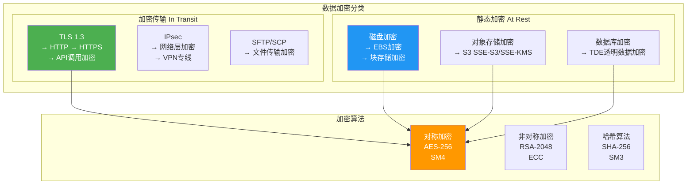
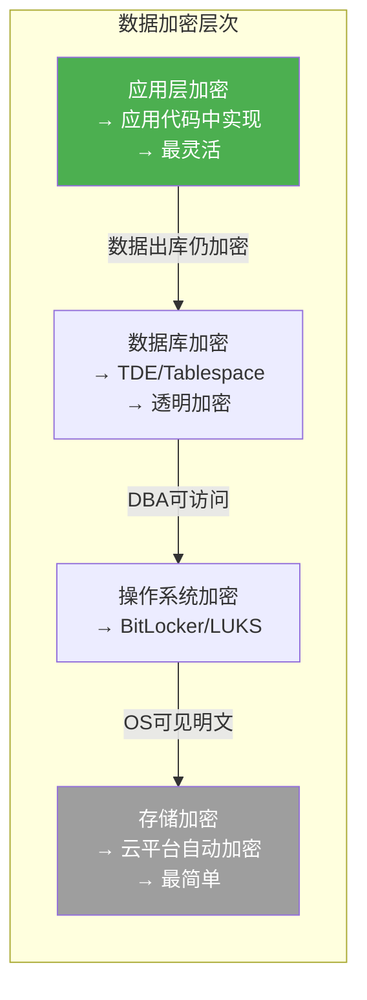
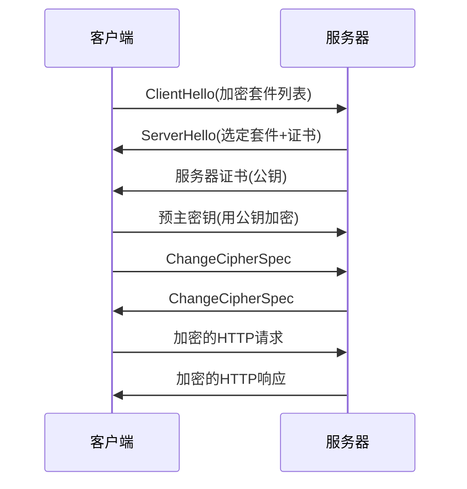
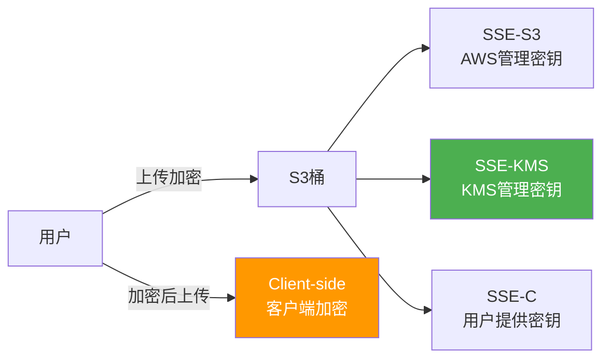
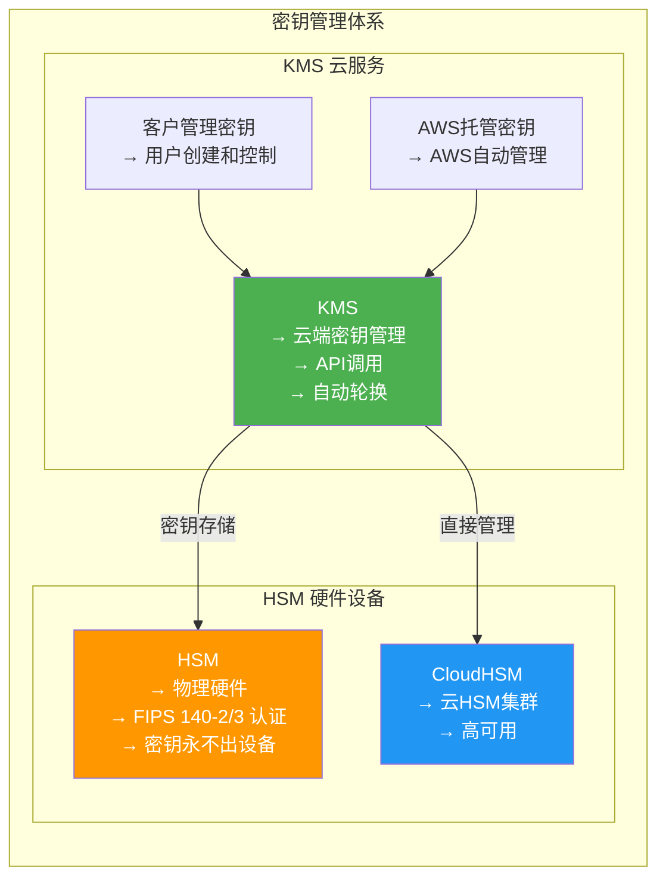
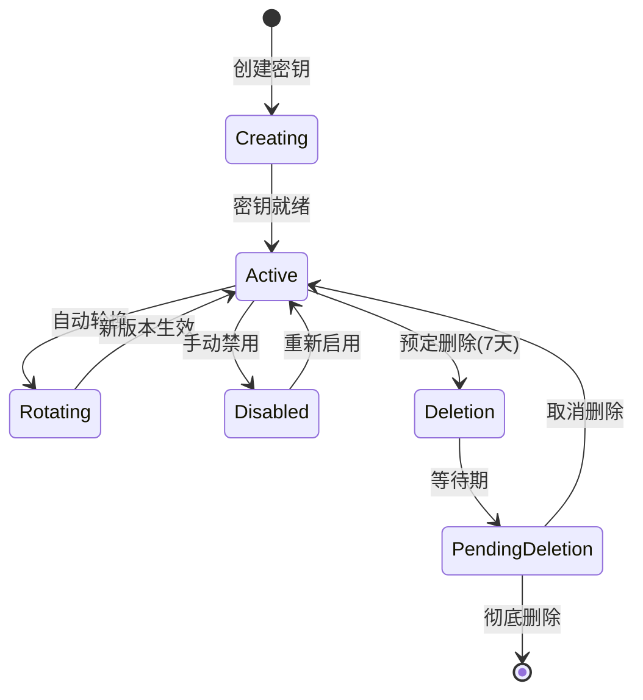
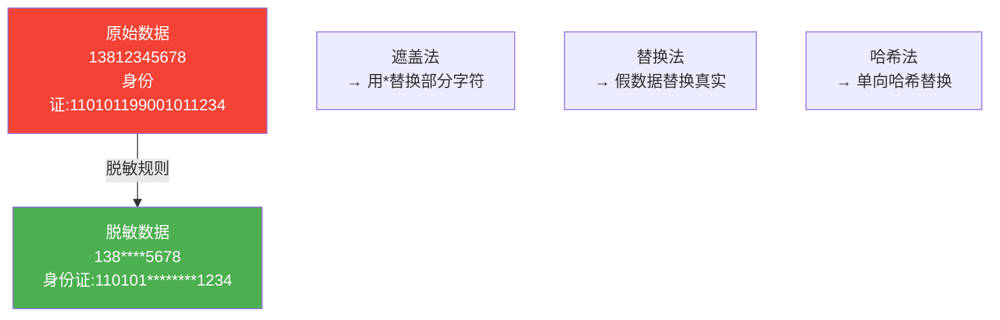
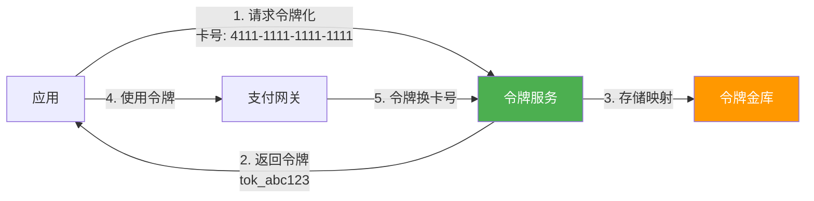
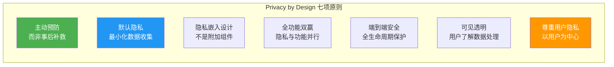

# 9.3 数据加密与隐私保护

> [!abstract] 本节导读
> 数据是云时代最宝贵的资产，加密与隐私保护是数据安全的核心保障。本节首先介绍传输加密（TLS/SSL）与存储加密（AES）的实现方式，然后深入讲解密钥管理体系（KMS与HSM），接着讨论数据脱敏与令牌化技术，最后介绍GDPR和CCPA两大隐私法规的核心要求及合规实践。

## 一、数据加密概述

### 加密分类



### 加密层次模型



### 传输加密：TLS握手流程



**TLS版本对比**：

| 版本 | 状态 | 特性 |
|-----|------|------|
| SSL 3.0 | 已废弃 | 早期版本 |
| TLS 1.0 | 已废弃 | 广泛使用 |
| TLS 1.2 | 推荐过渡 | AEAD加密、更好握手 |
| **TLS 1.3** | **推荐使用** | **0-RTT、更简洁握手** |

### AWS S3 加密方式

| 方式 | 说明 | 密钥管理 |
|-----|------|---------|
| **SSE-S3** | S3托管密钥加密 | AWS管理 |
| **SSE-KMS** | KMS托管密钥加密 | 用户可控 |
| **SSE-C** | 客户提供密钥 | 用户自管理 |
| **Client-side** | 客户端加密 | 客户端管理 |



## 二、密钥管理

### KMS vs HSM

> [!definition] KMS（Key Management Service）
> 云平台提供的密钥管理服务，用于创建、存储、管理和审计加密密钥。

> [!definition] HSM（Hardware Security Module）
> 专用硬件设备，提供最高级别的密钥安全，密钥永不出硬件。



### KMS 核心概念

| 概念 | 说明 |
|-----|------|
| **Key ID** | 密钥的唯一ARN标识符 |
| **Key Material** | 密钥材料（不可导出，除非CMK） |
| **Key Policy** | 控制密钥使用权限的策略 |
| **Key Rotation** | 定期轮换密钥，降低风险 |
| **Aliases** | 密钥的友好别名 |

### KMS 密钥生命周期



### KMS 使用示例

```python
import boto3
import base64
from botocore.exceptions import ClientError

kms = boto3.client('kms', region_name='us-east-1')

def create_kms_key(alias_name, description="KMS key for data encryption"):
    response = kms.create_key(
        Description=description,
        KeyUsage='ENCRYPT_DECRYPT',
        KeySpec='SYMMETRIC_DEFAULT',
        EnableKeyRotation=True,
        Tags=[
            {'TagKey': 'Environment', 'TagValue': 'Production'},
            {'TagKey': 'Purpose', 'TagValue': 'DataEncryption'}
        ]
    )
    key_id = response['KeyMetadata']['KeyId']
    kms.create_alias(
        AliasName=f'alias/{alias_name}',
        TargetKeyId=key_id
    )
    print(f"KMS密钥创建成功: alias/{alias_name}")
    return key_id

def encrypt_data(key_id, plaintext):
    response = kms.encrypt(
        KeyId=key_id,
        Plaintext=plaintext.encode('utf-8') if isinstance(plaintext, str) else plaintext
    )
    return base64.b64encode(response['CiphertextBlob']).decode('utf-8')

def decrypt_data(key_id, ciphertext_base64):
    ciphertext_blob = base64.b64decode(ciphertext_base64)
    response = kms.decrypt(KeyId=key_id, CiphertextBlob=ciphertext_blob)
    return response['Plaintext'].decode('utf-8')

def generate_data_key(key_id, key_spec='AES_256'):
    response = kms.generate_data_key(KeyId=key_id, KeySpec=key_spec)
    return {
        'Plaintext': response['Plaintext'],
        'CiphertextBlob': response['CiphertextBlob']
    }

if __name__ == '__main__':
    key_id = create_kms_key('my-app-key')
    original = "敏感数据: 13812345678"
    encrypted = encrypt_data(key_id, original)
    print(f"加密: {encrypted}")
    decrypted = decrypt_data(key_id, encrypted)
    print(f"解密: {decrypted}")
```

## 三、数据脱敏与令牌化

### 数据脱敏

> [!definition] 数据脱敏（Data Masking）
> 对敏感数据进行遮盖、替换或变形，使其保留使用价值的同时不暴露真实信息。



### 常见脱敏规则

| 数据类型 | 脱敏前 | 脱敏后 |
|---------|--------|--------|
| 手机号 | 13812345678 | 138****5678 |
| 身份证 | 110101199001011234 | 110101********1234 |
| 银行卡 | 6222021234567890 | 6222********7890 |
| 邮箱 | zhangsan@example.com | zha***@example.com |
| 姓名 | 张三丰 | 张** |

### 令牌化

> [!definition] 令牌化（Tokenization）
> 将敏感数据替换为不透明的令牌，令牌与原始数据的映射仅由令牌服务维护。



### 脱敏 vs 令牌化 vs 加密

| 维度 | 脱敏 | 令牌化 | 加密 |
|-----|------|--------|------|
| 可逆性 | 不可逆 | 可逆 | 可逆 |
| 数据价值 | 部分保留 | 完全保留 | 完全保留 |
| 实现成本 | 低 | 中 | 高 |
| 适用场景 | 测试数据、日志 | 支付、身份识别 | 数据存储、传输 |

### Python脱敏实现

```python
import hashlib

def mask_phone(phone):
    if not phone or len(phone) != 11:
        return phone
    return phone[:3] + '****' + phone[7:]

def mask_id_card(id_card):
    if not id_card or len(id_card) != 18:
        return id_card
    return id_card[:6] + '********' + id_card[14:]

def mask_email(email):
    if not email or '@' not in email:
        return email
    username, domain = email.split('@', 1)
    return username[:2] + '***@' + domain

def mask_name(name):
    if not name or len(name) <= 1:
        return name
    return name[0] + '*' * (len(name) - 1)

def hash_value(value, algorithm='sha256'):
    if isinstance(value, str):
        value = value.encode('utf-8')
    return hashlib.new(algorithm, value).hexdigest()

if __name__ == '__main__':
    print(mask_phone('13812345678'))
    print(mask_id_card('110101199001011234'))
    print(mask_email('zhangsan@example.com'))
    print(mask_name('张三丰'))
    print(hash_value('mypassword'))
```

## 四、隐私保护法规

### GDPR

> [!definition] GDPR（General Data Protection Regulation）
> 欧盟通用数据保护条例，2018年5月生效，是全球最严格的数据保护法规之一。

```mermaid
graph TB
    subgraph "GDPR 核心原则"
        direction TB
        P1["合法性、公平性、透明性"]
        P2["目的限制<br/>→ 数据收集需有明确目的"]
        P3["数据最小化<br/>→ 仅收集必要数据"]
        P4["准确性<br/>→ 数据应准确并及时更新"]
        P5["存储限制<br/>→ 数据保留期限不超必要"]
        P6["完整性与保密性<br/>→ 确保数据安全"]
    end

    subgraph "数据主体权利"
        direction TB
        R1["访问权<br/>→ 获取个人数据副本"]
        R2["更正权<br/>→ 更正不准确数据"]
        R3["删除权<br/>→ 被遗忘的权利"]
        R4["限制处理权<br/>→ 限制数据处理"]
        R5["数据可携带权<br/>→ 以结构化格式获取"]
        R6["反对权<br/>→ 反对数据处理"]
    end

    style P1 fill:#4CAF50,color:#fff
    style R3 fill:#F44336,color:#fff
```



**GDPR关键要求**：

| 要求 | 说明 |
|-----|------|
| **数据保护设计** | 隐私设计原则，默认保护 |
| **同意机制** | 明确、自愿、知情的同意 |
| **数据泄露通知** | 72小时内通知监管机构 |
| **数据跨境传输** | 需有适当保障措施 |
| **DPIA** | 高风险处理需进行数据保护影响评估 |
| **DPO** | 指定数据保护官（特定情况） |
| **罚款** | 最高全球年营业额4%或2000万欧元 |

### CCPA

> [!definition] CCPA（California Consumer Privacy Act）
> 加州消费者隐私法案，2020年1月生效，美国最严格的隐私法规。

| 维度 | GDPR | CCPA |
|-----|------|------|
| **适用地区** | 欧盟 | 加州 |
| **保护对象** | 数据主体（自然人） | 加州消费者 |
| **核心权利** | 访问、更正、删除、可携带 | 知晓、访问、删除、拒绝出售 |
| **数据保护官** | 必须指定（特定情况） | 未强制 |
| **同意机制** | 必须明确同意 | 选择加入/退出 |
| **罚款上限** | 4%全球营收或2000万欧元 | 7500美元/违规 |
| **监管机构** | EDPS/各国DPA | 加州AG |

### 隐私设计（Privacy by Design）

> [!definition] Privacy by Design
> 在系统设计阶段就考虑隐私保护，而不是事后补救。



### 云合规实践

| 法规 | 云服务商合规 | 客户责任 |
|-----|------------|---------|
| **GDPR** | AWS/Azure/GCP提供合规认证 | 数据处理协议、DPIA、同意管理 |
| **CCPA** | 提供数据处理协议 | 消费者权利实现、隐私政策 |
| **HIPAA** | 提供HIPAA合规环境 | BAA协议、访问控制、审计 |
| **PCI DSS** | 提供PCI合规云环境 | SAQ填写、加密、访问控制 |
| **等保2.0** | 提供等保合规云环境 | 定级备案、安全建设整改 |

## 五、小结

> [!summary] 本节要点回顾
> 1. **加密分类**：传输加密（TLS/SSL）与存储加密（AES），各有多种实现方式
> 2. **加密层次**：应用层 > 数据库层 > 操作系统层 > 存储层，层层加密
> 3. **密钥管理**：KMS（云服务，便捷）vs HSM（硬件，最高安全），密钥生命周期管理
> 4. **数据脱敏**：遮盖、替换、哈希等方法，保护测试数据和日志安全
> 5. **令牌化**：敏感数据替换为令牌，适用于支付等场景
> 6. **隐私法规**：GDPR（欧盟，最严格）、CCPA（加州），核心原则和用户权利
> 7. **Privacy by Design**：设计阶段就考虑隐私保护，主动预防

## 关联知识点

| 关联知识点 | 关系 |
|-----------|------|
| [[9.1 云安全威胁与防护体系]] | 数据加密是数据安全域的核心措施 |
| [[9.2 身份认证与访问控制IAM]] | IAM控制密钥和加密数据的访问 |
| [[第4章 云计算架构与资源调度]] | 云架构需考虑加密和隐私设计 |
| [[第10章 云原生技术体系]] | 云原生应用需默认支持加密和隐私 |