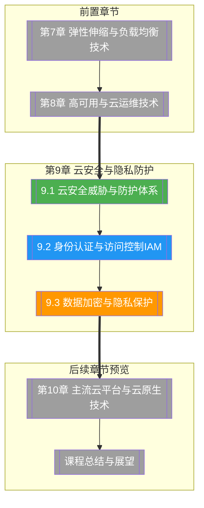

# 第9章 云安全与隐私防护

> [!abstract] 章节概述
> 云安全是云计算应用的生命线。本章系统介绍云安全面临的主要威胁与防护体系（数据泄露、DDoS、内部威胁、账户劫持）、云安全的共享责任模型、身份认证与访问控制（IAM/RAM）、数据加密与隐私保护技术。通过本章学习，读者将建立完整的云安全知识体系，掌握IAM策略编写、数据加密实现和GDPR/CCPA合规实践。

## 学习路线图

## 知识点导航

| 编号 | 知识点 | 核心内容 | 重要程度 |
|-----|--------|---------|---------|
| 9.1 | [[9.1 云安全威胁与防护体系]] | 云安全威胁类型、共享责任模型、安全架构设计、五大安全域 | ⭐⭐⭐⭐⭐ |
| 9.2 | [[9.2 身份认证与访问控制IAM]] | IAM核心概念、AWS IAM/阿里云RAM、策略类型、MFA与最小权限原则 | ⭐⭐⭐⭐⭐ |
| 9.3 | [[9.3 数据加密与隐私保护]] | 传输加密/存储加密、KMS/HSM密钥管理、数据脱敏与令牌化、GDPR/CCPA合规 | ⭐⭐⭐⭐⭐ |

## 核心概念速览

> [!tip] 本章必须掌握的核心概念
> - **共享责任模型**：云服务商负责基础设施安全，客户负责数据和应用安全
> - **IAM（身份与访问管理）**：管理用户身份和访问权限的核心安全服务
> - **最小权限原则**：用户仅拥有完成工作所需的最少权限
> - **MFA（多因素认证）**：结合两种以上认证方式提高登录安全性
> - **KMS（密钥管理服务）**：云端密钥管理服务，用于加密密钥的存储和使用
> - **HSM（硬件安全模块）**：专用硬件设备，提供最高级别的密钥安全
> - **加密传输（Encryption in Transit）**：数据在网络传输过程中加密（TLS/SSL）
> - **静态加密（Encryption at Rest）**：数据存储时加密（AES-256等）
> - **数据脱敏（Data Masking）**：遮盖敏感数据，使其在非生产环境可用
> - **令牌化（Tokenization）**：将敏感数据替换为不透明的令牌
> - **GDPR**：欧盟通用数据保护条例，数据保护里程碑
> - **CCPA**：加州消费者隐私法案，美国重要隐私法规

## 核心考点

> [!important] 期末高频考点

| 考点 | 所属知识点 | 考查形式 | 难度 |
|-----|-----------|---------|------|
| 云安全主要威胁类型及应对 | 9.1 | 简答题/对比题 | ★★★ |
| 共享责任模型的层级划分 | 9.1 | 简答题/论述题 | ★★★★ |
| 云安全五大安全域的防护要点 | 9.1 | 论述题/案例分析 | ★★★★ |
| IAM用户/组/角色/策略的关系 | 9.2 | 简答题/选择题 | ★★★ |
| IAM策略（Policy）的结构与类型 | 9.2 | 简答题/实操题 | ★★★★ |
| 最小权限原则与MFA的实践 | 9.2 | 案例分析/论述题 | ★★★★ |
| 传输加密与存储加密的实现方式 | 9.3 | 简答题/对比题 | ★★★ |
| KMS与HSM的区别与选型 | 9.3 | 对比题 | ★★★ |
| GDPR与CCPA的核心要求 | 9.3 | 简答题/论述题 | ★★★★ |
| 数据脱敏与令牌化的实现 | 9.3 | 实操题/案例分析 | ★★★ |

## 自测题

> [!question] 章节自测
> 1. 阐述云安全的共享责任模型，分别说明在IaaS、PaaS、SaaS模式下，云服务商和客户各自的安全责任范围。
> 2. 使用AWS IAM控制台或boto3创建一个只读权限的用户、一个管理员权限的角色，并编写对应的访问策略文档。
> 3. 设计一个完整的数据加密方案，涵盖传输加密（TLS）、存储加密（KMS）、密钥轮换和密钥审计。
> 4. 分析一个典型的云安全事件案例（如数据泄露），说明攻击路径、防护措施和改进建议。
> 5. 某跨境电商业务需要同时遵守GDPR和CCPA，请设计一套数据隐私合规方案，涵盖数据收集、存储、传输和用户权利保障。

## 章节导航

| 方向 | 链接 |
|-----|------|
| ⬆ 返回课程总览 | [[MOC - 云计算技术]] |
| ⬅ 上一章 | [[第8章 高可用与云运维技术/MOC - 第8章]] |
| ➡ 下一章 | [[第10章 主流云平台与云原生技术/MOC - 第10章]] |