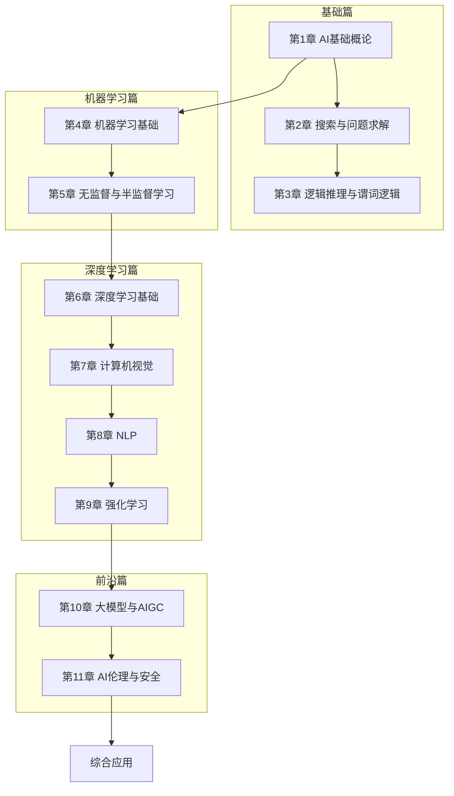

# 人工智能技术

> [!abstract] 课程定位
> 本课程系统介绍人工智能的基础理论、核心算法和前沿应用，涵盖从AI哲学思辨到深度学习、大模型的完整知识体系。

## 课程结构

## 章节导航

| 章节 | 主题 | 核心知识点 |
|-----|------|-----------|
| [[第1章-人工智能基础概论/MOC - 第1章]] | AI定义、分支与发展 | 弱AI/强AI/超AI、落地场景 |
| [[第2章-搜索与问题求解/MOC - 第2章]] | 搜索算法、问题求解 | BFS/DFS、启发式搜索、A* |
| [[第3章-逻辑推理与谓词逻辑/MOC - 第3章]] | 命题逻辑、谓词逻辑 | 消解、归结、知识库构建 |
| [[第4章-机器学习基础/MOC - 第4章]] | 监督学习、模型评估 | 线性回归、决策树、SVM |
| [[第5章-无监督与半监督学习/MOC - 第5章]] | 聚类、降维、半监督 | K-Means、PCA、EM算法 |
| [[第6章-深度学习基础神经网络/MOC - 第6章]] | 神经网络、反向传播 | MLP、CNN、RNN、优化算法 |
| [[第7章-计算机视觉核心算法/MOC - 第7章]] | 图像分类、目标检测 | ResNet、YOLO、语义分割 |
| [[第8章-自然语言处理NLP/MOC - 第8章]] | 语言模型、文本处理 | Transformer、BERT、LLM基础 |
| [[第9章-强化学习/MOC - 第9章]] | MDP、价值/策略学习 | Q-Learning、Policy Gradient、DQN |
| [[第10章-生成式大模型与AIGC/MOC - 第10章]] | GPT、Diffusion、AIGC | Transformer架构、LLM训练与应用 |
| [[第11章-人工智能伦理安全与行业规范/MOC - 第11章]] | AI伦理、安全、监管 | 偏见、可解释性、治理框架 |

## 学习路径建议

### 适合人群

| 背景 | 建议路径 |
|-----|---------|
| 计算机专业本科生 | 第1-11章（完整学习） |
| 软件工程师 | 第4-10章（机器学习与深度学习） |
| AI初学者 | 第1-3章 + 第4-6章（基础先行） |
| 考研复习 | 第1-9章（核心考点） |
| AI竞赛选手 | 第4-10章（算法与应用） |

### 先修知识

- 线性代数（矩阵运算、特征值）
- 概率论与数理统计
- 微积分与优化理论
- Python编程
- 数据结构与算法

## 复习重点

> [!important] 考研/竞赛高频考点
> 1. 搜索算法（BFS、DFS、A*）的实现与复杂度分析
> 2. 决策树（ID3/C4.5/CART）的构建过程
> 3. SVM的数学推导与核函数
> 4. 神经网络的反向传播算法推导
> 5. CNN的核心组件（卷积、池化、BatchNorm）
> 6. RNN/LSTM的结构与梯度消失问题
> 7. Transformer的自注意力机制
> 8. Q-Learning与Policy Gradient的对比
> 9. 大模型的预训练与微调方法

## 工具推荐

| 工具 | 用途 | 学习阶段 |
|-----|------|---------|
| Python | AI开发主语言 | 全程 |
| NumPy/Pandas | 数据处理 | 第4章起 |
| Scikit-learn | 传统机器学习 | 第4-5章 |
| PyTorch/TensorFlow | 深度学习框架 | 第6章起 |
| HuggingFace | 预训练模型 | 第10章 |
| MLflow | 实验管理 | 进阶 |