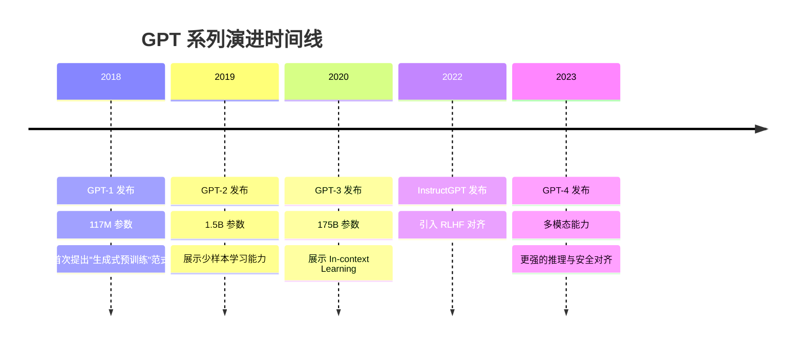
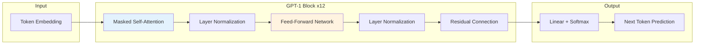
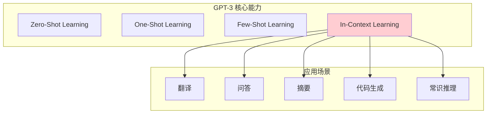
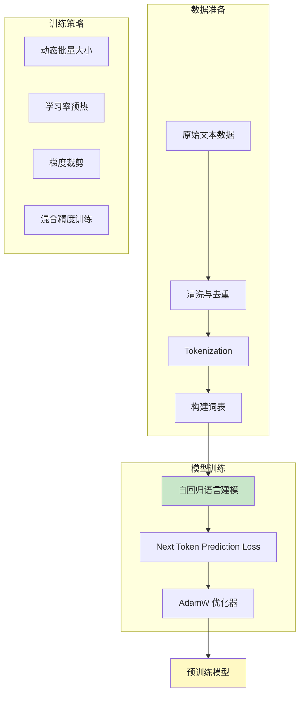
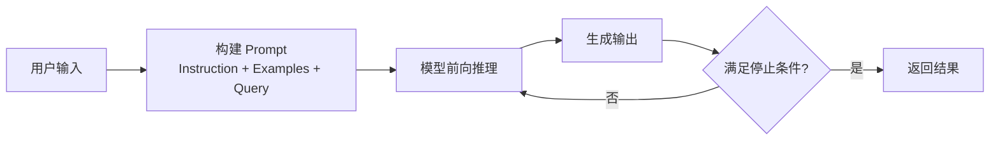
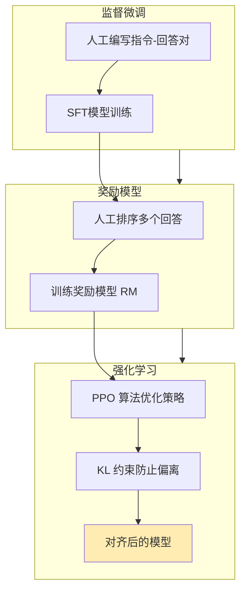
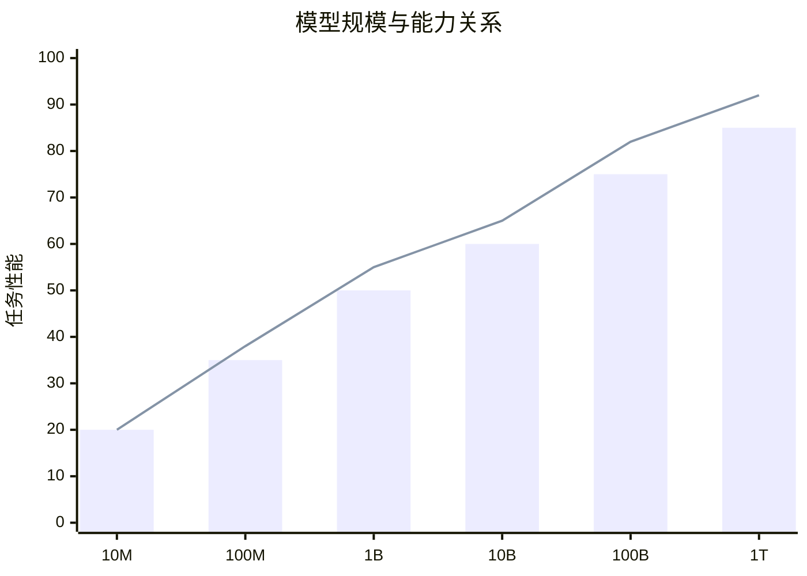
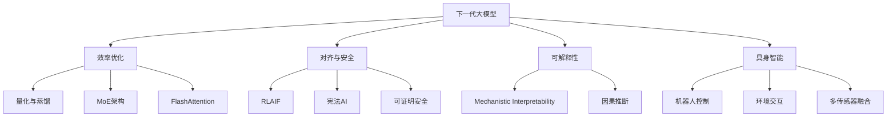

# 10.1 GPT 系列模型

## 📖 定义与概述

**GPT（Generative Pre-trained Transformer）** 是由 OpenAI 提出的一系列基于 Transformer 解码器架构的自回归大语言模型。其核心思想是：在海量无标签文本上进行预训练，学习通用的语言表示，然后通过微调或 Prompt 方式适配下游任务。

> GPT 系列模型是当代大语言模型的技术基石，确立了"预训练 + 微调/Prompt"的范式。

---

## 🏛️ 历史演进



---

## 🧩 各版本架构详解

### GPT-1：预训练范式的奠基

| 属性 | 规格 |
|------|------|
| 参数量 | 117M |
| 架构 | 12层 Decoder-only Transformer |
| 注意力头 | 12 heads, 768-dim |
| 训练数据 | BooksCorpus (7000本小说) |
| 上下文长度 | 512 tokens |

**核心贡献**：
- 验证了"生成式预训练 + 判别式微调"的有效性
- 首次证明在未标注数据上预训练可以学习到通用语言表示
- 在 5 个 NLP 任务上取得显著提升

**GPT-1 架构图**：



### GPT-2：规模化的力量

| 属性 | 规格 |
|------|------|
| 参数量 | 1.5B (10x GPT-1) |
| 架构 | 12层 Decoder-only Transformer |
| 注意力头 | 12 heads, 768-dim |
| 训练数据 | WebText (40GB 网页数据) |
| 上下文长度 | 1024 tokens |

**核心改进**：
- **迁移学习**：证明跨任务、跨领域的零样本迁移能力
- **通用能力涌现**：在零样本设置下翻译、摘要、问答均表现良好
- **数据质量**：使用经过筛选的高质量网页数据而非小说

**关键发现**：模型规模和数据规模的增长可以带来持续的性能提升，这被称为 **Scaling Law** 的早期证据。

### GPT-3：In-Context Learning 的突破

| 属性 | 规格 |
|------|------|
| 参数量 | 175B (116x GPT-2) |
| 架构 | 96层 Decoder-only Transformer |
| 注意力头 | 96 heads, 12288-dim |
| 训练数据 | Common Crawl + 高质量数据 (500B tokens) |
| 上下文长度 | 2048 tokens |

**核心能力**：



**In-Context Learning 机制**：
- GPT-3 通过在 Prompt 中提供示例（1-shot/few-shot）来学习任务
- 模型并未进行梯度更新，仅通过注意力机制从上下文中"检索"模式
- 这是与传统 Fine-tuning 的根本区别

**示例对比**：

| 方法 | Prompt 示例 | 是否需要梯度更新 |
|------|------------|-----------------|
| Zero-shot | `将以下中文翻译成英文：你好世界` | ❌ |
| One-shot | `中文：你好 → 英文：Hello\n中文：你好世界 → 英文：` | ❌ |
| Few-shot | `（提供多个示例后）中文：你好世界 → 英文：` | ❌ |
| Fine-tune | 在翻译数据集上训练 | ✅ |

### GPT-4：多模态与安全对齐

| 属性 | 规格 |
|------|------|
| 参数量 | 未公开（估计 >100B） |
| 架构 | 多模态 Transformer（MoE 可能） |
| 输入模态 | 文本 + 图像 |
| 训练数据 | 多模态数据（文本+图像+代码） |
| 上下文长度 | 128K tokens |

**核心改进**：
1. **多模态理解**：可以处理图像输入，进行视觉问答、OCR 等任务
2. **更强的推理能力**：在数学、编程、逻辑推理上显著提升
3. **RLHF 对齐**：通过人类反馈强化学习使模型更安全、更有用
4. **长上下文**：支持 128K 上下文窗口，可处理长文档

---

## ⚙️ 训练方法论

### 预训练阶段



**训练目标**：

```
L = - Σ log P(next_token | previous_tokens)
```

模型学习在给定前文的情况下预测下一个 token 的条件概率。

### Prompt 阶段（In-Context Learning）



### Fine-tuning 阶段

| 方法 | 描述 | 适用场景 |
|------|------|----------|
| Full Fine-tuning | 更新所有参数 | 数据充足、算力充足 |
| LoRA | 只更新低秩适配器 | 数据有限、快速适配 |
| Adapter | 在层间插入小型网络 | 保留原始模型能力 |

### RLHF 对齐（GPT-3.5/4）



---

## 🌟 涌现能力（Emergent Abilities）

### 什么是涌现能力？

> 当模型规模跨越某个阈值后，突然出现的、未被显式训练的能力。



### 典型涌现能力

1. **思维链推理（Chain-of-Thought）**：模型能够分步思考复杂问题
2. **指令遵循**：理解自然语言指令并执行
3. **代码生成**：从自然语言描述生成代码
4. **多语言迁移**：在非英语语言上表现良好
5. **上下文学习**：零样本/少样本学习

---

## 📊 GPT 系列对比总结

| 特性 | GPT-1 | GPT-2 | GPT-3 | GPT-4 |
|------|-------|-------|-------|-------|
| **发布年份** | 2018 | 2019 | 2020 | 2023 |
| **参数量** | 117M | 1.5B | 175B | 未公开 |
| **上下文长度** | 512 | 1024 | 2048 | 128K |
| **多模态** | ❌ | ❌ | ❌ | ✅ |
| **RLHF对齐** | ❌ | ❌ | ❌ | ✅ |
| **推理能力** | 基础 | 中等 | 强 | 很强 |
| **典型应用** | 研究 | 研究 | 工业 | 生产 |

---

## 💻 实践代码示例

### 使用 HuggingFace 加载 GPT-2

```python
from transformers import GPT2LMHeadModel, GPT2Tokenizer

# 加载预训练模型和分词器
model_name = "gpt2"
tokenizer = GPT2Tokenizer.from_pretrained(model_name)
model = GPT2LMHeadModel.from_pretrained(model_name)

# 准备输入文本
input_text = "人工智能的未来发展方向是"
inputs = tokenizer(input_text, return_tensors="pt")

# 生成文本
outputs = model.generate(
    inputs["input_ids"],
    max_length=100,
    num_return_sequences=1,
    temperature=0.7,
    do_sample=True
)

# 解码输出
generated_text = tokenizer.decode(outputs[0], skip_special_tokens=True)
print(f"生成结果: {generated_text}")
```

### In-Context Learning 示例

```python
# Zero-shot 翻译示例
prompt_zero = """
将中文翻译成英文：
你好世界 →
"""

# One-shot 翻译示例
prompt_one = """
中文：你好 → 英文：Hello
中文：你好世界 → 英文：
"""

# Few-shot 翻译示例
prompt_few = """
中文：你好 → 英文：Hello
中文：谢谢 → 英文：Thank you
中文：早上好 → 英文：Good morning
中文：你好世界 → 英文：
"""

# 使用 GPT-3 API（示意）
# response = openai.Completion.create(
#     engine="text-davinci-003",
#     prompt=prompt_few,
#     max_tokens=50
# )
```

---

## 🔬 与其他模型的对比

### GPT vs BERT

| 维度 | GPT | BERT |
|------|-----|------|
| 架构 | Decoder-only | Encoder-only |
| 训练方式 | 自回归（Causal LM） | 掩码（Masked LM） |
| 适用任务 | 生成类任务 | 理解类任务 |
| 上下文 | 单向（左到右） | 双向 |
| 典型用途 | 文本生成、对话 | 分类、抽取、检索 |

### GPT vs LLaMA (开源)

| 维度 | GPT-4 | LLaMA 2 |
|------|-------|---------|
| 开发方 | OpenAI | Meta |
| 开源 | 闭源 | 开源 |
| 可部署 | API only | 本地部署 |
| 社区生态 | 较小 | 活跃 |

---

## 🚀 前沿展望

### 下一代大模型趋势

1. **更大规模 + 更高效率**：MoE（混合专家）架构实现万亿参数
2. **多模态统一**：文本、图像、音频、视频的统一建模
3. **Agent 能力**：大模型作为 Agent，规划、调用工具、执行任务
4. **长上下文记忆**：从 128K 扩展到百万级 token
5. **具身智能**：LLM 与机器人结合，理解物理世界

### 关键研究方向



---

## 📝 考研真题精选

### 简答题

**【真题1】（2024 某高校）简述 GPT 系列模型从 GPT-1 到 GPT-4 的核心架构演进与能力提升。**

> **参考答案要点**：
> 1. GPT-1（117M）：首次验证 Decoder-only Transformer 预训练范式的有效性
> 2. GPT-2（1.5B）：规模化验证，展示零样本迁移能力
> 3. GPT-3（175B）：In-Context Learning，无需微调即可适配任务
> 4. GPT-4：多模态输入、长上下文、RLHF 对齐、强推理能力

**【真题2】（2023 某高校）解释"涌现能力"的概念，并说明它对大模型研究的意义。**

> **参考答案要点**：
> 涌现能力指模型规模跨越阈值后突然出现的未显式训练的能力。意义：① 证明 Scaling Law 的有效性；② 推动研究者探索更大模型；③ 引发对模型能力边界的思考。

### 论述题

**【论述题】In-Context Learning 与传统 Fine-tuning 有何本质区别？它们各自的适用场景是什么？**

---

## 📚 参考文献

1. Brown, T., et al. *Language Models are Few-Shot Learners*. NeurIPS, 2020. (GPT-3)
2. Radford, A., et al. *Improving Language Understanding by Generative Pre-Training*. 2018. (GPT-1)
3. Wu, Z., et al. *A Survey on the Emergent Abilities of Large Language Models*. 2023.
4. OpenAI. *GPT-4 Technical Report*. 2023.

---

> 💡 **学习建议**：通过实际调用 GPT API 或使用开源模型（如 LLaMA）来直观理解 In-Context Learning 和 Prompt Engineering 的效果。重点掌握不同规模模型的能力差异。