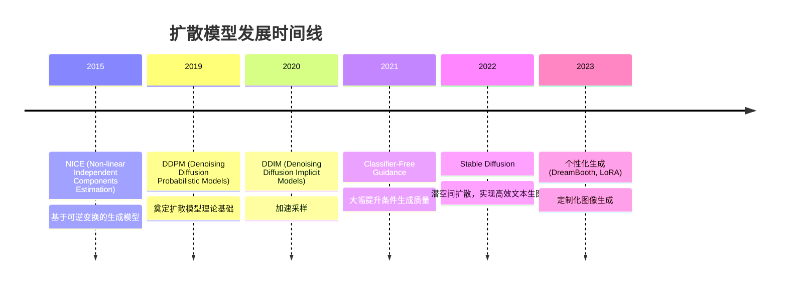
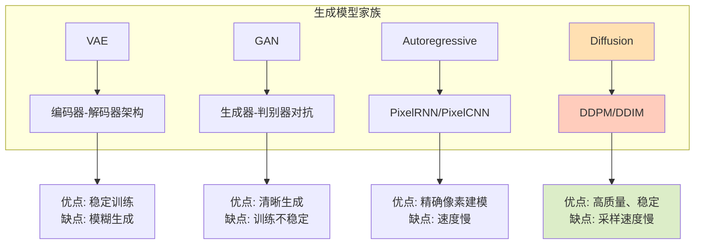
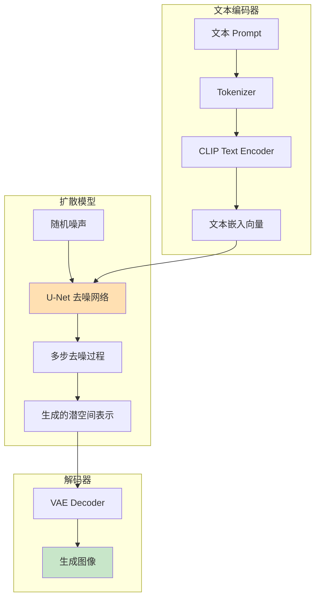
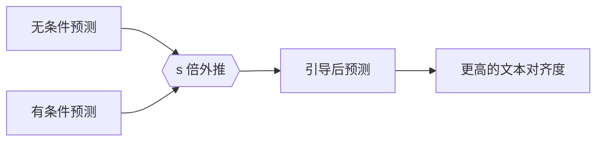
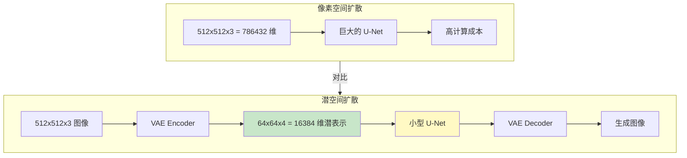
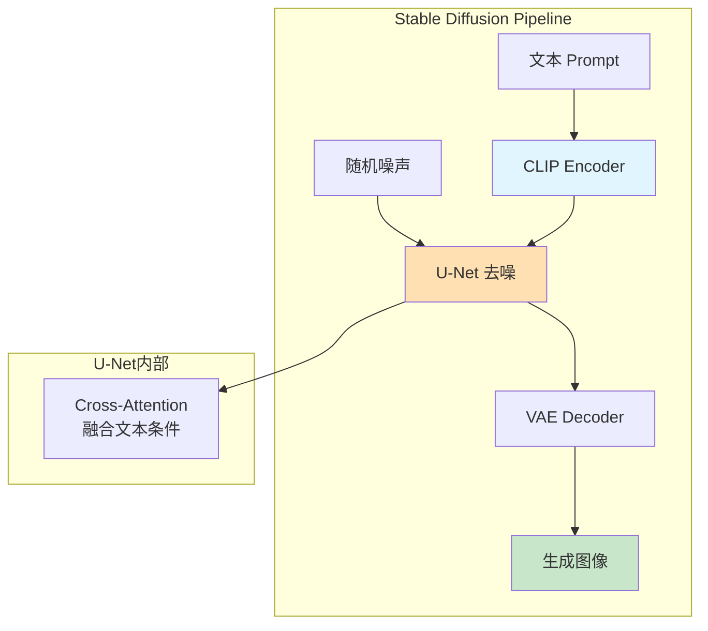
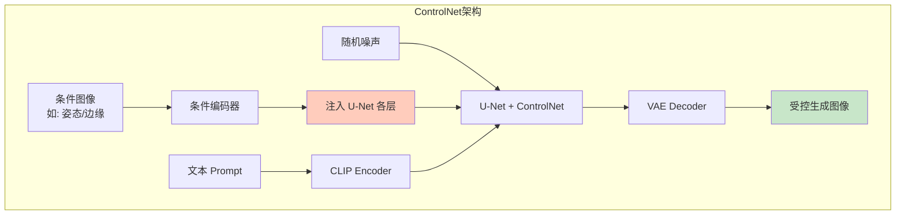
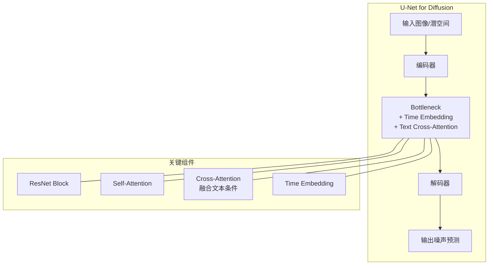
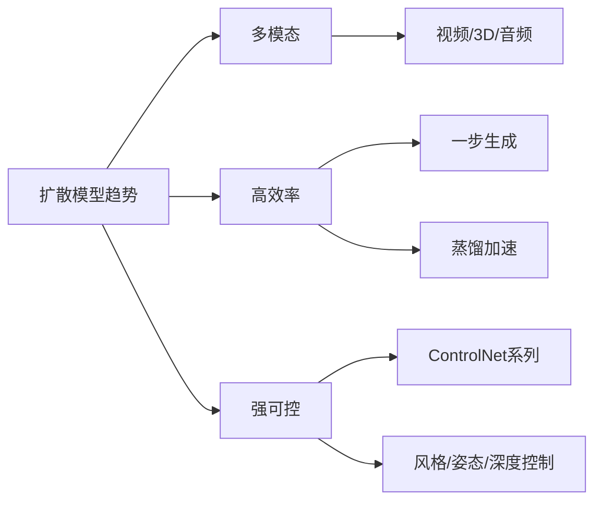

# 10.2 扩散模型与生成图像

## 📖 定义与概述

**扩散模型（Diffusion Models）** 是一类基于热力学扩散过程的生成模型。其核心思想分为两步：

1. **前向过程**：逐步向数据添加高斯噪声，最终将数据变为纯噪声
2. **反向过程**：学习逆转该过程，从噪声中逐步恢复出数据样本

> 扩散模型在图像生成领域取得了突破性进展，是 Stable Diffusion、DALL-E、Midjourney 等主流文本生成图像系统的核心技术。

---

## 🏛️ 历史演进



### 生成模型四大范式对比



---

## ⚙️ 核心原理：DDPM

### 前向扩散过程（Forward Process）

前向过程是一个马尔可夫链，逐步向数据 $x_0$ 添加高斯噪声：

$$q(x_t | x_{t-1}) = \mathcal{N}(x_t; \sqrt{1-\beta_t} x_{t-1}, \beta_t I)$$

经过 $T$ 步后，数据变为纯高斯噪声：

$$x_T \approx \mathcal{N}(0, I)$$

**过程图示**：

```mermaid
flowchart LR
    subgraph Forward Process
        x0[干净图像 x₀] -->|√1-β₁·ε| x1[加噪图像 x₁]
        x1 -->|√1-β₂·ε| x2[加噪图像 x₂]
        x2 -->|...| x3[... x_T]
        x3 -->|N(0,I)| x4[纯噪声]
    end

    style x0 fill:#c8e6c9
    style x4 fill:#ffcdd2
```

### 反向去噪过程（Reverse Process）

反向过程学习从噪声中恢复数据，目标是训练一个神经网络 $\epsilon_\theta(x_t, t)$ 来预测 $t$ 时刻添加的噪声：

$$p_\theta(x_{t-1} | x_t) = \mathcal{N}(x_{t-1}; \frac{1}{\sqrt{\alpha_t}}(x_t - \frac{\beta_t}{\sqrt{1-\bar{\alpha}_t}}\epsilon_\theta(x_t, t)), \sigma_t^2 I)$$

**训练目标**：

$$L_{simple} = \mathbb{E}_{t,x_0,\epsilon}[\|\epsilon - \epsilon_\theta(\sqrt{\bar{\alpha}_t}x_0 + \sqrt{1-\bar{\alpha}_t}\epsilon, t)\|^2]$$

训练过程简化为：给定带噪图像 $x_t$，预测其中的噪声 $\epsilon$。

### DDPM 整体架构

```mermaid
flowchart TD
    subgraph Training Phase[训练阶段]
        A[采样 x₀ 从真实数据] --> B[采样 t 从 uniform 1...T]
        B --> C[采样 ε 从 N(0,I)]
        C --> D[计算 xₜ = √ᾱₜ x₀ + √1-ᾱₜ ε]
        D --> E[神经网络 ε_θ 预测噪声]
        E --> F[计算 MSE 损失]
        F --> G[反向传播更新 θ]
    end

    subgraph Inference Phase[推理阶段]
        H[初始化 x_T ~ N(0,I)] --> I[for t = T to 1]
        I --> J[预测噪声 ε_θ(xₜ, t)]
        J --> K[计算 xₜ₋₁]
        K --> I
        I --> L[返回 x₀]
    end

    Training --> Inference

    style E fill:#bbdefb
    style L fill:#c8e6c9
```

### DDPM vs DDIM

| 特性 | DDPM | DDIM |
|------|------|------|
| 采样步数 | 1000 步 | 10-50 步 |
| 采样质量 | 高 | 接近 DDPM |
| 确定性 | 随机 | 确定性（同种子同结果） |
| 核心改进 | - | 引入 $\eta$ 参数控制随机性 |

**DDIM 核心思想**：
- 通过非马尔可夫过程加速采样
- 使用 $\sigma_t = \eta \sqrt{(1-\bar{\alpha}_{t-1})/(1-\bar{\alpha}_t)} \sqrt{1-\bar{\alpha}_t/\bar{\alpha}_{t-1}}$ 控制每步的随机性
- $\eta = 0$ 时完全确定性，$\eta = 1$ 时等效 DDPM

---

## 🖼️ 文本生成图像

### Text-to-Image 核心架构



### Classifier-Free Guidance

**关键技术**：在训练时以一定概率（10%）丢弃文本条件，让模型同时学习条件生成和无条件生成。

**推理时的引导公式**：

$$\hat{\epsilon}_\theta(x_t, c) = \epsilon_\theta(x_t, \emptyset) + s \cdot (\epsilon_\theta(x_t, c) - \epsilon_\theta(x_t, \emptyset))$$

其中：
- $\epsilon_\theta(x_t, \emptyset)$：无条件预测的噪声
- $\epsilon_\theta(x_t, c)$：有条件预测的噪声
- $s$：引导强度（通常 7-15），控制生成图像与文本的匹配程度



---

## 🏗️ Stable Diffusion

### 核心创新：潜空间扩散



### Stable Diffusion 架构详解

**三大组件**：

1. **VAE（变分自编码器）**
   - 编码器：将图像压缩到潜空间（压缩比 4²=16 倍）
   - 解码器：从潜表示重建图像

2. **U-Net 扩散模型**
   - 在潜空间上执行去噪过程
   - 使用时间嵌入和文本条件（Cross-Attention）

3. **CLIP 文本编码器**
   - 将文本 Prompt 编码为语义向量
   - 通过 Cross-Attention 注入 U-Net



### 为什么用潜空间？

| 维度 | 像素空间 (DDPM) | 潜空间 (Stable Diffusion) |
|------|----------------|--------------------------|
| 输入维度 | 786K | 16K |
| 模型大小 | ~1B params | ~800M params |
| 推理时间 | 分钟级 | 秒级 |
| 生成质量 | 高 | 相当 |

---

## 🎨 个性化生成技术

### DreamBooth

> 通过少量（3-5张）图片训练，让模型学会生成特定个体/物体的图像。

**原理**：在 Prompt 中引入特殊标识符（如 `sks`），微调 Text Encoder 和 U-Net 的部分参数。

### LoRA for Diffusion

> 使用低秩适配器微调扩散模型，在保持原模型能力的同时学习新概念。

**优势**：
- 只需训练几 MB 参数（vs 全训练 800MB）
- 可叠加多个 LoRA 模型
- 便于分享和部署

### ControlNet

> 允许在生成时施加额外条件（如姿态、边缘、深度图）。



---

## 💻 实践代码示例

### 使用 Diffusers 库生成图像

```python
from diffusers import StableDiffusionPipeline
import torch

# 加载 Stable Diffusion 模型
model_id = "runwayml/stable-diffusion-v1-5"
pipe = StableDiffusionPipeline.from_pretrained(
    model_id,
    torch_dtype=torch.float16
)
pipe = pipe.to("cuda")

# 文本生成图像
prompt = "A cute cat sitting on a spaceship, digital art, highly detailed"
image = pipe(
    prompt,
    num_inference_steps=30,
    guidance_scale=7.5,
    height=512,
    width=512
).images[0]

image.save("generated_image.png")
```

### 使用 LoRA 进行个性化生成

```python
from diffusers import StableDiffusionPipeline
import torch

# 加载基础模型
pipe = StableDiffusionPipeline.from_pretrained(
    "runwayml/stable-diffusion-v1-5",
    torch_dtype=torch.float16
)

# 加载 LoRA 权重
pipe.load_lora_weights(
    "path/to/lora_weights",
    weight_name="lora_weights.safetensors"
)

# 生成个性化图像
prompt = "A photo of sks person in a beautiful garden"
image = pipe(prompt).images[0]
```

### ControlNet 示例

```python
from diffusers import StableDiffusionControlNetPipeline, ControlNetModel
from PIL import Image
import torch

# 加载 ControlNet（以 Canny 边缘检测为例）
controlnet = ControlNetModel.from_pretrained(
    "lllyasviel/control_v11p_sd15_canny",
    torch_dtype=torch.float16
)

# 加载预生成的边缘图
canny_image = Image.open("edges.png")

# 创建 Pipeline
pipe = StableDiffusionControlNetPipeline.from_pretrained(
    "runwayml/stable-diffusion-v1-5",
    controlnet=controlnet,
    torch_dtype=torch.float16
)

# 基于边缘图生成
prompt = "A beautiful landscape, highly detailed"
image = pipe(
    prompt,
    image=canny_image,
    controlnet_conditioning_scale=0.5
).images[0]
```

---

## 🔍 扩散模型的数学直觉

### 噪声调度（Noise Schedule）

常见的噪声调度策略：

| 调度方式 | 公式 | 特点 |
|---------|------|------|
| 线性调度 | $\beta_t = \beta_{min} + \frac{t}{T}(\beta_{max} - \beta_{min})$ | DDPM 原始方案 |
| 余弦调度 | $\bar{\alpha}_t = \cos^2(\frac{t}{T}\pi/2)$ | 后期噪声更小，效果更好 |
| 方差保持 | 基于 SNR 设计 | 训练更稳定 |

### U-Net 架构特点



---

## 🚀 前沿展望

### 扩散模型的发展方向

1. **视频生成**：SVD（Stable Video Diffusion）、Runway Gen-2
2. **3D 生成**：DreamFusion、Zero123
3. **音频生成**：AudioLDM、Stable Audio
4. **实时生成**：一步生成（One-step Generation）、Consistency Models
5. **可控生成**：更强的条件控制和可编辑性

### 关键趋势



---

## 📝 考研真题精选

### 简答题

**【真题】（2024 某高校）简述扩散模型的前向过程和反向过程，并写出对应的数学公式。**

> **参考答案要点**：
> 1. 前向过程：马尔可夫链逐步添加高斯噪声
>    $q(x_t|x_{t-1}) = \mathcal{N}(x_t; \sqrt{1-\beta_t}x_{t-1}, \beta_t I)$
> 2. 反向过程：学习从噪声恢复数据，核心是预测噪声
>    $\epsilon_\theta(x_t, t)$ 预测噪声，逐步去噪
> 3. 训练目标：简化为 MSE 损失 $\|\epsilon - \epsilon_\theta\|^2$

**【真题】（2023 某高校）Stable Diffusion 为什么使用潜空间？相比像素空间有什么优势？**

> **参考答案要点**：
> 潜空间压缩比达 16 倍，计算效率大幅提升。在相同硬件条件下，潜空间扩散可以使用更大的模型、更大的 batch size，生成质量相当但速度快数倍。

### 论述题

**【论述题】对比 GAN 和 Diffusion 两种生成模型的优缺点及适用场景。**

---

## 📚 参考文献

1. Ho, J., Jain, A., & Abbeel, P. *Denoising Diffusion Probabilistic Models*. NeurIPS, 2020. (DDPM)
2. Song, J., et al. *Denoising Diffusion Implicit Models*. ICLR, 2021. (DDIM)
3. Rombach, R., et al. *High-Resolution Image Synthesis and Semantic Manipulation with Latent Diffusion Models*. CVPR, 2022. (Stable Diffusion)
4. Ho, J., & Salimans, T. *Classifier-Free Diffusion Guidance*. 2021.

---

> 💡 **学习建议**：扩散模型的数学推导较为复杂，建议先掌握直觉理解，再深入推导。实践方面推荐使用 HuggingFace Diffusers 库，快速体验文本生成图像。