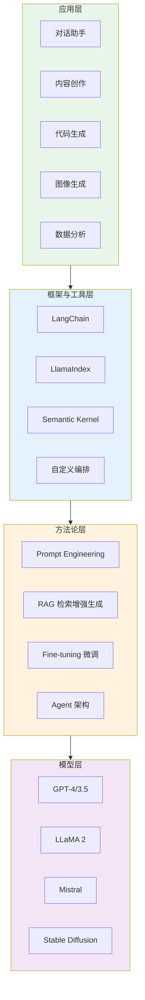
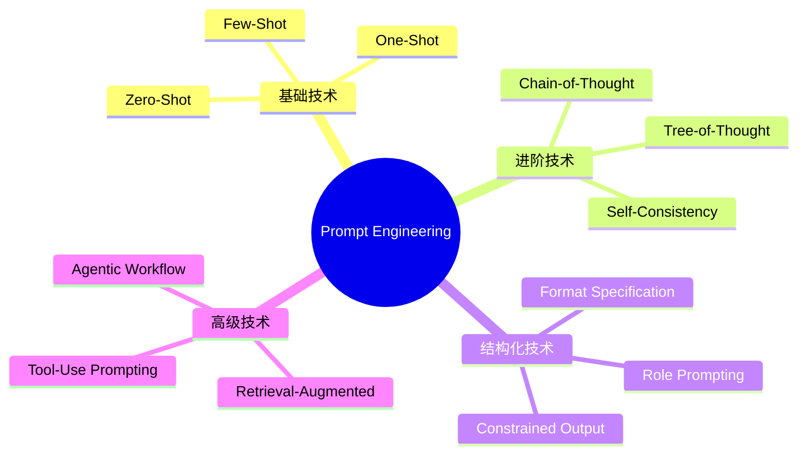
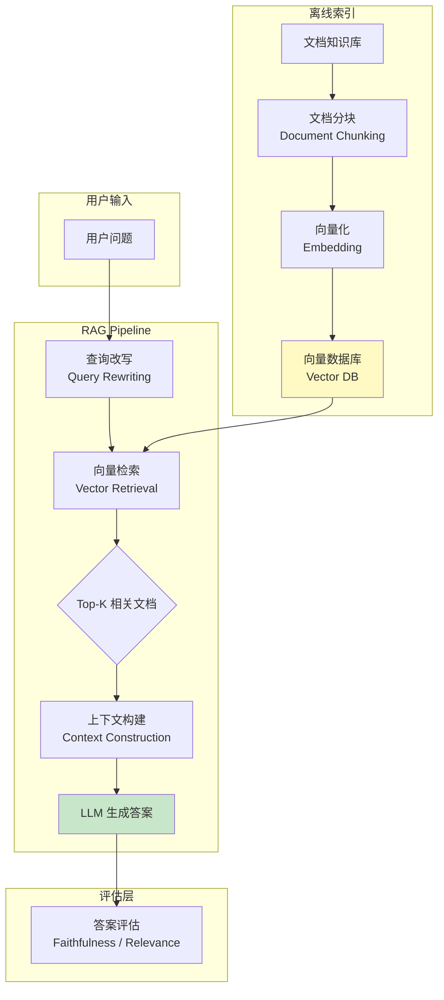
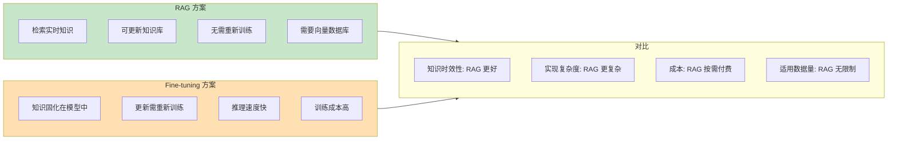
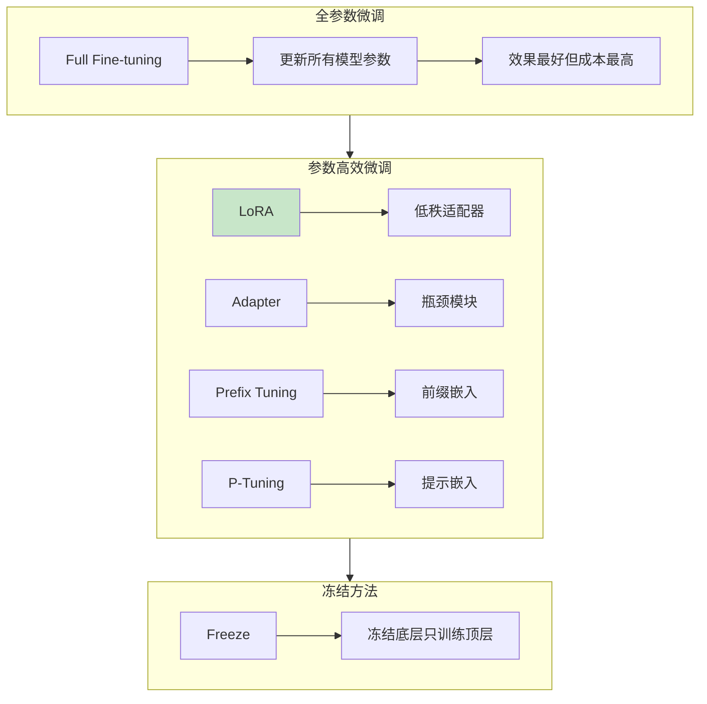
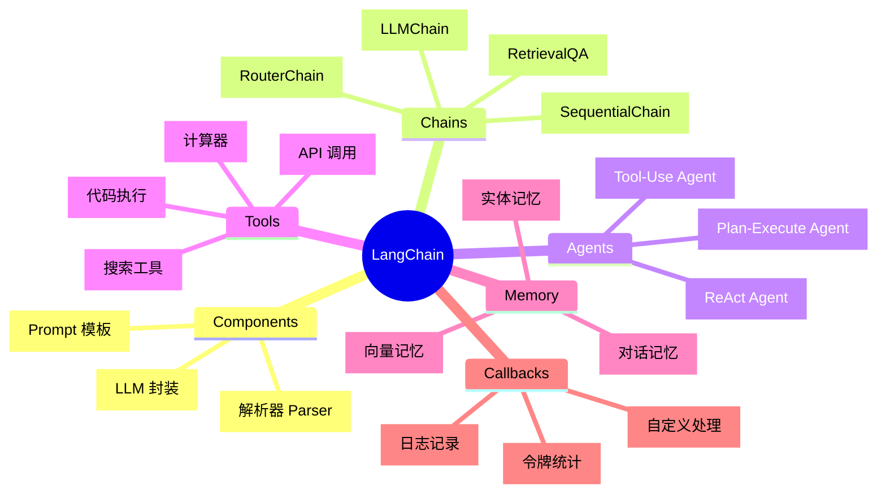
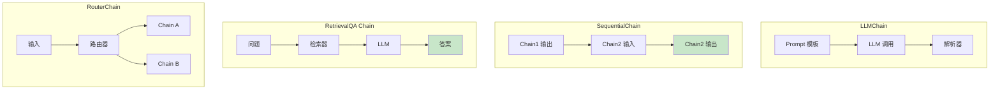
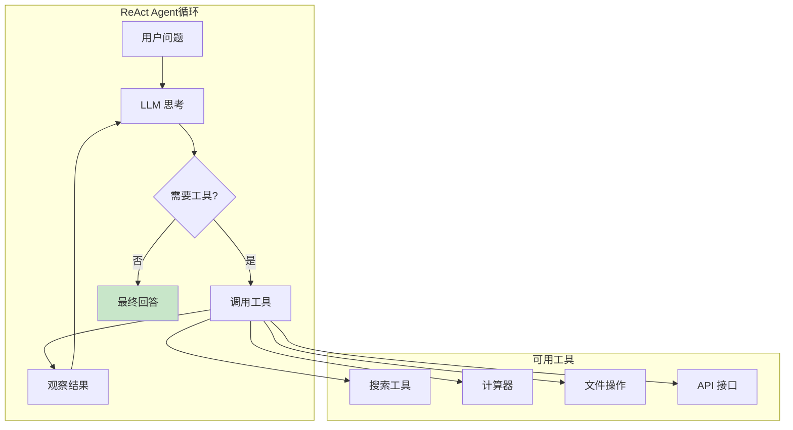
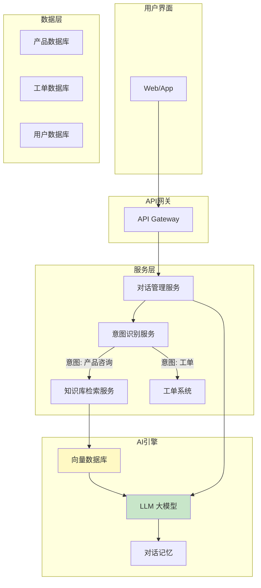
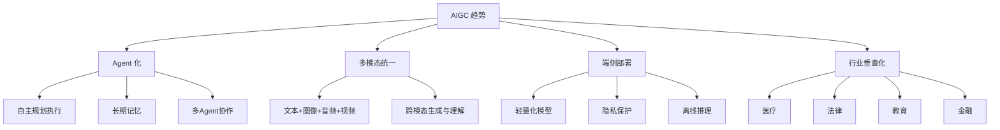

# 10.3 AIGC 应用与工程实践

## 📖 定义与概述

**AIGC（AI-Generated Content）** 指由人工智能生成的内容，包括文本、图像、音频、视频、代码等。AIGC 的工程实践涵盖从模型选型、Prompt 设计、检索增强到微调部署的完整链路。

> AIGC 不仅是模型能力的展示，更是一套完整的工程方法论，帮助开发者将大模型能力落地到实际业务场景中。

---

## 🗺️ AIGC 技术栈全景



---

## 💬 Prompt Engineering（提示工程）

### 什么是 Prompt Engineering？

> 通过设计和优化输入给大模型的文本（Prompt），引导模型生成高质量、符合预期的输出的技术。

### 核心技术分类



### 基础 Prompting 技术

#### Zero-Shot Prompting

```
Prompt:
将以下中文翻译成英文：
人工智能正在改变世界

Response:
Artificial intelligence is changing the world
```

#### One-Shot / Few-Shot Prompting

```
Prompt:
请将下列句子转换为正式语气：

示例1: "Hey, what's up?" → "Hello, how are you?"
示例2: "Gimme a sec" → "Please wait a moment"

输入: "Can't do that" →
```

#### Chain-of-Thought (CoT) 推理

```
Prompt:
请一步步推理：

一个商店有 23 个苹果，卖出 17 个后，
又进货了原来的 3 倍。请问现在有多少个苹果？

Reasoning:
1. 初始: 23 个
2. 卖出: 23 - 17 = 6 个
3. 进货: 6 × 3 = 18 个
4. 总计: 6 + 18 = 24 个

Answer: 24
```

### Prompt 设计原则

| 原则 | 说明 | 示例 |
|------|------|------|
| **清晰具体** | 明确描述任务要求 | "将以下 200 字的中文文本翻译为地道的美式英语" |
| **提供示例** | Few-shot 提供格式参考 | 列出 2-3 个输入输出示例 |
| **指定角色** | 设定专业身份 | "你是一位资深的 Python 工程师" |
| **约束输出** | 规定格式和长度 | "输出不超过 50 字的 JSON 格式" |
| **分步引导** | CoT 要求逐步推理 | "请一步步思考..." |

### 进阶 Prompt 技术对比

| 技术 | 适用场景 | 核心思想 |
|------|----------|----------|
| Zero-Shot | 简单任务、快速验证 | 无需示例，直接指令 |
| Few-Shot | 格式敏感的任务 | 提供示例引导格式 |
| CoT | 复杂推理任务 | 引导分步思考 |
| Self-Consistency | 需要确定性答案 | 多次采样取多数 |
| Tree-of-Thought | 需要规划的任务 | 生成多个推理路径 |

---

## 🔍 RAG（检索增强生成）

### 什么是 RAG？

> **Retrieval-Augmented Generation**：将信息检索系统与生成模型结合，先检索相关知识，再基于检索结果生成回答。

### RAG 架构详解



### RAG 核心组件

#### 1. 文档处理与索引

- **分块策略**：固定长度（512 tokens）、语义分块、结构化分块
- **向量化**：使用 Embedding 模型将文档块转换为向量
- **存储**：向量数据库（Pinecone、Milvus、Chroma、FAISS）

#### 2. 检索策略

| 策略 | 描述 | 适用场景 |
|------|------|----------|
| 语义检索 | 基于向量余弦相似度 | 通用问答 |
| 关键词检索 | 基于 BM25 等 | 精确匹配需求 |
| 混合检索 | 语义 + 关键词 | 平衡召回率和精度 |
| 元数据过滤 | 基于时间、来源等过滤 | 特定范围查询 |

#### 3. 生成策略

```python
# RAG 的 Prompt 模板示例
rag_prompt = """
基于以下上下文信息回答用户的问题。
如果上下文中没有相关信息，请回答"我无法回答这个问题"。

上下文:
{retrieved_context}

问题: {user_question}

回答:
"""
```

### RAG vs Fine-tuning 对比



### RAG 实践代码

```python
from langchain.vectorstores import Chroma
from langchain.embeddings import HuggingFaceEmbeddings
from langchain.llms import OpenAI
from langchain.chains import RetrievalQA
from langchain.document_loaders import TextLoader
from langchain.text_splitter import CharacterTextSplitter

# 1. 加载和处理文档
loader = TextLoader("knowledge_base.txt")
documents = loader.load()

# 2. 分块
text_splitter = CharacterTextSplitter(
    chunk_size=1000,
    chunk_overlap=200
)
texts = text_splitter.split_documents(documents)

# 3. 创建向量存储
embeddings = HuggingFaceEmbeddings()
vectordb = Chroma.from_documents(
    documents=texts,
    embedding=embeddings,
    persist_directory="./chroma_db"
)

# 4. 创建 RAG 链
qa_chain = RetrievalQA.from_chain_type(
    llm=OpenAI(temperature=0),
    chain_type="stuff",
    retriever=vectordb.as_retriever(search_kwargs={"k": 3})
)

# 5. 问答
query = "公司的年假政策是什么？"
result = qa_chain.run(query)
print(f"回答: {result}")
```

---

## 🔧 Fine-tuning（微调）

### 微调方法分类



### LoRA（Low-Rank Adaptation）详解

**核心思想**：用低秩矩阵近似权重更新。

$$W_0 = W_0 + \Delta W = W_0 + BA$$

其中：
- $W_0$：原始冻结的权重矩阵
- $A$：低秩可训练矩阵（$r \times d$）
- $B$：低秩可训练矩阵（$k \times r$）
- $r$：秩，通常远小于 $d$ 和 $k$（如 $r=8$）

```mermaid
flowchart LR
    subgraph LoRA结构
        A[输入 x] --> B[冻结权重 W₀]
        A --> C[低秩矩阵 A]
        C --> D[低秩矩阵 B]
        B --> E[输出]
        D --> E
    end

    subgraph 参数对比
        F[全参数: d×k]
        G[LoRA: r×d + r×k = r×(d+k)]
    end

    style C fill:#c8e6c9
    style D fill:#c8e6c9
```

### 微调方法对比

| 方法 | 可训练参数 | 显存需求 | 效果 | 训练速度 |
|------|-----------|----------|------|----------|
| Full Fine-tuning | 100% | 高 | 最好 | 慢 |
| LoRA (r=8) | ~0.1% | 低 | 好 | 快 |
| QLoRA | ~0.1% | 极低 | 好 | 快 |
| Adapter | ~1% | 中 | 较好 | 中 |
| Prefix Tuning | ~0.01% | 低 | 中等 | 快 |

### LoRA 微调实践

```python
from transformers import AutoModelForCausalLM, AutoTokenizer
from peft import LoraConfig, get_peft_model

# 加载基础模型
model_name = "meta-llama/Llama-2-7b-hf"
model = AutoModelForCausalLM.from_pretrained(model_name)
tokenizer = AutoTokenizer.from_pretrained(model_name)

# 配置 LoRA
lora_config = LoraConfig(
    r=8,
    lora_alpha=32,
    lora_dropout=0.05,
    target_modules=["q_proj", "v_proj"],
    task_type="CAUSAL_LM"
)

# 应用 LoRA
model = get_peft_model(model, lora_config)
model.print_trainable_parameters()

# 准备训练数据
train_data = [
    {"instruction": "总结以下文本", "input": "...", "output": "..."},
    # ... 更多样本
]

# 训练（伪代码）
# trainer = Trainer(model, args, train_dataset)
# trainer.train()

# 保存 LoRA 权重
model.save_pretrained("./lora_weights")
```

---

## 🦜 LangChain 框架

### LangChain 核心抽象



### 核心组件详解

#### 1. Chain 模式



#### 2. Agent 模式



#### 3. Memory 模式

```python
from langchain.memory import ConversationBufferMemory
from langchain.chains import ConversationChain
from langchain.llms import OpenAI

# 创建带记忆的对话链
memory = ConversationBufferMemory(memory_key="chat_history")
conversation = ConversationChain(
    llm=OpenAI(temperature=0.7),
    memory=memory,
    verbose=True
)

# 多轮对话
response1 = conversation.predict(input="你好，我叫张三")
response2 = conversation.predict(input="我叫什么名字？")
# response2 应该记得用户叫"张三"
```

### LangChain 实战：构建客服 Agent

```python
from langchain.agents import initialize_agent, AgentType
from langchain.tools import Tool
from langchain.llms import OpenAI

# 定义工具
def query_order(order_id: str) -> str:
    """查询订单状态"""
    return f"订单 {order_id} 已发货，预计 3 天内送达"

def get_product_info(product_id: str) -> str:
    """获取产品信息"""
    return f"产品 {product_id}：价格 99 元，库存充足"

tools = [
    Tool(name="订单查询", func=query_order, description="查询订单状态"),
    Tool(name="产品查询", func=get_product_info, description="查询产品信息")
]

# 初始化 Agent
agent = initialize_agent(
    tools=tools,
    llm=OpenAI(temperature=0),
    agent_type=AgentType.ZERO_SHOT_REACT_DESCRIPTION,
    verbose=True
)

# 使用 Agent
result = agent.run("帮我查一下订单 SH12345 的状态")
print(result)
```

---

## 🏗️ AIGC 应用架构设计

### 典型应用：智能客服系统



### 应用模式选择矩阵

| 场景 | 推荐方案 | 理由 |
|------|----------|------|
| 知识库问答 | RAG | 知识可更新、成本低 |
| 风格化文本生成 | Fine-tuning | 需要特定写作风格 |
| 复杂工作流 | Agent + Tools | 需要多步骤、多工具 |
| 简单对话 | LLM + Prompt | 快速上线 |
| 数据分析 | LLM + Code Interpreter | 需要计算能力 |

---

## 🔧 工程实践 Checklist

### 模型选型

- [ ] 是否需要私有化部署？→ 选择开源模型（LLaMA/Mistral）
- [ ] 任务是生成还是理解？→ Decoder-only vs Encoder-only
- [ ] 上下文长度需求？→ 128K vs 32K vs 8K
- [ ] 延迟要求？→ 小模型 vs 大模型

### 开发流程

- [ ] 明确业务场景和评估指标
- [ ] 选择 LLM 和推理框架
- [ ] 设计 Prompt 模板（包含错误处理）
- [ ] 实现 RAG 或 Fine-tuning
- [ ] 搭建评估测试集
- [ ] 性能优化（缓存、批处理、量化）
- [ ] 安全对齐（内容过滤、越狱检测）
- [ ] 上线部署与监控

### 性能优化技术

| 技术 | 效果 | 说明 |
|------|------|------|
| KV Cache | 2-3x 加速 | 缓存前缀注意力 |
| 量化 (INT8/INT4) | 2-4x 加速 | 降低模型精度 |
| FlashAttention | 1.5-2x 加速 | 优化注意力计算 |
| vLLM 推理 | 5-10x 加速 | PagedAttention |
| 批处理 | 高吞吐 | 动态 batching |

---

## 🚀 前沿展望

### AIGC 发展趋势



### 关键技术预测

1. **Agent 成为核心范式**：大模型从"工具"变为"Agent"，具备自主规划和执行能力
2. **开源生态繁荣**：LLaMA、Mistral 等开源模型持续进化，逼近闭源模型水平
3. **端侧大模型**：手机、PC 本地运行 7B-70B 参数模型
4. **垂直行业方案**：医疗、法律、教育等领域出现定制化 AIGC 解决方案

---

## 📝 考研真题精选

### 简答题

**【真题】（2024 某高校）简述 RAG（检索增强生成）的工作流程及其相比 Fine-tuning 的优势。**

> **参考答案要点**：
> 1. 流程：文档分块 → 向量化 → 向量存储 → 检索相关文档 → 构建上下文 Prompt → LLM 生成
> 2. 优势：知识可实时更新、无需重新训练、成本更低、可解释性更好

**【真题】（2023 某高校）解释 LoRA 的核心思想，为什么它比全参数微调更高效？**

> **参考答案要点**：
> LoRA 用低秩矩阵近似权重更新 $\Delta W = BA$，其中 $r \ll \min(d,k)$。可训练参数仅为 $r \times (d+k)$，远少于全参数 $d \times k$，因此训练更快、显存更低。

### 设计题

**【设计题】某企业需要构建一个内部知识库问答系统，请设计基于 RAG 的完整架构，包括数据处理、索引构建、检索生成和评估监控等环节。**

---

## 📚 参考文献

1. Lewis, P., et al. *Retrieval-Augmented Generation for Knowledge-Intensive NLP Tasks*. NeurIPS, 2020. (RAG)
2. Hu, E., et al. *LoRA: Low-Rank Adaptation of Large Language Models*. ICLR, 2022.
3. LangChain. *LangChain Documentation*. https://python.langchain.com/
4. Ding, N., et al. *Parameter-Efficient Prompt Tuning Makes Generalized and Calibrated NLP Models*. 2022.

---

> 💡 **学习建议**：本章是实践性最强的一章。建议：
> 1. 使用 LangChain 官方教程搭建一个简单的 RAG 系统
> 2. 尝试对 LLaMA 2 进行 LoRA 微调
> 3. 对比不同 Prompt 策略在实际任务中的效果
> 4. 关注 Agent 框架的发展（LangChain、AutoGen、CrewAI）