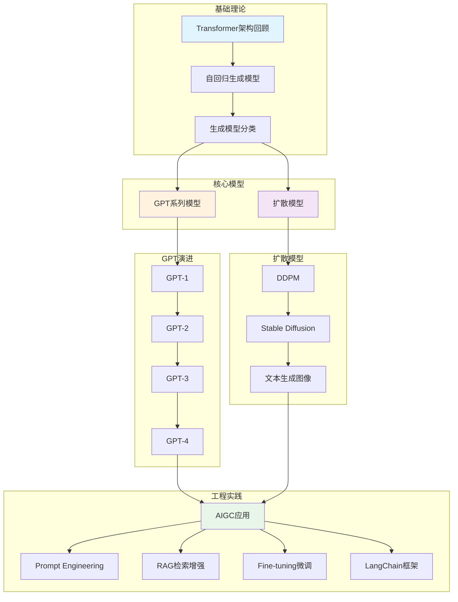
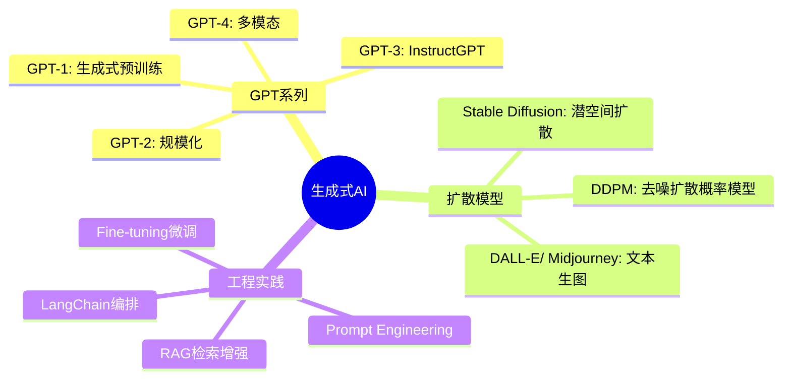

# 第10章 生成式大模型与AIGC — 目录导航

## 📋 章节概览

本章系统介绍生成式大模型（Large Language Models, LLMs）与人工智能生成内容（AIGC）的核心技术原理与工程实践。内容涵盖 GPT 系列模型的演进路线、扩散模型与图像生成技术、以及大模型在实际应用中的工程方法论。

---

## 🗺️ 学习路线图

---

## 📚 章节内容

| 知识点 | 链接 | 核心内容 | 难度 |
|--------|------|----------|------|
| 10.1 GPT系列模型 | [[10.1-GPT系列模型]] | GPT-1到GPT-4的架构演进、训练方法、涌现能力 | ⭐⭐⭐⭐ |
| 10.2 扩散模型与生成图像 | [[10.2-扩散模型与生成图像]] | DDPM、Stable Diffusion、文本生成图像原理 | ⭐⭐⭐⭐ |
| 10.3 AIGC应用与工程实践 | [[10.3-AIGC应用与工程实践]] | Prompt工程、RAG、微调、LangChain实战 | ⭐⭐⭐ |

---

## 🎯 核心考点

### 考研/考试高频考点

1. **生成模型分类**：VAE、GAN、扩散模型、自回归模型的区别与联系
2. **GPT架构演进**：各版本的核心改进（Decoder-only、RLHF、Multi-modal）
3. **扩散模型原理**：前向扩散过程、反向去噪过程、噪声预测目标
4. **Prompt Engineering**：Zero-shot、Few-shot、CoT 的区别与适用场景
5. **RAG vs Fine-tuning**：两种方案的对比选择与工程权衡

### 典型题型

- **简答题**：描述扩散模型的前向过程和反向过程
- **论述题**：比较 GPT-3 与 GPT-4 的主要架构差异
- **计算题**：Transformer 参数量估算、扩散过程步数选择
- **设计题**：设计一个基于 RAG 的企业知识库问答系统

---

## 🧩 知识体系图谱

---

## ✅ 自测清单

- [ ] 能描述 GPT-1 到 GPT-4 的架构演进路线
- [ ] 理解自回归语言模型的训练目标（next token prediction）
- [ ] 掌握扩散模型的前向加噪与反向去噪过程
- [ ] 能区分 DDPM 与 DDIM 的采样效率差异
- [ ] 理解 Stable Diffusion 使用潜空间的动机与好处
- [ ] 掌握 Zero-shot、One-shot、Few-shot Prompting 的区别
- [ ] 理解 RAG 的架构：检索 + 生成两阶段
- [ ] 了解 Fine-tuning 全参数微调与 LoRA 的区别
- [ ] 熟悉 LangChain 的核心抽象：Chain、Agent、Tool
- [ ] 能列举至少 3 种 AIGC 的典型应用场景

---

## 🔗 相关章节

- **前置章节**：[[第9章-自然语言处理与大模型基础]] — NLP基础、Transformer架构
- **后续章节**：[[第11章-人工智能伦理安全与行业规范]] — AI安全、伦理治理
- **关联知识点**：[[注意力机制与Transformer]]、[[强化学习基础]]

---

## 📝 学习建议

1. **先理论后实践**：先深入理解 Transformer 和扩散模型的数学原理，再动手实践
2. **对比学习**：将 GPT 系列与扩散模型对比，理解两种生成范式的差异
3. **动手编程**：使用 HuggingFace Transformers 库体验模型推理
4. **关注前沿**：AIGC 领域发展迅速，建议持续关注最新论文和产品

---

> 💡 **学习提示**：本章是当前 AI 领域最活跃的方向，建议结合代码实践加深理解。推荐使用 Colab 或本地 GPU 环境运行示例代码。