# 11.1 AI 伦理与公平性

## 📖 定义与概述

**AI 伦理（AI Ethics）** 研究人工智能系统在开发、部署和使用过程中涉及的伦理原则、价值判断和社会责任问题。核心关注 AI 系统的公平性、可解释性、隐私保护和人类福祉。

**AI 公平性（AI Fairness）** 指 AI 系统不应基于受保护特征（如性别、种族、年龄等）对特定群体产生系统性的不利影响。

> "AI 的价值不仅在于其智能水平，更在于其是否能公平、公正地服务于所有人。"

---

## 🏛️ 背景与历史演进

### 关键里程碑

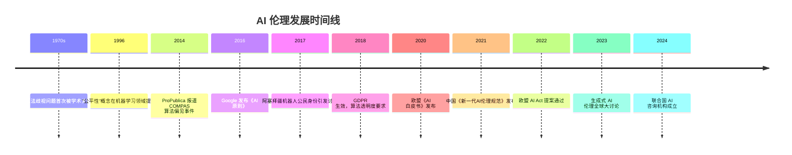

### 经典案例

#### COMPAS 算法歧视事件

> **背景**：美国 Northpointe 公司开发的 COMPAS 系统用于预测被告的再犯风险，法官据此决定保释或判刑。
>
> **ProPublica 调查结论（2014）**：
> - 对非裔美国被告的假阳性率（45%）远高于白人被告（23%）
> - 系统系统性地将黑人标记为高风险
> - 受影响人群被剥夺自由的比例远超实际风险

#### Amazon 招聘算法歧视

> **背景**：Amazon 开发 AI 辅助简历筛选系统。
>
> **问题**：系统在训练过程中学习到了性别偏见——因为历史数据中技术岗位以男性为主，系统倾向于惩罚"女子学院"背景的候选人。项目于 2018 年被终止。

---

## 🚫 AI 偏见的来源

### 三大偏见类型

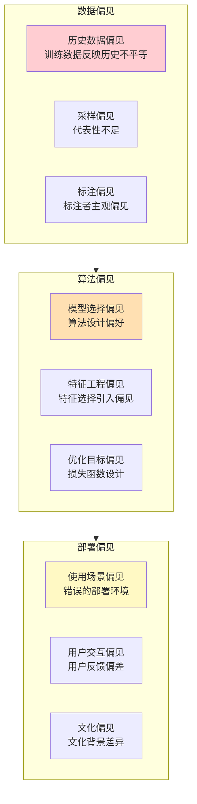

### 各类型详解

#### 1. 数据偏见

| 子类型 | 描述 | 示例 |
|--------|------|------|
| 历史偏见 | 历史数据中存在的不平等 | 历史上某些岗位性别比例失衡 |
| 代表性偏差 | 采样不覆盖所有群体 | 人脸训练数据中欧洲人种占 80%+ |
| 测量偏见 | 数据采集方式引入偏差 | 仅使用手机端数据，忽视非手机用户 |
| 标注偏见 | 标注者的主观偏见 | 情感分析中标注者对特定口音的偏见 |

#### 2. 算法偏见

| 子类型 | 描述 | 示例 |
|--------|------|------|
| 特征偏见 | 选择与受保护属性相关的特征 | 使用邮编作为特征（关联种族） |
| 目标偏见 | 损失函数未能体现公平要求 | 仅优化准确率，忽视群体差异 |
| 建模偏见 | 模型架构选择的偏见 | 复杂模型可能放大偏见 |

#### 3. 部署偏见

| 子类型 | 描述 | 示例 |
|--------|------|------|
| 交互偏见 | 用户与系统交互引入偏差 | 推荐系统的信息茧房效应 |
| 上下文偏见 | 使用场景的文化差异 | 翻译系统对非英语方言的低质量支持 |

---

## 📐 公平性度量框架

### 核心概念

**受保护特征（Protected Attributes）**：受法律保护的特征，不应成为歧视的依据。
- 性别、种族、年龄、宗教、国籍、性取向、残疾等

**公平性的三个层面**：

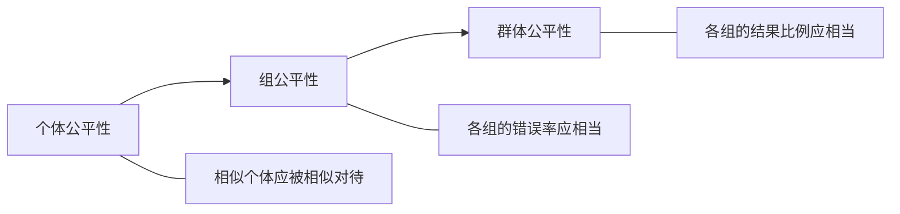

### 主要公平性度量指标

#### 1. 人口统计平价（Demographic Parity）

$$P(Y=1|G=a) = P(Y=1|G=b), \quad \forall a,b \in G$$

**解释**：不同群体获得正向结果的比例相同。

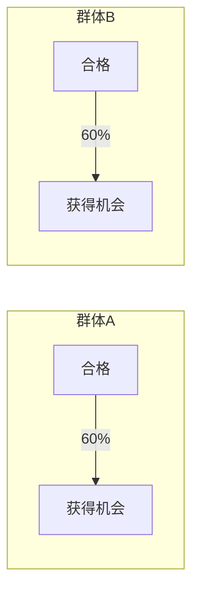

#### 2. 平等机会（Equal Opportunity）

$$TPR_{G=a} = TPR_{G=b}, \quad \forall a,b \in G$$

**解释**：不同群体的真阳性率（召回率）相同。

#### 3. 均衡赔率（Equalized Odds）

$$TPR_{G=a} = TPR_{G=b} \quad \text{且} \quad FPR_{G=a} = FPR_{G=b}$$

**解释**：不同群体的真阳性率和假阳性率都相同（最严格的条件）。

#### 4. 个体公平性（Individual Fairness）

$$d(x_i, x_j) \leq d(y_i, y_j) \quad \text{当} \quad D(x_i, x_j) \leq D(x_i, x_j)$$

**解释**：相似的个体应得到相似的处理。

#### 5. 校准公平性（Calibration Fairness）

$$P(Y=y|\hat{Y}=y, G=a) = P(Y=y|\hat{Y}=y, G=b)$$

**解释**：不同群体的预测概率应具有相同的校准特性。

### 各指标的权衡关系

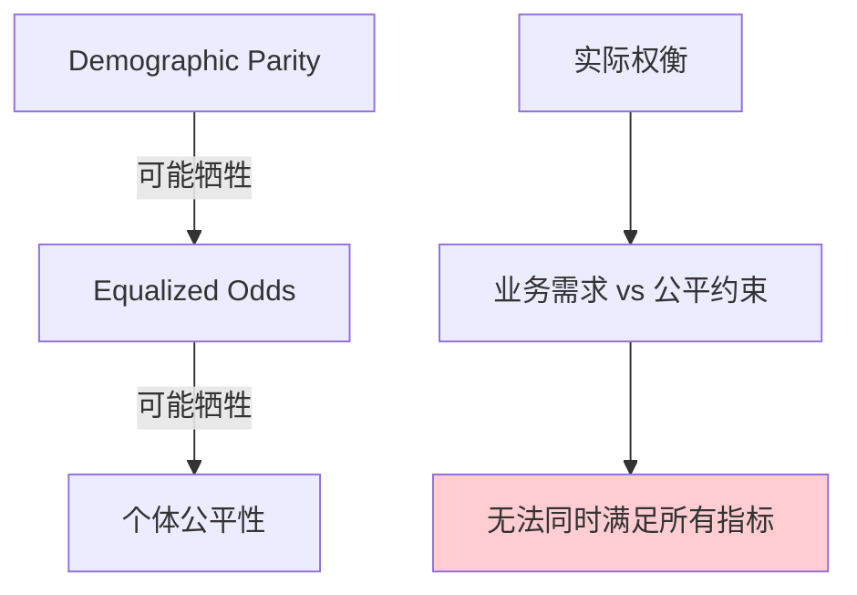

> **关键发现**：在某些条件下，不可能同时满足所有公平性指标（Impossibility Theorem of Fairness）。实际应用需要根据场景选择合适的公平性定义。

---

## 🛡️ 公平性保障方法

### 方法论分类

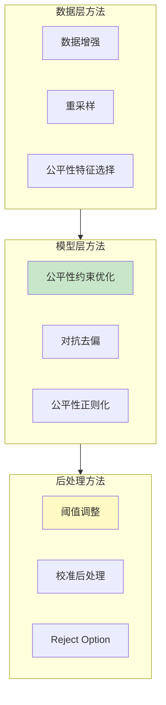

### 各方法详解

#### 1. 数据层方法

| 方法 | 描述 | 适用场景 |
|------|------|----------|
| 数据增强 | 增加少数群体样本 | 分类任务 |
| 重采样 | 平衡不同群体的采样率 | 类别不平衡 |
| 公平性特征选择 | 移除与受保护特征相关的特征 | 特征工程阶段 |

#### 2. 模型层方法

**公平性约束优化**：

$$\min_\theta L(\theta) \quad \text{s.t.} \quad \text{Fairness}(\theta) \leq \epsilon$$

**对抗去偏**：在主模型之外添加一个对抗模型，用于预测受保护属性。训练主模型使其无法被对抗模型预测受保护属性。

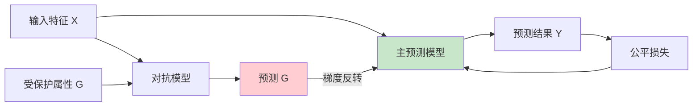

#### 3. 后处理方法

**阈值调整**：为不同群体设置不同的分类阈值。

**Reject Option 分类**：在不确定区域延迟决策，要求人工审核。

---

## 🧭 负责任 AI 原则

### 国际主流框架

#### 欧盟 AI 法案（EU AI Act）七项要求

| 序号 | 要求 | 说明 |
|------|------|------|
| 1 | 人类监管 | 保留人类监督和决策权 |
| 2 | 安全 | 确保 AI 系统安全可靠 |
| 3 | 隐私 | 保护个人数据和隐私 |
| 4 | 透明 | AI 系统可解释、可追溯 |
| 5 | 公平 | 避免歧视、确保公平 |
| 6 | 社会福祉 | 考虑对社会的积极/消极影响 |
| 7 | 权利 | 尊重基本权利和自由 |

#### 中国《新一代 AI 伦理规范》四大原则

1. **以人为本**：AI 发展以人类福祉为中心
2. **责任可控**：AI 研发者和使用者承担责任
3. **开放协作**：促进 AI 技术的开放透明
4. **和平发展**：AI 应用于和平目的

### 负责任 AI 生命周期

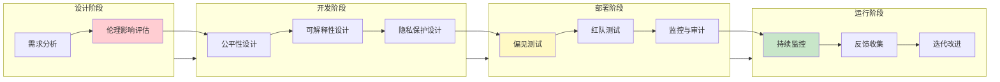

---

## 🔍 可解释性 AI（XAI）

### 可解释性维度

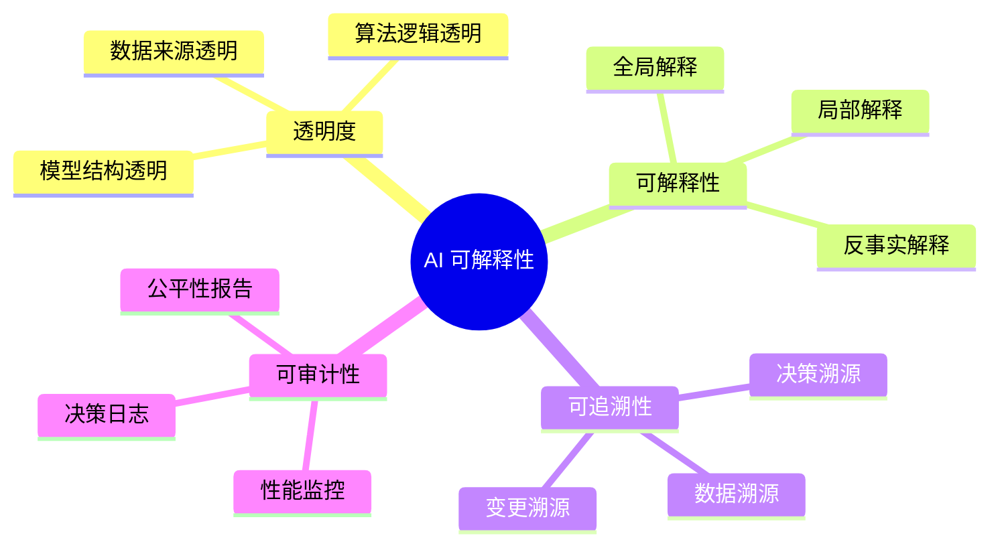

### 主要 XAI 技术

| 方法 | 类型 | 描述 |
|------|------|------|
| LIME | 局部解释 | 在预测点附近拟合线性模型 |
| SHAP | 基于博弈论 | 基于 Shapley 值的特征贡献 |
| Grad-CAM | 可视化解释 | 可视化模型关注的区域 |
| 注意力可视化 | 深度学习 | 可视化 Transformer 注意力权重 |
| 反事实解释 | 因果解释 | 生成最小修改的反事实样本 |

### SHAP 值示例

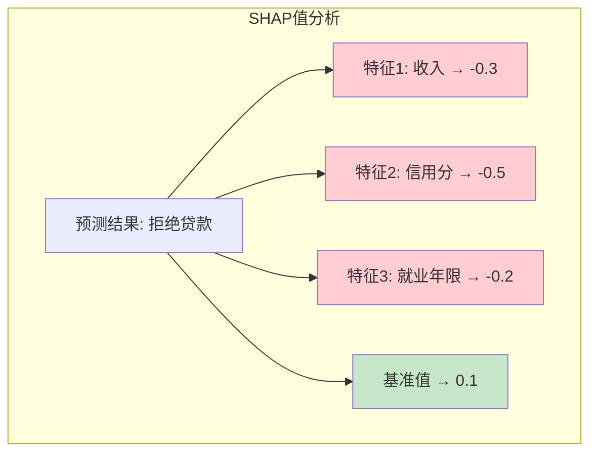

---

## 💻 实践代码示例

### 使用 Fairlearn 进行公平性评估

```python
from fairlearn.metrics import demographic_parity_difference
from sklearn.metrics import accuracy_score
import numpy as np

# 模拟数据
y_true = np.array([1, 0, 1, 1, 0, 1, 0, 0, 1, 1])
y_pred = np.array([1, 0, 1, 1, 0, 0, 0, 0, 1, 1])
sensitive = np.array(["A", "A", "A", "A", "A", "B", "B", "B", "B", "B"])

# 计算准确率
accuracy = accuracy_score(y_true, y_pred)
print(f"准确率: {accuracy:.2f}")

# 计算人口统计平价差异
dp_diff = demographic_parity_difference(y_true, y_pred, sensitive_features=sensitive)
print(f"人口统计平价差异: {dp_diff:.2f}")
```

### 使用 SHAP 进行模型解释

```python
import shap
import xgboost as xgb
from sklearn.datasets import load_breast_cancer

# 加载数据和模型
data = load_breast_cancer()
model = xgb.XGBClassifier().fit(data.data, data.target)

# 计算 SHAP 值
explainer = shap.TreeExplainer(model)
shap_values = explainer.shap_values(data.data[:100])

# 摘要图
shap.summary_plot(shap_values, data.data, feature_names=data.feature_names)

# 单个预测的解释
shap.force_plot(explainer.expected_value, shap_values[0], data.data[0])
```

---

## 🚀 前沿展望

### 发展趋势

1. **法规驱动**：全球 AI 立法加速，伦理合规成为企业刚需
2. **技术融合**：公平性、可解释性、隐私保护技术深度融合
3. **行业标准**：ISO/IEC 42001 等国际标准陆续发布
4. **自动化公平性**：AI 自动检测和修正偏见
5. **跨学科协作**：伦理学家、法律专家、工程师深度合作

### 关键研究方向

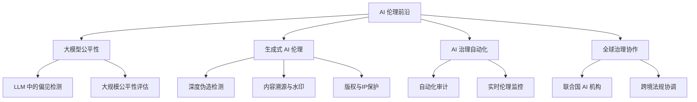

---

## 📝 考研真题精选

### 简答题

**【真题1】（2024 某高校）简述 AI 系统中偏见的主要来源，并各举一例说明。**

> **参考答案要点**：
> 1. 数据偏见：历史数据反映历史不平等（如招聘数据中男性比例高）
> 2. 算法偏见：模型设计引入（如使用邮编作为特征关联种族）
> 3. 部署偏见：使用场景不当（如在特定文化中使用不适配的模型）

**【真题2】（2023 某高校）解释"人口统计平价"和"平等机会"的概念，并说明它们的区别。**

> **参考答案要点**：
> - 人口统计平价：不同群体获得正向结果的比例相同
> - 平等机会：不同群体的真阳性率（召回率）相同
> - 区别：前者关注结果分配公平，后者关注表现公平；前者可能允许不同群体的基础率差异

### 论述题

**【论述题】某银行使用 AI 系统进行贷款审批，系统在性别和种族上存在偏见。请分析可能的偏见来源，并提出综合的公平性改进方案。**

---

## 📚 参考文献

1. Barocas, S., Hardt, M., & Narayanan, A. *Fairness and Machine Learning*. 2019.
2. Mehrabi, N., et al. *A Survey on Bias and Fairness in Machine Learning*. ACM Computing Surveys, 2021.
3. EU. *Ethics Guidelines for Trustworthy AI*. 2019.
4. 中国人工智能产业发展联盟. *新一代人工智能伦理规范*. 2021.

---

> 💡 **学习建议**：AI 伦理是技术与人文的交叉学科，建议：
> 1. 阅读经典案例（COMPAS、Amazon 招聘、DeepMind 医疗 AI）
> 2. 使用 Fairlearn、Aequitas 等工具进行实践
> 3. 关注 GDPR、欧盟 AI Act 等法规的最新进展
> 4. 参与 AI 伦理讨论，形成多角度思考