# 11.3 AI 监管与治理框架

## 📖 定义与概述

**AI 监管（AI Regulation）** 指政府和国际组织通过立法、政策、标准等手段对人工智能的开发、部署和使用进行规范和引导的行为。

**AI 治理（AI Governance）** 是更广泛的概念，涵盖监管框架、行业标准、企业内部治理、跨组织协作等多层次的管理体系。

> AI 治理的目标是在促进创新和发展的同时，确保 AI 系统安全、可靠、公平、透明、负责任。

---

## 🏛️ 全球治理格局

### 主要监管框架对比

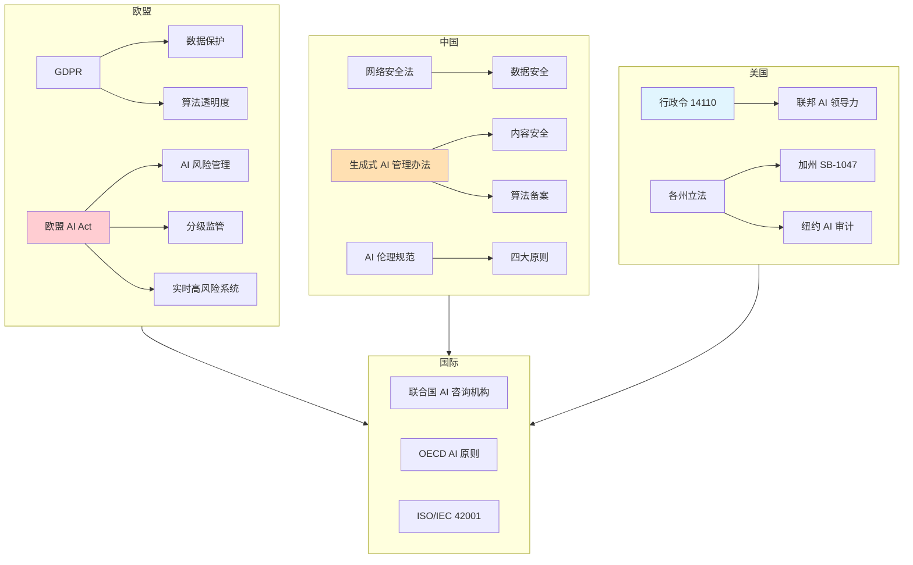

---

## 📋 欧盟监管框架

### GDPR（通用数据保护条例）

#### 核心原则

| 原则 | 描述 | 对 AI 的影响 |
|------|------|-------------|
| **合法性、公平性、透明性** | 数据处理必须合法、公平、透明 | AI 训练数据需合法获取 |
| **目的限制** | 数据只能用于特定、明确的目的 | 限制 AI 模型数据二次利用 |
| **数据最小化** | 仅收集必要数据 | AI 训练数据应最小化 |
| **准确性** | 数据必须准确最新 | AI 数据需定期验证 |
| **存储限制** | 数据不应超过必要保存期 | AI 模型需定期更新 |
| **完整性与保密性** | 数据安全保护 | AI 需实施安全措施 |
| **责任性** | 控制者负责合规 | AI 开发者/部署者担责 |

#### AI 相关条款

- **第 22 条**：自动化决策相关权利，包括拒绝仅基于自动化决策的决定
- **第 25 条**：数据保护设计和默认保护
- **第 35 条**：数据保护影响评估（DPIA）
- **第 30 条**：处理活动记录

### 欧盟 AI Act（人工智能法案）

#### 风险分级监管

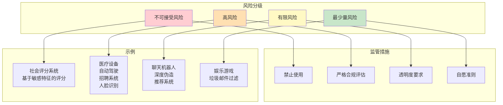

#### 核心要求

| 要求 | 描述 | 适用范围 |
|------|------|----------|
| **风险管理** | 建立持续的风险识别、分析、评估、缓解体系 | 高风险 |
| **数据治理** | 确保训练/测试/验证数据的合法性和质量 | 高风险 |
| **可解释性** | 提供清晰、可理解的决策解释 | 高风险 |
| **人类监督** | 保留人类监督决策权 | 高风险 |
| **鲁棒性** | 确保系统在异常情况下安全可靠 | 高风险 |
| **透明度** | 告知用户正在与 AI 交互 | 有限风险 |
| **内容溯源** | 生成内容需标记、溯源 | 有限风险 |
| **模型报告** | 大模型需提交训练计算报告 | 通用 |

#### 生成式 AI 特别规定

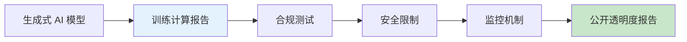

---

## 🇨🇳 中国 AI 治理

### 政策框架体系

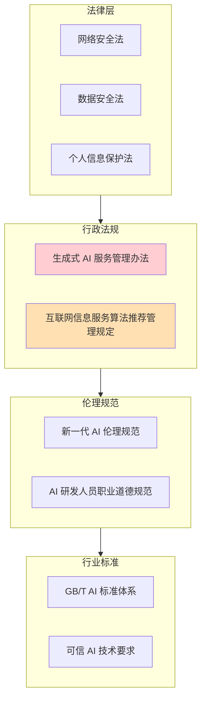

### 《生成式人工智能服务管理暂行办法》

#### 核心内容

| 方面 | 要求 |
|------|------|
| **安全评估** | 提供生成式 AI 服务前需通过安全评估 |
| **算法备案** | 推荐类算法需向网信部门备案 |
| **内容审核** | 生成内容需符合法律法规和社会主义核心价值观 |
| **数据合规** | 训练数据需合法合规，不得侵犯知识产权 |
| **用户保护** | 需采取措施防止用户滥用，保护用户权益 |
| **标识要求** | 生成内容应可识别为 AI 生成 |

#### 管理流程

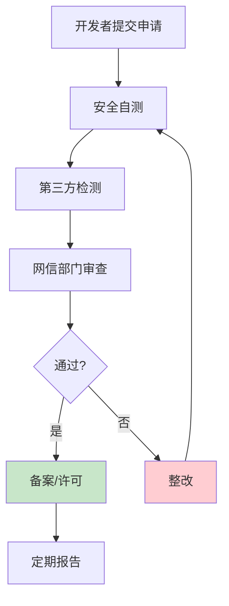

### 中国 AI 治理特点

1. **发展与规范并重**：在鼓励创新的同时强调规范发展
2. **分类分级管理**：针对不同类型 AI 采取差异化管理
3. **技术与制度结合**：技术能力建设与制度建设同步推进
4. **多方协同治理**：政府、企业、学界、公众共同参与

---

## 🌐 国际治理协作

### 主要国际倡议

| 倡议 | 发起方 | 核心内容 |
|------|--------|----------|
| **OECD AI 原则** | OECD | 负责任 AI 的五项原则 |
| **G7 AI 部长级会议** | G7 | 安全、可靠、可相信的 AI |
| **联合国 AI 咨询机构** | 联合国 | 全球 AI 治理建议 |
| **全球 AI 治理峰会** | 英国 | 前沿 AI 安全研究所 |

### OECD 负责任 AI 原则

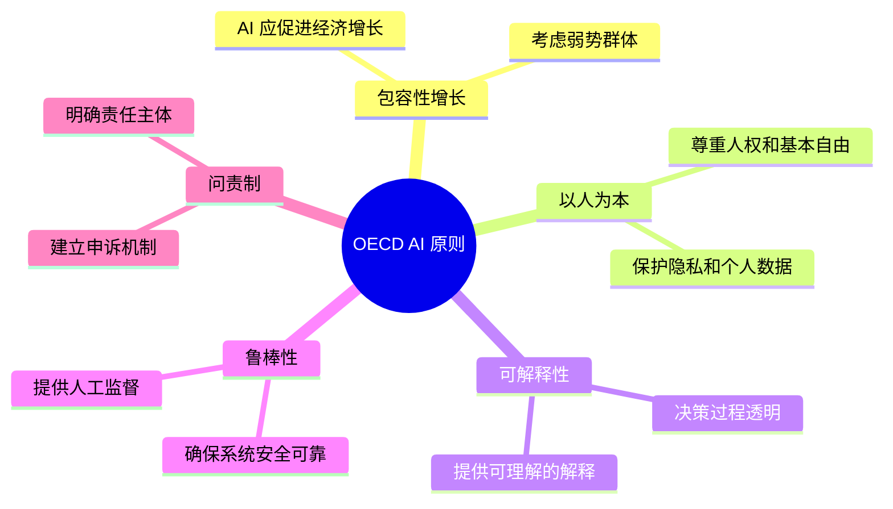

### ISO/IEC 42001（AI 管理体系）

**全球首个 AI 管理体系标准**，于 2023 年发布。

| 要素 | 内容 |
|------|------|
| 目标 | 帮助组织建立、实施、维护 AI 管理体系 |
| 结构 | 计划-实施-检查-改进（PDCA） |
| 核心 | 11 个控制域，37 个控制措施 |
| 适用 | 任何规模的组织 |

**11 个控制域**：
1. 组织背景
2. 领导力
3. 风险和机遇
4. AI 治理
5. 数据
6. 系统生命周期
7. 第三方关系
8. 使用方关系
9. 知识
10. 人员
11. 基础设施

---

## 🏢 企业 AI 治理

### 企业治理框架

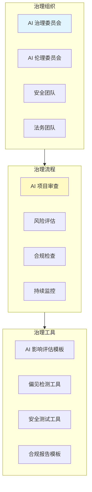

### AI 项目审查 Checklist

#### 立项阶段

- [ ] AI 系统的用途和目标是否明确？
- [ ] 是否评估了潜在的伦理风险？
- [ ] 是否确定了数据需求和合规要求？

#### 开发阶段

- [ ] 训练数据是否合法获取、是否有数据保护措施？
- [ ] 模型是否进行了公平性测试？
- [ ] 是否实施了可解释性设计？
- [ ] 是否进行了安全测试（对抗攻击、后门检测）？

#### 部署阶段

- [ ] 是否制定了部署和使用指南？
- [ ] 是否建立了监控和报警机制？
- [ ] 是否确定了责任人和应急方案？
- [ ] 是否完成了必要的备案/注册？

#### 运行阶段

- [ ] 是否定期进行公平性和性能复审？
- [ ] 是否建立了用户反馈渠道？
- [ ] 是否进行了定期的合规检查？

### 合规路线图

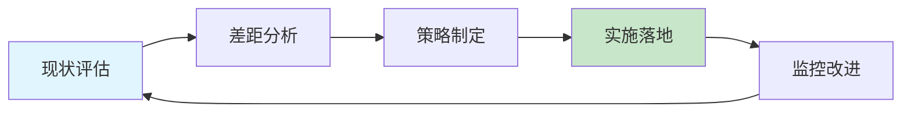

---

## 📊 全球法规时间线

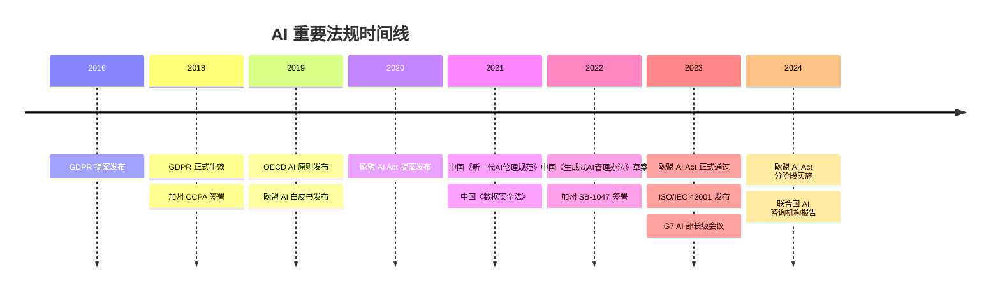

---

## 🔍 关键争议与挑战

### 核心争议议题

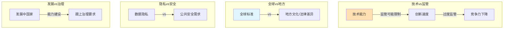

### 挑战与对策

| 挑战 | 描述 | 对策 |
|------|------|------|
| **技术发展速度超越立法** | AI 快速迭代，立法滞后 | 敏捷立法、框架性规定 |
| **法规碎片化** | 各国法规不一致 | 国际协调、互认机制 |
| **合规成本高** | 中小企业难以承担 | 分级分类、沙箱机制 |
| **技术能力不对称** | 监管方技术能力不足 | 技术援助、第三方评估 |
| **跨境数据问题** | 数据跨境传输规则 | 数据主权、跨境协议 |

---

## 🚀 前沿展望

### 未来治理趋势

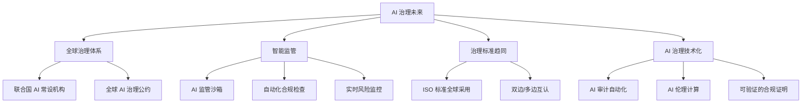

### 关键预测

1. **2025-2027**：欧盟 AI Act 全面实施，形成全球标杆
2. **2025-2030**：中国、印度等新兴市场形成有影响力的治理模式
3. **长期**：建立全球 AI 治理协调机制，减少法规碎片化
4. **技术趋势**：可验证 AI（Verified AI）和可信 AI（Trusted AI）技术成为主流

---

## 📝 考研真题精选

### 简答题

**【真题1】（2024 某高校）简述欧盟 AI Act 的风险分级体系及其对应的监管要求。**

> **参考答案要点**：
> 1. 不可接受风险：禁止使用（如社会评分）
> 2. 高风险：严格合规评估、可解释性、人类监督
> 3. 有限风险：透明度要求（如告知 AI 交互）
> 4. 最少量风险：自愿准则
> 重点：高风险系统包括医疗设备、自动驾驶、招聘系统等

**【真题2】（2023 某高校）中国《生成式人工智能服务管理暂行办法》的核心要求有哪些？**

> **参考答案要点**：
> 1. 安全评估和算法备案
> 2. 内容合规（符合法律法规和核心价值观）
> 3. 数据合法合规
> 4. 用户权益保护
> 5. AI 生成内容标识

### 论述题

**【论述题】随着生成式 AI 的快速发展，全球监管框架正在形成。请对比欧盟 AI Act 和中国《生成式 AI 服务管理办法》的主要异同，并分析其背后的治理理念差异。**

---

## 📚 参考文献

1. European Commission. *Regulation (EU) 2024/1689 (EU AI Act)*. 2024.
2. 国家互联网信息办公室. *生成式人工智能服务管理暂行办法*. 2023.
3. OECD. *Recommendation of the Council on Artificial Intelligence*. 2019.
4. ISO/IEC 42001:2023. *Information technology — Artificial Intelligence — Management System*. 2023.
5. 中国人工智能产业发展联盟. *新一代人工智能伦理规范*. 2021.

---

> 💡 **学习建议**：AI 治理是动态发展的领域，建议：
> 1. 关注欧盟 AI Act 的实施进展和判例
> 2. 跟踪中国网信办的最新政策和备案要求
> 3. 比较不同治理模式的优劣，形成独立思考
> 4. 参与企业 AI 治理实践，理解合规的实际挑战
> 5. 关注 ISO/IEC 42001 等国际标准的更新