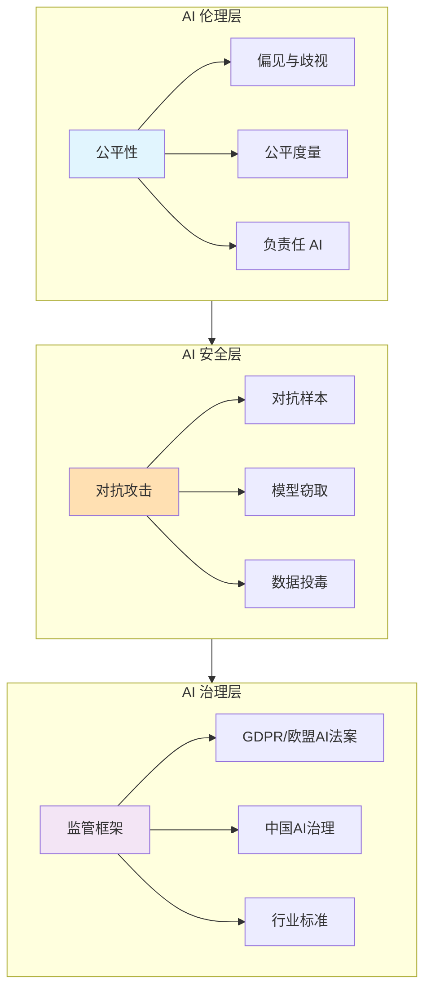
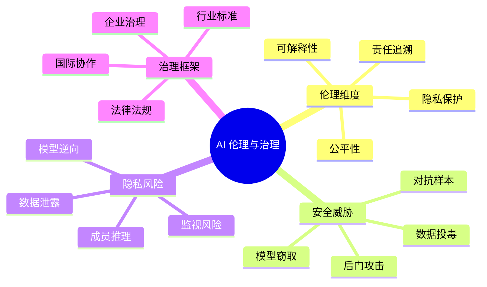

# 第11章 人工智能伦理、安全与行业规范 — 目录导航

## 📋 章节概览

本章围绕人工智能的伦理、安全与治理三大主题展开，系统介绍 AI 系统中的公平性问题、安全威胁、隐私风险，以及国内外 AI 监管框架与行业标准。帮助读者建立负责任 AI 的思维框架。

---

## 🗺️ 学习路线图

---

## 📚 章节内容

| 知识点 | 链接 | 核心内容 | 难度 |
|--------|------|----------|------|
| 11.1 AI伦理与公平性 | [[11.1-AI伦理与公平性]] | 偏见来源、公平性度量框架、负责任AI原则 | ⭐⭐⭐ |
| 11.2 AI安全与对抗攻击 | [[11.2-AI安全与对抗攻击]] | 对抗样本、模型安全威胁、隐私攻击与防御 | ⭐⭐⭐⭐ |
| 11.3 AI监管与治理框架 | [[11.3-AI监管与治理框架]] | 国内外法规、治理框架、行业标准体系 | ⭐⭐⭐ |

---

## 🎯 核心考点

### 考研/考试高频考点

1. **AI 偏见来源**：数据偏见、算法偏见、部署偏见的区别与实例
2. **公平性度量**：Demographic Parity、Equalized Odds、Individual Fairness
3. **对抗攻击类型**：白盒/黑盒、投毒/后门/对抗样本
4. **隐私攻击**：成员推理、模型逆向、数据泄露
5. **主要监管框架**：GDPR、欧盟 AI Act、中国《生成式 AI 服务管理办法》

### 典型题型

- **简答题**：说明 AI 系统中偏见的主要来源
- **论述题**：对比 GDPR 与欧盟 AI Act 的主要内容与影响
- **案例分析**：给定一个 AI 应用场景，分析潜在的伦理风险与合规要求
- **设计题**：设计一个负责任 AI 的评估框架

---

## 🧩 知识体系图谱

---

## ✅ 自测清单

- [ ] 能列举 AI 系统中偏见的三种主要来源
- [ ] 理解 Demographic Parity 和 Equalized Odds 的区别
- [ ] 掌握对抗样本的基本生成原理（FGSM、PGD）
- [ ] 区分白盒攻击和黑盒攻击
- [ ] 了解后门攻击的危害与检测方法
- [ ] 理解成员推理攻击的原理
- [ ] 熟悉 GDPR 的核心原则及其对 AI 的影响
- [ ] 了解欧盟 AI Act 的风险分级体系
- [ ] 掌握中国《生成式 AI 服务管理办法》的核心要求
- [ ] 能描述负责任 AI 的六大原则

---

## 🔗 相关章节

- **前置章节**：[[第10章-生成式大模型与AIGC]] — AIGC 应用与安全风险
- **关联知识点**：[[机器学习基础]]、[[深度学习模型]]
- **延伸阅读**：ISO/IEC 42001（AI 管理体系标准）

---

## 📝 学习建议

1. **案例驱动**：结合实际案例（如人脸识别偏见、招聘算法歧视）加深理解
2. **技术与政策结合**：不仅要了解技术原理，还要理解监管政策的背景和意义
3. **跨学科思维**：AI 伦理是技术、法律、社会学的交叉领域
4. **关注时事**：AI 立法进展迅速，建议持续关注国内外政策动态

---

> 💡 **学习提示**：本章内容具有很强的时效性和政策依赖性。建议阅读原文法规和最新论文，同时关注行业动态和典型案例分析。