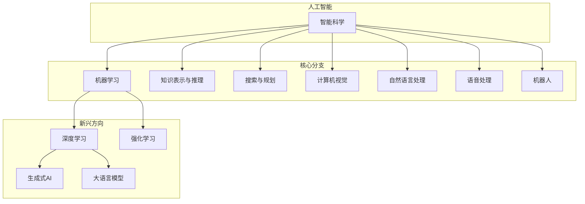
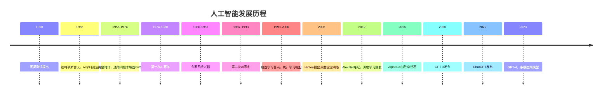

# 1.1 人工智能定义、分支与发展历程

## 一、人工智能的定义

### 1. 经典定义

> [!quote] 图灵测试（Turing Test）
> 1950年，英国数学家阿兰·图灵提出：如果一台机器能够与人类展开对话而不能被辨别出其机器身份，那么称这台机器具有智能。

**图灵测试的标准**：
- 测试者与被测试者（人和机器）隔离
- 测试者通过文本交互提问
- 如果30%的回答无法区分是人类还是机器
- 则通过测试，机器具有智能

### 2. 达特茅斯会议定义

> [!quote] 人工智能（Artificial Intelligence，AI）
> 研究如何使机器具有人类智能的学科，包括学习、推理、解决问题、感知、语言理解等能力。

### 3. AI的五大核心能力

| 能力 | 说明 | 示例 |
|-----|------|------|
| 感知（Perception） | 理解视觉、听觉等信息 | 图像识别、语音识别 |
| 学习（Learning） | 从数据中获取知识 | 机器学习、深度学习 |
| 推理（Reasoning） | 进行逻辑推理和决策 | 专家系统、推理引擎 |
| 自然语言处理（NLP） | 理解和生成自然语言 | 机器翻译、对话系统 |
| 行动（Action） | 与物理环境交互 | 机器人、自动驾驶 |

## 二、人工智能核心分支

### 1. 分支体系图

### 2. 各分支简介

| 分支 | 研究内容 | 代表技术 |
|-----|---------|---------|
| 机器学习 | 让系统从数据中学习 | 决策树、SVM、集成学习 |
| 深度学习 | 基于神经网络的学习 | CNN、RNN、Transformer |
| 计算机视觉 | 让机器理解图像/视频 | 图像分类、目标检测、分割 |
| 自然语言处理 | 理解和生成自然语言 | 分词、翻译、对话、摘要 |
| 语音处理 | 识别和合成语音 | 语音识别、声纹识别、TTS |
| 知识图谱 | 构建和推理知识网络 | 实体关系抽取、图推理 |
| 强化学习 | 智能体与环境交互 | Q-Learning、Policy Gradient |
| 机器人 | 智能体的物理实现 | 工业机器人、服务机器人 |

## 三、人工智能发展历程

### 1. 发展时间线

### 2. 重要里程碑

#### 达特茅斯会议（1956）

- 标志着AI作为学科诞生
- 参与者：McCarthy、Minsky、Shannon等
- 目标：使机器能够像人一样思考

#### 第一次AI寒冬（1974-1980）

**原因**：
- 感知机无法解决异或问题
- 计算复杂度远超预期
- 政府削减AI研究经费

#### 第二次AI寒冬（1987-1993）

**原因**：
- 专家系统维护成本高
- 商业化过度承诺
- 日本第五代计算机计划失败

#### 深度学习复兴（2006至今）

**关键事件**：
1. 2006年：Hinton提出深度信念网络，深度学习概念重生
2. 2012年：AlexNet在ImageNet比赛中大幅领先
3. 2014年：GAN问世
4. 2016年：AlphaGo以4:1战胜围棋九段李世石
5. 2018年：BERT发布，开启NLP新时代
6. 2020年：GPT-3发布（1750亿参数）
7. 2022年：ChatGPT发布，开启对话式AI时代

### 3. 各阶段特点对比

| 阶段 | 核心方法 | 代表成果 | 局限性 |
|-----|---------|---------|--------|
| 萌芽期（1956-1974） | 符号主义 | GPS、LISP | 过于乐观，忽视难度 |
| 专家系统期（1980s） | 知识工程 | MYCIN、XCON | 知识获取瓶颈 |
| 统计学习期（1990s） | 概率图模型 | HMM、SVM | 特征工程依赖 |
| 深度学习期（2006-） | 神经网络 | CNN、Transformer | 数据/算力依赖 |

## 四、主要技术流派

### 1. 符号主义（Symbolism）

> [!quote] 符号主义
> 认为智能可以通过符号运算和逻辑推理实现，关注"知识表示"和"推理"。

**代表**：
- 专家系统
- 定理证明器
- 逻辑编程语言（Prolog）

### 2. 连接主义（Connectionism）

> [!quote] 连接主义
> 认为智能来自神经元之间的连接，关注"学习"和"表征"。

**代表**：
- 感知机
- 神经网络
- 深度学习

### 3. 行为主义（Behaviorism）

> [!quote] 行为主义
> 认为智能是智能体与环境交互的产物，关注"感知-行动"循环。

**代表**：
- 强化学习
- 机器人控制
- 自主智能体

### 4. 现代融合

| 方向 | 融合方式 | 示例 |
|-----|---------|------|
| 神经符号AI | 神经网络+逻辑推理 | 可解释神经网络 |
| 因果AI | 深度学习+因果推理 | 可干预的预测模型 |
| 具身智能 | 深度学习+机器人学 | 人形机器人 |
| 大模型 | 统计+知识+推理 | 通用智能 |

---

**导航**：[[MOC - 第1章\|返回章节导航]] · 下一节 [[1.2-弱AI与强AI与超AI区分]]