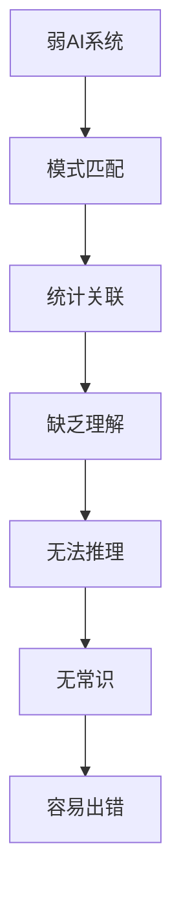

# 1.2 弱AI与强AI与超AI区分

## 一、三种AI形态概述

### 1. 分类框架

> [!quote] AI分类框架（John Searle & Nick Bostrom）
> - **弱AI（Weak AI）**：专用智能，在特定任务上模拟人类智能
> - **强AI（Strong AI）**：通用智能，具有真正的意识和理解
> - **超AI（Superintelligence）**：超级智能，超越人类智能水平

### 2. 对比总览

| 维度 | 弱AI | 强AI | 超AI |
|-----|------|------|------|
| 别称 | 窄AI、专用AI | 通用AI、AGI | 超级智能 |
| 能力范围 | 单任务 | 多任务、通用 | 超越人类 |
| 意识 | 无意识 | 有争议 | 不确定 |
| 理解 | 模拟理解 | 真正理解 | 超越理解 |
| 现有代表 | 深度思维、GPT-4 | 尚无 | 尚无 |
| 实现难度 | 已实现 | 极难 | 未知 |

## 二、弱AI（Weak AI）

### 1. 定义

> [!quote] 弱AI
> 指在特定领域执行特定任务的AI系统，能够表现出智能行为，但不具备真正的意识和理解力。

### 2. 典型特征

| 特征 | 说明 |
|-----|------|
| 专用性 | 专为特定任务设计 |
| 无通用性 | 无法跨领域迁移 |
| 无意识 | 没有自我意识或主观体验 |
| 高效率 | 在特定任务上可能超越人类 |
| 可解释性有限 | 决策过程可能难以理解 |

### 3. 现实中的弱AI

| 应用 | 例子 | 能力范围 |
|-----|------|---------|
| 图像识别 | CNN分类器 | 仅识别特定类别 |
| 语音助手 | Siri、小爱同学 | 仅处理语音指令 |
| 推荐系统 | 电商推荐 | 仅推荐商品 |
| 自动驾驶 | L2级辅助驾驶 | 有限场景辅助 |
| 医疗影像 | 肿瘤检测AI | 仅辅助诊断 |
| 棋类AI | AlphaGo | 仅下围棋 |

### 4. 弱AI的局限

**经典案例**：
- AI将哈士奇识别为狼（因背景草地）
- 语音助手无法理解讽刺
- 自动驾驶在非常规场景失灵

## 三、强AI（Strong AI）

### 1. 定义

> [!quote] 强AI
> 指具有与人类同等智能水平的AI系统，能够理解、学习、推理、感知，并拥有真正的意识。

### 2. 必要条件

| 条件 | 说明 |
|-----|------|
| 通用智能 | 能在任何智力任务上媲美人类 |
| 真正理解 | 不仅能处理信息，还能理解含义 |
| 自主学习 | 无需大量标注数据即可学习 |
| 常识推理 | 具备常识性知识和推理能力 |
| 创造性 | 能产生创造性的想法和解决方案 |
| 意识 | 具有主观体验和自我意识 |

### 3. 强AI的哲学争议

#### 中文房间论证（Searle, 1980）

> [!example] 思想实验
> 一个人被锁在房间里，通过手册处理中文符号。他能正确输出中文回答，但他不懂中文。
> 
> 类比：计算机处理符号但不理解意义。

#### 反向论证

| 反对观点 | 说明 |
|---------|------|
| 系统回应 | 整个系统理解了中文 |
| 机器人回应 | 与环境交互才能理解 |
| 意识困难问题 | 意识是否是计算的结果 |

### 4. 强AI的技术路径

| 路径 | 思路 | 进展 |
|-----|------|------|
| 符号主义 | 模拟人类思维过程 | 专家系统，但缺乏学习 |
| 全脑模拟 | 模拟整个大脑 | 计算量巨大，进展有限 |
| 通用智能架构 | 设计AGI架构 | 多个项目，尚无突破 |
| 大模型扩展 | 扩大模型规模 | GPT系列，通用能力增强 |

### 5. 当前进展评估

| 能力 | 当前状态 | 人类水平 |
|-----|---------|---------|
| 语言理解 | 接近人类 | 相当或超过 |
| 知识问答 | 接近人类 | 相当 |
| 逻辑推理 | 中等水平 | 需要提升 |
| 创造性 | 初步表现 | 需大幅提升 |
| 常识 | 有限 | 需要加强 |
| 自主学习 | 有限 | 需要突破 |
| 意识 | 无 | 尚未实现 |

## 四、超AI（Superintelligence）

### 1. 定义

> [!quote] 超AI
> 指在所有智力维度上超越人类的AI系统，能够解决人类无法解决的复杂问题。

### 2. Bostrom的超智能分类

| 类型 | 说明 |
|-----|------|
| 速度超智能 | 思考速度远超人类 |
| 质量超智能 | 思考质量远超人类 |
| 集体超智能 | 集体智慧远超人类 |
| 物理超智能 | 能自我改进硬件 |

### 3. 超AI的风险与机遇

#### 潜在机遇

| 领域 | 潜在突破 |
|-----|---------|
| 科学 | 解决癌症、气候变化等 |
| 工程 | 星际旅行、可控核聚变 |
| 社会 | 消除贫困、延长寿命 |
| 知识 | 加速科学发现 |

#### 潜在风险

| 风险 | 说明 |
|-----|------|
| 失业危机 | 大规模替代人类工作 |
| 权力集中 | 掌控AI的组织获得优势 |
| 价值对齐 | AI目标与人类冲突 |
| 安全威胁 | 被恶意使用 |
| 社会变革 | 社会结构根本变化 |

### 4. 对齐问题（Alignment Problem）

> [!warning] AI对齐问题
> 如何确保超AI的行为与人类价值观对齐，避免灾难性后果。

**核心挑战**：
1. **目标明确问题**：人类目标难以精确定义
2. **价值多样性**：不同文化、群体的价值观冲突
3. **长期影响**：当前决策影响未来数千年
4. **自我改进**：AI可能改变自身目标

## 五、当前主流观点

### 1. AI发展现状

| 观点 | 支持方 |
|-----|--------|
| 弱AI将持续增强 | 主流研究者 |
| 强AI可能在本世纪实现 | 乐观派（Ray Kurzweil等） |
| 强AI实现极其困难 | 怀疑派（Andrew Ng等） |
| 应关注AI安全对齐 | 有效加速、DeepMind |

### 2. 关键时间预测

| 预测来源 | 强AI时间 | 超AI时间 |
|---------|---------|---------|
| Ray Kurzweil | 2045年 | 2045年后不久 |
| DeepMind研究 | 20-40年 | 不确定 |
| 调查学者（2022） | 2059年（中位） | 不确定 |
|  skeptic派 | 永不 | 永不 |

### 3. 主流大模型的定位

| 模型 | 弱AI程度 | 通用能力 | 意识 |
|-----|---------|---------|------|
| GPT-4 | 高级弱AI | 跨领域能力强 | 无意识 |
| Claude 3 | 高级弱AI | 多模态能力强 | 无意识 |
| Gemini | 高级弱AI | 多模态能力强 | 无意识 |
| 结论 | **仍属弱AI范畴** | 接近通用 | 尚无定论 |

---

**导航**：上一节 [[1.1-人工智能定义、分支与发展历程]] · [[MOC - 第1章\|返回章节导航]] · 下一节 [[1.3-人工智能典型落地场景]]